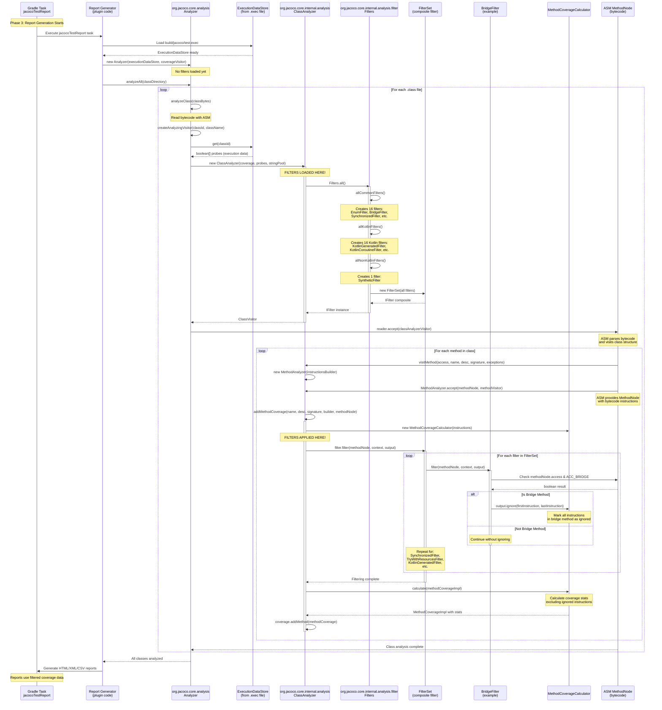

# JaCoCo Filter Loading and Application - Technical Analysis

**Analysis Date**: 2025-11-10
**Analyzed By**: Claude Code
**JaCoCo Version**: 0.8.14+
**Reference**: org.jacoco.core/src/org/jacoco/core/internal/analysis/filter/Filters.java

---

## Executive Summary

**CRITICAL FINDING**: JaCoCo filters are **NOT applied during instrumentation or test execution**. They are **ONLY applied during report generation** when analyzing class bytecode against execution data.

This means:
- ✅ Filters affect what gets included in coverage calculations
- ❌ Filters do NOT affect instrumentation (all code is instrumented)
- ❌ Filters do NOT need to be present during test execution
- ✅ Filters must be available during report generation (`jacocoTestReport` task)

---

## Three Phases of JaCoCo Coverage Collection

### Phase 1: Instrumentation (Filters: NOT USED ❌)

**When**:
- On-the-fly: During class loading when JaCoCo agent is attached to JVM
- Offline: During build process with `instrument` task

**What Happens**:
- JaCoCo reads class bytecode using ASM library
- Inserts probes at branch points, method entries, etc.
- Modifies bytecode to call probe recording methods
- **NO FILTERS ARE CONSULTED**

**Code Location**: `org.jacoco.core/src/org/jacoco/core/instr/Instrumenter.java:75-93`

**Key Method**:
```java
private byte[] instrument(final byte[] source) {
    final ClassReader reader = InstrSupport.classReaderFor(source);
    final ClassWriter writer = new ClassWriter(reader, 0);
    final IProbeArrayStrategy strategy = ProbeArrayStrategyFactory
            .createFor(classId, reader, accessorGenerator);
    final ClassVisitor visitor = new ClassProbesAdapter(
            new ClassInstrumenter(strategy, writer),
            InstrSupport.needsFrames(version));
    reader.accept(visitor, ClassReader.EXPAND_FRAMES);
    return writer.toByteArray();
}
```

**Evidence**: No imports or references to `Filters` class in Instrumenter.java

---

### Phase 2: Test Execution (Filters: NOT USED ❌)

**When**: During test execution (e.g., `./gradlew test`)

**What Happens**:
- Tests run normally
- Instrumented code executes
- Probes record hits in boolean arrays
- Execution data stored in memory or written to `.exec` file
- **NO FILTERS ARE CONSULTED**

**Data Format**: Binary execution data (.exec file or in-memory ExecutionDataStore)
- Maps class ID (CRC64) to probe hit arrays
- Example: Class `com.example.Foo` (ID: 0x1234567890ABCDEF) → [true, false, true, true, ...]

**Gradle Task**: `test`
- JaCoCo agent attached via `-javaagent:jacocoagent.jar=destfile=build/jacoco/test.exec`
- Agent instruments classes as they load
- Writes execution data to `.exec` file on JVM shutdown

---

### Phase 3: Report Generation (Filters: ✅ USED HERE!)

**When**: During coverage report generation (e.g., `./gradlew jacocoTestReport`)

**What Happens**:
1. Load execution data from `.exec` file into `ExecutionDataStore`
2. Read original class files from `build/classes` directories
3. **Create filters via `Filters.all()`** (THIS IS WHERE FILTERS LOAD!)
4. Analyze each class using `ClassAnalyzer`
5. Apply filters to exclude synthetic/generated methods
6. Calculate coverage percentages
7. Generate HTML/XML/CSV reports

**Code Locations**:
- `org.jacoco.core/src/org/jacoco/core/analysis/Analyzer.java:81-104`
- `org.jacoco.core/src/org/jacoco/core/internal/analysis/ClassAnalyzer.java:65-71, 131`

**Key Code Flow**:

#### Step 1: Filter Creation (Filters.java:36-51)
```java
public static IFilter all() {
    final IFilter allCommonFilters = allCommonFilters();
    final IFilter allKotlinFilters = allKotlinFilters();
    final IFilter allNonKotlinFilters = allNonKotlinFilters();
    return new IFilter() {
        public void filter(final MethodNode methodNode,
                final IFilterContext context, final IFilterOutput output) {
            allCommonFilters.filter(methodNode, context, output);
            if (isKotlinClass(context)) {
                allKotlinFilters.filter(methodNode, context, output);
            } else {
                allNonKotlinFilters.filter(methodNode, context, output);
            }
        }
    };
}
```

#### Step 2: ClassAnalyzer Construction (ClassAnalyzer.java:65-71)
```java
public ClassAnalyzer(final ClassCoverageImpl coverage,
        final boolean[] probes, final StringPool stringPool) {
    this.coverage = coverage;
    this.probes = probes;
    this.stringPool = stringPool;
    this.filter = Filters.all(); // ← FILTERS LOADED HERE
}
```

#### Step 3: Filter Application (ClassAnalyzer.java:121-141)
```java
private void addMethodCoverage(final String name, final String desc,
        final String signature, final InstructionsBuilder icc,
        final MethodNode methodNode) {

    final Map<AbstractInsnNode, Instruction> instructions = icc
            .getInstructions();
    calculateFragments(instructions);

    final MethodCoverageCalculator mcc = new MethodCoverageCalculator(
            instructions);
    filter.filter(methodNode, this, mcc); // ← FILTERS APPLIED HERE

    final MethodCoverageImpl mc = new MethodCoverageImpl(name, desc,
            signature);
    mcc.calculate(mc);

    if (mc.containsCode()) {
        coverage.addMethod(mc);
    }
}
```

#### Step 4: Analyzer Creates ClassAnalyzer (Analyzer.java:81-104)
```java
private ClassVisitor createAnalyzingVisitor(final long classid,
        final String className) {
    final ExecutionData data = executionData.get(classid);
    final boolean[] probes;
    if (data == null) {
        probes = null;
    } else {
        probes = data.getProbes();
    }
    final ClassCoverageImpl coverage = new ClassCoverageImpl(className,
            classid, noMatch);
    final ClassAnalyzer analyzer = new ClassAnalyzer(coverage, probes,
            stringPool) { // ← ClassAnalyzer created, filters loaded
        @Override
        public void visitEnd() {
            super.visitEnd();
            coverageVisitor.visitCoverage(coverage);
        }
    };
    return new ClassProbesAdapter(analyzer, false);
}
```

---

## Filter Types and Purpose

### Common Filters (Apply to All Classes)

Located in `Filters.java:53-71`:

```java
private static IFilter allCommonFilters() {
    return new FilterSet(
        new EnumFilter(),                           // Enum synthetic methods
        new BridgeFilter(),                         // Bridge methods
        new SynchronizedFilter(),                   // Synchronized blocks
        new TryWithResourcesJavac11Filter(),       // Try-with-resources (Java 11+)
        new TryWithResourcesJavacFilter(),         // Try-with-resources (javac)
        new TryWithResourcesEcjFilter(),           // Try-with-resources (Eclipse compiler)
        new FinallyFilter(),                        // Finally blocks
        new PrivateEmptyNoArgConstructorFilter(),  // Private empty constructors
        new AssertFilter(),                         // Assert statements
        new StringSwitchJavacFilter(),             // String switch (javac)
        new StringSwitchFilter(),                   // String switch (general)
        new EnumEmptyConstructorFilter(),          // Empty enum constructors
        new RecordsFilter(),                        // Java records
        new ExhaustiveSwitchFilter(),              // Exhaustive switch expressions
        new RecordPatternFilter(),                 // Record patterns
        new AnnotationGeneratedFilter()            // @Generated annotation
    );
}
```

### Kotlin-Specific Filters

Located in `Filters.java:78-97`:

```java
private static IFilter allKotlinFilters() {
    return new FilterSet(
        new KotlinGeneratedFilter(),              // Kotlin generated code
        new KotlinSyntheticAccessorsFilter(),     // Synthetic accessors
        new KotlinSerializableFilter(),           // Serialization code
        new KotlinEnumFilter(),                   // Kotlin enums
        new KotlinJvmOverloadsFilter(),           // @JvmOverloads
        new KotlinSafeCallOperatorFilter(),       // ?. operator
        new KotlinLateinitFilter(),               // lateinit
        new KotlinWhenFilter(),                   // when expressions
        new KotlinWhenStringFilter(),             // when with strings
        new KotlinUnsafeCastOperatorFilter(),     // as operator
        new KotlinNotNullOperatorFilter(),        // !! operator
        new KotlinInlineClassFilter(),            // Inline classes
        new KotlinDefaultArgumentsFilter(),       // Default arguments
        new KotlinInlineFilter(),                 // inline functions
        new KotlinCoroutineFilter(),              // Coroutines
        new KotlinDefaultMethodsFilter(),         // Default methods
        new KotlinComposeFilter()                 // Jetpack Compose
    );
}
```

### Non-Kotlin Filters

Located in `Filters.java:73-76`:

```java
private static IFilter allNonKotlinFilters() {
    return new FilterSet(
        new SyntheticFilter()                     // ACC_SYNTHETIC flag
    );
}
```

**Why Separate?** Kotlin uses `ACC_SYNTHETIC` for legitimate user code, so it's only filtered for non-Kotlin classes.

---

## Gradle Task Lifecycle Mapping

### Standard Gradle + JaCoCo Plugin Flow

```
┌─────────────────────────────────────────────────────────────────┐
│ Phase 1: Compilation (Filters: NOT LOADED)                      │
├─────────────────────────────────────────────────────────────────┤
│ Task: compileJava / compileTestJava                             │
│ Output: build/classes/java/main/*.class                         │
│         build/classes/java/test/*.class                         │
│ JaCoCo: Not involved                                            │
└─────────────────────────────────────────────────────────────────┘
                              ↓
┌─────────────────────────────────────────────────────────────────┐
│ Phase 2: Test Execution (Filters: NOT LOADED)                   │
├─────────────────────────────────────────────────────────────────┤
│ Task: test                                                      │
│ JaCoCo Agent: Attached to JVM                                   │
│   -javaagent:org.jacoco.agent-0.8.14-runtime.jar=               │
│     destfile=build/jacoco/test.exec,                            │
│     append=false,                                               │
│     includes=*,                                                 │
│     excludes=                                                   │
│                                                                 │
│ What Happens:                                                   │
│ 1. JVM starts with JaCoCo agent attached                        │
│ 2. As classes load, agent instruments them (adds probes)        │
│ 3. Tests execute, probes record hits                            │
│ 4. On JVM shutdown, agent writes build/jacoco/test.exec         │
│                                                                 │
│ Filters: ❌ NOT CONSULTED                                       │
│ Custom Agents: Must be loaded here if modifying bytecode        │
└─────────────────────────────────────────────────────────────────┘
                              ↓
┌─────────────────────────────────────────────────────────────────┐
│ Phase 3: Report Generation (Filters: ✅ LOADED AND APPLIED)     │
├─────────────────────────────────────────────────────────────────┤
│ Task: jacocoTestReport                                          │
│                                                                 │
│ Input Files:                                                    │
│ - Execution data: build/jacoco/test.exec                        │
│ - Class files:    build/classes/java/main/**/*.class            │
│ - Source files:   src/main/java/**/*.java (optional)            │
│                                                                 │
│ Processing Steps:                                               │
│ 1. Load ExecutionDataStore from test.exec                       │
│    └─> Map of ClassID → boolean[] probes                        │
│                                                                 │
│ 2. Create Analyzer with ExecutionDataStore                      │
│    └─> org.jacoco.core.analysis.Analyzer                        │
│                                                                 │
│ 3. For each .class file in build/classes/java/main:             │
│    a. Read bytecode with ASM ClassReader                        │
│    b. Create ClassAnalyzer                                      │
│       └─> this.filter = Filters.all() ← FILTERS LOADED!         │
│    c. Visit class structure                                     │
│    d. For each method:                                          │
│       - Get probe execution data                                │
│       - Build instruction map                                   │
│       - filter.filter(methodNode, context, output) ← APPLIED!   │
│       - Calculate coverage (instructions, branches, lines)      │
│    e. Aggregate to class coverage                               │
│                                                                 │
│ 4. Generate reports:                                            │
│    - HTML:  build/reports/jacoco/test/html/index.html           │
│    - XML:   build/reports/jacoco/test/jacocoTestReport.xml      │
│    - CSV:   build/reports/jacoco/test/jacocoTestReport.csv      │
│                                                                 │
│ Filters: ✅ LOADED AND APPLIED                                  │
│ Custom Filters: Must be in classpath here if customizing        │
└─────────────────────────────────────────────────────────────────┘
```

---

## Detailed Timeline: When Exactly Are Filters Loaded?

### Timeline Within `jacocoTestReport` Task

```
T+0ms:    Task jacocoTestReport starts
          └─> Configuration: executionData, classDirectories, sourceDirectories

T+10ms:   Load execution data
          └─> Read build/jacoco/test.exec
          └─> Deserialize into ExecutionDataStore
          └─> No filters involved

T+20ms:   Create Analyzer
          └─> new Analyzer(executionDataStore, coverageVisitor)
          └─> No filters involved yet

T+30ms:   Analyze first class (e.g., com/example/Foo.class)
          ├─> Analyzer.analyzeClass(classBytes)
          ├─> createAnalyzingVisitor(classId, className)
          └─> new ClassAnalyzer(coverage, probes, stringPool)
              └─> this.filter = Filters.all() ← FILTERS LOADED! (T+30ms)
                  ├─> Calls allCommonFilters()
                  │   └─> Creates 16 filter instances
                  ├─> Calls allKotlinFilters()
                  │   └─> Creates 16 filter instances
                  └─> Calls allNonKotlinFilters()
                      └─> Creates 1 filter instance

T+40ms:   Visit class structure
          └─> ClassAnalyzer extends ClassProbesVisitor
          └─> ASM calls visitMethod() for each method

T+50ms:   Analyze first method (e.g., public void doSomething())
          ├─> MethodAnalyzer builds instruction graph
          ├─> addMethodCoverage() called
          ├─> Get execution data for method probes
          ├─> Build instructions map
          └─> filter.filter(methodNode, this, mcc) ← FILTERS APPLIED! (T+50ms)
              ├─> allCommonFilters.filter()
              │   ├─> BridgeFilter: Is this a bridge method? No → continue
              │   ├─> SynchronizedFilter: Generated sync code? No → continue
              │   ├─> TryWithResourcesFilter: TWR boilerplate? No → continue
              │   └─> ... (all 16 common filters check)
              └─> If Kotlin: allKotlinFilters.filter()
                  └─> ... (16 Kotlin filters check)

T+60ms:   Calculate coverage for method
          └─> MethodCoverageCalculator.calculate()
          └─> Aggregates instructions/branches not filtered out

T+70ms:   Repeat for each method in class
          ...

T+100ms:  Finish class, visit next class
          └─> Create NEW ClassAnalyzer for next class
          └─> Filters.all() called AGAIN ← NEW FILTER INSTANCE
          └─> Repeat analysis

T+500ms:  All classes analyzed
          └─> Coverage data aggregated

T+600ms:  Generate HTML report
          └─> Read coverage data
          └─> Format as HTML

T+700ms:  Generate XML/CSV reports
          └─> Same coverage data, different formats

T+800ms:  Task complete
```

### Key Observations

1. **Filters are instantiated per class analysis** - Each class gets a fresh `ClassAnalyzer` with `Filters.all()`
2. **Filters are stateless** - Each filter checks method patterns without maintaining state
3. **Filters operate on ASM MethodNode** - They analyze bytecode instructions, not source code
4. **Filters mark instructions to ignore** - via `IFilterOutput.ignore()` calls

---

## Filter Execution Call Stack

### Mermaid Sequence Diagram

This diagram shows the complete call stack from the Gradle task through filter loading and application:



### Call Stack Breakdown

#### Level 1: Task Execution
```
Gradle Task: jacocoTestReport
└─> File Location: Applied by jacoco plugin
└─> Responsibility: Orchestrate report generation
```

#### Level 2: Report Generator (Plugin Code)
```
JaCoCo Gradle Plugin
├─> Load ExecutionDataStore from build/jacoco/test.exec
├─> Collect class files from build/classes/java/main
├─> Create Analyzer instance
└─> Call analyzeAll() for each class directory
```

#### Level 3: Analyzer (org.jacoco.core.analysis.Analyzer)
```java
// File: org.jacoco.core/src/org/jacoco/core/analysis/Analyzer.java

public void analyzeClass(byte[] buffer, String location) throws IOException {
    analyzeClass(buffer);  // ← Entry point
}

private void analyzeClass(byte[] source) {
    final ClassReader reader = InstrSupport.classReaderFor(source);
    final ClassVisitor visitor = createAnalyzingVisitor(classId, reader.getClassName());
    reader.accept(visitor, 0);  // ← Triggers ASM visiting
}

private ClassVisitor createAnalyzingVisitor(long classid, String className) {
    final ExecutionData data = executionData.get(classid);  // ← Get probe data
    final boolean[] probes = (data == null) ? null : data.getProbes();

    final ClassCoverageImpl coverage = new ClassCoverageImpl(className, classid, noMatch);

    // ↓ FILTERS LOADED HERE in ClassAnalyzer constructor
    final ClassAnalyzer analyzer = new ClassAnalyzer(coverage, probes, stringPool);

    return new ClassProbesAdapter(analyzer, false);
}
```

#### Level 4: ClassAnalyzer Constructor (FILTER LOADING)
```java
// File: org.jacoco.core/src/org/jacoco/core/internal/analysis/ClassAnalyzer.java:65-71

public ClassAnalyzer(final ClassCoverageImpl coverage,
        final boolean[] probes, final StringPool stringPool) {
    this.coverage = coverage;
    this.probes = probes;
    this.stringPool = stringPool;
    this.filter = Filters.all();  // ← FILTERS LOADED HERE
}
```

#### Level 5: Filters.all() (FILTER CREATION)
```java
// File: org.jacoco.core/src/org/jacoco/core/internal/analysis/filter/Filters.java:36-51

public static IFilter all() {
    final IFilter allCommonFilters = allCommonFilters();      // ← Create common filters
    final IFilter allKotlinFilters = allKotlinFilters();      // ← Create Kotlin filters
    final IFilter allNonKotlinFilters = allNonKotlinFilters(); // ← Create non-Kotlin filters

    return new IFilter() {  // ← Return composite filter
        public void filter(final MethodNode methodNode,
                final IFilterContext context, final IFilterOutput output) {
            allCommonFilters.filter(methodNode, context, output);
            if (isKotlinClass(context)) {
                allKotlinFilters.filter(methodNode, context, output);
            } else {
                allNonKotlinFilters.filter(methodNode, context, output);
            }
        }
    };
}
```

#### Level 6: ASM Class Visiting
```
ASM ClassReader.accept()
├─> Parses class bytecode
├─> Calls ClassAnalyzer.visit() for class metadata
├─> Calls ClassAnalyzer.visitMethod() for each method
└─> Each visitMethod() creates MethodAnalyzer
```

#### Level 7: Method Analysis (FILTER APPLICATION)
```java
// File: org.jacoco.core/src/org/jacoco/core/internal/analysis/ClassAnalyzer.java:121-141

private void addMethodCoverage(final String name, final String desc,
        final String signature, final InstructionsBuilder icc,
        final MethodNode methodNode) {

    final Map<AbstractInsnNode, Instruction> instructions = icc.getInstructions();

    final MethodCoverageCalculator mcc = new MethodCoverageCalculator(instructions);

    // ↓ FILTERS APPLIED HERE
    filter.filter(methodNode, this, mcc);

    final MethodCoverageImpl mc = new MethodCoverageImpl(name, desc, signature);
    mcc.calculate(mc);  // ← Calculate coverage excluding ignored instructions

    if (mc.containsCode()) {
        coverage.addMethod(mc);
    }
}
```

#### Level 8: FilterSet Iteration
```java
// Pseudo-code showing FilterSet behavior

class FilterSet implements IFilter {
    private final IFilter[] filters;

    public void filter(MethodNode methodNode, IFilterContext context, IFilterOutput output) {
        for (IFilter filter : filters) {
            filter.filter(methodNode, context, output);  // ← Each filter checks method
        }
    }
}
```

#### Level 9: Individual Filter (Example: BridgeFilter)
```java
// File: org.jacoco.core/src/org/jacoco/core/internal/analysis/filter/BridgeFilter.java

public void filter(final MethodNode methodNode,
        final IFilterContext context,
        final IFilterOutput output) {

    if ((methodNode.access & Opcodes.ACC_BRIDGE) != 0) {
        // ↓ Mark ALL instructions in bridge method to be ignored
        output.ignore(methodNode.instructions.getFirst(),
                      methodNode.instructions.getLast());
    }
}
```

#### Level 10: MethodCoverageCalculator
```
MethodCoverageCalculator.calculate()
├─> Iterate through all instructions
├─> Skip instructions marked as "ignored" by filters
├─> Count covered/missed instructions
├─> Count covered/missed branches
└─> Aggregate into MethodCoverageImpl
```

### Key Observations from Call Stack

1. **Filters are loaded AFTER execution data is loaded** - They only need bytecode and execution data, not live JVM
2. **One filter instance per ClassAnalyzer** - Each class gets fresh filters (could be optimized)
3. **Filters are applied DURING method analysis** - Not before, not after
4. **Filters operate on ASM MethodNode** - They analyze compiled bytecode, not source
5. **Multiple filters check each method** - 33 total filters (16 common + 16 Kotlin + 1 non-Kotlin)
6. **Filters mark instructions to ignore** - via `IFilterOutput.ignore()` calls
7. **Coverage calculation happens AFTER filtering** - Only non-ignored instructions counted

---

## What Filters Actually Do

### Example: BridgeFilter

**Input**: Method bytecode from ASM
```java
// Source code:
class Parent<T> {
    void process(T value) { ... }
}

class Child extends Parent<String> {
    void process(String value) { ... }  // User code
    // Compiler generates:
    // bridge void process(Object value) {  // Synthetic bridge
    //     this.process((String)value);
    // }
}
```

**Filter Logic**:
```java
public void filter(final MethodNode methodNode,
        final IFilterContext context,
        final IFilterOutput output) {
    if ((methodNode.access & Opcodes.ACC_BRIDGE) != 0) {
        output.ignore(methodNode.instructions.getFirst(),
                      methodNode.instructions.getLast());
        // ↑ Marks ALL instructions in bridge method to be ignored
    }
}
```

**Effect**: Bridge method instructions excluded from coverage calculations

**Coverage Report Impact**:
- Without filter: Bridge shows as "partially covered" (confusing red/yellow)
- With filter: Bridge method completely hidden from report

---

## Summary: The Definitive Timeline

```
BUILD TIME (Compilation)
└─> javac compiles .java → .class files
    └─> No JaCoCo involvement
    └─> Filters: ❌ NOT LOADED

TEST EXECUTION TIME (Gradle test task)
├─> JVM starts with -javaagent:jacocoagent.jar
├─> Agent instruments classes as they load (adds probes)
│   └─> Uses Instrumenter class
│   └─> Filters: ❌ NOT LOADED
├─> Tests execute, probes record hits
└─> Agent writes build/jacoco/test.exec on shutdown
    └─> Filters: ❌ NOT LOADED

REPORT GENERATION TIME (Gradle jacocoTestReport task)
├─> Load build/jacoco/test.exec into ExecutionDataStore
│   └─> Filters: ❌ NOT LOADED (just reading binary data)
├─> Create Analyzer with ExecutionDataStore
│   └─> Filters: ❌ NOT LOADED YET
├─> FOR EACH .class file in build/classes/java/main:
│   ├─> Create ClassAnalyzer
│   │   └─> this.filter = Filters.all() ← ✅ FILTERS LOADED HERE!
│   ├─> Parse bytecode with ASM
│   ├─> FOR EACH method:
│   │   ├─> Get execution data (probe hits)
│   │   ├─> filter.filter(methodNode, context, output) ← ✅ FILTERS APPLIED!
│   │   │   ├─> BridgeFilter checks if bridge method → mark as ignored
│   │   │   ├─> SyntheticFilter checks if synthetic → mark as ignored
│   │   │   ├─> KotlinGeneratedFilter checks patterns → mark as ignored
│   │   │   └─> ... (all filters check)
│   │   └─> Calculate coverage (excluding ignored instructions)
│   └─> Aggregate class coverage
└─> Generate HTML/XML/CSV reports
    └─> Filters: ✅ ALREADY APPLIED (using calculated coverage)
```

**Key Takeaway**: Filters are loaded during `jacocoTestReport` task, specifically when `ClassAnalyzer` is instantiated for each class, and applied when analyzing each method.

---

## Mapping to Gradle Task Graph

```
compileJava
    ↓
compileTestJava
    ↓
test ← JaCoCo agent attaches here
│      Instrumentation: YES (adds probes)
│      Filter loading:  NO
│      Filter application: NO
│      Output: build/jacoco/test.exec
    ↓
jacocoTestReport ← Filters load and apply here
       Filter loading:  YES (Filters.all() called per class)
       Filter application: YES (filter.filter() called per method)
       Input:  build/jacoco/test.exec + build/classes/java/main/**/*.class
       Output: build/reports/jacoco/test/html/index.html
```

---

## Common Misconceptions

### ❌ Misconception 1: "Filters affect instrumentation"
**Reality**: Instrumentation adds probes to ALL code. Filters only affect what gets reported.

**Evidence**: Instrumenter.java has no imports from `.filter` package

### ❌ Misconception 2: "Custom filter agents must run during tests"
**Reality**: Filters are only needed during report generation, not test execution.

**Caveat**: If using a Java agent to INJECT custom filter implementations into Filters.all(), the agent must modify the JVM running `jacocoTestReport`, not `test`.

### ❌ Misconception 3: "Filters reduce probe count"
**Reality**: All probes are inserted and recorded. Filters just exclude some from coverage percentages.

**Proof**: The `.exec` file contains probe data for filtered methods; they're just ignored during analysis.

### ❌ Misconception 4: ".exec file excludes filtered data"
**Reality**: `.exec` file is a raw dump of probe hits. No filtering occurs during execution.

**Format**: Binary format mapping class IDs to boolean arrays, no method metadata.

---

## References

### Source Files Analyzed
1. `org.jacoco.core/src/org/jacoco/core/internal/analysis/filter/Filters.java:36-51` - Filter factory
2. `org.jacoco.core/src/org/jacoco/core/internal/analysis/ClassAnalyzer.java:65-71` - Filter loading
3. `org.jacoco.core/src/org/jacoco/core/internal/analysis/ClassAnalyzer.java:121-141` - Filter application
4. `org.jacoco.core/src/org/jacoco/core/analysis/Analyzer.java:81-104` - Analysis orchestration
5. `org.jacoco.core/src/org/jacoco/core/instr/Instrumenter.java:75-93` - Instrumentation (no filters)

### Key Insights
- Filters are purely an analysis-time concern, not instrumentation-time
- Instrumentation is filter-agnostic (instruments everything)
- `.exec` files contain unfiltered probe data
- Custom filters require modification of JaCoCo core or runtime injection during report generation

---

**Document Version**: 1.0
**Last Updated**: 2025-11-10
**Next Review**: When JaCoCo architecture changes or custom filters needed
