```mermaid
graph LR
    subgraph executed ["🚀 Executed Tasks"]
        direction TB
        testClasses[":testClasses"]
        processResources[":processResources"]
        classes[":classes"]
        test[":test"]
        compileJava[":compileJava"]
        processTestResources[":processTestResources"]
        jacocoTestReport[":jacocoTestReport"]
        compileTestGosu[":compileTestGosu"]
        compileGosu[":compileGosu"]
        compileTestJava[":compileTestJava"]
    end

    test --> jacocoTestReport
    jar -..-> test
    test -.-> jacocoTestReport
```

```mermaid
flowchart TD
    Start@{ shape: circle, label: "Start" }
Stop@{ shape: dbl-circ, label: "Stop" }

subgraph executed ["🚀 Executed Tasks (Execution Order)"]
direction TB
compileJava[":compileJava"]
compileGosu[":compileGosu"]
processResources[":processResources"]
classes[":classes"]
compileTestJava[":compileTestJava"]
compileTestGosu[":compileTestGosu"]
processTestResources[":processTestResources"]
testClasses[":testClasses"]
test[":test"]:::requested
jacocoTestReport[":jacocoTestReport"]
end

Start -->|" Step 1"|compileJava
compileJava -->|" Step 2"|compileGosu
compileGosu -->|" Step 3"|processResources
processResources -->|" Step 4"|classes
classes -->|" Step 5"|compileTestJava
compileTestJava -->|" Step 6"|compileTestGosu
compileTestGosu -->|" Step 7"|processTestResources
processTestResources -->|" Step 8"|testClasses
testClasses -->|" Step 9"|test
test -->|" Step 10"|jacocoTestReport
jacocoTestReport -->|" Complete "|Stop

test -.->|" finalizes "|jacocoTestReport

%% Styling
classDef requested fill: #90EE90, stroke: #006400, stroke-width: 3px, color: #000000
classDef available fill: #F0F0F0, stroke: #808080, stroke-width: 1px, color: #666666
```

```mermaid
flowchart TD
    Start@{ shape: circle, label: "Start" }
Stop@{ shape: dbl-circ, label: "Stop" }

subgraph executed ["🚀 Executed Tasks (Execution Order)"]
direction TB
clean[":clean"]:::requested
end

Start -->|" Step 1 "|clean
clean -->|" Complete "|Stop


%% Styling
classDef requested fill: #90EE90, stroke: #006400, stroke-width: 3px, color: #000000
classDef available fill: #F0F0F0, stroke: #808080, stroke-width: 1px, color: #666666
```

```mermaid
flowchart BT
    Start@{ shape: circle, label: "Start" }
Stop@{ shape: dbl-circ, label: "Stop" }

subgraph executed ["🚀 Executed Tasks (Execution Order)"]
direction TB
compileJava[":compileJava"]
compileGosu[":compileGosu"]
processResources[":processResources"]
classes[":classes"]
jar[":jar"]
assemble[":assemble"]
compileTestJava[":compileTestJava"]
compileTestGosu[":compileTestGosu"]
processTestResources[":processTestResources"]
testClasses[":testClasses"]
test[":test"]
jacocoTestReport[":jacocoTestReport"]
check[":check"]
build[":build"]:::requested
end

Start -->|" Step 1 "| compileJava
compileJava -->|" Step 2 "| compileGosu
compileGosu -->|" Step 3 "| processResources
processResources -->|" Step 4 "| classes
classes -->|" Step 5 "| jar
jar -->|" Step 6 "| assemble
assemble -->|" Step 7 "| compileTestJava
compileTestJava -->|" Step 8 "| compileTestGosu
compileTestGosu -->|" Step 9 "| processTestResources
processTestResources -->|" Step 10 "| testClasses
testClasses -->|" Step 11 "| test
test -->|" Step 12 "| jacocoTestReport
jacocoTestReport -->|" Step 13 "| check
check -->|" Step 14 "| build
build -->|" Complete "|Stop

jar -.->|" depends on "| assemble
test -.->|" finalizes "|jacocoTestReport

%% Styling
classDef requested fill: #90EE90, stroke: #006400, stroke-width: 3px, color: #000000
classDef available fill: #F0F0F0, stroke: #808080, stroke-width: 1px, color: #666666
```

```mermaid
flowchart TD
    Start@{ shape: circle, label: "Start" }
Stop@{ shape: dbl-circ, label: "Stop" }

subgraph executed ["🚀 Executed Tasks (Execution Order)"]
direction TB
prepareKotlinBuildScriptModel[":prepareKotlinBuildScriptModel"]:::requested
end

Start -->|" Step 1 "|prepareKotlinBuildScriptModel
prepareKotlinBuildScriptModel -->|" Complete "|Stop


%% Styling
classDef requested fill: #90EE90, stroke: #006400, stroke-width: 3px, color: #000000
classDef available fill: #F0F0F0, stroke: #808080, stroke-width: 1px, color: #666666
```

```mermaid
graph TD
    Start((Start))
    Stop(((Stop)))

    subgraph executed ["🚀 Executed Tasks (Execution Order)"]
        direction TB
        tasks[":tasks"]
    end

    Start -->|" Step 1 "| tasks
    tasks -->|" Complete "| Stop
%% Styling
    classDef requested fill: #90EE90, stroke: #006400, stroke-width: 3px, color: #000000
    classDef available fill: #F0F0F0, stroke: #808080, stroke-width: 1px, color: #666666
    class tasks requested
```

```mermaid
graph LR
    Start((Start))
    Stop(((Stop)))

    subgraph executed ["🚀 Executed Tasks (Execution Order)"]
        direction TB
        tasks[":tasks"]
    end

    Start -->|"Step 1"| tasks
    tasks -->|"Complete"| Stop


    %% Styling
    classDef requested fill:#90EE90,stroke:#006400,stroke-width:3px,color:#000000
    classDef available fill:#F0F0F0,stroke:#808080,stroke-width:1px,color:#666666
    class tasks requested
```

```mermaid
graph LR
    Start((Start))
    Stop(((Stop)))

    subgraph executed ["🚀 Executed Tasks (Execution Order)"]
        direction TB
        stageDependencies[":stageDependencies"]
    end

    Start -->|"Step 1"| stageDependencies
    stageDependencies -->|"Complete"| Stop


    %% Styling
    classDef requested fill:#90EE90,stroke:#006400,stroke-width:3px,color:#000000
    classDef available fill:#F0F0F0,stroke:#808080,stroke-width:1px,color:#666666
    class stageDependencies requested
```

```mermaid
graph LR
    Start((Start))
    Stop(((Stop)))

    subgraph executed ["🚀 Executed Tasks (Execution Order)"]
        direction TB
        prepareKotlinBuildScriptModel[":prepareKotlinBuildScriptModel"]
    end

    Start -->|"Step 1"| prepareKotlinBuildScriptModel
    prepareKotlinBuildScriptModel -->|"Complete"| Stop


    %% Styling
    classDef requested fill:#90EE90,stroke:#006400,stroke-width:3px,color:#000000
    classDef available fill:#F0F0F0,stroke:#808080,stroke-width:1px,color:#666666
    class prepareKotlinBuildScriptModel requested
```

--------------------------------------------------------------------------------

# Gradle Execution - 2025-07-07 14:59:34

## Command

```bash
gradle tasks -Duser.variant= -Dfile.encoding=windows-1252 -Duser.country=US -Duser.language=en --parallel --configure-on-demand
```

## Task Graph


**Legend:**

- `-->` : dependsOn (solid arrow)
- `-.->` : mustRunAfter (dashed arrow)
- `-..->` : shouldRunAfter (dotted arrow)

**Summary:**

- Total Tasks: 48
- Total Dependencies: 9
- Projects: 1

--------------------------------------------------------------------------------


--------------------------------------------------------------------------------

# Gradle Execution - 2025-07-07 15:01:36

## Command

```bash
gradle test --rerun -Duser.variant= -Dfile.encoding=windows-1252 -Duser.country=US -Duser.language=en --parallel --configure-on-demand
```

## Task Graph


**Legend:**

- `-->` : dependsOn (solid arrow)
- `-.->` : mustRunAfter (dashed arrow)
- `-..->` : shouldRunAfter (dotted arrow)

**Summary:**

- Total Tasks: 48
- Total Dependencies: 9
- Projects: 1

--------------------------------------------------------------------------------


--------------------------------------------------------------------------------

# Gradle Execution - 2025-07-07 15:03:10

## Command

```bash
gradle -Duser.variant= -Dfile.encoding=UTF-8 -Duser.country=US -Duser.language=en --parallel --configure-on-demand
```

## Task Graph


**Legend:**

- `-->` : dependsOn (solid arrow)
- `-.->` : mustRunAfter (dashed arrow)
- `-..->` : shouldRunAfter (dotted arrow)

**Summary:**

- Total Tasks: 48
- Total Dependencies: 9
- Projects: 1

--------------------------------------------------------------------------------


--------------------------------------------------------------------------------

# Gradle Execution - 2025-07-07 15:09:12

## Command

```bash
gradle test --rerun -Duser.variant= -Dfile.encoding=windows-1252 -Duser.country=US -Duser.language=en --parallel --configure-on-demand
```

## Task Graph



**Legend:**

- 🚀 **Executed Tasks**: Tasks that will run in this execution
- 📋 **Available Tasks**: Other tasks available but not executed
- `-->` : dependsOn (solid arrow)
- `-.->` : mustRunAfter (dashed arrow)
- `-..->` : shouldRunAfter (dotted arrow)

**Summary:**

- **Executed Tasks**: 10
- **Available Tasks**: 48
- **Dependencies**: 3
- **Projects**: 1

--------------------------------------------------------------------------------


--------------------------------------------------------------------------------

# Gradle Execution - 2025-07-07 15:20:33

## Command

```bash
gradle test --rerun -Duser.variant= -Dfile.encoding=windows-1252 -Duser.country=US -Duser.language=en --parallel --configure-on-demand
```

## Task Graph



**Legend:**

- 🚀 **Executed Tasks**: Tasks that will run in this execution (in execution order)
- 📋 **Available Tasks**: Other tasks available but not executed
- 🟢 **Green Background**: Tasks explicitly requested by user
- `-->|Step N|` : Execution order (solid arrows with step numbers)
- `-.->|depends on|` : Task dependencies (dashed arrows)
- ⭕ **Start/Stop**: Execution flow markers

**Summary:**

- **Executed Tasks**: 10
- **Available Tasks**: 48
- **Dependencies**: 1
- **Projects**: 1

--------------------------------------------------------------------------------


--------------------------------------------------------------------------------

# Gradle Execution - 2025-07-07 15:21:26

## Command

```bash
gradle clean -Duser.variant= -Dfile.encoding=windows-1252 -Duser.country=US -Duser.language=en --parallel --configure-on-demand
```

## Task Graph



**Legend:**

- 🚀 **Executed Tasks**: Tasks that will run in this execution (in execution order)
- 📋 **Available Tasks**: Other tasks available but not executed
- 🟢 **Green Background**: Tasks explicitly requested by user
- `-->|Step N|` : Execution order (solid arrows with step numbers)
- `-.->|depends on|` : Task dependencies (dashed arrows)
- ⭕ **Start/Stop**: Execution flow markers

**Summary:**

- **Executed Tasks**: 1
- **Available Tasks**: 48
- **Dependencies**: 0
- **Projects**: 1

--------------------------------------------------------------------------------


--------------------------------------------------------------------------------

# Gradle Execution - 2025-07-07 15:21:51

## Command

```bash
gradle build -Duser.variant= -Dfile.encoding=windows-1252 -Duser.country=US -Duser.language=en --parallel --configure-on-demand
```

## Task Graph



**Legend:**

- 🚀 **Executed Tasks**: Tasks that will run in this execution (in execution order)
- 📋 **Available Tasks**: Other tasks available but not executed
- 🟢 **Green Background**: Tasks explicitly requested by user
- `-->|Step N|` : Execution order (solid arrows with step numbers)
- `-.->|depends on|` : Task dependencies (dashed arrows)
- ⭕ **Start/Stop**: Execution flow markers

**Summary:**

- **Executed Tasks**: 14
- **Available Tasks**: 48
- **Dependencies**: 2
- **Projects**: 1

--------------------------------------------------------------------------------


--------------------------------------------------------------------------------

# Gradle Execution - 2025-07-07 15:25:32

## Command

```bash
gradle prepareKotlinBuildScriptModel -Porg.gradle.kotlin.dsl.provider.cid=456739609230400 -Pkotlin.mpp.enableIntransitiveMetadataConfiguration=true -Didea.active=true -Duser.variant= -Didea.resolveSourceSetDependencies=true -Dfile.encoding=windows-1252 -Didea.version=2024.1.5 -Duser.language=en -Didea.sync.active=true -Duser.country=US -Didea.vendor.name=JetBrains -Didea.gradle.download.sources=false --parallel --configure-on-demand
```

## Task Graph



**Legend:**

- 🚀 **Executed Tasks**: Tasks that will run in this execution (in execution order)
- 📋 **Available Tasks**: Other tasks available but not executed
- 🟢 **Green Background**: Tasks explicitly requested by user
- `-->|Step N|` : Execution order (solid arrows with step numbers)
- `-.->|depends on|` : Task dependencies (dashed arrows)
- ⭕ **Start/Stop**: Execution flow markers

**Summary:**

- **Executed Tasks**: 1
- **Available Tasks**: 48
- **Dependencies**: 0
- **Projects**: 1

--------------------------------------------------------------------------------


--------------------------------------------------------------------------------

# Gradle Execution - 2025-07-07 15:39:23

## Command

```bash
gradle tasks --all -Duser.variant= -Dfile.encoding=windows-1252 -Duser.country=US -Duser.language=en --parallel --configure-on-demand
```

## Task Graph



**Legend:**

- 🚀 **Executed Tasks**: Tasks that will run in this execution (in execution order)
- 📋 **Available Tasks**: Other tasks available but not executed
- 🟢 **Green Background**: Tasks explicitly requested by user
- `-->|Step N|` : Execution order (solid arrows with step numbers)
- `-.->|depends on|` : Task dependencies (dashed arrows)
- ⭕ **Start/Stop**: Execution flow markers

**Summary:**

- **Executed Tasks**: 1
- **Available Tasks**: 48
- **Dependencies**: 0
- **Projects**: 1

--------------------------------------------------------------------------------


--------------------------------------------------------------------------------

# Gradle Execution - 2025-07-07 15:39:48

## Command

```bash
gradle build -Duser.variant= -Dfile.encoding=windows-1252 -Duser.country=US -Duser.language=en --rerun-tasks --parallel --configure-on-demand
```

## Task Graph


**Legend:**

- 🚀 **Executed Tasks**: Tasks that will run in this execution (in execution order)
- 📋 **Available Tasks**: Other tasks available but not executed
- 🟢 **Green Background**: Tasks explicitly requested by user
- `-->|Step N|` : Execution order (solid arrows with step numbers)
- `-.->|depends on|` : Task dependencies (dashed arrows)
- ⭕ **Start/Stop**: Execution flow markers

**Summary:**

- **Executed Tasks**: 14
- **Available Tasks**: 48
- **Dependencies**: 2
- **Projects**: 1

--------------------------------------------------------------------------------


--------------------------------------------------------------------------------

# Gradle Execution - 2025-07-09 09:28:33

## Command
```bash
gradle tasks -Duser.variant= -Dfile.encoding=windows-1252 -Duser.country=US -Duser.language=en --parallel --configure-on-demand
```

## Task Graph



**Legend:**
- 🚀 **Executed Tasks**: Tasks that will run in this execution (in execution order)
- 📋 **Available Tasks**: Other tasks available but not executed
- 🟢 **Green Background**: Tasks explicitly requested by user
- `-->|Step N|` : Execution order (solid arrows with step numbers)
- `-.->|depends on|` : Task dependencies (dashed arrows)
- ⭕ **Start/Stop**: Execution flow markers

**Summary:**
- **Executed Tasks**: 1
- **Available Tasks**: 49
- **Dependencies**: 0
- **Projects**: 1


--------------------------------------------------------------------------------


--------------------------------------------------------------------------------

# Gradle Execution - 2025-07-09 09:28:55

## Command
```bash
gradle stageDependencies -Duser.variant= -Dfile.encoding=windows-1252 -Duser.country=US -Duser.language=en --parallel --configure-on-demand
```

## Task Graph



**Legend:**
- 🚀 **Executed Tasks**: Tasks that will run in this execution (in execution order)
- 📋 **Available Tasks**: Other tasks available but not executed
- 🟢 **Green Background**: Tasks explicitly requested by user
- `-->|Step N|` : Execution order (solid arrows with step numbers)
- `-.->|depends on|` : Task dependencies (dashed arrows)
- ⭕ **Start/Stop**: Execution flow markers

**Summary:**
- **Executed Tasks**: 1
- **Available Tasks**: 49
- **Dependencies**: 0
- **Projects**: 1


--------------------------------------------------------------------------------


--------------------------------------------------------------------------------

# Gradle Execution - 2025-07-09 09:29:52

## Command
```bash
gradle prepareKotlinBuildScriptModel -Porg.gradle.kotlin.dsl.provider.cid=608236306951400 -Pkotlin.mpp.enableIntransitiveMetadataConfiguration=true -Didea.active=true -Duser.variant= -Didea.resolveSourceSetDependencies=true -Dfile.encoding=windows-1252 -Didea.version=2024.1.5 -Duser.language=en -Didea.sync.active=true -Duser.country=US -Didea.vendor.name=JetBrains -Didea.gradle.download.sources=false --parallel --configure-on-demand
```

## Task Graph



**Legend:**
- 🚀 **Executed Tasks**: Tasks that will run in this execution (in execution order)
- 📋 **Available Tasks**: Other tasks available but not executed
- 🟢 **Green Background**: Tasks explicitly requested by user
- `-->|Step N|` : Execution order (solid arrows with step numbers)
- `-.->|depends on|` : Task dependencies (dashed arrows)
- ⭕ **Start/Stop**: Execution flow markers

**Summary:**
- **Executed Tasks**: 1
- **Available Tasks**: 49
- **Dependencies**: 0
- **Projects**: 1


--------------------------------------------------------------------------------


--------------------------------------------------------------------------------

# Gradle Execution - 2025-07-09 09:30:07

## Command
```bash
gradle stageDependencies -Didea.active=true -Duser.variant= -Dfile.encoding=windows-1252 -Didea.version=2024.1.5 -Duser.language=en -Duser.country=US -Didea.vendor.name=JetBrains --parallel --configure-on-demand
```

## Task Graph


**Legend:**
- 🚀 **Executed Tasks**: Tasks that will run in this execution (in execution order)
- 📋 **Available Tasks**: Other tasks available but not executed
- 🟢 **Green Background**: Tasks explicitly requested by user
- `-->|Step N|` : Execution order (solid arrows with step numbers)
- `-.->|depends on|` : Task dependencies (dashed arrows)
- ⭕ **Start/Stop**: Execution flow markers

**Summary:**
- **Executed Tasks**: 1
- **Available Tasks**: 49
- **Dependencies**: 0
- **Projects**: 1


--------------------------------------------------------------------------------


--------------------------------------------------------------------------------

# Gradle Execution - 2025-07-09 09:30:36

## Command
```bash
gradle prepareKotlinBuildScriptModel -Porg.gradle.kotlin.dsl.provider.cid=608281872478900 -Pkotlin.mpp.enableIntransitiveMetadataConfiguration=true -Didea.active=true -Duser.variant= -Didea.resolveSourceSetDependencies=true -Dfile.encoding=windows-1252 -Didea.version=2024.1.5 -Duser.language=en -Didea.sync.active=true -Duser.country=US -Didea.vendor.name=JetBrains -Didea.gradle.download.sources=false --parallel --configure-on-demand
```

## Task Graph


**Legend:**
- 🚀 **Executed Tasks**: Tasks that will run in this execution (in execution order)
- 📋 **Available Tasks**: Other tasks available but not executed
- 🟢 **Green Background**: Tasks explicitly requested by user
- `-->|Step N|` : Execution order (solid arrows with step numbers)
- `-.->|depends on|` : Task dependencies (dashed arrows)
- ⭕ **Start/Stop**: Execution flow markers

**Summary:**
- **Executed Tasks**: 1
- **Available Tasks**: 49
- **Dependencies**: 0
- **Projects**: 1


--------------------------------------------------------------------------------


--------------------------------------------------------------------------------

# Gradle Execution - 2025-07-09 09:30:36

## Command
```bash
gradle stageDependencies -Didea.active=true -Duser.variant= -Dfile.encoding=windows-1252 -Didea.version=2024.1.5 -Duser.language=en -Duser.country=US -Didea.vendor.name=JetBrains --parallel --configure-on-demand
```

## Task Graph


**Legend:**
- 🚀 **Executed Tasks**: Tasks that will run in this execution (in execution order)
- 📋 **Available Tasks**: Other tasks available but not executed
- 🟢 **Green Background**: Tasks explicitly requested by user
- `-->|Step N|` : Execution order (solid arrows with step numbers)
- `-.->|depends on|` : Task dependencies (dashed arrows)
- ⭕ **Start/Stop**: Execution flow markers

**Summary:**
- **Executed Tasks**: 1
- **Available Tasks**: 49
- **Dependencies**: 0
- **Projects**: 1


--------------------------------------------------------------------------------


--------------------------------------------------------------------------------

# Gradle Execution - 2025-07-09 09:32:03

## Command
```bash
gradle stageDependencies -Didea.active=true -Duser.variant= -Dfile.encoding=windows-1252 -Didea.version=2024.1.5 -Duser.language=en -Duser.country=US -Didea.vendor.name=JetBrains --parallel --configure-on-demand
```

## Task Graph


**Legend:**
- 🚀 **Executed Tasks**: Tasks that will run in this execution (in execution order)
- 📋 **Available Tasks**: Other tasks available but not executed
- 🟢 **Green Background**: Tasks explicitly requested by user
- `-->|Step N|` : Execution order (solid arrows with step numbers)
- `-.->|depends on|` : Task dependencies (dashed arrows)
- ⭕ **Start/Stop**: Execution flow markers

**Summary:**
- **Executed Tasks**: 1
- **Available Tasks**: 49
- **Dependencies**: 0
- **Projects**: 1


--------------------------------------------------------------------------------


--------------------------------------------------------------------------------

# Gradle Execution - 2025-07-09 09:33:46

## Command
```bash
gradle stageDependencies -Didea.active=true -Duser.variant= -Dfile.encoding=windows-1252 -Didea.version=2024.1.5 -Duser.language=en -Duser.country=US -Didea.vendor.name=JetBrains --parallel --configure-on-demand
```

## Task Graph


**Legend:**
- 🚀 **Executed Tasks**: Tasks that will run in this execution (in execution order)
- 📋 **Available Tasks**: Other tasks available but not executed
- 🟢 **Green Background**: Tasks explicitly requested by user
- `-->|Step N|` : Execution order (solid arrows with step numbers)
- `-.->|depends on|` : Task dependencies (dashed arrows)
- ⭕ **Start/Stop**: Execution flow markers

**Summary:**
- **Executed Tasks**: 1
- **Available Tasks**: 49
- **Dependencies**: 0
- **Projects**: 1


--------------------------------------------------------------------------------


--------------------------------------------------------------------------------

# Gradle Execution - 2025-07-09 09:53:44

## Command
```bash
gradle prepareKotlinBuildScriptModel -Porg.gradle.kotlin.dsl.provider.cid=609671533280700 -Pkotlin.mpp.enableIntransitiveMetadataConfiguration=true -Didea.active=true -Duser.variant= -Didea.resolveSourceSetDependencies=true -Dfile.encoding=windows-1252 -Didea.version=2024.1.5 -Duser.language=en -Didea.sync.active=true -Duser.country=US -Didea.vendor.name=JetBrains -Didea.gradle.download.sources=false --parallel --configure-on-demand
```

## Task Graph


**Legend:**
- 🚀 **Executed Tasks**: Tasks that will run in this execution (in execution order)
- 📋 **Available Tasks**: Other tasks available but not executed
- 🟢 **Green Background**: Tasks explicitly requested by user
- `-->|Step N|` : Execution order (solid arrows with step numbers)
- `-.->|depends on|` : Task dependencies (dashed arrows)
- ⭕ **Start/Stop**: Execution flow markers

**Summary:**
- **Executed Tasks**: 1
- **Available Tasks**: 49
- **Dependencies**: 0
- **Projects**: 1


--------------------------------------------------------------------------------


--------------------------------------------------------------------------------

# Gradle Execution - 2025-07-09 09:53:52

## Command
```bash
gradle stageDependencies -Didea.active=true -Duser.variant= -Dfile.encoding=windows-1252 -Didea.version=2024.1.5 -Duser.language=en -Duser.country=US -Didea.vendor.name=JetBrains --parallel --configure-on-demand
```

## Task Graph


**Legend:**
- 🚀 **Executed Tasks**: Tasks that will run in this execution (in execution order)
- 📋 **Available Tasks**: Other tasks available but not executed
- 🟢 **Green Background**: Tasks explicitly requested by user
- `-->|Step N|` : Execution order (solid arrows with step numbers)
- `-.->|depends on|` : Task dependencies (dashed arrows)
- ⭕ **Start/Stop**: Execution flow markers

**Summary:**
- **Executed Tasks**: 1
- **Available Tasks**: 49
- **Dependencies**: 0
- **Projects**: 1


--------------------------------------------------------------------------------


--------------------------------------------------------------------------------

# Gradle Execution - 2025-07-09 12:27:41

## Command
```bash
gradle prepareKotlinBuildScriptModel -Porg.gradle.kotlin.dsl.provider.cid=618906521614100 -Pkotlin.mpp.enableIntransitiveMetadataConfiguration=true -Didea.active=true -Duser.variant= -Didea.resolveSourceSetDependencies=true -Dfile.encoding=windows-1252 -Didea.version=2024.1.5 -Duser.language=en -Didea.sync.active=true -Duser.country=US -Didea.vendor.name=JetBrains -Didea.gradle.download.sources=false --parallel --configure-on-demand
```

## Task Graph

```mermaid
graph LR
    Start((Start))
    Stop(((Stop)))

    subgraph executed ["🚀 Executed Tasks (Execution Order)"]
        direction TB
        prepareKotlinBuildScriptModel[":prepareKotlinBuildScriptModel"]
    end

    Start -->|"Step 1"| prepareKotlinBuildScriptModel
    prepareKotlinBuildScriptModel -->|"Complete"| Stop


    %% Styling
    classDef requested fill:#90EE90,stroke:#006400,stroke-width:3px,color:#000000
    classDef available fill:#F0F0F0,stroke:#808080,stroke-width:1px,color:#666666
    class prepareKotlinBuildScriptModel requested
```

**Legend:**
- 🚀 **Executed Tasks**: Tasks that will run in this execution (in execution order)
- 📋 **Available Tasks**: Other tasks available but not executed
- 🟢 **Green Background**: Tasks explicitly requested by user
- `-->|Step N|` : Execution order (solid arrows with step numbers)
- `-.->|depends on|` : Task dependencies (dashed arrows)
- ⭕ **Start/Stop**: Execution flow markers

**Summary:**
- **Executed Tasks**: 1
- **Available Tasks**: 49
- **Dependencies**: 0
- **Projects**: 1


--------------------------------------------------------------------------------


--------------------------------------------------------------------------------

# Gradle Execution - 2025-07-09 12:27:55

## Command
```bash
gradle stageDependencies -Didea.active=true -Duser.variant= -Dfile.encoding=windows-1252 -Didea.version=2024.1.5 -Duser.language=en -Duser.country=US -Didea.vendor.name=JetBrains --parallel --configure-on-demand
```

## Task Graph

```mermaid
graph LR
    Start((Start))
    Stop(((Stop)))

    subgraph executed ["🚀 Executed Tasks (Execution Order)"]
        direction TB
        stageDependencies[":stageDependencies"]
    end

    Start -->|"Step 1"| stageDependencies
    stageDependencies -->|"Complete"| Stop


    %% Styling
    classDef requested fill:#90EE90,stroke:#006400,stroke-width:3px,color:#000000
    classDef available fill:#F0F0F0,stroke:#808080,stroke-width:1px,color:#666666
    class stageDependencies requested
```

**Legend:**
- 🚀 **Executed Tasks**: Tasks that will run in this execution (in execution order)
- 📋 **Available Tasks**: Other tasks available but not executed
- 🟢 **Green Background**: Tasks explicitly requested by user
- `-->|Step N|` : Execution order (solid arrows with step numbers)
- `-.->|depends on|` : Task dependencies (dashed arrows)
- ⭕ **Start/Stop**: Execution flow markers

**Summary:**
- **Executed Tasks**: 1
- **Available Tasks**: 49
- **Dependencies**: 0
- **Projects**: 1


--------------------------------------------------------------------------------


--------------------------------------------------------------------------------

# Gradle Execution - 2025-07-09 12:29:18

## Command
```bash
gradle prepareKotlinBuildScriptModel -Porg.gradle.kotlin.dsl.provider.cid=619005764483500 -Pkotlin.mpp.enableIntransitiveMetadataConfiguration=true -Didea.active=true -Duser.variant= -Didea.resolveSourceSetDependencies=true -Dfile.encoding=windows-1252 -Didea.version=2024.1.5 -Duser.language=en -Didea.sync.active=true -Duser.country=US -Didea.vendor.name=JetBrains -Didea.gradle.download.sources=false --parallel --configure-on-demand
```

## Task Graph

```mermaid
graph LR
    Start((Start))
    Stop(((Stop)))

    subgraph executed ["🚀 Executed Tasks (Execution Order)"]
        direction TB
        prepareKotlinBuildScriptModel[":prepareKotlinBuildScriptModel"]
    end

    Start -->|"Step 1"| prepareKotlinBuildScriptModel
    prepareKotlinBuildScriptModel -->|"Complete"| Stop


    %% Styling
    classDef requested fill:#90EE90,stroke:#006400,stroke-width:3px,color:#000000
    classDef available fill:#F0F0F0,stroke:#808080,stroke-width:1px,color:#666666
    class prepareKotlinBuildScriptModel requested
```

**Legend:**
- 🚀 **Executed Tasks**: Tasks that will run in this execution (in execution order)
- 📋 **Available Tasks**: Other tasks available but not executed
- 🟢 **Green Background**: Tasks explicitly requested by user
- `-->|Step N|` : Execution order (solid arrows with step numbers)
- `-.->|depends on|` : Task dependencies (dashed arrows)
- ⭕ **Start/Stop**: Execution flow markers

**Summary:**
- **Executed Tasks**: 1
- **Available Tasks**: 49
- **Dependencies**: 0
- **Projects**: 1


--------------------------------------------------------------------------------


--------------------------------------------------------------------------------

# Gradle Execution - 2025-07-09 12:29:58

## Command
```bash
gradle prepareKotlinBuildScriptModel -Porg.gradle.kotlin.dsl.provider.cid=619045824718600 -Pkotlin.mpp.enableIntransitiveMetadataConfiguration=true -Didea.active=true -Duser.variant= -Didea.resolveSourceSetDependencies=true -Dfile.encoding=windows-1252 -Didea.version=2024.1.5 -Duser.language=en -Didea.sync.active=true -Duser.country=US -Didea.vendor.name=JetBrains -Didea.gradle.download.sources=false --parallel --configure-on-demand
```

## Task Graph

```mermaid
graph LR
    Start((Start))
    Stop(((Stop)))

    subgraph executed ["🚀 Executed Tasks (Execution Order)"]
        direction TB
        prepareKotlinBuildScriptModel[":prepareKotlinBuildScriptModel"]
    end

    Start -->|"Step 1"| prepareKotlinBuildScriptModel
    prepareKotlinBuildScriptModel -->|"Complete"| Stop


    %% Styling
    classDef requested fill:#90EE90,stroke:#006400,stroke-width:3px,color:#000000
    classDef available fill:#F0F0F0,stroke:#808080,stroke-width:1px,color:#666666
    class prepareKotlinBuildScriptModel requested
```

**Legend:**
- 🚀 **Executed Tasks**: Tasks that will run in this execution (in execution order)
- 📋 **Available Tasks**: Other tasks available but not executed
- 🟢 **Green Background**: Tasks explicitly requested by user
- `-->|Step N|` : Execution order (solid arrows with step numbers)
- `-.->|depends on|` : Task dependencies (dashed arrows)
- ⭕ **Start/Stop**: Execution flow markers

**Summary:**
- **Executed Tasks**: 1
- **Available Tasks**: 49
- **Dependencies**: 0
- **Projects**: 1


--------------------------------------------------------------------------------


--------------------------------------------------------------------------------

# Gradle Execution - 2025-07-09 12:30:04

## Command
```bash
gradle stageDependencies -Didea.active=true -Duser.variant= -Dfile.encoding=windows-1252 -Didea.version=2024.1.5 -Duser.language=en -Duser.country=US -Didea.vendor.name=JetBrains --parallel --configure-on-demand
```

## Task Graph

```mermaid
graph LR
    Start((Start))
    Stop(((Stop)))

    subgraph executed ["🚀 Executed Tasks (Execution Order)"]
        direction TB
        stageDependencies[":stageDependencies"]
    end

    Start -->|"Step 1"| stageDependencies
    stageDependencies -->|"Complete"| Stop


    %% Styling
    classDef requested fill:#90EE90,stroke:#006400,stroke-width:3px,color:#000000
    classDef available fill:#F0F0F0,stroke:#808080,stroke-width:1px,color:#666666
    class stageDependencies requested
```

**Legend:**
- 🚀 **Executed Tasks**: Tasks that will run in this execution (in execution order)
- 📋 **Available Tasks**: Other tasks available but not executed
- 🟢 **Green Background**: Tasks explicitly requested by user
- `-->|Step N|` : Execution order (solid arrows with step numbers)
- `-.->|depends on|` : Task dependencies (dashed arrows)
- ⭕ **Start/Stop**: Execution flow markers

**Summary:**
- **Executed Tasks**: 1
- **Available Tasks**: 49
- **Dependencies**: 0
- **Projects**: 1


--------------------------------------------------------------------------------


--------------------------------------------------------------------------------

# Gradle Execution - 2025-07-09 12:33:19

## Command
```bash
gradle prepareKotlinBuildScriptModel -Porg.gradle.kotlin.dsl.provider.cid=619246634275400 -Pkotlin.mpp.enableIntransitiveMetadataConfiguration=true -Didea.active=true -Duser.variant= -Didea.resolveSourceSetDependencies=true -Dfile.encoding=windows-1252 -Didea.version=2024.1.5 -Duser.language=en -Didea.sync.active=true -Duser.country=US -Didea.vendor.name=JetBrains -Didea.gradle.download.sources=false --parallel --configure-on-demand
```

## Task Graph

```mermaid
graph LR
    Start((Start))
    Stop(((Stop)))

    subgraph executed ["🚀 Executed Tasks (Execution Order)"]
        direction TB
        prepareKotlinBuildScriptModel[":prepareKotlinBuildScriptModel"]
    end

    Start -->|"Step 1"| prepareKotlinBuildScriptModel
    prepareKotlinBuildScriptModel -->|"Complete"| Stop


    %% Styling
    classDef requested fill:#90EE90,stroke:#006400,stroke-width:3px,color:#000000
    classDef available fill:#F0F0F0,stroke:#808080,stroke-width:1px,color:#666666
    class prepareKotlinBuildScriptModel requested
```

**Legend:**
- 🚀 **Executed Tasks**: Tasks that will run in this execution (in execution order)
- 📋 **Available Tasks**: Other tasks available but not executed
- 🟢 **Green Background**: Tasks explicitly requested by user
- `-->|Step N|` : Execution order (solid arrows with step numbers)
- `-.->|depends on|` : Task dependencies (dashed arrows)
- ⭕ **Start/Stop**: Execution flow markers

**Summary:**
- **Executed Tasks**: 1
- **Available Tasks**: 49
- **Dependencies**: 0
- **Projects**: 1


--------------------------------------------------------------------------------


--------------------------------------------------------------------------------

# Gradle Execution - 2025-07-09 12:33:23

## Command
```bash
gradle stageDependencies -Didea.active=true -Duser.variant= -Dfile.encoding=windows-1252 -Didea.version=2024.1.5 -Duser.language=en -Duser.country=US -Didea.vendor.name=JetBrains --parallel --configure-on-demand
```

## Task Graph

```mermaid
graph LR
    Start((Start))
    Stop(((Stop)))

    subgraph executed ["🚀 Executed Tasks (Execution Order)"]
        direction TB
        stageDependencies[":stageDependencies"]
    end

    Start -->|"Step 1"| stageDependencies
    stageDependencies -->|"Complete"| Stop


    %% Styling
    classDef requested fill:#90EE90,stroke:#006400,stroke-width:3px,color:#000000
    classDef available fill:#F0F0F0,stroke:#808080,stroke-width:1px,color:#666666
    class stageDependencies requested
```

**Legend:**
- 🚀 **Executed Tasks**: Tasks that will run in this execution (in execution order)
- 📋 **Available Tasks**: Other tasks available but not executed
- 🟢 **Green Background**: Tasks explicitly requested by user
- `-->|Step N|` : Execution order (solid arrows with step numbers)
- `-.->|depends on|` : Task dependencies (dashed arrows)
- ⭕ **Start/Stop**: Execution flow markers

**Summary:**
- **Executed Tasks**: 1
- **Available Tasks**: 49
- **Dependencies**: 0
- **Projects**: 1


--------------------------------------------------------------------------------


--------------------------------------------------------------------------------

# Gradle Execution - 2025-07-09 12:34:06

## Command
```bash
gradle prepareKotlinBuildScriptModel -Porg.gradle.kotlin.dsl.provider.cid=619293158765500 -Pkotlin.mpp.enableIntransitiveMetadataConfiguration=true -Didea.active=true -Duser.variant= -Didea.resolveSourceSetDependencies=true -Dfile.encoding=windows-1252 -Didea.version=2024.1.5 -Duser.language=en -Didea.sync.active=true -Duser.country=US -Didea.vendor.name=JetBrains -Didea.gradle.download.sources=false --parallel --configure-on-demand
```

## Task Graph

```mermaid
graph LR
    Start((Start))
    Stop(((Stop)))

    subgraph executed ["🚀 Executed Tasks (Execution Order)"]
        direction TB
        prepareKotlinBuildScriptModel[":prepareKotlinBuildScriptModel"]
    end

    Start -->|"Step 1"| prepareKotlinBuildScriptModel
    prepareKotlinBuildScriptModel -->|"Complete"| Stop


    %% Styling
    classDef requested fill:#90EE90,stroke:#006400,stroke-width:3px,color:#000000
    classDef available fill:#F0F0F0,stroke:#808080,stroke-width:1px,color:#666666
    class prepareKotlinBuildScriptModel requested
```

**Legend:**
- 🚀 **Executed Tasks**: Tasks that will run in this execution (in execution order)
- 📋 **Available Tasks**: Other tasks available but not executed
- 🟢 **Green Background**: Tasks explicitly requested by user
- `-->|Step N|` : Execution order (solid arrows with step numbers)
- `-.->|depends on|` : Task dependencies (dashed arrows)
- ⭕ **Start/Stop**: Execution flow markers

**Summary:**
- **Executed Tasks**: 1
- **Available Tasks**: 49
- **Dependencies**: 0
- **Projects**: 1


--------------------------------------------------------------------------------


--------------------------------------------------------------------------------

# Gradle Execution - 2025-07-09 12:34:08

## Command
```bash
gradle stageDependencies -Didea.active=true -Duser.variant= -Dfile.encoding=windows-1252 -Didea.version=2024.1.5 -Duser.language=en -Duser.country=US -Didea.vendor.name=JetBrains --parallel --configure-on-demand
```

## Task Graph

```mermaid
graph LR
    Start((Start))
    Stop(((Stop)))

    subgraph executed ["🚀 Executed Tasks (Execution Order)"]
        direction TB
        stageDependencies[":stageDependencies"]
    end

    Start -->|"Step 1"| stageDependencies
    stageDependencies -->|"Complete"| Stop


    %% Styling
    classDef requested fill:#90EE90,stroke:#006400,stroke-width:3px,color:#000000
    classDef available fill:#F0F0F0,stroke:#808080,stroke-width:1px,color:#666666
    class stageDependencies requested
```

**Legend:**
- 🚀 **Executed Tasks**: Tasks that will run in this execution (in execution order)
- 📋 **Available Tasks**: Other tasks available but not executed
- 🟢 **Green Background**: Tasks explicitly requested by user
- `-->|Step N|` : Execution order (solid arrows with step numbers)
- `-.->|depends on|` : Task dependencies (dashed arrows)
- ⭕ **Start/Stop**: Execution flow markers

**Summary:**
- **Executed Tasks**: 1
- **Available Tasks**: 49
- **Dependencies**: 0
- **Projects**: 1


--------------------------------------------------------------------------------


--------------------------------------------------------------------------------

# Gradle Execution - 2025-07-09 12:35:48

## Command
```bash
gradle prepareKotlinBuildScriptModel -Porg.gradle.kotlin.dsl.provider.cid=619395019016400 -Pkotlin.mpp.enableIntransitiveMetadataConfiguration=true -Didea.active=true -Duser.variant= -Didea.resolveSourceSetDependencies=true -Dfile.encoding=windows-1252 -Didea.version=2024.1.5 -Duser.language=en -Didea.sync.active=true -Duser.country=US -Didea.vendor.name=JetBrains -Didea.gradle.download.sources=false --parallel --configure-on-demand
```

## Task Graph

```mermaid
graph LR
    Start((Start))
    Stop(((Stop)))

    subgraph executed ["🚀 Executed Tasks (Execution Order)"]
        direction TB
        prepareKotlinBuildScriptModel[":prepareKotlinBuildScriptModel"]
    end

    Start -->|"Step 1"| prepareKotlinBuildScriptModel
    prepareKotlinBuildScriptModel -->|"Complete"| Stop


    %% Styling
    classDef requested fill:#90EE90,stroke:#006400,stroke-width:3px,color:#000000
    classDef available fill:#F0F0F0,stroke:#808080,stroke-width:1px,color:#666666
    class prepareKotlinBuildScriptModel requested
```

**Legend:**
- 🚀 **Executed Tasks**: Tasks that will run in this execution (in execution order)
- 📋 **Available Tasks**: Other tasks available but not executed
- 🟢 **Green Background**: Tasks explicitly requested by user
- `-->|Step N|` : Execution order (solid arrows with step numbers)
- `-.->|depends on|` : Task dependencies (dashed arrows)
- ⭕ **Start/Stop**: Execution flow markers

**Summary:**
- **Executed Tasks**: 1
- **Available Tasks**: 49
- **Dependencies**: 0
- **Projects**: 1


--------------------------------------------------------------------------------


--------------------------------------------------------------------------------

# Gradle Execution - 2025-07-09 12:38:09

## Command
```bash
gradle prepareKotlinBuildScriptModel -Porg.gradle.kotlin.dsl.provider.cid=619536409748000 -Pkotlin.mpp.enableIntransitiveMetadataConfiguration=true -Didea.active=true -Duser.variant= -Didea.resolveSourceSetDependencies=true -Dfile.encoding=windows-1252 -Didea.version=2024.1.5 -Duser.language=en -Didea.sync.active=true -Duser.country=US -Didea.vendor.name=JetBrains -Didea.gradle.download.sources=false --parallel --configure-on-demand
```

## Task Graph

```mermaid
graph LR
    Start((Start))
    Stop(((Stop)))

    subgraph executed ["🚀 Executed Tasks (Execution Order)"]
        direction TB
        prepareKotlinBuildScriptModel[":prepareKotlinBuildScriptModel"]
    end

    Start -->|"Step 1"| prepareKotlinBuildScriptModel
    prepareKotlinBuildScriptModel -->|"Complete"| Stop


    %% Styling
    classDef requested fill:#90EE90,stroke:#006400,stroke-width:3px,color:#000000
    classDef available fill:#F0F0F0,stroke:#808080,stroke-width:1px,color:#666666
    class prepareKotlinBuildScriptModel requested
```

**Legend:**
- 🚀 **Executed Tasks**: Tasks that will run in this execution (in execution order)
- 📋 **Available Tasks**: Other tasks available but not executed
- 🟢 **Green Background**: Tasks explicitly requested by user
- `-->|Step N|` : Execution order (solid arrows with step numbers)
- `-.->|depends on|` : Task dependencies (dashed arrows)
- ⭕ **Start/Stop**: Execution flow markers

**Summary:**
- **Executed Tasks**: 1
- **Available Tasks**: 49
- **Dependencies**: 0
- **Projects**: 1


--------------------------------------------------------------------------------


--------------------------------------------------------------------------------

# Gradle Execution - 2025-07-09 12:39:25

## Command
```bash
gradle prepareKotlinBuildScriptModel -Porg.gradle.kotlin.dsl.provider.cid=619612361854000 -Pkotlin.mpp.enableIntransitiveMetadataConfiguration=true -Didea.active=true -Duser.variant= -Didea.resolveSourceSetDependencies=true -Dfile.encoding=windows-1252 -Didea.version=2024.1.5 -Duser.language=en -Didea.sync.active=true -Duser.country=US -Didea.vendor.name=JetBrains -Didea.gradle.download.sources=false --parallel --configure-on-demand
```

## Task Graph

```mermaid
graph LR
    Start((Start))
    Stop(((Stop)))

    subgraph executed ["🚀 Executed Tasks (Execution Order)"]
        direction TB
        prepareKotlinBuildScriptModel[":prepareKotlinBuildScriptModel"]
    end

    Start -->|"Step 1"| prepareKotlinBuildScriptModel
    prepareKotlinBuildScriptModel -->|"Complete"| Stop


    %% Styling
    classDef requested fill:#90EE90,stroke:#006400,stroke-width:3px,color:#000000
    classDef available fill:#F0F0F0,stroke:#808080,stroke-width:1px,color:#666666
    class prepareKotlinBuildScriptModel requested
```

**Legend:**
- 🚀 **Executed Tasks**: Tasks that will run in this execution (in execution order)
- 📋 **Available Tasks**: Other tasks available but not executed
- 🟢 **Green Background**: Tasks explicitly requested by user
- `-->|Step N|` : Execution order (solid arrows with step numbers)
- `-.->|depends on|` : Task dependencies (dashed arrows)
- ⭕ **Start/Stop**: Execution flow markers

**Summary:**
- **Executed Tasks**: 1
- **Available Tasks**: 49
- **Dependencies**: 0
- **Projects**: 1


--------------------------------------------------------------------------------


--------------------------------------------------------------------------------

# Gradle Execution - 2025-07-09 12:42:08

## Command
```bash
gradle tasks --all -Duser.variant= -Dfile.encoding=windows-1252 -Duser.country=US -Duser.language=en --parallel --configure-on-demand
```

## Task Graph

```mermaid
graph LR
    Start((Start))
    Stop(((Stop)))

    subgraph executed ["🚀 Executed Tasks (Execution Order)"]
        direction TB
        tasks[":tasks"]
    end

    Start -->|"Step 1"| tasks
    tasks -->|"Complete"| Stop


    %% Styling
    classDef requested fill:#90EE90,stroke:#006400,stroke-width:3px,color:#000000
    classDef available fill:#F0F0F0,stroke:#808080,stroke-width:1px,color:#666666
    class tasks requested
```

**Legend:**
- 🚀 **Executed Tasks**: Tasks that will run in this execution (in execution order)
- 📋 **Available Tasks**: Other tasks available but not executed
- 🟢 **Green Background**: Tasks explicitly requested by user
- `-->|Step N|` : Execution order (solid arrows with step numbers)
- `-.->|depends on|` : Task dependencies (dashed arrows)
- ⭕ **Start/Stop**: Execution flow markers

**Summary:**
- **Executed Tasks**: 1
- **Available Tasks**: 49
- **Dependencies**: 0
- **Projects**: 1


--------------------------------------------------------------------------------


--------------------------------------------------------------------------------

# Gradle Execution - 2025-07-09 12:42:22

## Command
```bash
gradle stageDependencies -Duser.variant= -Dfile.encoding=windows-1252 -Duser.country=US -Duser.language=en --parallel --configure-on-demand
```

## Task Graph

```mermaid
graph LR
    Start((Start))
    Stop(((Stop)))

    subgraph executed ["🚀 Executed Tasks (Execution Order)"]
        direction TB
        stageDependencies[":stageDependencies"]
    end

    Start -->|"Step 1"| stageDependencies
    stageDependencies -->|"Complete"| Stop


    %% Styling
    classDef requested fill:#90EE90,stroke:#006400,stroke-width:3px,color:#000000
    classDef available fill:#F0F0F0,stroke:#808080,stroke-width:1px,color:#666666
    class stageDependencies requested
```

**Legend:**
- 🚀 **Executed Tasks**: Tasks that will run in this execution (in execution order)
- 📋 **Available Tasks**: Other tasks available but not executed
- 🟢 **Green Background**: Tasks explicitly requested by user
- `-->|Step N|` : Execution order (solid arrows with step numbers)
- `-.->|depends on|` : Task dependencies (dashed arrows)
- ⭕ **Start/Stop**: Execution flow markers

**Summary:**
- **Executed Tasks**: 1
- **Available Tasks**: 49
- **Dependencies**: 0
- **Projects**: 1


--------------------------------------------------------------------------------


--------------------------------------------------------------------------------

# Gradle Execution - 2025-07-09 12:43:32

## Command
```bash
gradle stageDependencies -Duser.variant= -Dfile.encoding=windows-1252 -Duser.country=US -Duser.language=en --parallel --configure-on-demand
```

## Task Graph

```mermaid
graph LR
    Start((Start))
    Stop(((Stop)))

    subgraph executed ["🚀 Executed Tasks (Execution Order)"]
        direction TB
        stageDependencies[":stageDependencies"]
    end

    Start -->|"Step 1"| stageDependencies
    stageDependencies -->|"Complete"| Stop


    %% Styling
    classDef requested fill:#90EE90,stroke:#006400,stroke-width:3px,color:#000000
    classDef available fill:#F0F0F0,stroke:#808080,stroke-width:1px,color:#666666
    class stageDependencies requested
```

**Legend:**
- 🚀 **Executed Tasks**: Tasks that will run in this execution (in execution order)
- 📋 **Available Tasks**: Other tasks available but not executed
- 🟢 **Green Background**: Tasks explicitly requested by user
- `-->|Step N|` : Execution order (solid arrows with step numbers)
- `-.->|depends on|` : Task dependencies (dashed arrows)
- ⭕ **Start/Stop**: Execution flow markers

**Summary:**
- **Executed Tasks**: 1
- **Available Tasks**: 49
- **Dependencies**: 0
- **Projects**: 1


--------------------------------------------------------------------------------


--------------------------------------------------------------------------------

# Gradle Execution - 2025-07-09 12:48:20

## Command
```bash
gradle stageDependencies -Duser.variant= -Dfile.encoding=windows-1252 -Duser.country=US -Duser.language=en --parallel --configure-on-demand
```

## Task Graph

```mermaid
graph LR
    Start((Start))
    Stop(((Stop)))

    subgraph executed ["🚀 Executed Tasks (Execution Order)"]
        direction TB
        stageDependencies[":stageDependencies"]
    end

    Start -->|"Step 1"| stageDependencies
    stageDependencies -->|"Complete"| Stop


    %% Styling
    classDef requested fill:#90EE90,stroke:#006400,stroke-width:3px,color:#000000
    classDef available fill:#F0F0F0,stroke:#808080,stroke-width:1px,color:#666666
    class stageDependencies requested
```

**Legend:**
- 🚀 **Executed Tasks**: Tasks that will run in this execution (in execution order)
- 📋 **Available Tasks**: Other tasks available but not executed
- 🟢 **Green Background**: Tasks explicitly requested by user
- `-->|Step N|` : Execution order (solid arrows with step numbers)
- `-.->|depends on|` : Task dependencies (dashed arrows)
- ⭕ **Start/Stop**: Execution flow markers

**Summary:**
- **Executed Tasks**: 1
- **Available Tasks**: 49
- **Dependencies**: 0
- **Projects**: 1


--------------------------------------------------------------------------------


--------------------------------------------------------------------------------

# Gradle Execution - 2025-07-09 13:07:51

## Command
```bash
gradle prepareKotlinBuildScriptModel -Porg.gradle.kotlin.dsl.provider.cid=621314712142100 -Pkotlin.mpp.enableIntransitiveMetadataConfiguration=true -Didea.active=true -Duser.variant= -Didea.resolveSourceSetDependencies=true -Dfile.encoding=windows-1252 -Didea.version=2024.1.5 -Duser.language=en -Didea.sync.active=true -Duser.country=US -Didea.vendor.name=JetBrains -Didea.gradle.download.sources=false --parallel --configure-on-demand
```

## Task Graph

```mermaid
graph LR
    Start((Start))
    Stop(((Stop)))

    subgraph executed ["🚀 Executed Tasks (Execution Order)"]
        direction TB
        prepareKotlinBuildScriptModel[":prepareKotlinBuildScriptModel"]
    end

    Start -->|"Step 1"| prepareKotlinBuildScriptModel
    prepareKotlinBuildScriptModel -->|"Complete"| Stop


    %% Styling
    classDef requested fill:#90EE90,stroke:#006400,stroke-width:3px,color:#000000
    classDef available fill:#F0F0F0,stroke:#808080,stroke-width:1px,color:#666666
    class prepareKotlinBuildScriptModel requested
```

**Legend:**
- 🚀 **Executed Tasks**: Tasks that will run in this execution (in execution order)
- 📋 **Available Tasks**: Other tasks available but not executed
- 🟢 **Green Background**: Tasks explicitly requested by user
- `-->|Step N|` : Execution order (solid arrows with step numbers)
- `-.->|depends on|` : Task dependencies (dashed arrows)
- ⭕ **Start/Stop**: Execution flow markers

**Summary:**
- **Executed Tasks**: 1
- **Available Tasks**: 49
- **Dependencies**: 0
- **Projects**: 1


--------------------------------------------------------------------------------


--------------------------------------------------------------------------------

# Gradle Execution - 2025-07-09 13:10:16

## Command
```bash
gradle prepareKotlinBuildScriptModel -Porg.gradle.kotlin.dsl.provider.cid=621462643621000 -Pkotlin.mpp.enableIntransitiveMetadataConfiguration=true -Didea.active=true -Duser.variant= -Didea.resolveSourceSetDependencies=true -Dfile.encoding=windows-1252 -Didea.version=2024.1.5 -Duser.language=en -Didea.sync.active=true -Duser.country=US -Didea.vendor.name=JetBrains -Didea.gradle.download.sources=false --parallel --configure-on-demand
```

## Task Graph

```mermaid
graph LR
    Start((Start))
    Stop(((Stop)))

    subgraph executed ["🚀 Executed Tasks (Execution Order)"]
        direction TB
        prepareKotlinBuildScriptModel[":prepareKotlinBuildScriptModel"]
    end

    Start -->|"Step 1"| prepareKotlinBuildScriptModel
    prepareKotlinBuildScriptModel -->|"Complete"| Stop


    %% Styling
    classDef requested fill:#90EE90,stroke:#006400,stroke-width:3px,color:#000000
    classDef available fill:#F0F0F0,stroke:#808080,stroke-width:1px,color:#666666
    class prepareKotlinBuildScriptModel requested
```

**Legend:**
- 🚀 **Executed Tasks**: Tasks that will run in this execution (in execution order)
- 📋 **Available Tasks**: Other tasks available but not executed
- 🟢 **Green Background**: Tasks explicitly requested by user
- `-->|Step N|` : Execution order (solid arrows with step numbers)
- `-.->|depends on|` : Task dependencies (dashed arrows)
- ⭕ **Start/Stop**: Execution flow markers

**Summary:**
- **Executed Tasks**: 1
- **Available Tasks**: 49
- **Dependencies**: 0
- **Projects**: 1


--------------------------------------------------------------------------------


--------------------------------------------------------------------------------

# Gradle Execution - 2025-07-09 13:10:24

## Command
```bash
gradle prepareKotlinBuildScriptModel -Porg.gradle.kotlin.dsl.provider.cid=621471280078100 -Pkotlin.mpp.enableIntransitiveMetadataConfiguration=true -Didea.active=true -Duser.variant= -Didea.resolveSourceSetDependencies=true -Dfile.encoding=windows-1252 -Didea.version=2024.1.5 -Duser.language=en -Didea.sync.active=true -Duser.country=US -Didea.vendor.name=JetBrains -Didea.gradle.download.sources=false --parallel --configure-on-demand
```

## Task Graph

```mermaid
graph LR
    Start((Start))
    Stop(((Stop)))

    subgraph executed ["🚀 Executed Tasks (Execution Order)"]
        direction TB
        prepareKotlinBuildScriptModel[":prepareKotlinBuildScriptModel"]
    end

    Start -->|"Step 1"| prepareKotlinBuildScriptModel
    prepareKotlinBuildScriptModel -->|"Complete"| Stop


    %% Styling
    classDef requested fill:#90EE90,stroke:#006400,stroke-width:3px,color:#000000
    classDef available fill:#F0F0F0,stroke:#808080,stroke-width:1px,color:#666666
    class prepareKotlinBuildScriptModel requested
```

**Legend:**
- 🚀 **Executed Tasks**: Tasks that will run in this execution (in execution order)
- 📋 **Available Tasks**: Other tasks available but not executed
- 🟢 **Green Background**: Tasks explicitly requested by user
- `-->|Step N|` : Execution order (solid arrows with step numbers)
- `-.->|depends on|` : Task dependencies (dashed arrows)
- ⭕ **Start/Stop**: Execution flow markers

**Summary:**
- **Executed Tasks**: 1
- **Available Tasks**: 49
- **Dependencies**: 0
- **Projects**: 1


--------------------------------------------------------------------------------


--------------------------------------------------------------------------------

# Gradle Execution - 2025-07-09 13:10:30

## Command
```bash
gradle stageDependencies -Didea.active=true -Duser.variant= -Dfile.encoding=windows-1252 -Didea.version=2024.1.5 -Duser.language=en -Duser.country=US -Didea.vendor.name=JetBrains --parallel --configure-on-demand
```

## Task Graph

```mermaid
graph LR
    Start((Start))
    Stop(((Stop)))

    subgraph executed ["🚀 Executed Tasks (Execution Order)"]
        direction TB
        stageDependencies[":stageDependencies"]
    end

    Start -->|"Step 1"| stageDependencies
    stageDependencies -->|"Complete"| Stop


    %% Styling
    classDef requested fill:#90EE90,stroke:#006400,stroke-width:3px,color:#000000
    classDef available fill:#F0F0F0,stroke:#808080,stroke-width:1px,color:#666666
    class stageDependencies requested
```

**Legend:**
- 🚀 **Executed Tasks**: Tasks that will run in this execution (in execution order)
- 📋 **Available Tasks**: Other tasks available but not executed
- 🟢 **Green Background**: Tasks explicitly requested by user
- `-->|Step N|` : Execution order (solid arrows with step numbers)
- `-.->|depends on|` : Task dependencies (dashed arrows)
- ⭕ **Start/Stop**: Execution flow markers

**Summary:**
- **Executed Tasks**: 1
- **Available Tasks**: 49
- **Dependencies**: 0
- **Projects**: 1


--------------------------------------------------------------------------------


--------------------------------------------------------------------------------

# Gradle Execution - 2025-07-09 13:19:58

## Command
```bash
gradle stageDependencies -Duser.variant= -Dfile.encoding=windows-1252 -Duser.country=US -Duser.language=en --refresh-dependencies --parallel --configure-on-demand
```

## Task Graph

```mermaid
graph LR
    Start((Start))
    Stop(((Stop)))

    subgraph executed ["🚀 Executed Tasks (Execution Order)"]
        direction TB
        stageDependencies[":stageDependencies"]
    end

    Start -->|"Step 1"| stageDependencies
    stageDependencies -->|"Complete"| Stop


    %% Styling
    classDef requested fill:#90EE90,stroke:#006400,stroke-width:3px,color:#000000
    classDef available fill:#F0F0F0,stroke:#808080,stroke-width:1px,color:#666666
    class stageDependencies requested
```

**Legend:**
- 🚀 **Executed Tasks**: Tasks that will run in this execution (in execution order)
- 📋 **Available Tasks**: Other tasks available but not executed
- 🟢 **Green Background**: Tasks explicitly requested by user
- `-->|Step N|` : Execution order (solid arrows with step numbers)
- `-.->|depends on|` : Task dependencies (dashed arrows)
- ⭕ **Start/Stop**: Execution flow markers

**Summary:**
- **Executed Tasks**: 1
- **Available Tasks**: 49
- **Dependencies**: 0
- **Projects**: 1


--------------------------------------------------------------------------------


--------------------------------------------------------------------------------

# Gradle Execution - 2025-07-09 13:21:25

## Command
```bash
gradle build -Didea.active=true -Duser.variant= -Dfile.encoding=windows-1252 -Didea.version=2024.1.5 -Duser.language=en -Duser.country=US -Didea.vendor.name=JetBrains --offline --parallel --configure-on-demand
```

## Task Graph

```mermaid
graph TD
    Start((Start))
    Stop(((Stop)))

    subgraph executed ["🚀 Executed Tasks (Execution Order)"]
        direction TB
        compileJava[":compileJava"]
        compileGosu[":compileGosu"]
        processResources[":processResources"]
        classes[":classes"]
        jar[":jar"]
        assemble[":assemble"]
        compileTestJava[":compileTestJava"]
        compileTestGosu[":compileTestGosu"]
        processTestResources[":processTestResources"]
        testClasses[":testClasses"]
        test[":test"]
        jacocoTestReport[":jacocoTestReport"]
        check[":check"]
        build[":build"]
    end

    Start -->|"Step 1"| compileJava
    compileJava -->|"Step 2"| compileGosu
    compileGosu -->|"Step 3"| processResources
    processResources -->|"Step 4"| classes
    classes -->|"Step 5"| jar
    jar -->|"Step 6"| assemble
    assemble -->|"Step 7"| compileTestJava
    compileTestJava -->|"Step 8"| compileTestGosu
    compileTestGosu -->|"Step 9"| processTestResources
    processTestResources -->|"Step 10"| testClasses
    testClasses -->|"Step 11"| test
    test -->|"Step 12"| jacocoTestReport
    jacocoTestReport -->|"Step 13"| check
    check -->|"Step 14"| build
    build -->|"Complete"| Stop

    jar -.->|"depends on"| assemble
    test -.->|"finalizes"| jacocoTestReport

    %% Styling
    classDef requested fill:#90EE90,stroke:#006400,stroke-width:3px,color:#000000
    classDef available fill:#F0F0F0,stroke:#808080,stroke-width:1px,color:#666666
    class build requested
```

**Legend:**
- 🚀 **Executed Tasks**: Tasks that will run in this execution (in execution order)
- 📋 **Available Tasks**: Other tasks available but not executed
- 🟢 **Green Background**: Tasks explicitly requested by user
- `-->|Step N|` : Execution order (solid arrows with step numbers)
- `-.->|depends on|` : Task dependencies (dashed arrows)
- ⭕ **Start/Stop**: Execution flow markers

**Summary:**
- **Executed Tasks**: 14
- **Available Tasks**: 49
- **Dependencies**: 2
- **Projects**: 1


--------------------------------------------------------------------------------


--------------------------------------------------------------------------------

# Gradle Execution - 2025-07-09 13:22:03

## Command
```bash
gradle build -Didea.active=true -Duser.variant= -Dfile.encoding=windows-1252 -Didea.version=2024.1.5 -Duser.language=en -Duser.country=US -Didea.vendor.name=JetBrains --offline --parallel --configure-on-demand
```

## Task Graph

```mermaid
graph TD
    Start((Start))
    Stop(((Stop)))

    subgraph executed ["🚀 Executed Tasks (Execution Order)"]
        direction TB
        compileJava[":compileJava"]
        compileGosu[":compileGosu"]
        processResources[":processResources"]
        classes[":classes"]
        jar[":jar"]
        assemble[":assemble"]
        compileTestJava[":compileTestJava"]
        compileTestGosu[":compileTestGosu"]
        processTestResources[":processTestResources"]
        testClasses[":testClasses"]
        test[":test"]
        jacocoTestReport[":jacocoTestReport"]
        check[":check"]
        build[":build"]
    end

    Start -->|"Step 1"| compileJava
    compileJava -->|"Step 2"| compileGosu
    compileGosu -->|"Step 3"| processResources
    processResources -->|"Step 4"| classes
    classes -->|"Step 5"| jar
    jar -->|"Step 6"| assemble
    assemble -->|"Step 7"| compileTestJava
    compileTestJava -->|"Step 8"| compileTestGosu
    compileTestGosu -->|"Step 9"| processTestResources
    processTestResources -->|"Step 10"| testClasses
    testClasses -->|"Step 11"| test
    test -->|"Step 12"| jacocoTestReport
    jacocoTestReport -->|"Step 13"| check
    check -->|"Step 14"| build
    build -->|"Complete"| Stop

    jar -.->|"depends on"| assemble
    test -.->|"finalizes"| jacocoTestReport

    %% Styling
    classDef requested fill:#90EE90,stroke:#006400,stroke-width:3px,color:#000000
    classDef available fill:#F0F0F0,stroke:#808080,stroke-width:1px,color:#666666
    class build requested
```

**Legend:**
- 🚀 **Executed Tasks**: Tasks that will run in this execution (in execution order)
- 📋 **Available Tasks**: Other tasks available but not executed
- 🟢 **Green Background**: Tasks explicitly requested by user
- `-->|Step N|` : Execution order (solid arrows with step numbers)
- `-.->|depends on|` : Task dependencies (dashed arrows)
- ⭕ **Start/Stop**: Execution flow markers

**Summary:**
- **Executed Tasks**: 14
- **Available Tasks**: 49
- **Dependencies**: 2
- **Projects**: 1


--------------------------------------------------------------------------------


--------------------------------------------------------------------------------

# Gradle Execution - 2025-07-09 13:43:36

## Command
```bash
gradle prepareKotlinBuildScriptModel -Porg.gradle.kotlin.dsl.provider.cid=623460946366900 -Pkotlin.mpp.enableIntransitiveMetadataConfiguration=true -Didea.active=true -Duser.variant= -Didea.resolveSourceSetDependencies=true -Dfile.encoding=windows-1252 -Didea.version=2024.1.5 -Duser.language=en -Didea.sync.active=true -Duser.country=US -Didea.vendor.name=JetBrains -Didea.gradle.download.sources=false --offline --parallel --configure-on-demand
```

## Task Graph

```mermaid
graph LR
    Start((Start))
    Stop(((Stop)))

    subgraph executed ["🚀 Executed Tasks (Execution Order)"]
        direction TB
        prepareKotlinBuildScriptModel[":prepareKotlinBuildScriptModel"]
    end

    Start -->|"Step 1"| prepareKotlinBuildScriptModel
    prepareKotlinBuildScriptModel -->|"Complete"| Stop


    %% Styling
    classDef requested fill:#90EE90,stroke:#006400,stroke-width:3px,color:#000000
    classDef available fill:#F0F0F0,stroke:#808080,stroke-width:1px,color:#666666
    class prepareKotlinBuildScriptModel requested
```

**Legend:**
- 🚀 **Executed Tasks**: Tasks that will run in this execution (in execution order)
- 📋 **Available Tasks**: Other tasks available but not executed
- 🟢 **Green Background**: Tasks explicitly requested by user
- `-->|Step N|` : Execution order (solid arrows with step numbers)
- `-.->|depends on|` : Task dependencies (dashed arrows)
- ⭕ **Start/Stop**: Execution flow markers

**Summary:**
- **Executed Tasks**: 1
- **Available Tasks**: 50
- **Dependencies**: 0
- **Projects**: 1


--------------------------------------------------------------------------------


--------------------------------------------------------------------------------

# Gradle Execution - 2025-07-09 13:43:50

## Command
```bash
gradle verifySourcesJavadoc -Duser.variant= -Dfile.encoding=windows-1252 -Duser.country=US -Duser.language=en --parallel --configure-on-demand
```

## Task Graph

```mermaid
graph LR
    Start((Start))
    Stop(((Stop)))

    subgraph executed ["🚀 Executed Tasks (Execution Order)"]
        direction TB
        verifySourcesJavadoc[":verifySourcesJavadoc"]
    end

    Start -->|"Step 1"| verifySourcesJavadoc
    verifySourcesJavadoc -->|"Complete"| Stop


    %% Styling
    classDef requested fill:#90EE90,stroke:#006400,stroke-width:3px,color:#000000
    classDef available fill:#F0F0F0,stroke:#808080,stroke-width:1px,color:#666666
    class verifySourcesJavadoc requested
```

**Legend:**
- 🚀 **Executed Tasks**: Tasks that will run in this execution (in execution order)
- 📋 **Available Tasks**: Other tasks available but not executed
- 🟢 **Green Background**: Tasks explicitly requested by user
- `-->|Step N|` : Execution order (solid arrows with step numbers)
- `-.->|depends on|` : Task dependencies (dashed arrows)
- ⭕ **Start/Stop**: Execution flow markers

**Summary:**
- **Executed Tasks**: 1
- **Available Tasks**: 50
- **Dependencies**: 0
- **Projects**: 1


--------------------------------------------------------------------------------


--------------------------------------------------------------------------------

# Gradle Execution - 2025-07-09 13:44:22

## Command
```bash
gradle verifySourcesJavadoc -Duser.variant= -Dfile.encoding=windows-1252 -Duser.country=US -Duser.language=en --parallel --configure-on-demand
```

## Task Graph

```mermaid
graph LR
    Start((Start))
    Stop(((Stop)))

    subgraph executed ["🚀 Executed Tasks (Execution Order)"]
        direction TB
        verifySourcesJavadoc[":verifySourcesJavadoc"]
    end

    Start -->|"Step 1"| verifySourcesJavadoc
    verifySourcesJavadoc -->|"Complete"| Stop


    %% Styling
    classDef requested fill:#90EE90,stroke:#006400,stroke-width:3px,color:#000000
    classDef available fill:#F0F0F0,stroke:#808080,stroke-width:1px,color:#666666
    class verifySourcesJavadoc requested
```

**Legend:**
- 🚀 **Executed Tasks**: Tasks that will run in this execution (in execution order)
- 📋 **Available Tasks**: Other tasks available but not executed
- 🟢 **Green Background**: Tasks explicitly requested by user
- `-->|Step N|` : Execution order (solid arrows with step numbers)
- `-.->|depends on|` : Task dependencies (dashed arrows)
- ⭕ **Start/Stop**: Execution flow markers

**Summary:**
- **Executed Tasks**: 1
- **Available Tasks**: 50
- **Dependencies**: 0
- **Projects**: 1


--------------------------------------------------------------------------------


--------------------------------------------------------------------------------

# Gradle Execution - 2025-07-09 13:44:33

## Command
```bash
gradle prepareKotlinBuildScriptModel -Porg.gradle.kotlin.dsl.provider.cid=623521019995500 -Pkotlin.mpp.enableIntransitiveMetadataConfiguration=true -Didea.active=true -Duser.variant= -Didea.resolveSourceSetDependencies=true -Dfile.encoding=windows-1252 -Didea.version=2024.1.5 -Duser.language=en -Didea.sync.active=true -Duser.country=US -Didea.vendor.name=JetBrains -Didea.gradle.download.sources=false --offline --parallel --configure-on-demand
```

## Task Graph

```mermaid
graph LR
    Start((Start))
    Stop(((Stop)))

    subgraph executed ["🚀 Executed Tasks (Execution Order)"]
        direction TB
        prepareKotlinBuildScriptModel[":prepareKotlinBuildScriptModel"]
    end

    Start -->|"Step 1"| prepareKotlinBuildScriptModel
    prepareKotlinBuildScriptModel -->|"Complete"| Stop


    %% Styling
    classDef requested fill:#90EE90,stroke:#006400,stroke-width:3px,color:#000000
    classDef available fill:#F0F0F0,stroke:#808080,stroke-width:1px,color:#666666
    class prepareKotlinBuildScriptModel requested
```

**Legend:**
- 🚀 **Executed Tasks**: Tasks that will run in this execution (in execution order)
- 📋 **Available Tasks**: Other tasks available but not executed
- 🟢 **Green Background**: Tasks explicitly requested by user
- `-->|Step N|` : Execution order (solid arrows with step numbers)
- `-.->|depends on|` : Task dependencies (dashed arrows)
- ⭕ **Start/Stop**: Execution flow markers

**Summary:**
- **Executed Tasks**: 1
- **Available Tasks**: 50
- **Dependencies**: 0
- **Projects**: 1


--------------------------------------------------------------------------------


--------------------------------------------------------------------------------

# Gradle Execution - 2025-07-09 13:48:01

## Command
```bash
gradle stageDependencies -Duser.variant= -Dfile.encoding=windows-1252 -Duser.country=US -Duser.language=en --parallel --configure-on-demand --info
```

## Task Graph

```mermaid
graph LR
    Start((Start))
    Stop(((Stop)))

    subgraph executed ["🚀 Executed Tasks (Execution Order)"]
        direction TB
        stageDependencies[":stageDependencies"]
    end

    Start -->|"Step 1"| stageDependencies
    stageDependencies -->|"Complete"| Stop


    %% Styling
    classDef requested fill:#90EE90,stroke:#006400,stroke-width:3px,color:#000000
    classDef available fill:#F0F0F0,stroke:#808080,stroke-width:1px,color:#666666
    class stageDependencies requested
```

**Legend:**
- 🚀 **Executed Tasks**: Tasks that will run in this execution (in execution order)
- 📋 **Available Tasks**: Other tasks available but not executed
- 🟢 **Green Background**: Tasks explicitly requested by user
- `-->|Step N|` : Execution order (solid arrows with step numbers)
- `-.->|depends on|` : Task dependencies (dashed arrows)
- ⭕ **Start/Stop**: Execution flow markers

**Summary:**
- **Executed Tasks**: 1
- **Available Tasks**: 50
- **Dependencies**: 0
- **Projects**: 1


--------------------------------------------------------------------------------


--------------------------------------------------------------------------------

# Gradle Execution - 2025-07-09 13:49:05

## Command
```bash
gradle stageDependencies -Duser.variant= -Dfile.encoding=windows-1252 -Duser.country=US -Duser.language=en --parallel --configure-on-demand --info
```

## Task Graph

```mermaid
graph LR
    Start((Start))
    Stop(((Stop)))

    subgraph executed ["🚀 Executed Tasks (Execution Order)"]
        direction TB
        stageDependencies[":stageDependencies"]
    end

    Start -->|"Step 1"| stageDependencies
    stageDependencies -->|"Complete"| Stop


    %% Styling
    classDef requested fill:#90EE90,stroke:#006400,stroke-width:3px,color:#000000
    classDef available fill:#F0F0F0,stroke:#808080,stroke-width:1px,color:#666666
    class stageDependencies requested
```

**Legend:**
- 🚀 **Executed Tasks**: Tasks that will run in this execution (in execution order)
- 📋 **Available Tasks**: Other tasks available but not executed
- 🟢 **Green Background**: Tasks explicitly requested by user
- `-->|Step N|` : Execution order (solid arrows with step numbers)
- `-.->|depends on|` : Task dependencies (dashed arrows)
- ⭕ **Start/Stop**: Execution flow markers

**Summary:**
- **Executed Tasks**: 1
- **Available Tasks**: 50
- **Dependencies**: 0
- **Projects**: 1


--------------------------------------------------------------------------------


--------------------------------------------------------------------------------

# Gradle Execution - 2025-07-09 14:23:23

## Command
```bash
gradle stageDependencies -Duser.variant= -Dfile.encoding=windows-1252 -Duser.country=US -Duser.language=en --parallel --configure-on-demand
```

## Task Graph

```mermaid
graph LR
    Start((Start))
    Stop(((Stop)))

    subgraph executed ["🚀 Executed Tasks (Execution Order)"]
        direction TB
        stageDependencies[":stageDependencies"]
    end

    Start -->|"Step 1"| stageDependencies
    stageDependencies -->|"Complete"| Stop


    %% Styling
    classDef requested fill:#90EE90,stroke:#006400,stroke-width:3px,color:#000000
    classDef available fill:#F0F0F0,stroke:#808080,stroke-width:1px,color:#666666
    class stageDependencies requested
```

**Legend:**
- 🚀 **Executed Tasks**: Tasks that will run in this execution (in execution order)
- 📋 **Available Tasks**: Other tasks available but not executed
- 🟢 **Green Background**: Tasks explicitly requested by user
- `-->|Step N|` : Execution order (solid arrows with step numbers)
- `-.->|depends on|` : Task dependencies (dashed arrows)
- ⭕ **Start/Stop**: Execution flow markers

**Summary:**
- **Executed Tasks**: 1
- **Available Tasks**: 50
- **Dependencies**: 0
- **Projects**: 1


--------------------------------------------------------------------------------


--------------------------------------------------------------------------------

# Gradle Execution - 2025-07-09 14:25:27

## Command
```bash
gradle prepareKotlinBuildScriptModel -Porg.gradle.kotlin.dsl.provider.cid=625973262944600 -Pkotlin.mpp.enableIntransitiveMetadataConfiguration=true -Didea.active=true -Duser.variant= -Didea.resolveSourceSetDependencies=true -Dfile.encoding=windows-1252 -Didea.version=2024.1.5 -Duser.language=en -Didea.sync.active=true -Duser.country=US -Didea.vendor.name=JetBrains -Didea.gradle.download.sources=false --parallel --configure-on-demand
```

## Task Graph

```mermaid
graph LR
    Start((Start))
    Stop(((Stop)))

    subgraph executed ["🚀 Executed Tasks (Execution Order)"]
        direction TB
        prepareKotlinBuildScriptModel[":prepareKotlinBuildScriptModel"]
    end

    Start -->|"Step 1"| prepareKotlinBuildScriptModel
    prepareKotlinBuildScriptModel -->|"Complete"| Stop


    %% Styling
    classDef requested fill:#90EE90,stroke:#006400,stroke-width:3px,color:#000000
    classDef available fill:#F0F0F0,stroke:#808080,stroke-width:1px,color:#666666
    class prepareKotlinBuildScriptModel requested
```

**Legend:**
- 🚀 **Executed Tasks**: Tasks that will run in this execution (in execution order)
- 📋 **Available Tasks**: Other tasks available but not executed
- 🟢 **Green Background**: Tasks explicitly requested by user
- `-->|Step N|` : Execution order (solid arrows with step numbers)
- `-.->|depends on|` : Task dependencies (dashed arrows)
- ⭕ **Start/Stop**: Execution flow markers

**Summary:**
- **Executed Tasks**: 1
- **Available Tasks**: 50
- **Dependencies**: 0
- **Projects**: 1


--------------------------------------------------------------------------------


--------------------------------------------------------------------------------

# Gradle Execution - 2025-07-09 14:31:24

## Command
```bash
gradlew prepareKotlinBuildScriptModel -Porg.gradle.kotlin.dsl.provider.cid=626331498071100 -Pkotlin.mpp.enableIntransitiveMetadataConfiguration=true -Didea.active=true -Duser.variant= -Didea.resolveSourceSetDependencies=true -Dfile.encoding=windows-1252 -Didea.version=2024.1.5 -Duser.language=en -Didea.sync.active=true -Duser.country=US -Didea.vendor.name=JetBrains -Didea.gradle.download.sources=false --parallel --configure-on-demand
```

## Task Graph

```mermaid
graph LR
    Start((Start))
    Stop(((Stop)))

    subgraph executed ["🚀 Executed Tasks (Execution Order)"]
        direction TB
        prepareKotlinBuildScriptModel[":prepareKotlinBuildScriptModel"]
    end

    Start -->|"Step 1"| prepareKotlinBuildScriptModel
    prepareKotlinBuildScriptModel -->|"Complete"| Stop


    %% Styling
    classDef requested fill:#90EE90,stroke:#006400,stroke-width:3px,color:#000000
    classDef available fill:#F0F0F0,stroke:#808080,stroke-width:1px,color:#666666
    class prepareKotlinBuildScriptModel requested
```

**Legend:**
- 🚀 **Executed Tasks**: Tasks that will run in this execution (in execution order)
- 📋 **Available Tasks**: Other tasks available but not executed
- 🟢 **Green Background**: Tasks explicitly requested by user
- `-->|Step N|` : Execution order (solid arrows with step numbers)
- `-.->|depends on|` : Task dependencies (dashed arrows)
- ⭕ **Start/Stop**: Execution flow markers

**Summary:**
- **Executed Tasks**: 1
- **Available Tasks**: 50
- **Dependencies**: 0
- **Projects**: 1


--------------------------------------------------------------------------------


--------------------------------------------------------------------------------

# Gradle Execution - 2025-07-09 14:34:08

## Command
```bash
gradlew stageDependencies -Duser.variant= -Dfile.encoding=windows-1252 -Duser.country=US -Duser.language=en --parallel --configure-on-demand
```

## Task Graph

```mermaid
graph LR
    Start((Start))
    Stop(((Stop)))

    subgraph executed ["🚀 Executed Tasks (Execution Order)"]
        direction TB
        stageDependencies[":stageDependencies"]
    end

    Start -->|"Step 1"| stageDependencies
    stageDependencies -->|"Complete"| Stop


    %% Styling
    classDef requested fill:#90EE90,stroke:#006400,stroke-width:3px,color:#000000
    classDef available fill:#F0F0F0,stroke:#808080,stroke-width:1px,color:#666666
    class stageDependencies requested
```

**Legend:**
- 🚀 **Executed Tasks**: Tasks that will run in this execution (in execution order)
- 📋 **Available Tasks**: Other tasks available but not executed
- 🟢 **Green Background**: Tasks explicitly requested by user
- `-->|Step N|` : Execution order (solid arrows with step numbers)
- `-.->|depends on|` : Task dependencies (dashed arrows)
- ⭕ **Start/Stop**: Execution flow markers

**Summary:**
- **Executed Tasks**: 1
- **Available Tasks**: 50
- **Dependencies**: 0
- **Projects**: 1


--------------------------------------------------------------------------------


--------------------------------------------------------------------------------

# Gradle Execution - 2025-07-09 14:34:45

## Command
```bash
gradlew prepareKotlinBuildScriptModel -Porg.gradle.kotlin.dsl.provider.cid=626496662712900 -Pkotlin.mpp.enableIntransitiveMetadataConfiguration=true -Didea.active=true -Duser.variant= -Didea.resolveSourceSetDependencies=true -Dfile.encoding=windows-1252 -Didea.version=2024.1.5 -Duser.language=en -Didea.sync.active=true -Duser.country=US -Didea.vendor.name=JetBrains -Didea.gradle.download.sources=false --parallel --configure-on-demand
```

## Task Graph

```mermaid
graph LR
    Start((Start))
    Stop(((Stop)))

    subgraph executed ["🚀 Executed Tasks (Execution Order)"]
        direction TB
        prepareKotlinBuildScriptModel[":prepareKotlinBuildScriptModel"]
    end

    Start -->|"Step 1"| prepareKotlinBuildScriptModel
    prepareKotlinBuildScriptModel -->|"Complete"| Stop


    %% Styling
    classDef requested fill:#90EE90,stroke:#006400,stroke-width:3px,color:#000000
    classDef available fill:#F0F0F0,stroke:#808080,stroke-width:1px,color:#666666
    class prepareKotlinBuildScriptModel requested
```

**Legend:**
- 🚀 **Executed Tasks**: Tasks that will run in this execution (in execution order)
- 📋 **Available Tasks**: Other tasks available but not executed
- 🟢 **Green Background**: Tasks explicitly requested by user
- `-->|Step N|` : Execution order (solid arrows with step numbers)
- `-.->|depends on|` : Task dependencies (dashed arrows)
- ⭕ **Start/Stop**: Execution flow markers

**Summary:**
- **Executed Tasks**: 1
- **Available Tasks**: 50
- **Dependencies**: 0
- **Projects**: 1


--------------------------------------------------------------------------------


--------------------------------------------------------------------------------

# Gradle Execution - 2025-07-09 14:34:53

## Command
```bash
gradlew prepareKotlinBuildScriptModel -Porg.gradle.kotlin.dsl.provider.cid=626540355709600 -Pkotlin.mpp.enableIntransitiveMetadataConfiguration=true -Didea.active=true -Duser.variant= -Didea.resolveSourceSetDependencies=true -Dfile.encoding=windows-1252 -Didea.version=2024.1.5 -Duser.language=en -Didea.sync.active=true -Duser.country=US -Didea.vendor.name=JetBrains -Didea.gradle.download.sources=false --parallel --configure-on-demand
```

## Task Graph

```mermaid
graph LR
    Start((Start))
    Stop(((Stop)))

    subgraph executed ["🚀 Executed Tasks (Execution Order)"]
        direction TB
        prepareKotlinBuildScriptModel[":prepareKotlinBuildScriptModel"]
    end

    Start -->|"Step 1"| prepareKotlinBuildScriptModel
    prepareKotlinBuildScriptModel -->|"Complete"| Stop


    %% Styling
    classDef requested fill:#90EE90,stroke:#006400,stroke-width:3px,color:#000000
    classDef available fill:#F0F0F0,stroke:#808080,stroke-width:1px,color:#666666
    class prepareKotlinBuildScriptModel requested
```

**Legend:**
- 🚀 **Executed Tasks**: Tasks that will run in this execution (in execution order)
- 📋 **Available Tasks**: Other tasks available but not executed
- 🟢 **Green Background**: Tasks explicitly requested by user
- `-->|Step N|` : Execution order (solid arrows with step numbers)
- `-.->|depends on|` : Task dependencies (dashed arrows)
- ⭕ **Start/Stop**: Execution flow markers

**Summary:**
- **Executed Tasks**: 1
- **Available Tasks**: 50
- **Dependencies**: 0
- **Projects**: 1


--------------------------------------------------------------------------------


--------------------------------------------------------------------------------

# Gradle Execution - 2025-07-09 14:39:39

## Command
```bash
gradlew prepareKotlinBuildScriptModel -Porg.gradle.kotlin.dsl.provider.cid=626827156541900 -Pkotlin.mpp.enableIntransitiveMetadataConfiguration=true -Didea.active=true -Duser.variant= -Didea.resolveSourceSetDependencies=true -Dfile.encoding=windows-1252 -Didea.version=2024.1.5 -Duser.language=en -Didea.sync.active=true -Duser.country=US -Didea.vendor.name=JetBrains -Didea.gradle.download.sources=false --parallel --configure-on-demand
```

## Task Graph

```mermaid
graph LR
    Start((Start))
    Stop(((Stop)))

    subgraph executed ["🚀 Executed Tasks (Execution Order)"]
        direction TB
        prepareKotlinBuildScriptModel[":prepareKotlinBuildScriptModel"]
    end

    Start -->|"Step 1"| prepareKotlinBuildScriptModel
    prepareKotlinBuildScriptModel -->|"Complete"| Stop


    %% Styling
    classDef requested fill:#90EE90,stroke:#006400,stroke-width:3px,color:#000000
    classDef available fill:#F0F0F0,stroke:#808080,stroke-width:1px,color:#666666
    class prepareKotlinBuildScriptModel requested
```

**Legend:**
- 🚀 **Executed Tasks**: Tasks that will run in this execution (in execution order)
- 📋 **Available Tasks**: Other tasks available but not executed
- 🟢 **Green Background**: Tasks explicitly requested by user
- `-->|Step N|` : Execution order (solid arrows with step numbers)
- `-.->|depends on|` : Task dependencies (dashed arrows)
- ⭕ **Start/Stop**: Execution flow markers

**Summary:**
- **Executed Tasks**: 1
- **Available Tasks**: 50
- **Dependencies**: 0
- **Projects**: 1


--------------------------------------------------------------------------------


--------------------------------------------------------------------------------

# Gradle Execution - 2025-07-09 14:39:45

## Command
```bash
gradlew stageDependencies -Duser.variant= -Dfile.encoding=windows-1252 -Duser.country=US -Duser.language=en --parallel --configure-on-demand
```

## Task Graph

```mermaid
graph LR
    Start((Start))
    Stop(((Stop)))

    subgraph executed ["🚀 Executed Tasks (Execution Order)"]
        direction TB
        stageDependencies[":stageDependencies"]
    end

    Start -->|"Step 1"| stageDependencies
    stageDependencies -->|"Complete"| Stop


    %% Styling
    classDef requested fill:#90EE90,stroke:#006400,stroke-width:3px,color:#000000
    classDef available fill:#F0F0F0,stroke:#808080,stroke-width:1px,color:#666666
    class stageDependencies requested
```

**Legend:**
- 🚀 **Executed Tasks**: Tasks that will run in this execution (in execution order)
- 📋 **Available Tasks**: Other tasks available but not executed
- 🟢 **Green Background**: Tasks explicitly requested by user
- `-->|Step N|` : Execution order (solid arrows with step numbers)
- `-.->|depends on|` : Task dependencies (dashed arrows)
- ⭕ **Start/Stop**: Execution flow markers

**Summary:**
- **Executed Tasks**: 1
- **Available Tasks**: 50
- **Dependencies**: 0
- **Projects**: 1


--------------------------------------------------------------------------------

