```mermaid
flowchart TD
    Start@{ shape: circle, label: "Start" }
    Stop@{ shape: dbl-circ, label: "Stop" }

    subgraph executed ["🚀 Executed Tasks (Execution Order)"]
        direction TB
        clean[":clean"]:::requested
    end

    Start -->|"Step 1"| clean
    clean -->|"Complete"| Stop


    %% Styling
    classDef requested fill:#90EE90,stroke:#006400,stroke-width:3px,color:#000000
    classDef available fill:#F0F0F0,stroke:#808080,stroke-width:1px,color:#666666
```

```mermaid
flowchart TB
    Start@{ shape: circle, label: "Start" }
    Stop@{ shape: dbl-circ, label: "Stop" }

    subgraph executed ["🚀 Executed Tasks (Execution Order)"]
        direction TB
        compileJava[":compileJava"]
        compileGosu[":compileGosu"]
        processResources[":processResources"]
        classes[":classes"]
        jar[":jar"]
        assemble[":assemble"]
        compileTestJava[":compileTestJava"]
        compileTestGosu[":compileTestGosu"]
        processTestResources[":processTestResources"]
        testClasses[":testClasses"]
        test[":test"]
        jacocoTestReport[":jacocoTestReport"]
        check[":check"]
        build[":build"]:::requested
    end

    Start -->|"Step 1"| compileJava
    compileJava -->|"Step 2"| compileGosu
    compileGosu -->|"Step 3"| processResources
    processResources -->|"Step 4"| classes
    classes -->|"Step 5"| jar
    jar -->|"Step 6"| assemble
    assemble -->|"Step 7"| compileTestJava
    compileTestJava -->|"Step 8"| compileTestGosu
    compileTestGosu -->|"Step 9"| processTestResources
    processTestResources -->|"Step 10"| testClasses
    testClasses -->|"Step 11"| test
    test -->|"Step 12"| jacocoTestReport
    jacocoTestReport -->|"Step 13"| check
    check -->|"Step 14"| build
    build -->|"Complete"| Stop

    jar -.->|"depends on"| assemble
    test -.->|"finalizes"| jacocoTestReport

    %% Styling
    classDef requested fill:#90EE90,stroke:#006400,stroke-width:3px,color:#000000
    classDef available fill:#F0F0F0,stroke:#808080,stroke-width:1px,color:#666666
```

--------------------------------------------------------------------------------

# Gradle Execution - 2025-07-07 14:59:34

## Command
```bash
gradle tasks -Duser.variant= -Dfile.encoding=windows-1252 -Duser.country=US -Duser.language=en --parallel --configure-on-demand
```

## Task Graph


**Legend:**
- `-->` : dependsOn (solid arrow)
- `-.->` : mustRunAfter (dashed arrow)
- `-..->` : shouldRunAfter (dotted arrow)

**Summary:**
- Total Tasks: 48
- Total Dependencies: 9
- Projects: 1


--------------------------------------------------------------------------------


--------------------------------------------------------------------------------

# Gradle Execution - 2025-07-07 15:01:36

## Command
```bash
gradle test --rerun -Duser.variant= -Dfile.encoding=windows-1252 -Duser.country=US -Duser.language=en --parallel --configure-on-demand
```

## Task Graph


**Legend:**
- `-->` : dependsOn (solid arrow)
- `-.->` : mustRunAfter (dashed arrow)
- `-..->` : shouldRunAfter (dotted arrow)

**Summary:**
- Total Tasks: 48
- Total Dependencies: 9
- Projects: 1


--------------------------------------------------------------------------------


--------------------------------------------------------------------------------

# Gradle Execution - 2025-07-07 15:03:10

## Command
```bash
gradle -Duser.variant= -Dfile.encoding=UTF-8 -Duser.country=US -Duser.language=en --parallel --configure-on-demand
```

## Task Graph


**Legend:**
- `-->` : dependsOn (solid arrow)
- `-.->` : mustRunAfter (dashed arrow)
- `-..->` : shouldRunAfter (dotted arrow)

**Summary:**
- Total Tasks: 48
- Total Dependencies: 9
- Projects: 1


--------------------------------------------------------------------------------


--------------------------------------------------------------------------------

# Gradle Execution - 2025-07-07 15:09:12

## Command
```bash
gradle test --rerun -Duser.variant= -Dfile.encoding=windows-1252 -Duser.country=US -Duser.language=en --parallel --configure-on-demand
```

## Task Graph


**Legend:**
- 🚀 **Executed Tasks**: Tasks that will run in this execution
- 📋 **Available Tasks**: Other tasks available but not executed
- `-->` : dependsOn (solid arrow)
- `-.->` : mustRunAfter (dashed arrow)
- `-..->` : shouldRunAfter (dotted arrow)

**Summary:**
- **Executed Tasks**: 10
- **Available Tasks**: 48
- **Dependencies**: 3
- **Projects**: 1


--------------------------------------------------------------------------------


--------------------------------------------------------------------------------

# Gradle Execution - 2025-07-07 15:20:33

## Command
```bash
gradle test --rerun -Duser.variant= -Dfile.encoding=windows-1252 -Duser.country=US -Duser.language=en --parallel --configure-on-demand
```

## Task Graph


**Legend:**
- 🚀 **Executed Tasks**: Tasks that will run in this execution (in execution order)
- 📋 **Available Tasks**: Other tasks available but not executed
- 🟢 **Green Background**: Tasks explicitly requested by user
- `-->|Step N|` : Execution order (solid arrows with step numbers)
- `-.->|depends on|` : Task dependencies (dashed arrows)
- ⭕ **Start/Stop**: Execution flow markers

**Summary:**
- **Executed Tasks**: 10
- **Available Tasks**: 48
- **Dependencies**: 1
- **Projects**: 1


--------------------------------------------------------------------------------


--------------------------------------------------------------------------------

# Gradle Execution - 2025-07-07 15:21:26

## Command
```bash
gradle clean -Duser.variant= -Dfile.encoding=windows-1252 -Duser.country=US -Duser.language=en --parallel --configure-on-demand
```

## Task Graph



**Legend:**
- 🚀 **Executed Tasks**: Tasks that will run in this execution (in execution order)
- 📋 **Available Tasks**: Other tasks available but not executed
- 🟢 **Green Background**: Tasks explicitly requested by user
- `-->|Step N|` : Execution order (solid arrows with step numbers)
- `-.->|depends on|` : Task dependencies (dashed arrows)
- ⭕ **Start/Stop**: Execution flow markers

**Summary:**
- **Executed Tasks**: 1
- **Available Tasks**: 48
- **Dependencies**: 0
- **Projects**: 1


--------------------------------------------------------------------------------


--------------------------------------------------------------------------------

# Gradle Execution - 2025-07-07 15:21:51

## Command
```bash
gradle build -Duser.variant= -Dfile.encoding=windows-1252 -Duser.country=US -Duser.language=en --parallel --configure-on-demand
```

## Task Graph



**Legend:**
- 🚀 **Executed Tasks**: Tasks that will run in this execution (in execution order)
- 📋 **Available Tasks**: Other tasks available but not executed
- 🟢 **Green Background**: Tasks explicitly requested by user
- `-->|Step N|` : Execution order (solid arrows with step numbers)
- `-.->|depends on|` : Task dependencies (dashed arrows)
- ⭕ **Start/Stop**: Execution flow markers

**Summary:**
- **Executed Tasks**: 14
- **Available Tasks**: 48
- **Dependencies**: 2
- **Projects**: 1


--------------------------------------------------------------------------------

