```mermaid
graph LR
    subgraph executed ["🚀 Executed Tasks"]
        direction TB
        testClasses[":testClasses"]
        processResources[":processResources"]
        classes[":classes"]
        test[":test"]
        compileJava[":compileJava"]
        processTestResources[":processTestResources"]
        jacocoTestReport[":jacocoTestReport"]
        compileTestGosu[":compileTestGosu"]
        compileGosu[":compileGosu"]
        compileTestJava[":compileTestJava"]
    end

    test --> jacocoTestReport
    jar -..-> test
    test -.-> jacocoTestReport
```

```mermaid
flowchart TD
    Start@{ shape: circle, label: "Start" }
Stop@{ shape: dbl-circ, label: "Stop" }

subgraph executed ["🚀 Executed Tasks (Execution Order)"]
direction TB
compileJava[":compileJava"]
compileGosu[":compileGosu"]
processResources[":processResources"]
classes[":classes"]
compileTestJava[":compileTestJava"]
compileTestGosu[":compileTestGosu"]
processTestResources[":processTestResources"]
testClasses[":testClasses"]
test[":test"]:::requested
jacocoTestReport[":jacocoTestReport"]
end

Start -->|" Step 1"|compileJava
compileJava -->|" Step 2"|compileGosu
compileGosu -->|" Step 3"|processResources
processResources -->|" Step 4"|classes
classes -->|" Step 5"|compileTestJava
compileTestJava -->|" Step 6"|compileTestGosu
compileTestGosu -->|" Step 7"|processTestResources
processTestResources -->|" Step 8"|testClasses
testClasses -->|" Step 9"|test
test -->|" Step 10"|jacocoTestReport
jacocoTestReport -->|" Complete "|Stop

test -.->|" finalizes "|jacocoTestReport

%% Styling
classDef requested fill: #90EE90, stroke: #006400, stroke-width: 3px, color: #000000
classDef available fill: #F0F0F0, stroke: #808080, stroke-width: 1px, color: #666666
```

```mermaid
flowchart TD
    Start@{ shape: circle, label: "Start" }
Stop@{ shape: dbl-circ, label: "Stop" }

subgraph executed ["🚀 Executed Tasks (Execution Order)"]
direction TB
clean[":clean"]:::requested
end

Start -->|" Step 1 "|clean
clean -->|" Complete "|Stop


%% Styling
classDef requested fill: #90EE90, stroke: #006400, stroke-width: 3px, color: #000000
classDef available fill: #F0F0F0, stroke: #808080, stroke-width: 1px, color: #666666
```

```mermaid
flowchart BT
    Start@{ shape: circle, label: "Start" }
Stop@{ shape: dbl-circ, label: "Stop" }

subgraph executed ["🚀 Executed Tasks (Execution Order)"]
direction TB
compileJava[":compileJava"]
compileGosu[":compileGosu"]
processResources[":processResources"]
classes[":classes"]
jar[":jar"]
assemble[":assemble"]
compileTestJava[":compileTestJava"]
compileTestGosu[":compileTestGosu"]
processTestResources[":processTestResources"]
testClasses[":testClasses"]
test[":test"]
jacocoTestReport[":jacocoTestReport"]
check[":check"]
build[":build"]:::requested
end

Start -->|" Step 1 "| compileJava
compileJava -->|" Step 2 "| compileGosu
compileGosu -->|" Step 3 "| processResources
processResources -->|" Step 4 "| classes
classes -->|" Step 5 "| jar
jar -->|" Step 6 "| assemble
assemble -->|" Step 7 "| compileTestJava
compileTestJava -->|" Step 8 "| compileTestGosu
compileTestGosu -->|" Step 9 "| processTestResources
processTestResources -->|" Step 10 "| testClasses
testClasses -->|" Step 11 "| test
test -->|" Step 12 "| jacocoTestReport
jacocoTestReport -->|" Step 13 "| check
check -->|" Step 14 "| build
build -->|" Complete "|Stop

jar -.->|" depends on "| assemble
test -.->|" finalizes "|jacocoTestReport

%% Styling
classDef requested fill: #90EE90, stroke: #006400, stroke-width: 3px, color: #000000
classDef available fill: #F0F0F0, stroke: #808080, stroke-width: 1px, color: #666666
```

```mermaid
flowchart TD
    Start@{ shape: circle, label: "Start" }
Stop@{ shape: dbl-circ, label: "Stop" }

subgraph executed ["🚀 Executed Tasks (Execution Order)"]
direction TB
prepareKotlinBuildScriptModel[":prepareKotlinBuildScriptModel"]:::requested
end

Start -->|" Step 1 "|prepareKotlinBuildScriptModel
prepareKotlinBuildScriptModel -->|" Complete "|Stop


%% Styling
classDef requested fill: #90EE90, stroke: #006400, stroke-width: 3px, color: #000000
classDef available fill: #F0F0F0, stroke: #808080, stroke-width: 1px, color: #666666
```

```mermaid
graph TD
    Start((Start))
    Stop(((Stop)))

    subgraph executed ["🚀 Executed Tasks (Execution Order)"]
        direction TB
        tasks[":tasks"]
    end

    Start -->|" Step 1 "| tasks
    tasks -->|" Complete "| Stop
%% Styling
    classDef requested fill: #90EE90, stroke: #006400, stroke-width: 3px, color: #000000
    classDef available fill: #F0F0F0, stroke: #808080, stroke-width: 1px, color: #666666
    class tasks requested
```

```mermaid
graph LR
    Start((Start))
    Stop(((Stop)))

    subgraph executed ["🚀 Executed Tasks (Execution Order)"]
        direction TB
        tasks[":tasks"]
    end

    Start -->|"Step 1"| tasks
    tasks -->|"Complete"| Stop


    %% Styling
    classDef requested fill:#90EE90,stroke:#006400,stroke-width:3px,color:#000000
    classDef available fill:#F0F0F0,stroke:#808080,stroke-width:1px,color:#666666
    class tasks requested
```

```mermaid
graph LR
    Start((Start))
    Stop(((Stop)))

    subgraph executed ["🚀 Executed Tasks (Execution Order)"]
        direction TB
        stageDependencies[":stageDependencies"]
    end

    Start -->|"Step 1"| stageDependencies
    stageDependencies -->|"Complete"| Stop


    %% Styling
    classDef requested fill:#90EE90,stroke:#006400,stroke-width:3px,color:#000000
    classDef available fill:#F0F0F0,stroke:#808080,stroke-width:1px,color:#666666
    class stageDependencies requested
```

```mermaid
graph LR
    Start((Start))
    Stop(((Stop)))

    subgraph executed ["🚀 Executed Tasks (Execution Order)"]
        direction TB
        prepareKotlinBuildScriptModel[":prepareKotlinBuildScriptModel"]
    end

    Start -->|"Step 1"| prepareKotlinBuildScriptModel
    prepareKotlinBuildScriptModel -->|"Complete"| Stop


    %% Styling
    classDef requested fill:#90EE90,stroke:#006400,stroke-width:3px,color:#000000
    classDef available fill:#F0F0F0,stroke:#808080,stroke-width:1px,color:#666666
    class prepareKotlinBuildScriptModel requested
```

--------------------------------------------------------------------------------

# Gradle Execution - 2025-07-07 14:59:34

## Command

```bash
gradle tasks -Duser.variant= -Dfile.encoding=windows-1252 -Duser.country=US -Duser.language=en --parallel --configure-on-demand
```

## Task Graph


**Legend:**

- `-->` : dependsOn (solid arrow)
- `-.->` : mustRunAfter (dashed arrow)
- `-..->` : shouldRunAfter (dotted arrow)

**Summary:**

- Total Tasks: 48
- Total Dependencies: 9
- Projects: 1

--------------------------------------------------------------------------------


--------------------------------------------------------------------------------

# Gradle Execution - 2025-07-07 15:01:36

## Command

```bash
gradle test --rerun -Duser.variant= -Dfile.encoding=windows-1252 -Duser.country=US -Duser.language=en --parallel --configure-on-demand
```

## Task Graph


**Legend:**

- `-->` : dependsOn (solid arrow)
- `-.->` : mustRunAfter (dashed arrow)
- `-..->` : shouldRunAfter (dotted arrow)

**Summary:**

- Total Tasks: 48
- Total Dependencies: 9
- Projects: 1

--------------------------------------------------------------------------------


--------------------------------------------------------------------------------

# Gradle Execution - 2025-07-07 15:03:10

## Command

```bash
gradle -Duser.variant= -Dfile.encoding=UTF-8 -Duser.country=US -Duser.language=en --parallel --configure-on-demand
```

## Task Graph


**Legend:**

- `-->` : dependsOn (solid arrow)
- `-.->` : mustRunAfter (dashed arrow)
- `-..->` : shouldRunAfter (dotted arrow)

**Summary:**

- Total Tasks: 48
- Total Dependencies: 9
- Projects: 1

--------------------------------------------------------------------------------


--------------------------------------------------------------------------------

# Gradle Execution - 2025-07-07 15:09:12

## Command

```bash
gradle test --rerun -Duser.variant= -Dfile.encoding=windows-1252 -Duser.country=US -Duser.language=en --parallel --configure-on-demand
```

## Task Graph



**Legend:**

- 🚀 **Executed Tasks**: Tasks that will run in this execution
- 📋 **Available Tasks**: Other tasks available but not executed
- `-->` : dependsOn (solid arrow)
- `-.->` : mustRunAfter (dashed arrow)
- `-..->` : shouldRunAfter (dotted arrow)

**Summary:**

- **Executed Tasks**: 10
- **Available Tasks**: 48
- **Dependencies**: 3
- **Projects**: 1

--------------------------------------------------------------------------------


--------------------------------------------------------------------------------

# Gradle Execution - 2025-07-07 15:20:33

## Command

```bash
gradle test --rerun -Duser.variant= -Dfile.encoding=windows-1252 -Duser.country=US -Duser.language=en --parallel --configure-on-demand
```

## Task Graph



**Legend:**

- 🚀 **Executed Tasks**: Tasks that will run in this execution (in execution order)
- 📋 **Available Tasks**: Other tasks available but not executed
- 🟢 **Green Background**: Tasks explicitly requested by user
- `-->|Step N|` : Execution order (solid arrows with step numbers)
- `-.->|depends on|` : Task dependencies (dashed arrows)
- ⭕ **Start/Stop**: Execution flow markers

**Summary:**

- **Executed Tasks**: 10
- **Available Tasks**: 48
- **Dependencies**: 1
- **Projects**: 1

--------------------------------------------------------------------------------


--------------------------------------------------------------------------------

# Gradle Execution - 2025-07-07 15:21:26

## Command

```bash
gradle clean -Duser.variant= -Dfile.encoding=windows-1252 -Duser.country=US -Duser.language=en --parallel --configure-on-demand
```

## Task Graph



**Legend:**

- 🚀 **Executed Tasks**: Tasks that will run in this execution (in execution order)
- 📋 **Available Tasks**: Other tasks available but not executed
- 🟢 **Green Background**: Tasks explicitly requested by user
- `-->|Step N|` : Execution order (solid arrows with step numbers)
- `-.->|depends on|` : Task dependencies (dashed arrows)
- ⭕ **Start/Stop**: Execution flow markers

**Summary:**

- **Executed Tasks**: 1
- **Available Tasks**: 48
- **Dependencies**: 0
- **Projects**: 1

--------------------------------------------------------------------------------


--------------------------------------------------------------------------------

# Gradle Execution - 2025-07-07 15:21:51

## Command

```bash
gradle build -Duser.variant= -Dfile.encoding=windows-1252 -Duser.country=US -Duser.language=en --parallel --configure-on-demand
```

## Task Graph



**Legend:**

- 🚀 **Executed Tasks**: Tasks that will run in this execution (in execution order)
- 📋 **Available Tasks**: Other tasks available but not executed
- 🟢 **Green Background**: Tasks explicitly requested by user
- `-->|Step N|` : Execution order (solid arrows with step numbers)
- `-.->|depends on|` : Task dependencies (dashed arrows)
- ⭕ **Start/Stop**: Execution flow markers

**Summary:**

- **Executed Tasks**: 14
- **Available Tasks**: 48
- **Dependencies**: 2
- **Projects**: 1

--------------------------------------------------------------------------------


--------------------------------------------------------------------------------

# Gradle Execution - 2025-07-07 15:25:32

## Command

```bash
gradle prepareKotlinBuildScriptModel -Porg.gradle.kotlin.dsl.provider.cid=456739609230400 -Pkotlin.mpp.enableIntransitiveMetadataConfiguration=true -Didea.active=true -Duser.variant= -Didea.resolveSourceSetDependencies=true -Dfile.encoding=windows-1252 -Didea.version=2024.1.5 -Duser.language=en -Didea.sync.active=true -Duser.country=US -Didea.vendor.name=JetBrains -Didea.gradle.download.sources=false --parallel --configure-on-demand
```

## Task Graph



**Legend:**

- 🚀 **Executed Tasks**: Tasks that will run in this execution (in execution order)
- 📋 **Available Tasks**: Other tasks available but not executed
- 🟢 **Green Background**: Tasks explicitly requested by user
- `-->|Step N|` : Execution order (solid arrows with step numbers)
- `-.->|depends on|` : Task dependencies (dashed arrows)
- ⭕ **Start/Stop**: Execution flow markers

**Summary:**

- **Executed Tasks**: 1
- **Available Tasks**: 48
- **Dependencies**: 0
- **Projects**: 1

--------------------------------------------------------------------------------


--------------------------------------------------------------------------------

# Gradle Execution - 2025-07-07 15:39:23

## Command

```bash
gradle tasks --all -Duser.variant= -Dfile.encoding=windows-1252 -Duser.country=US -Duser.language=en --parallel --configure-on-demand
```

## Task Graph



**Legend:**

- 🚀 **Executed Tasks**: Tasks that will run in this execution (in execution order)
- 📋 **Available Tasks**: Other tasks available but not executed
- 🟢 **Green Background**: Tasks explicitly requested by user
- `-->|Step N|` : Execution order (solid arrows with step numbers)
- `-.->|depends on|` : Task dependencies (dashed arrows)
- ⭕ **Start/Stop**: Execution flow markers

**Summary:**

- **Executed Tasks**: 1
- **Available Tasks**: 48
- **Dependencies**: 0
- **Projects**: 1

--------------------------------------------------------------------------------


--------------------------------------------------------------------------------

# Gradle Execution - 2025-07-07 15:39:48

## Command

```bash
gradle build -Duser.variant= -Dfile.encoding=windows-1252 -Duser.country=US -Duser.language=en --rerun-tasks --parallel --configure-on-demand
```

## Task Graph


**Legend:**

- 🚀 **Executed Tasks**: Tasks that will run in this execution (in execution order)
- 📋 **Available Tasks**: Other tasks available but not executed
- 🟢 **Green Background**: Tasks explicitly requested by user
- `-->|Step N|` : Execution order (solid arrows with step numbers)
- `-.->|depends on|` : Task dependencies (dashed arrows)
- ⭕ **Start/Stop**: Execution flow markers

**Summary:**

- **Executed Tasks**: 14
- **Available Tasks**: 48
- **Dependencies**: 2
- **Projects**: 1

--------------------------------------------------------------------------------


--------------------------------------------------------------------------------

# Gradle Execution - 2025-07-09 09:28:33

## Command
```bash
gradle tasks -Duser.variant= -Dfile.encoding=windows-1252 -Duser.country=US -Duser.language=en --parallel --configure-on-demand
```

## Task Graph



**Legend:**
- 🚀 **Executed Tasks**: Tasks that will run in this execution (in execution order)
- 📋 **Available Tasks**: Other tasks available but not executed
- 🟢 **Green Background**: Tasks explicitly requested by user
- `-->|Step N|` : Execution order (solid arrows with step numbers)
- `-.->|depends on|` : Task dependencies (dashed arrows)
- ⭕ **Start/Stop**: Execution flow markers

**Summary:**
- **Executed Tasks**: 1
- **Available Tasks**: 49
- **Dependencies**: 0
- **Projects**: 1


--------------------------------------------------------------------------------


--------------------------------------------------------------------------------

# Gradle Execution - 2025-07-09 09:28:55

## Command
```bash
gradle stageDependencies -Duser.variant= -Dfile.encoding=windows-1252 -Duser.country=US -Duser.language=en --parallel --configure-on-demand
```

## Task Graph



**Legend:**
- 🚀 **Executed Tasks**: Tasks that will run in this execution (in execution order)
- 📋 **Available Tasks**: Other tasks available but not executed
- 🟢 **Green Background**: Tasks explicitly requested by user
- `-->|Step N|` : Execution order (solid arrows with step numbers)
- `-.->|depends on|` : Task dependencies (dashed arrows)
- ⭕ **Start/Stop**: Execution flow markers

**Summary:**
- **Executed Tasks**: 1
- **Available Tasks**: 49
- **Dependencies**: 0
- **Projects**: 1


--------------------------------------------------------------------------------


--------------------------------------------------------------------------------

# Gradle Execution - 2025-07-09 09:29:52

## Command
```bash
gradle prepareKotlinBuildScriptModel -Porg.gradle.kotlin.dsl.provider.cid=608236306951400 -Pkotlin.mpp.enableIntransitiveMetadataConfiguration=true -Didea.active=true -Duser.variant= -Didea.resolveSourceSetDependencies=true -Dfile.encoding=windows-1252 -Didea.version=2024.1.5 -Duser.language=en -Didea.sync.active=true -Duser.country=US -Didea.vendor.name=JetBrains -Didea.gradle.download.sources=false --parallel --configure-on-demand
```

## Task Graph



**Legend:**
- 🚀 **Executed Tasks**: Tasks that will run in this execution (in execution order)
- 📋 **Available Tasks**: Other tasks available but not executed
- 🟢 **Green Background**: Tasks explicitly requested by user
- `-->|Step N|` : Execution order (solid arrows with step numbers)
- `-.->|depends on|` : Task dependencies (dashed arrows)
- ⭕ **Start/Stop**: Execution flow markers

**Summary:**
- **Executed Tasks**: 1
- **Available Tasks**: 49
- **Dependencies**: 0
- **Projects**: 1


--------------------------------------------------------------------------------


--------------------------------------------------------------------------------

# Gradle Execution - 2025-07-09 09:30:07

## Command
```bash
gradle stageDependencies -Didea.active=true -Duser.variant= -Dfile.encoding=windows-1252 -Didea.version=2024.1.5 -Duser.language=en -Duser.country=US -Didea.vendor.name=JetBrains --parallel --configure-on-demand
```

## Task Graph


**Legend:**
- 🚀 **Executed Tasks**: Tasks that will run in this execution (in execution order)
- 📋 **Available Tasks**: Other tasks available but not executed
- 🟢 **Green Background**: Tasks explicitly requested by user
- `-->|Step N|` : Execution order (solid arrows with step numbers)
- `-.->|depends on|` : Task dependencies (dashed arrows)
- ⭕ **Start/Stop**: Execution flow markers

**Summary:**
- **Executed Tasks**: 1
- **Available Tasks**: 49
- **Dependencies**: 0
- **Projects**: 1


--------------------------------------------------------------------------------


--------------------------------------------------------------------------------

# Gradle Execution - 2025-07-09 09:30:36

## Command
```bash
gradle prepareKotlinBuildScriptModel -Porg.gradle.kotlin.dsl.provider.cid=608281872478900 -Pkotlin.mpp.enableIntransitiveMetadataConfiguration=true -Didea.active=true -Duser.variant= -Didea.resolveSourceSetDependencies=true -Dfile.encoding=windows-1252 -Didea.version=2024.1.5 -Duser.language=en -Didea.sync.active=true -Duser.country=US -Didea.vendor.name=JetBrains -Didea.gradle.download.sources=false --parallel --configure-on-demand
```

## Task Graph


**Legend:**
- 🚀 **Executed Tasks**: Tasks that will run in this execution (in execution order)
- 📋 **Available Tasks**: Other tasks available but not executed
- 🟢 **Green Background**: Tasks explicitly requested by user
- `-->|Step N|` : Execution order (solid arrows with step numbers)
- `-.->|depends on|` : Task dependencies (dashed arrows)
- ⭕ **Start/Stop**: Execution flow markers

**Summary:**
- **Executed Tasks**: 1
- **Available Tasks**: 49
- **Dependencies**: 0
- **Projects**: 1


--------------------------------------------------------------------------------


--------------------------------------------------------------------------------

# Gradle Execution - 2025-07-09 09:30:36

## Command
```bash
gradle stageDependencies -Didea.active=true -Duser.variant= -Dfile.encoding=windows-1252 -Didea.version=2024.1.5 -Duser.language=en -Duser.country=US -Didea.vendor.name=JetBrains --parallel --configure-on-demand
```

## Task Graph


**Legend:**
- 🚀 **Executed Tasks**: Tasks that will run in this execution (in execution order)
- 📋 **Available Tasks**: Other tasks available but not executed
- 🟢 **Green Background**: Tasks explicitly requested by user
- `-->|Step N|` : Execution order (solid arrows with step numbers)
- `-.->|depends on|` : Task dependencies (dashed arrows)
- ⭕ **Start/Stop**: Execution flow markers

**Summary:**
- **Executed Tasks**: 1
- **Available Tasks**: 49
- **Dependencies**: 0
- **Projects**: 1


--------------------------------------------------------------------------------


--------------------------------------------------------------------------------

# Gradle Execution - 2025-07-09 09:32:03

## Command
```bash
gradle stageDependencies -Didea.active=true -Duser.variant= -Dfile.encoding=windows-1252 -Didea.version=2024.1.5 -Duser.language=en -Duser.country=US -Didea.vendor.name=JetBrains --parallel --configure-on-demand
```

## Task Graph


**Legend:**
- 🚀 **Executed Tasks**: Tasks that will run in this execution (in execution order)
- 📋 **Available Tasks**: Other tasks available but not executed
- 🟢 **Green Background**: Tasks explicitly requested by user
- `-->|Step N|` : Execution order (solid arrows with step numbers)
- `-.->|depends on|` : Task dependencies (dashed arrows)
- ⭕ **Start/Stop**: Execution flow markers

**Summary:**
- **Executed Tasks**: 1
- **Available Tasks**: 49
- **Dependencies**: 0
- **Projects**: 1


--------------------------------------------------------------------------------


--------------------------------------------------------------------------------

# Gradle Execution - 2025-07-09 09:33:46

## Command
```bash
gradle stageDependencies -Didea.active=true -Duser.variant= -Dfile.encoding=windows-1252 -Didea.version=2024.1.5 -Duser.language=en -Duser.country=US -Didea.vendor.name=JetBrains --parallel --configure-on-demand
```

## Task Graph


**Legend:**
- 🚀 **Executed Tasks**: Tasks that will run in this execution (in execution order)
- 📋 **Available Tasks**: Other tasks available but not executed
- 🟢 **Green Background**: Tasks explicitly requested by user
- `-->|Step N|` : Execution order (solid arrows with step numbers)
- `-.->|depends on|` : Task dependencies (dashed arrows)
- ⭕ **Start/Stop**: Execution flow markers

**Summary:**
- **Executed Tasks**: 1
- **Available Tasks**: 49
- **Dependencies**: 0
- **Projects**: 1


--------------------------------------------------------------------------------


--------------------------------------------------------------------------------

# Gradle Execution - 2025-07-09 09:53:44

## Command
```bash
gradle prepareKotlinBuildScriptModel -Porg.gradle.kotlin.dsl.provider.cid=609671533280700 -Pkotlin.mpp.enableIntransitiveMetadataConfiguration=true -Didea.active=true -Duser.variant= -Didea.resolveSourceSetDependencies=true -Dfile.encoding=windows-1252 -Didea.version=2024.1.5 -Duser.language=en -Didea.sync.active=true -Duser.country=US -Didea.vendor.name=JetBrains -Didea.gradle.download.sources=false --parallel --configure-on-demand
```

## Task Graph


**Legend:**
- 🚀 **Executed Tasks**: Tasks that will run in this execution (in execution order)
- 📋 **Available Tasks**: Other tasks available but not executed
- 🟢 **Green Background**: Tasks explicitly requested by user
- `-->|Step N|` : Execution order (solid arrows with step numbers)
- `-.->|depends on|` : Task dependencies (dashed arrows)
- ⭕ **Start/Stop**: Execution flow markers

**Summary:**
- **Executed Tasks**: 1
- **Available Tasks**: 49
- **Dependencies**: 0
- **Projects**: 1


--------------------------------------------------------------------------------


--------------------------------------------------------------------------------

# Gradle Execution - 2025-07-09 09:53:52

## Command
```bash
gradle stageDependencies -Didea.active=true -Duser.variant= -Dfile.encoding=windows-1252 -Didea.version=2024.1.5 -Duser.language=en -Duser.country=US -Didea.vendor.name=JetBrains --parallel --configure-on-demand
```

## Task Graph


**Legend:**
- 🚀 **Executed Tasks**: Tasks that will run in this execution (in execution order)
- 📋 **Available Tasks**: Other tasks available but not executed
- 🟢 **Green Background**: Tasks explicitly requested by user
- `-->|Step N|` : Execution order (solid arrows with step numbers)
- `-.->|depends on|` : Task dependencies (dashed arrows)
- ⭕ **Start/Stop**: Execution flow markers

**Summary:**
- **Executed Tasks**: 1
- **Available Tasks**: 49
- **Dependencies**: 0
- **Projects**: 1


--------------------------------------------------------------------------------


--------------------------------------------------------------------------------

# Gradle Execution - 2025-07-09 12:27:41

## Command
```bash
gradle prepareKotlinBuildScriptModel -Porg.gradle.kotlin.dsl.provider.cid=618906521614100 -Pkotlin.mpp.enableIntransitiveMetadataConfiguration=true -Didea.active=true -Duser.variant= -Didea.resolveSourceSetDependencies=true -Dfile.encoding=windows-1252 -Didea.version=2024.1.5 -Duser.language=en -Didea.sync.active=true -Duser.country=US -Didea.vendor.name=JetBrains -Didea.gradle.download.sources=false --parallel --configure-on-demand
```

## Task Graph

```mermaid
graph LR
    Start((Start))
    Stop(((Stop)))

    subgraph executed ["🚀 Executed Tasks (Execution Order)"]
        direction TB
        prepareKotlinBuildScriptModel[":prepareKotlinBuildScriptModel"]
    end

    Start -->|"Step 1"| prepareKotlinBuildScriptModel
    prepareKotlinBuildScriptModel -->|"Complete"| Stop


    %% Styling
    classDef requested fill:#90EE90,stroke:#006400,stroke-width:3px,color:#000000
    classDef available fill:#F0F0F0,stroke:#808080,stroke-width:1px,color:#666666
    class prepareKotlinBuildScriptModel requested
```

**Legend:**
- 🚀 **Executed Tasks**: Tasks that will run in this execution (in execution order)
- 📋 **Available Tasks**: Other tasks available but not executed
- 🟢 **Green Background**: Tasks explicitly requested by user
- `-->|Step N|` : Execution order (solid arrows with step numbers)
- `-.->|depends on|` : Task dependencies (dashed arrows)
- ⭕ **Start/Stop**: Execution flow markers

**Summary:**
- **Executed Tasks**: 1
- **Available Tasks**: 49
- **Dependencies**: 0
- **Projects**: 1


--------------------------------------------------------------------------------


--------------------------------------------------------------------------------

# Gradle Execution - 2025-07-09 12:27:55

## Command
```bash
gradle stageDependencies -Didea.active=true -Duser.variant= -Dfile.encoding=windows-1252 -Didea.version=2024.1.5 -Duser.language=en -Duser.country=US -Didea.vendor.name=JetBrains --parallel --configure-on-demand
```

## Task Graph

```mermaid
graph LR
    Start((Start))
    Stop(((Stop)))

    subgraph executed ["🚀 Executed Tasks (Execution Order)"]
        direction TB
        stageDependencies[":stageDependencies"]
    end

    Start -->|"Step 1"| stageDependencies
    stageDependencies -->|"Complete"| Stop


    %% Styling
    classDef requested fill:#90EE90,stroke:#006400,stroke-width:3px,color:#000000
    classDef available fill:#F0F0F0,stroke:#808080,stroke-width:1px,color:#666666
    class stageDependencies requested
```

**Legend:**
- 🚀 **Executed Tasks**: Tasks that will run in this execution (in execution order)
- 📋 **Available Tasks**: Other tasks available but not executed
- 🟢 **Green Background**: Tasks explicitly requested by user
- `-->|Step N|` : Execution order (solid arrows with step numbers)
- `-.->|depends on|` : Task dependencies (dashed arrows)
- ⭕ **Start/Stop**: Execution flow markers

**Summary:**
- **Executed Tasks**: 1
- **Available Tasks**: 49
- **Dependencies**: 0
- **Projects**: 1


--------------------------------------------------------------------------------


--------------------------------------------------------------------------------

# Gradle Execution - 2025-07-09 12:29:18

## Command
```bash
gradle prepareKotlinBuildScriptModel -Porg.gradle.kotlin.dsl.provider.cid=619005764483500 -Pkotlin.mpp.enableIntransitiveMetadataConfiguration=true -Didea.active=true -Duser.variant= -Didea.resolveSourceSetDependencies=true -Dfile.encoding=windows-1252 -Didea.version=2024.1.5 -Duser.language=en -Didea.sync.active=true -Duser.country=US -Didea.vendor.name=JetBrains -Didea.gradle.download.sources=false --parallel --configure-on-demand
```

## Task Graph

```mermaid
graph LR
    Start((Start))
    Stop(((Stop)))

    subgraph executed ["🚀 Executed Tasks (Execution Order)"]
        direction TB
        prepareKotlinBuildScriptModel[":prepareKotlinBuildScriptModel"]
    end

    Start -->|"Step 1"| prepareKotlinBuildScriptModel
    prepareKotlinBuildScriptModel -->|"Complete"| Stop


    %% Styling
    classDef requested fill:#90EE90,stroke:#006400,stroke-width:3px,color:#000000
    classDef available fill:#F0F0F0,stroke:#808080,stroke-width:1px,color:#666666
    class prepareKotlinBuildScriptModel requested
```

**Legend:**
- 🚀 **Executed Tasks**: Tasks that will run in this execution (in execution order)
- 📋 **Available Tasks**: Other tasks available but not executed
- 🟢 **Green Background**: Tasks explicitly requested by user
- `-->|Step N|` : Execution order (solid arrows with step numbers)
- `-.->|depends on|` : Task dependencies (dashed arrows)
- ⭕ **Start/Stop**: Execution flow markers

**Summary:**
- **Executed Tasks**: 1
- **Available Tasks**: 49
- **Dependencies**: 0
- **Projects**: 1


--------------------------------------------------------------------------------


--------------------------------------------------------------------------------

# Gradle Execution - 2025-07-09 12:29:58

## Command
```bash
gradle prepareKotlinBuildScriptModel -Porg.gradle.kotlin.dsl.provider.cid=619045824718600 -Pkotlin.mpp.enableIntransitiveMetadataConfiguration=true -Didea.active=true -Duser.variant= -Didea.resolveSourceSetDependencies=true -Dfile.encoding=windows-1252 -Didea.version=2024.1.5 -Duser.language=en -Didea.sync.active=true -Duser.country=US -Didea.vendor.name=JetBrains -Didea.gradle.download.sources=false --parallel --configure-on-demand
```

## Task Graph

```mermaid
graph LR
    Start((Start))
    Stop(((Stop)))

    subgraph executed ["🚀 Executed Tasks (Execution Order)"]
        direction TB
        prepareKotlinBuildScriptModel[":prepareKotlinBuildScriptModel"]
    end

    Start -->|"Step 1"| prepareKotlinBuildScriptModel
    prepareKotlinBuildScriptModel -->|"Complete"| Stop


    %% Styling
    classDef requested fill:#90EE90,stroke:#006400,stroke-width:3px,color:#000000
    classDef available fill:#F0F0F0,stroke:#808080,stroke-width:1px,color:#666666
    class prepareKotlinBuildScriptModel requested
```

**Legend:**
- 🚀 **Executed Tasks**: Tasks that will run in this execution (in execution order)
- 📋 **Available Tasks**: Other tasks available but not executed
- 🟢 **Green Background**: Tasks explicitly requested by user
- `-->|Step N|` : Execution order (solid arrows with step numbers)
- `-.->|depends on|` : Task dependencies (dashed arrows)
- ⭕ **Start/Stop**: Execution flow markers

**Summary:**
- **Executed Tasks**: 1
- **Available Tasks**: 49
- **Dependencies**: 0
- **Projects**: 1


--------------------------------------------------------------------------------


--------------------------------------------------------------------------------

# Gradle Execution - 2025-07-09 12:30:04

## Command
```bash
gradle stageDependencies -Didea.active=true -Duser.variant= -Dfile.encoding=windows-1252 -Didea.version=2024.1.5 -Duser.language=en -Duser.country=US -Didea.vendor.name=JetBrains --parallel --configure-on-demand
```

## Task Graph

```mermaid
graph LR
    Start((Start))
    Stop(((Stop)))

    subgraph executed ["🚀 Executed Tasks (Execution Order)"]
        direction TB
        stageDependencies[":stageDependencies"]
    end

    Start -->|"Step 1"| stageDependencies
    stageDependencies -->|"Complete"| Stop


    %% Styling
    classDef requested fill:#90EE90,stroke:#006400,stroke-width:3px,color:#000000
    classDef available fill:#F0F0F0,stroke:#808080,stroke-width:1px,color:#666666
    class stageDependencies requested
```

**Legend:**
- 🚀 **Executed Tasks**: Tasks that will run in this execution (in execution order)
- 📋 **Available Tasks**: Other tasks available but not executed
- 🟢 **Green Background**: Tasks explicitly requested by user
- `-->|Step N|` : Execution order (solid arrows with step numbers)
- `-.->|depends on|` : Task dependencies (dashed arrows)
- ⭕ **Start/Stop**: Execution flow markers

**Summary:**
- **Executed Tasks**: 1
- **Available Tasks**: 49
- **Dependencies**: 0
- **Projects**: 1


--------------------------------------------------------------------------------


--------------------------------------------------------------------------------

# Gradle Execution - 2025-07-09 12:33:19

## Command
```bash
gradle prepareKotlinBuildScriptModel -Porg.gradle.kotlin.dsl.provider.cid=619246634275400 -Pkotlin.mpp.enableIntransitiveMetadataConfiguration=true -Didea.active=true -Duser.variant= -Didea.resolveSourceSetDependencies=true -Dfile.encoding=windows-1252 -Didea.version=2024.1.5 -Duser.language=en -Didea.sync.active=true -Duser.country=US -Didea.vendor.name=JetBrains -Didea.gradle.download.sources=false --parallel --configure-on-demand
```

## Task Graph

```mermaid
graph LR
    Start((Start))
    Stop(((Stop)))

    subgraph executed ["🚀 Executed Tasks (Execution Order)"]
        direction TB
        prepareKotlinBuildScriptModel[":prepareKotlinBuildScriptModel"]
    end

    Start -->|"Step 1"| prepareKotlinBuildScriptModel
    prepareKotlinBuildScriptModel -->|"Complete"| Stop


    %% Styling
    classDef requested fill:#90EE90,stroke:#006400,stroke-width:3px,color:#000000
    classDef available fill:#F0F0F0,stroke:#808080,stroke-width:1px,color:#666666
    class prepareKotlinBuildScriptModel requested
```

**Legend:**
- 🚀 **Executed Tasks**: Tasks that will run in this execution (in execution order)
- 📋 **Available Tasks**: Other tasks available but not executed
- 🟢 **Green Background**: Tasks explicitly requested by user
- `-->|Step N|` : Execution order (solid arrows with step numbers)
- `-.->|depends on|` : Task dependencies (dashed arrows)
- ⭕ **Start/Stop**: Execution flow markers

**Summary:**
- **Executed Tasks**: 1
- **Available Tasks**: 49
- **Dependencies**: 0
- **Projects**: 1


--------------------------------------------------------------------------------


--------------------------------------------------------------------------------

# Gradle Execution - 2025-07-09 12:33:23

## Command
```bash
gradle stageDependencies -Didea.active=true -Duser.variant= -Dfile.encoding=windows-1252 -Didea.version=2024.1.5 -Duser.language=en -Duser.country=US -Didea.vendor.name=JetBrains --parallel --configure-on-demand
```

## Task Graph

```mermaid
graph LR
    Start((Start))
    Stop(((Stop)))

    subgraph executed ["🚀 Executed Tasks (Execution Order)"]
        direction TB
        stageDependencies[":stageDependencies"]
    end

    Start -->|"Step 1"| stageDependencies
    stageDependencies -->|"Complete"| Stop


    %% Styling
    classDef requested fill:#90EE90,stroke:#006400,stroke-width:3px,color:#000000
    classDef available fill:#F0F0F0,stroke:#808080,stroke-width:1px,color:#666666
    class stageDependencies requested
```

**Legend:**
- 🚀 **Executed Tasks**: Tasks that will run in this execution (in execution order)
- 📋 **Available Tasks**: Other tasks available but not executed
- 🟢 **Green Background**: Tasks explicitly requested by user
- `-->|Step N|` : Execution order (solid arrows with step numbers)
- `-.->|depends on|` : Task dependencies (dashed arrows)
- ⭕ **Start/Stop**: Execution flow markers

**Summary:**
- **Executed Tasks**: 1
- **Available Tasks**: 49
- **Dependencies**: 0
- **Projects**: 1


--------------------------------------------------------------------------------


--------------------------------------------------------------------------------

# Gradle Execution - 2025-07-09 12:34:06

## Command
```bash
gradle prepareKotlinBuildScriptModel -Porg.gradle.kotlin.dsl.provider.cid=619293158765500 -Pkotlin.mpp.enableIntransitiveMetadataConfiguration=true -Didea.active=true -Duser.variant= -Didea.resolveSourceSetDependencies=true -Dfile.encoding=windows-1252 -Didea.version=2024.1.5 -Duser.language=en -Didea.sync.active=true -Duser.country=US -Didea.vendor.name=JetBrains -Didea.gradle.download.sources=false --parallel --configure-on-demand
```

## Task Graph

```mermaid
graph LR
    Start((Start))
    Stop(((Stop)))

    subgraph executed ["🚀 Executed Tasks (Execution Order)"]
        direction TB
        prepareKotlinBuildScriptModel[":prepareKotlinBuildScriptModel"]
    end

    Start -->|"Step 1"| prepareKotlinBuildScriptModel
    prepareKotlinBuildScriptModel -->|"Complete"| Stop


    %% Styling
    classDef requested fill:#90EE90,stroke:#006400,stroke-width:3px,color:#000000
    classDef available fill:#F0F0F0,stroke:#808080,stroke-width:1px,color:#666666
    class prepareKotlinBuildScriptModel requested
```

**Legend:**
- 🚀 **Executed Tasks**: Tasks that will run in this execution (in execution order)
- 📋 **Available Tasks**: Other tasks available but not executed
- 🟢 **Green Background**: Tasks explicitly requested by user
- `-->|Step N|` : Execution order (solid arrows with step numbers)
- `-.->|depends on|` : Task dependencies (dashed arrows)
- ⭕ **Start/Stop**: Execution flow markers

**Summary:**
- **Executed Tasks**: 1
- **Available Tasks**: 49
- **Dependencies**: 0
- **Projects**: 1


--------------------------------------------------------------------------------


--------------------------------------------------------------------------------

# Gradle Execution - 2025-07-09 12:34:08

## Command
```bash
gradle stageDependencies -Didea.active=true -Duser.variant= -Dfile.encoding=windows-1252 -Didea.version=2024.1.5 -Duser.language=en -Duser.country=US -Didea.vendor.name=JetBrains --parallel --configure-on-demand
```

## Task Graph

```mermaid
graph LR
    Start((Start))
    Stop(((Stop)))

    subgraph executed ["🚀 Executed Tasks (Execution Order)"]
        direction TB
        stageDependencies[":stageDependencies"]
    end

    Start -->|"Step 1"| stageDependencies
    stageDependencies -->|"Complete"| Stop


    %% Styling
    classDef requested fill:#90EE90,stroke:#006400,stroke-width:3px,color:#000000
    classDef available fill:#F0F0F0,stroke:#808080,stroke-width:1px,color:#666666
    class stageDependencies requested
```

**Legend:**
- 🚀 **Executed Tasks**: Tasks that will run in this execution (in execution order)
- 📋 **Available Tasks**: Other tasks available but not executed
- 🟢 **Green Background**: Tasks explicitly requested by user
- `-->|Step N|` : Execution order (solid arrows with step numbers)
- `-.->|depends on|` : Task dependencies (dashed arrows)
- ⭕ **Start/Stop**: Execution flow markers

**Summary:**
- **Executed Tasks**: 1
- **Available Tasks**: 49
- **Dependencies**: 0
- **Projects**: 1


--------------------------------------------------------------------------------


--------------------------------------------------------------------------------

# Gradle Execution - 2025-07-09 12:35:48

## Command
```bash
gradle prepareKotlinBuildScriptModel -Porg.gradle.kotlin.dsl.provider.cid=619395019016400 -Pkotlin.mpp.enableIntransitiveMetadataConfiguration=true -Didea.active=true -Duser.variant= -Didea.resolveSourceSetDependencies=true -Dfile.encoding=windows-1252 -Didea.version=2024.1.5 -Duser.language=en -Didea.sync.active=true -Duser.country=US -Didea.vendor.name=JetBrains -Didea.gradle.download.sources=false --parallel --configure-on-demand
```

## Task Graph

```mermaid
graph LR
    Start((Start))
    Stop(((Stop)))

    subgraph executed ["🚀 Executed Tasks (Execution Order)"]
        direction TB
        prepareKotlinBuildScriptModel[":prepareKotlinBuildScriptModel"]
    end

    Start -->|"Step 1"| prepareKotlinBuildScriptModel
    prepareKotlinBuildScriptModel -->|"Complete"| Stop


    %% Styling
    classDef requested fill:#90EE90,stroke:#006400,stroke-width:3px,color:#000000
    classDef available fill:#F0F0F0,stroke:#808080,stroke-width:1px,color:#666666
    class prepareKotlinBuildScriptModel requested
```

**Legend:**
- 🚀 **Executed Tasks**: Tasks that will run in this execution (in execution order)
- 📋 **Available Tasks**: Other tasks available but not executed
- 🟢 **Green Background**: Tasks explicitly requested by user
- `-->|Step N|` : Execution order (solid arrows with step numbers)
- `-.->|depends on|` : Task dependencies (dashed arrows)
- ⭕ **Start/Stop**: Execution flow markers

**Summary:**
- **Executed Tasks**: 1
- **Available Tasks**: 49
- **Dependencies**: 0
- **Projects**: 1


--------------------------------------------------------------------------------


--------------------------------------------------------------------------------

# Gradle Execution - 2025-07-09 12:38:09

## Command
```bash
gradle prepareKotlinBuildScriptModel -Porg.gradle.kotlin.dsl.provider.cid=619536409748000 -Pkotlin.mpp.enableIntransitiveMetadataConfiguration=true -Didea.active=true -Duser.variant= -Didea.resolveSourceSetDependencies=true -Dfile.encoding=windows-1252 -Didea.version=2024.1.5 -Duser.language=en -Didea.sync.active=true -Duser.country=US -Didea.vendor.name=JetBrains -Didea.gradle.download.sources=false --parallel --configure-on-demand
```

## Task Graph

```mermaid
graph LR
    Start((Start))
    Stop(((Stop)))

    subgraph executed ["🚀 Executed Tasks (Execution Order)"]
        direction TB
        prepareKotlinBuildScriptModel[":prepareKotlinBuildScriptModel"]
    end

    Start -->|"Step 1"| prepareKotlinBuildScriptModel
    prepareKotlinBuildScriptModel -->|"Complete"| Stop


    %% Styling
    classDef requested fill:#90EE90,stroke:#006400,stroke-width:3px,color:#000000
    classDef available fill:#F0F0F0,stroke:#808080,stroke-width:1px,color:#666666
    class prepareKotlinBuildScriptModel requested
```

**Legend:**
- 🚀 **Executed Tasks**: Tasks that will run in this execution (in execution order)
- 📋 **Available Tasks**: Other tasks available but not executed
- 🟢 **Green Background**: Tasks explicitly requested by user
- `-->|Step N|` : Execution order (solid arrows with step numbers)
- `-.->|depends on|` : Task dependencies (dashed arrows)
- ⭕ **Start/Stop**: Execution flow markers

**Summary:**
- **Executed Tasks**: 1
- **Available Tasks**: 49
- **Dependencies**: 0
- **Projects**: 1


--------------------------------------------------------------------------------


--------------------------------------------------------------------------------

# Gradle Execution - 2025-07-09 12:39:25

## Command
```bash
gradle prepareKotlinBuildScriptModel -Porg.gradle.kotlin.dsl.provider.cid=619612361854000 -Pkotlin.mpp.enableIntransitiveMetadataConfiguration=true -Didea.active=true -Duser.variant= -Didea.resolveSourceSetDependencies=true -Dfile.encoding=windows-1252 -Didea.version=2024.1.5 -Duser.language=en -Didea.sync.active=true -Duser.country=US -Didea.vendor.name=JetBrains -Didea.gradle.download.sources=false --parallel --configure-on-demand
```

## Task Graph

```mermaid
graph LR
    Start((Start))
    Stop(((Stop)))

    subgraph executed ["🚀 Executed Tasks (Execution Order)"]
        direction TB
        prepareKotlinBuildScriptModel[":prepareKotlinBuildScriptModel"]
    end

    Start -->|"Step 1"| prepareKotlinBuildScriptModel
    prepareKotlinBuildScriptModel -->|"Complete"| Stop


    %% Styling
    classDef requested fill:#90EE90,stroke:#006400,stroke-width:3px,color:#000000
    classDef available fill:#F0F0F0,stroke:#808080,stroke-width:1px,color:#666666
    class prepareKotlinBuildScriptModel requested
```

**Legend:**
- 🚀 **Executed Tasks**: Tasks that will run in this execution (in execution order)
- 📋 **Available Tasks**: Other tasks available but not executed
- 🟢 **Green Background**: Tasks explicitly requested by user
- `-->|Step N|` : Execution order (solid arrows with step numbers)
- `-.->|depends on|` : Task dependencies (dashed arrows)
- ⭕ **Start/Stop**: Execution flow markers

**Summary:**
- **Executed Tasks**: 1
- **Available Tasks**: 49
- **Dependencies**: 0
- **Projects**: 1


--------------------------------------------------------------------------------


--------------------------------------------------------------------------------

# Gradle Execution - 2025-07-09 12:42:08

## Command
```bash
gradle tasks --all -Duser.variant= -Dfile.encoding=windows-1252 -Duser.country=US -Duser.language=en --parallel --configure-on-demand
```

## Task Graph

```mermaid
graph LR
    Start((Start))
    Stop(((Stop)))

    subgraph executed ["🚀 Executed Tasks (Execution Order)"]
        direction TB
        tasks[":tasks"]
    end

    Start -->|"Step 1"| tasks
    tasks -->|"Complete"| Stop


    %% Styling
    classDef requested fill:#90EE90,stroke:#006400,stroke-width:3px,color:#000000
    classDef available fill:#F0F0F0,stroke:#808080,stroke-width:1px,color:#666666
    class tasks requested
```

**Legend:**
- 🚀 **Executed Tasks**: Tasks that will run in this execution (in execution order)
- 📋 **Available Tasks**: Other tasks available but not executed
- 🟢 **Green Background**: Tasks explicitly requested by user
- `-->|Step N|` : Execution order (solid arrows with step numbers)
- `-.->|depends on|` : Task dependencies (dashed arrows)
- ⭕ **Start/Stop**: Execution flow markers

**Summary:**
- **Executed Tasks**: 1
- **Available Tasks**: 49
- **Dependencies**: 0
- **Projects**: 1


--------------------------------------------------------------------------------


--------------------------------------------------------------------------------

# Gradle Execution - 2025-07-09 12:42:22

## Command
```bash
gradle stageDependencies -Duser.variant= -Dfile.encoding=windows-1252 -Duser.country=US -Duser.language=en --parallel --configure-on-demand
```

## Task Graph

```mermaid
graph LR
    Start((Start))
    Stop(((Stop)))

    subgraph executed ["🚀 Executed Tasks (Execution Order)"]
        direction TB
        stageDependencies[":stageDependencies"]
    end

    Start -->|"Step 1"| stageDependencies
    stageDependencies -->|"Complete"| Stop


    %% Styling
    classDef requested fill:#90EE90,stroke:#006400,stroke-width:3px,color:#000000
    classDef available fill:#F0F0F0,stroke:#808080,stroke-width:1px,color:#666666
    class stageDependencies requested
```

**Legend:**
- 🚀 **Executed Tasks**: Tasks that will run in this execution (in execution order)
- 📋 **Available Tasks**: Other tasks available but not executed
- 🟢 **Green Background**: Tasks explicitly requested by user
- `-->|Step N|` : Execution order (solid arrows with step numbers)
- `-.->|depends on|` : Task dependencies (dashed arrows)
- ⭕ **Start/Stop**: Execution flow markers

**Summary:**
- **Executed Tasks**: 1
- **Available Tasks**: 49
- **Dependencies**: 0
- **Projects**: 1


--------------------------------------------------------------------------------


--------------------------------------------------------------------------------

# Gradle Execution - 2025-07-09 12:43:32

## Command
```bash
gradle stageDependencies -Duser.variant= -Dfile.encoding=windows-1252 -Duser.country=US -Duser.language=en --parallel --configure-on-demand
```

## Task Graph

```mermaid
graph LR
    Start((Start))
    Stop(((Stop)))

    subgraph executed ["🚀 Executed Tasks (Execution Order)"]
        direction TB
        stageDependencies[":stageDependencies"]
    end

    Start -->|"Step 1"| stageDependencies
    stageDependencies -->|"Complete"| Stop


    %% Styling
    classDef requested fill:#90EE90,stroke:#006400,stroke-width:3px,color:#000000
    classDef available fill:#F0F0F0,stroke:#808080,stroke-width:1px,color:#666666
    class stageDependencies requested
```

**Legend:**
- 🚀 **Executed Tasks**: Tasks that will run in this execution (in execution order)
- 📋 **Available Tasks**: Other tasks available but not executed
- 🟢 **Green Background**: Tasks explicitly requested by user
- `-->|Step N|` : Execution order (solid arrows with step numbers)
- `-.->|depends on|` : Task dependencies (dashed arrows)
- ⭕ **Start/Stop**: Execution flow markers

**Summary:**
- **Executed Tasks**: 1
- **Available Tasks**: 49
- **Dependencies**: 0
- **Projects**: 1


--------------------------------------------------------------------------------


--------------------------------------------------------------------------------

# Gradle Execution - 2025-07-09 12:48:20

## Command
```bash
gradle stageDependencies -Duser.variant= -Dfile.encoding=windows-1252 -Duser.country=US -Duser.language=en --parallel --configure-on-demand
```

## Task Graph

```mermaid
graph LR
    Start((Start))
    Stop(((Stop)))

    subgraph executed ["🚀 Executed Tasks (Execution Order)"]
        direction TB
        stageDependencies[":stageDependencies"]
    end

    Start -->|"Step 1"| stageDependencies
    stageDependencies -->|"Complete"| Stop


    %% Styling
    classDef requested fill:#90EE90,stroke:#006400,stroke-width:3px,color:#000000
    classDef available fill:#F0F0F0,stroke:#808080,stroke-width:1px,color:#666666
    class stageDependencies requested
```

**Legend:**
- 🚀 **Executed Tasks**: Tasks that will run in this execution (in execution order)
- 📋 **Available Tasks**: Other tasks available but not executed
- 🟢 **Green Background**: Tasks explicitly requested by user
- `-->|Step N|` : Execution order (solid arrows with step numbers)
- `-.->|depends on|` : Task dependencies (dashed arrows)
- ⭕ **Start/Stop**: Execution flow markers

**Summary:**
- **Executed Tasks**: 1
- **Available Tasks**: 49
- **Dependencies**: 0
- **Projects**: 1


--------------------------------------------------------------------------------


--------------------------------------------------------------------------------

# Gradle Execution - 2025-07-09 13:07:51

## Command
```bash
gradle prepareKotlinBuildScriptModel -Porg.gradle.kotlin.dsl.provider.cid=621314712142100 -Pkotlin.mpp.enableIntransitiveMetadataConfiguration=true -Didea.active=true -Duser.variant= -Didea.resolveSourceSetDependencies=true -Dfile.encoding=windows-1252 -Didea.version=2024.1.5 -Duser.language=en -Didea.sync.active=true -Duser.country=US -Didea.vendor.name=JetBrains -Didea.gradle.download.sources=false --parallel --configure-on-demand
```

## Task Graph

```mermaid
graph LR
    Start((Start))
    Stop(((Stop)))

    subgraph executed ["🚀 Executed Tasks (Execution Order)"]
        direction TB
        prepareKotlinBuildScriptModel[":prepareKotlinBuildScriptModel"]
    end

    Start -->|"Step 1"| prepareKotlinBuildScriptModel
    prepareKotlinBuildScriptModel -->|"Complete"| Stop


    %% Styling
    classDef requested fill:#90EE90,stroke:#006400,stroke-width:3px,color:#000000
    classDef available fill:#F0F0F0,stroke:#808080,stroke-width:1px,color:#666666
    class prepareKotlinBuildScriptModel requested
```

**Legend:**
- 🚀 **Executed Tasks**: Tasks that will run in this execution (in execution order)
- 📋 **Available Tasks**: Other tasks available but not executed
- 🟢 **Green Background**: Tasks explicitly requested by user
- `-->|Step N|` : Execution order (solid arrows with step numbers)
- `-.->|depends on|` : Task dependencies (dashed arrows)
- ⭕ **Start/Stop**: Execution flow markers

**Summary:**
- **Executed Tasks**: 1
- **Available Tasks**: 49
- **Dependencies**: 0
- **Projects**: 1


--------------------------------------------------------------------------------


--------------------------------------------------------------------------------

# Gradle Execution - 2025-07-09 13:10:16

## Command
```bash
gradle prepareKotlinBuildScriptModel -Porg.gradle.kotlin.dsl.provider.cid=621462643621000 -Pkotlin.mpp.enableIntransitiveMetadataConfiguration=true -Didea.active=true -Duser.variant= -Didea.resolveSourceSetDependencies=true -Dfile.encoding=windows-1252 -Didea.version=2024.1.5 -Duser.language=en -Didea.sync.active=true -Duser.country=US -Didea.vendor.name=JetBrains -Didea.gradle.download.sources=false --parallel --configure-on-demand
```

## Task Graph

```mermaid
graph LR
    Start((Start))
    Stop(((Stop)))

    subgraph executed ["🚀 Executed Tasks (Execution Order)"]
        direction TB
        prepareKotlinBuildScriptModel[":prepareKotlinBuildScriptModel"]
    end

    Start -->|"Step 1"| prepareKotlinBuildScriptModel
    prepareKotlinBuildScriptModel -->|"Complete"| Stop


    %% Styling
    classDef requested fill:#90EE90,stroke:#006400,stroke-width:3px,color:#000000
    classDef available fill:#F0F0F0,stroke:#808080,stroke-width:1px,color:#666666
    class prepareKotlinBuildScriptModel requested
```

**Legend:**
- 🚀 **Executed Tasks**: Tasks that will run in this execution (in execution order)
- 📋 **Available Tasks**: Other tasks available but not executed
- 🟢 **Green Background**: Tasks explicitly requested by user
- `-->|Step N|` : Execution order (solid arrows with step numbers)
- `-.->|depends on|` : Task dependencies (dashed arrows)
- ⭕ **Start/Stop**: Execution flow markers

**Summary:**
- **Executed Tasks**: 1
- **Available Tasks**: 49
- **Dependencies**: 0
- **Projects**: 1


--------------------------------------------------------------------------------


--------------------------------------------------------------------------------

# Gradle Execution - 2025-07-09 13:10:24

## Command
```bash
gradle prepareKotlinBuildScriptModel -Porg.gradle.kotlin.dsl.provider.cid=621471280078100 -Pkotlin.mpp.enableIntransitiveMetadataConfiguration=true -Didea.active=true -Duser.variant= -Didea.resolveSourceSetDependencies=true -Dfile.encoding=windows-1252 -Didea.version=2024.1.5 -Duser.language=en -Didea.sync.active=true -Duser.country=US -Didea.vendor.name=JetBrains -Didea.gradle.download.sources=false --parallel --configure-on-demand
```

## Task Graph

```mermaid
graph LR
    Start((Start))
    Stop(((Stop)))

    subgraph executed ["🚀 Executed Tasks (Execution Order)"]
        direction TB
        prepareKotlinBuildScriptModel[":prepareKotlinBuildScriptModel"]
    end

    Start -->|"Step 1"| prepareKotlinBuildScriptModel
    prepareKotlinBuildScriptModel -->|"Complete"| Stop


    %% Styling
    classDef requested fill:#90EE90,stroke:#006400,stroke-width:3px,color:#000000
    classDef available fill:#F0F0F0,stroke:#808080,stroke-width:1px,color:#666666
    class prepareKotlinBuildScriptModel requested
```

**Legend:**
- 🚀 **Executed Tasks**: Tasks that will run in this execution (in execution order)
- 📋 **Available Tasks**: Other tasks available but not executed
- 🟢 **Green Background**: Tasks explicitly requested by user
- `-->|Step N|` : Execution order (solid arrows with step numbers)
- `-.->|depends on|` : Task dependencies (dashed arrows)
- ⭕ **Start/Stop**: Execution flow markers

**Summary:**
- **Executed Tasks**: 1
- **Available Tasks**: 49
- **Dependencies**: 0
- **Projects**: 1


--------------------------------------------------------------------------------


--------------------------------------------------------------------------------

# Gradle Execution - 2025-07-09 13:10:30

## Command
```bash
gradle stageDependencies -Didea.active=true -Duser.variant= -Dfile.encoding=windows-1252 -Didea.version=2024.1.5 -Duser.language=en -Duser.country=US -Didea.vendor.name=JetBrains --parallel --configure-on-demand
```

## Task Graph

```mermaid
graph LR
    Start((Start))
    Stop(((Stop)))

    subgraph executed ["🚀 Executed Tasks (Execution Order)"]
        direction TB
        stageDependencies[":stageDependencies"]
    end

    Start -->|"Step 1"| stageDependencies
    stageDependencies -->|"Complete"| Stop


    %% Styling
    classDef requested fill:#90EE90,stroke:#006400,stroke-width:3px,color:#000000
    classDef available fill:#F0F0F0,stroke:#808080,stroke-width:1px,color:#666666
    class stageDependencies requested
```

**Legend:**
- 🚀 **Executed Tasks**: Tasks that will run in this execution (in execution order)
- 📋 **Available Tasks**: Other tasks available but not executed
- 🟢 **Green Background**: Tasks explicitly requested by user
- `-->|Step N|` : Execution order (solid arrows with step numbers)
- `-.->|depends on|` : Task dependencies (dashed arrows)
- ⭕ **Start/Stop**: Execution flow markers

**Summary:**
- **Executed Tasks**: 1
- **Available Tasks**: 49
- **Dependencies**: 0
- **Projects**: 1


--------------------------------------------------------------------------------


--------------------------------------------------------------------------------

# Gradle Execution - 2025-07-09 13:19:58

## Command
```bash
gradle stageDependencies -Duser.variant= -Dfile.encoding=windows-1252 -Duser.country=US -Duser.language=en --refresh-dependencies --parallel --configure-on-demand
```

## Task Graph

```mermaid
graph LR
    Start((Start))
    Stop(((Stop)))

    subgraph executed ["🚀 Executed Tasks (Execution Order)"]
        direction TB
        stageDependencies[":stageDependencies"]
    end

    Start -->|"Step 1"| stageDependencies
    stageDependencies -->|"Complete"| Stop


    %% Styling
    classDef requested fill:#90EE90,stroke:#006400,stroke-width:3px,color:#000000
    classDef available fill:#F0F0F0,stroke:#808080,stroke-width:1px,color:#666666
    class stageDependencies requested
```

**Legend:**
- 🚀 **Executed Tasks**: Tasks that will run in this execution (in execution order)
- 📋 **Available Tasks**: Other tasks available but not executed
- 🟢 **Green Background**: Tasks explicitly requested by user
- `-->|Step N|` : Execution order (solid arrows with step numbers)
- `-.->|depends on|` : Task dependencies (dashed arrows)
- ⭕ **Start/Stop**: Execution flow markers

**Summary:**
- **Executed Tasks**: 1
- **Available Tasks**: 49
- **Dependencies**: 0
- **Projects**: 1


--------------------------------------------------------------------------------


--------------------------------------------------------------------------------

# Gradle Execution - 2025-07-09 13:21:25

## Command
```bash
gradle build -Didea.active=true -Duser.variant= -Dfile.encoding=windows-1252 -Didea.version=2024.1.5 -Duser.language=en -Duser.country=US -Didea.vendor.name=JetBrains --offline --parallel --configure-on-demand
```

## Task Graph

```mermaid
graph TD
    Start((Start))
    Stop(((Stop)))

    subgraph executed ["🚀 Executed Tasks (Execution Order)"]
        direction TB
        compileJava[":compileJava"]
        compileGosu[":compileGosu"]
        processResources[":processResources"]
        classes[":classes"]
        jar[":jar"]
        assemble[":assemble"]
        compileTestJava[":compileTestJava"]
        compileTestGosu[":compileTestGosu"]
        processTestResources[":processTestResources"]
        testClasses[":testClasses"]
        test[":test"]
        jacocoTestReport[":jacocoTestReport"]
        check[":check"]
        build[":build"]
    end

    Start -->|"Step 1"| compileJava
    compileJava -->|"Step 2"| compileGosu
    compileGosu -->|"Step 3"| processResources
    processResources -->|"Step 4"| classes
    classes -->|"Step 5"| jar
    jar -->|"Step 6"| assemble
    assemble -->|"Step 7"| compileTestJava
    compileTestJava -->|"Step 8"| compileTestGosu
    compileTestGosu -->|"Step 9"| processTestResources
    processTestResources -->|"Step 10"| testClasses
    testClasses -->|"Step 11"| test
    test -->|"Step 12"| jacocoTestReport
    jacocoTestReport -->|"Step 13"| check
    check -->|"Step 14"| build
    build -->|"Complete"| Stop

    jar -.->|"depends on"| assemble
    test -.->|"finalizes"| jacocoTestReport

    %% Styling
    classDef requested fill:#90EE90,stroke:#006400,stroke-width:3px,color:#000000
    classDef available fill:#F0F0F0,stroke:#808080,stroke-width:1px,color:#666666
    class build requested
```

**Legend:**
- 🚀 **Executed Tasks**: Tasks that will run in this execution (in execution order)
- 📋 **Available Tasks**: Other tasks available but not executed
- 🟢 **Green Background**: Tasks explicitly requested by user
- `-->|Step N|` : Execution order (solid arrows with step numbers)
- `-.->|depends on|` : Task dependencies (dashed arrows)
- ⭕ **Start/Stop**: Execution flow markers

**Summary:**
- **Executed Tasks**: 14
- **Available Tasks**: 49
- **Dependencies**: 2
- **Projects**: 1


--------------------------------------------------------------------------------


--------------------------------------------------------------------------------

# Gradle Execution - 2025-07-09 13:22:03

## Command
```bash
gradle build -Didea.active=true -Duser.variant= -Dfile.encoding=windows-1252 -Didea.version=2024.1.5 -Duser.language=en -Duser.country=US -Didea.vendor.name=JetBrains --offline --parallel --configure-on-demand
```

## Task Graph

```mermaid
graph TD
    Start((Start))
    Stop(((Stop)))

    subgraph executed ["🚀 Executed Tasks (Execution Order)"]
        direction TB
        compileJava[":compileJava"]
        compileGosu[":compileGosu"]
        processResources[":processResources"]
        classes[":classes"]
        jar[":jar"]
        assemble[":assemble"]
        compileTestJava[":compileTestJava"]
        compileTestGosu[":compileTestGosu"]
        processTestResources[":processTestResources"]
        testClasses[":testClasses"]
        test[":test"]
        jacocoTestReport[":jacocoTestReport"]
        check[":check"]
        build[":build"]
    end

    Start -->|"Step 1"| compileJava
    compileJava -->|"Step 2"| compileGosu
    compileGosu -->|"Step 3"| processResources
    processResources -->|"Step 4"| classes
    classes -->|"Step 5"| jar
    jar -->|"Step 6"| assemble
    assemble -->|"Step 7"| compileTestJava
    compileTestJava -->|"Step 8"| compileTestGosu
    compileTestGosu -->|"Step 9"| processTestResources
    processTestResources -->|"Step 10"| testClasses
    testClasses -->|"Step 11"| test
    test -->|"Step 12"| jacocoTestReport
    jacocoTestReport -->|"Step 13"| check
    check -->|"Step 14"| build
    build -->|"Complete"| Stop

    jar -.->|"depends on"| assemble
    test -.->|"finalizes"| jacocoTestReport

    %% Styling
    classDef requested fill:#90EE90,stroke:#006400,stroke-width:3px,color:#000000
    classDef available fill:#F0F0F0,stroke:#808080,stroke-width:1px,color:#666666
    class build requested
```

**Legend:**
- 🚀 **Executed Tasks**: Tasks that will run in this execution (in execution order)
- 📋 **Available Tasks**: Other tasks available but not executed
- 🟢 **Green Background**: Tasks explicitly requested by user
- `-->|Step N|` : Execution order (solid arrows with step numbers)
- `-.->|depends on|` : Task dependencies (dashed arrows)
- ⭕ **Start/Stop**: Execution flow markers

**Summary:**
- **Executed Tasks**: 14
- **Available Tasks**: 49
- **Dependencies**: 2
- **Projects**: 1


--------------------------------------------------------------------------------


--------------------------------------------------------------------------------

# Gradle Execution - 2025-07-09 13:43:36

## Command
```bash
gradle prepareKotlinBuildScriptModel -Porg.gradle.kotlin.dsl.provider.cid=623460946366900 -Pkotlin.mpp.enableIntransitiveMetadataConfiguration=true -Didea.active=true -Duser.variant= -Didea.resolveSourceSetDependencies=true -Dfile.encoding=windows-1252 -Didea.version=2024.1.5 -Duser.language=en -Didea.sync.active=true -Duser.country=US -Didea.vendor.name=JetBrains -Didea.gradle.download.sources=false --offline --parallel --configure-on-demand
```

## Task Graph

```mermaid
graph LR
    Start((Start))
    Stop(((Stop)))

    subgraph executed ["🚀 Executed Tasks (Execution Order)"]
        direction TB
        prepareKotlinBuildScriptModel[":prepareKotlinBuildScriptModel"]
    end

    Start -->|"Step 1"| prepareKotlinBuildScriptModel
    prepareKotlinBuildScriptModel -->|"Complete"| Stop


    %% Styling
    classDef requested fill:#90EE90,stroke:#006400,stroke-width:3px,color:#000000
    classDef available fill:#F0F0F0,stroke:#808080,stroke-width:1px,color:#666666
    class prepareKotlinBuildScriptModel requested
```

**Legend:**
- 🚀 **Executed Tasks**: Tasks that will run in this execution (in execution order)
- 📋 **Available Tasks**: Other tasks available but not executed
- 🟢 **Green Background**: Tasks explicitly requested by user
- `-->|Step N|` : Execution order (solid arrows with step numbers)
- `-.->|depends on|` : Task dependencies (dashed arrows)
- ⭕ **Start/Stop**: Execution flow markers

**Summary:**
- **Executed Tasks**: 1
- **Available Tasks**: 50
- **Dependencies**: 0
- **Projects**: 1


--------------------------------------------------------------------------------


--------------------------------------------------------------------------------

# Gradle Execution - 2025-07-09 13:43:50

## Command
```bash
gradle verifySourcesJavadoc -Duser.variant= -Dfile.encoding=windows-1252 -Duser.country=US -Duser.language=en --parallel --configure-on-demand
```

## Task Graph

```mermaid
graph LR
    Start((Start))
    Stop(((Stop)))

    subgraph executed ["🚀 Executed Tasks (Execution Order)"]
        direction TB
        verifySourcesJavadoc[":verifySourcesJavadoc"]
    end

    Start -->|"Step 1"| verifySourcesJavadoc
    verifySourcesJavadoc -->|"Complete"| Stop


    %% Styling
    classDef requested fill:#90EE90,stroke:#006400,stroke-width:3px,color:#000000
    classDef available fill:#F0F0F0,stroke:#808080,stroke-width:1px,color:#666666
    class verifySourcesJavadoc requested
```

**Legend:**
- 🚀 **Executed Tasks**: Tasks that will run in this execution (in execution order)
- 📋 **Available Tasks**: Other tasks available but not executed
- 🟢 **Green Background**: Tasks explicitly requested by user
- `-->|Step N|` : Execution order (solid arrows with step numbers)
- `-.->|depends on|` : Task dependencies (dashed arrows)
- ⭕ **Start/Stop**: Execution flow markers

**Summary:**
- **Executed Tasks**: 1
- **Available Tasks**: 50
- **Dependencies**: 0
- **Projects**: 1


--------------------------------------------------------------------------------


--------------------------------------------------------------------------------

# Gradle Execution - 2025-07-09 13:44:22

## Command
```bash
gradle verifySourcesJavadoc -Duser.variant= -Dfile.encoding=windows-1252 -Duser.country=US -Duser.language=en --parallel --configure-on-demand
```

## Task Graph

```mermaid
graph LR
    Start((Start))
    Stop(((Stop)))

    subgraph executed ["🚀 Executed Tasks (Execution Order)"]
        direction TB
        verifySourcesJavadoc[":verifySourcesJavadoc"]
    end

    Start -->|"Step 1"| verifySourcesJavadoc
    verifySourcesJavadoc -->|"Complete"| Stop


    %% Styling
    classDef requested fill:#90EE90,stroke:#006400,stroke-width:3px,color:#000000
    classDef available fill:#F0F0F0,stroke:#808080,stroke-width:1px,color:#666666
    class verifySourcesJavadoc requested
```

**Legend:**
- 🚀 **Executed Tasks**: Tasks that will run in this execution (in execution order)
- 📋 **Available Tasks**: Other tasks available but not executed
- 🟢 **Green Background**: Tasks explicitly requested by user
- `-->|Step N|` : Execution order (solid arrows with step numbers)
- `-.->|depends on|` : Task dependencies (dashed arrows)
- ⭕ **Start/Stop**: Execution flow markers

**Summary:**
- **Executed Tasks**: 1
- **Available Tasks**: 50
- **Dependencies**: 0
- **Projects**: 1


--------------------------------------------------------------------------------


--------------------------------------------------------------------------------

# Gradle Execution - 2025-07-09 13:44:33

## Command
```bash
gradle prepareKotlinBuildScriptModel -Porg.gradle.kotlin.dsl.provider.cid=623521019995500 -Pkotlin.mpp.enableIntransitiveMetadataConfiguration=true -Didea.active=true -Duser.variant= -Didea.resolveSourceSetDependencies=true -Dfile.encoding=windows-1252 -Didea.version=2024.1.5 -Duser.language=en -Didea.sync.active=true -Duser.country=US -Didea.vendor.name=JetBrains -Didea.gradle.download.sources=false --offline --parallel --configure-on-demand
```

## Task Graph

```mermaid
graph LR
    Start((Start))
    Stop(((Stop)))

    subgraph executed ["🚀 Executed Tasks (Execution Order)"]
        direction TB
        prepareKotlinBuildScriptModel[":prepareKotlinBuildScriptModel"]
    end

    Start -->|"Step 1"| prepareKotlinBuildScriptModel
    prepareKotlinBuildScriptModel -->|"Complete"| Stop


    %% Styling
    classDef requested fill:#90EE90,stroke:#006400,stroke-width:3px,color:#000000
    classDef available fill:#F0F0F0,stroke:#808080,stroke-width:1px,color:#666666
    class prepareKotlinBuildScriptModel requested
```

**Legend:**
- 🚀 **Executed Tasks**: Tasks that will run in this execution (in execution order)
- 📋 **Available Tasks**: Other tasks available but not executed
- 🟢 **Green Background**: Tasks explicitly requested by user
- `-->|Step N|` : Execution order (solid arrows with step numbers)
- `-.->|depends on|` : Task dependencies (dashed arrows)
- ⭕ **Start/Stop**: Execution flow markers

**Summary:**
- **Executed Tasks**: 1
- **Available Tasks**: 50
- **Dependencies**: 0
- **Projects**: 1


--------------------------------------------------------------------------------


--------------------------------------------------------------------------------

# Gradle Execution - 2025-07-09 13:48:01

## Command
```bash
gradle stageDependencies -Duser.variant= -Dfile.encoding=windows-1252 -Duser.country=US -Duser.language=en --parallel --configure-on-demand --info
```

## Task Graph

```mermaid
graph LR
    Start((Start))
    Stop(((Stop)))

    subgraph executed ["🚀 Executed Tasks (Execution Order)"]
        direction TB
        stageDependencies[":stageDependencies"]
    end

    Start -->|"Step 1"| stageDependencies
    stageDependencies -->|"Complete"| Stop


    %% Styling
    classDef requested fill:#90EE90,stroke:#006400,stroke-width:3px,color:#000000
    classDef available fill:#F0F0F0,stroke:#808080,stroke-width:1px,color:#666666
    class stageDependencies requested
```

**Legend:**
- 🚀 **Executed Tasks**: Tasks that will run in this execution (in execution order)
- 📋 **Available Tasks**: Other tasks available but not executed
- 🟢 **Green Background**: Tasks explicitly requested by user
- `-->|Step N|` : Execution order (solid arrows with step numbers)
- `-.->|depends on|` : Task dependencies (dashed arrows)
- ⭕ **Start/Stop**: Execution flow markers

**Summary:**
- **Executed Tasks**: 1
- **Available Tasks**: 50
- **Dependencies**: 0
- **Projects**: 1


--------------------------------------------------------------------------------


--------------------------------------------------------------------------------

# Gradle Execution - 2025-07-09 13:49:05

## Command
```bash
gradle stageDependencies -Duser.variant= -Dfile.encoding=windows-1252 -Duser.country=US -Duser.language=en --parallel --configure-on-demand --info
```

## Task Graph

```mermaid
graph LR
    Start((Start))
    Stop(((Stop)))

    subgraph executed ["🚀 Executed Tasks (Execution Order)"]
        direction TB
        stageDependencies[":stageDependencies"]
    end

    Start -->|"Step 1"| stageDependencies
    stageDependencies -->|"Complete"| Stop


    %% Styling
    classDef requested fill:#90EE90,stroke:#006400,stroke-width:3px,color:#000000
    classDef available fill:#F0F0F0,stroke:#808080,stroke-width:1px,color:#666666
    class stageDependencies requested
```

**Legend:**
- 🚀 **Executed Tasks**: Tasks that will run in this execution (in execution order)
- 📋 **Available Tasks**: Other tasks available but not executed
- 🟢 **Green Background**: Tasks explicitly requested by user
- `-->|Step N|` : Execution order (solid arrows with step numbers)
- `-.->|depends on|` : Task dependencies (dashed arrows)
- ⭕ **Start/Stop**: Execution flow markers

**Summary:**
- **Executed Tasks**: 1
- **Available Tasks**: 50
- **Dependencies**: 0
- **Projects**: 1


--------------------------------------------------------------------------------


--------------------------------------------------------------------------------

# Gradle Execution - 2025-07-09 14:23:23

## Command
```bash
gradle stageDependencies -Duser.variant= -Dfile.encoding=windows-1252 -Duser.country=US -Duser.language=en --parallel --configure-on-demand
```

## Task Graph

```mermaid
graph LR
    Start((Start))
    Stop(((Stop)))

    subgraph executed ["🚀 Executed Tasks (Execution Order)"]
        direction TB
        stageDependencies[":stageDependencies"]
    end

    Start -->|"Step 1"| stageDependencies
    stageDependencies -->|"Complete"| Stop


    %% Styling
    classDef requested fill:#90EE90,stroke:#006400,stroke-width:3px,color:#000000
    classDef available fill:#F0F0F0,stroke:#808080,stroke-width:1px,color:#666666
    class stageDependencies requested
```

**Legend:**
- 🚀 **Executed Tasks**: Tasks that will run in this execution (in execution order)
- 📋 **Available Tasks**: Other tasks available but not executed
- 🟢 **Green Background**: Tasks explicitly requested by user
- `-->|Step N|` : Execution order (solid arrows with step numbers)
- `-.->|depends on|` : Task dependencies (dashed arrows)
- ⭕ **Start/Stop**: Execution flow markers

**Summary:**
- **Executed Tasks**: 1
- **Available Tasks**: 50
- **Dependencies**: 0
- **Projects**: 1


--------------------------------------------------------------------------------


--------------------------------------------------------------------------------

# Gradle Execution - 2025-07-09 14:25:27

## Command
```bash
gradle prepareKotlinBuildScriptModel -Porg.gradle.kotlin.dsl.provider.cid=625973262944600 -Pkotlin.mpp.enableIntransitiveMetadataConfiguration=true -Didea.active=true -Duser.variant= -Didea.resolveSourceSetDependencies=true -Dfile.encoding=windows-1252 -Didea.version=2024.1.5 -Duser.language=en -Didea.sync.active=true -Duser.country=US -Didea.vendor.name=JetBrains -Didea.gradle.download.sources=false --parallel --configure-on-demand
```

## Task Graph

```mermaid
graph LR
    Start((Start))
    Stop(((Stop)))

    subgraph executed ["🚀 Executed Tasks (Execution Order)"]
        direction TB
        prepareKotlinBuildScriptModel[":prepareKotlinBuildScriptModel"]
    end

    Start -->|"Step 1"| prepareKotlinBuildScriptModel
    prepareKotlinBuildScriptModel -->|"Complete"| Stop


    %% Styling
    classDef requested fill:#90EE90,stroke:#006400,stroke-width:3px,color:#000000
    classDef available fill:#F0F0F0,stroke:#808080,stroke-width:1px,color:#666666
    class prepareKotlinBuildScriptModel requested
```

**Legend:**
- 🚀 **Executed Tasks**: Tasks that will run in this execution (in execution order)
- 📋 **Available Tasks**: Other tasks available but not executed
- 🟢 **Green Background**: Tasks explicitly requested by user
- `-->|Step N|` : Execution order (solid arrows with step numbers)
- `-.->|depends on|` : Task dependencies (dashed arrows)
- ⭕ **Start/Stop**: Execution flow markers

**Summary:**
- **Executed Tasks**: 1
- **Available Tasks**: 50
- **Dependencies**: 0
- **Projects**: 1


--------------------------------------------------------------------------------


--------------------------------------------------------------------------------

# Gradle Execution - 2025-07-09 14:31:24

## Command
```bash
gradlew prepareKotlinBuildScriptModel -Porg.gradle.kotlin.dsl.provider.cid=626331498071100 -Pkotlin.mpp.enableIntransitiveMetadataConfiguration=true -Didea.active=true -Duser.variant= -Didea.resolveSourceSetDependencies=true -Dfile.encoding=windows-1252 -Didea.version=2024.1.5 -Duser.language=en -Didea.sync.active=true -Duser.country=US -Didea.vendor.name=JetBrains -Didea.gradle.download.sources=false --parallel --configure-on-demand
```

## Task Graph

```mermaid
graph LR
    Start((Start))
    Stop(((Stop)))

    subgraph executed ["🚀 Executed Tasks (Execution Order)"]
        direction TB
        prepareKotlinBuildScriptModel[":prepareKotlinBuildScriptModel"]
    end

    Start -->|"Step 1"| prepareKotlinBuildScriptModel
    prepareKotlinBuildScriptModel -->|"Complete"| Stop


    %% Styling
    classDef requested fill:#90EE90,stroke:#006400,stroke-width:3px,color:#000000
    classDef available fill:#F0F0F0,stroke:#808080,stroke-width:1px,color:#666666
    class prepareKotlinBuildScriptModel requested
```

**Legend:**
- 🚀 **Executed Tasks**: Tasks that will run in this execution (in execution order)
- 📋 **Available Tasks**: Other tasks available but not executed
- 🟢 **Green Background**: Tasks explicitly requested by user
- `-->|Step N|` : Execution order (solid arrows with step numbers)
- `-.->|depends on|` : Task dependencies (dashed arrows)
- ⭕ **Start/Stop**: Execution flow markers

**Summary:**
- **Executed Tasks**: 1
- **Available Tasks**: 50
- **Dependencies**: 0
- **Projects**: 1


--------------------------------------------------------------------------------


--------------------------------------------------------------------------------

# Gradle Execution - 2025-07-09 14:34:08

## Command
```bash
gradlew stageDependencies -Duser.variant= -Dfile.encoding=windows-1252 -Duser.country=US -Duser.language=en --parallel --configure-on-demand
```

## Task Graph

```mermaid
graph LR
    Start((Start))
    Stop(((Stop)))

    subgraph executed ["🚀 Executed Tasks (Execution Order)"]
        direction TB
        stageDependencies[":stageDependencies"]
    end

    Start -->|"Step 1"| stageDependencies
    stageDependencies -->|"Complete"| Stop


    %% Styling
    classDef requested fill:#90EE90,stroke:#006400,stroke-width:3px,color:#000000
    classDef available fill:#F0F0F0,stroke:#808080,stroke-width:1px,color:#666666
    class stageDependencies requested
```

**Legend:**
- 🚀 **Executed Tasks**: Tasks that will run in this execution (in execution order)
- 📋 **Available Tasks**: Other tasks available but not executed
- 🟢 **Green Background**: Tasks explicitly requested by user
- `-->|Step N|` : Execution order (solid arrows with step numbers)
- `-.->|depends on|` : Task dependencies (dashed arrows)
- ⭕ **Start/Stop**: Execution flow markers

**Summary:**
- **Executed Tasks**: 1
- **Available Tasks**: 50
- **Dependencies**: 0
- **Projects**: 1


--------------------------------------------------------------------------------


--------------------------------------------------------------------------------

# Gradle Execution - 2025-07-09 14:34:45

## Command
```bash
gradlew prepareKotlinBuildScriptModel -Porg.gradle.kotlin.dsl.provider.cid=626496662712900 -Pkotlin.mpp.enableIntransitiveMetadataConfiguration=true -Didea.active=true -Duser.variant= -Didea.resolveSourceSetDependencies=true -Dfile.encoding=windows-1252 -Didea.version=2024.1.5 -Duser.language=en -Didea.sync.active=true -Duser.country=US -Didea.vendor.name=JetBrains -Didea.gradle.download.sources=false --parallel --configure-on-demand
```

## Task Graph

```mermaid
graph LR
    Start((Start))
    Stop(((Stop)))

    subgraph executed ["🚀 Executed Tasks (Execution Order)"]
        direction TB
        prepareKotlinBuildScriptModel[":prepareKotlinBuildScriptModel"]
    end

    Start -->|"Step 1"| prepareKotlinBuildScriptModel
    prepareKotlinBuildScriptModel -->|"Complete"| Stop


    %% Styling
    classDef requested fill:#90EE90,stroke:#006400,stroke-width:3px,color:#000000
    classDef available fill:#F0F0F0,stroke:#808080,stroke-width:1px,color:#666666
    class prepareKotlinBuildScriptModel requested
```

**Legend:**
- 🚀 **Executed Tasks**: Tasks that will run in this execution (in execution order)
- 📋 **Available Tasks**: Other tasks available but not executed
- 🟢 **Green Background**: Tasks explicitly requested by user
- `-->|Step N|` : Execution order (solid arrows with step numbers)
- `-.->|depends on|` : Task dependencies (dashed arrows)
- ⭕ **Start/Stop**: Execution flow markers

**Summary:**
- **Executed Tasks**: 1
- **Available Tasks**: 50
- **Dependencies**: 0
- **Projects**: 1


--------------------------------------------------------------------------------


--------------------------------------------------------------------------------

# Gradle Execution - 2025-07-09 14:34:53

## Command
```bash
gradlew prepareKotlinBuildScriptModel -Porg.gradle.kotlin.dsl.provider.cid=626540355709600 -Pkotlin.mpp.enableIntransitiveMetadataConfiguration=true -Didea.active=true -Duser.variant= -Didea.resolveSourceSetDependencies=true -Dfile.encoding=windows-1252 -Didea.version=2024.1.5 -Duser.language=en -Didea.sync.active=true -Duser.country=US -Didea.vendor.name=JetBrains -Didea.gradle.download.sources=false --parallel --configure-on-demand
```

## Task Graph

```mermaid
graph LR
    Start((Start))
    Stop(((Stop)))

    subgraph executed ["🚀 Executed Tasks (Execution Order)"]
        direction TB
        prepareKotlinBuildScriptModel[":prepareKotlinBuildScriptModel"]
    end

    Start -->|"Step 1"| prepareKotlinBuildScriptModel
    prepareKotlinBuildScriptModel -->|"Complete"| Stop


    %% Styling
    classDef requested fill:#90EE90,stroke:#006400,stroke-width:3px,color:#000000
    classDef available fill:#F0F0F0,stroke:#808080,stroke-width:1px,color:#666666
    class prepareKotlinBuildScriptModel requested
```

**Legend:**
- 🚀 **Executed Tasks**: Tasks that will run in this execution (in execution order)
- 📋 **Available Tasks**: Other tasks available but not executed
- 🟢 **Green Background**: Tasks explicitly requested by user
- `-->|Step N|` : Execution order (solid arrows with step numbers)
- `-.->|depends on|` : Task dependencies (dashed arrows)
- ⭕ **Start/Stop**: Execution flow markers

**Summary:**
- **Executed Tasks**: 1
- **Available Tasks**: 50
- **Dependencies**: 0
- **Projects**: 1


--------------------------------------------------------------------------------


--------------------------------------------------------------------------------

# Gradle Execution - 2025-07-09 14:39:39

## Command
```bash
gradlew prepareKotlinBuildScriptModel -Porg.gradle.kotlin.dsl.provider.cid=626827156541900 -Pkotlin.mpp.enableIntransitiveMetadataConfiguration=true -Didea.active=true -Duser.variant= -Didea.resolveSourceSetDependencies=true -Dfile.encoding=windows-1252 -Didea.version=2024.1.5 -Duser.language=en -Didea.sync.active=true -Duser.country=US -Didea.vendor.name=JetBrains -Didea.gradle.download.sources=false --parallel --configure-on-demand
```

## Task Graph

```mermaid
graph LR
    Start((Start))
    Stop(((Stop)))

    subgraph executed ["🚀 Executed Tasks (Execution Order)"]
        direction TB
        prepareKotlinBuildScriptModel[":prepareKotlinBuildScriptModel"]
    end

    Start -->|"Step 1"| prepareKotlinBuildScriptModel
    prepareKotlinBuildScriptModel -->|"Complete"| Stop


    %% Styling
    classDef requested fill:#90EE90,stroke:#006400,stroke-width:3px,color:#000000
    classDef available fill:#F0F0F0,stroke:#808080,stroke-width:1px,color:#666666
    class prepareKotlinBuildScriptModel requested
```

**Legend:**
- 🚀 **Executed Tasks**: Tasks that will run in this execution (in execution order)
- 📋 **Available Tasks**: Other tasks available but not executed
- 🟢 **Green Background**: Tasks explicitly requested by user
- `-->|Step N|` : Execution order (solid arrows with step numbers)
- `-.->|depends on|` : Task dependencies (dashed arrows)
- ⭕ **Start/Stop**: Execution flow markers

**Summary:**
- **Executed Tasks**: 1
- **Available Tasks**: 50
- **Dependencies**: 0
- **Projects**: 1


--------------------------------------------------------------------------------


--------------------------------------------------------------------------------

# Gradle Execution - 2025-07-09 14:39:45

## Command
```bash
gradlew stageDependencies -Duser.variant= -Dfile.encoding=windows-1252 -Duser.country=US -Duser.language=en --parallel --configure-on-demand
```

## Task Graph

```mermaid
graph LR
    Start((Start))
    Stop(((Stop)))

    subgraph executed ["🚀 Executed Tasks (Execution Order)"]
        direction TB
        stageDependencies[":stageDependencies"]
    end

    Start -->|"Step 1"| stageDependencies
    stageDependencies -->|"Complete"| Stop


    %% Styling
    classDef requested fill:#90EE90,stroke:#006400,stroke-width:3px,color:#000000
    classDef available fill:#F0F0F0,stroke:#808080,stroke-width:1px,color:#666666
    class stageDependencies requested
```

**Legend:**
- 🚀 **Executed Tasks**: Tasks that will run in this execution (in execution order)
- 📋 **Available Tasks**: Other tasks available but not executed
- 🟢 **Green Background**: Tasks explicitly requested by user
- `-->|Step N|` : Execution order (solid arrows with step numbers)
- `-.->|depends on|` : Task dependencies (dashed arrows)
- ⭕ **Start/Stop**: Execution flow markers

**Summary:**
- **Executed Tasks**: 1
- **Available Tasks**: 50
- **Dependencies**: 0
- **Projects**: 1


--------------------------------------------------------------------------------


--------------------------------------------------------------------------------

# Gradle Execution - 2025-07-25 13:06:46

## Command
```bash
gradlew prepareKotlinBuildScriptModel -Porg.gradle.kotlin.dsl.provider.cid=273019040024200 -Pkotlin.mpp.enableIntransitiveMetadataConfiguration=true -Didea.active=true -Duser.variant= -Didea.resolveSourceSetDependencies=true -Dfile.encoding=windows-1252 -Didea.version=2024.1.5 -Duser.language=en -Didea.sync.active=true -Duser.country=US -Didea.vendor.name=JetBrains -Didea.gradle.download.sources=false --parallel --configure-on-demand
```

## Task Graph

```mermaid
graph LR
    Start((Start))
    Stop(((Stop)))

    subgraph executed ["🚀 Executed Tasks (Execution Order)"]
        direction TB
        prepareKotlinBuildScriptModel[":prepareKotlinBuildScriptModel"]
    end

    Start -->|"Step 1"| prepareKotlinBuildScriptModel
    prepareKotlinBuildScriptModel -->|"Complete"| Stop


    %% Styling
    classDef requested fill:#90EE90,stroke:#006400,stroke-width:3px,color:#000000
    classDef available fill:#F0F0F0,stroke:#808080,stroke-width:1px,color:#666666
    class prepareKotlinBuildScriptModel requested
```

**Legend:**
- 🚀 **Executed Tasks**: Tasks that will run in this execution (in execution order)
- 📋 **Available Tasks**: Other tasks available but not executed
- 🟢 **Green Background**: Tasks explicitly requested by user
- `-->|Step N|` : Execution order (solid arrows with step numbers)
- `-.->|depends on|` : Task dependencies (dashed arrows)
- ⭕ **Start/Stop**: Execution flow markers

**Summary:**
- **Executed Tasks**: 1
- **Available Tasks**: 50
- **Dependencies**: 0
- **Projects**: 1


--------------------------------------------------------------------------------


--------------------------------------------------------------------------------

# Gradle Execution - 2025-07-25 13:19:34

## Command
```bash
gradlew prepareKotlinBuildScriptModel -Porg.gradle.kotlin.dsl.provider.cid=273752074724600 -Pkotlin.mpp.enableIntransitiveMetadataConfiguration=true -Didea.active=true -Duser.variant= -Didea.resolveSourceSetDependencies=true -Dfile.encoding=windows-1252 -Didea.version=2024.1.5 -Duser.language=en -Didea.sync.active=true -Duser.country=US -Didea.vendor.name=JetBrains -Didea.gradle.download.sources=false --parallel --configure-on-demand
```

## Task Graph

```mermaid
graph LR
    Start((Start))
    Stop(((Stop)))

    subgraph executed ["🚀 Executed Tasks (Execution Order)"]
        direction TB
        prepareKotlinBuildScriptModel[":prepareKotlinBuildScriptModel"]
    end

    Start -->|"Step 1"| prepareKotlinBuildScriptModel
    prepareKotlinBuildScriptModel -->|"Complete"| Stop


    %% Styling
    classDef requested fill:#90EE90,stroke:#006400,stroke-width:3px,color:#000000
    classDef available fill:#F0F0F0,stroke:#808080,stroke-width:1px,color:#666666
    class prepareKotlinBuildScriptModel requested
```

**Legend:**
- 🚀 **Executed Tasks**: Tasks that will run in this execution (in execution order)
- 📋 **Available Tasks**: Other tasks available but not executed
- 🟢 **Green Background**: Tasks explicitly requested by user
- `-->|Step N|` : Execution order (solid arrows with step numbers)
- `-.->|depends on|` : Task dependencies (dashed arrows)
- ⭕ **Start/Stop**: Execution flow markers

**Summary:**
- **Executed Tasks**: 1
- **Available Tasks**: 50
- **Dependencies**: 0
- **Projects**: 1


--------------------------------------------------------------------------------


--------------------------------------------------------------------------------

# Gradle Execution - 2025-07-25 13:24:36

## Command
```bash
gradlew :test -Didea.active=true -Duser.variant= -Dfile.encoding=windows-1252 -Didea.version=2024.1.5 -Duser.language=en -Duser.country=US -Didea.vendor.name=JetBrains --parallel --configure-on-demand
```

## Task Graph

```mermaid
graph TD
    Start((Start))
    Stop(((Stop)))

    subgraph executed ["🚀 Executed Tasks (Execution Order)"]
        direction TB
        compileJava[":compileJava"]
        compileGosu[":compileGosu"]
        processResources[":processResources"]
        classes[":classes"]
        compileTestJava[":compileTestJava"]
        compileTestGosu[":compileTestGosu"]
        processTestResources[":processTestResources"]
        testClasses[":testClasses"]
        test[":test"]
        jacocoTestReport[":jacocoTestReport"]
    end

    Start -->|"Step 1"| compileJava
    compileJava -->|"Step 2"| compileGosu
    compileGosu -->|"Step 3"| processResources
    processResources -->|"Step 4"| classes
    classes -->|"Step 5"| compileTestJava
    compileTestJava -->|"Step 6"| compileTestGosu
    compileTestGosu -->|"Step 7"| processTestResources
    processTestResources -->|"Step 8"| testClasses
    testClasses -->|"Step 9"| test
    test -->|"Step 10"| jacocoTestReport
    jacocoTestReport -->|"Complete"| Stop

    test -.->|"finalizes"| jacocoTestReport

    %% Styling
    classDef requested fill:#90EE90,stroke:#006400,stroke-width:3px,color:#000000
    classDef available fill:#F0F0F0,stroke:#808080,stroke-width:1px,color:#666666
    class test requested
```

**Legend:**
- 🚀 **Executed Tasks**: Tasks that will run in this execution (in execution order)
- 📋 **Available Tasks**: Other tasks available but not executed
- 🟢 **Green Background**: Tasks explicitly requested by user
- `-->|Step N|` : Execution order (solid arrows with step numbers)
- `-.->|depends on|` : Task dependencies (dashed arrows)
- ⭕ **Start/Stop**: Execution flow markers

**Summary:**
- **Executed Tasks**: 10
- **Available Tasks**: 50
- **Dependencies**: 1
- **Projects**: 1


--------------------------------------------------------------------------------


--------------------------------------------------------------------------------

# Gradle Execution - 2025-07-25 13:25:03

## Command
```bash
gradlew :test -Didea.active=true -Duser.variant= -Dfile.encoding=windows-1252 -Didea.version=2024.1.5 -Duser.language=en -Duser.country=US -Didea.vendor.name=JetBrains --parallel --configure-on-demand
```

## Task Graph

```mermaid
graph TD
    Start((Start))
    Stop(((Stop)))

    subgraph executed ["🚀 Executed Tasks (Execution Order)"]
        direction TB
        compileJava[":compileJava"]
        compileGosu[":compileGosu"]
        processResources[":processResources"]
        classes[":classes"]
        compileTestJava[":compileTestJava"]
        compileTestGosu[":compileTestGosu"]
        processTestResources[":processTestResources"]
        testClasses[":testClasses"]
        test[":test"]
        jacocoTestReport[":jacocoTestReport"]
    end

    Start -->|"Step 1"| compileJava
    compileJava -->|"Step 2"| compileGosu
    compileGosu -->|"Step 3"| processResources
    processResources -->|"Step 4"| classes
    classes -->|"Step 5"| compileTestJava
    compileTestJava -->|"Step 6"| compileTestGosu
    compileTestGosu -->|"Step 7"| processTestResources
    processTestResources -->|"Step 8"| testClasses
    testClasses -->|"Step 9"| test
    test -->|"Step 10"| jacocoTestReport
    jacocoTestReport -->|"Complete"| Stop

    test -.->|"finalizes"| jacocoTestReport

    %% Styling
    classDef requested fill:#90EE90,stroke:#006400,stroke-width:3px,color:#000000
    classDef available fill:#F0F0F0,stroke:#808080,stroke-width:1px,color:#666666
    class test requested
```

**Legend:**
- 🚀 **Executed Tasks**: Tasks that will run in this execution (in execution order)
- 📋 **Available Tasks**: Other tasks available but not executed
- 🟢 **Green Background**: Tasks explicitly requested by user
- `-->|Step N|` : Execution order (solid arrows with step numbers)
- `-.->|depends on|` : Task dependencies (dashed arrows)
- ⭕ **Start/Stop**: Execution flow markers

**Summary:**
- **Executed Tasks**: 10
- **Available Tasks**: 50
- **Dependencies**: 1
- **Projects**: 1


--------------------------------------------------------------------------------


--------------------------------------------------------------------------------

# Gradle Execution - 2025-07-25 13:26:27

## Command
```bash
gradlew build -Duser.variant= -Dfile.encoding=windows-1252 -Duser.country=US -Duser.language=en --parallel --configure-on-demand
```

## Task Graph

```mermaid
graph TD
    Start((Start))
    Stop(((Stop)))

    subgraph executed ["🚀 Executed Tasks (Execution Order)"]
        direction TB
        compileJava[":compileJava"]
        compileGosu[":compileGosu"]
        processResources[":processResources"]
        classes[":classes"]
        jar[":jar"]
        assemble[":assemble"]
        compileTestJava[":compileTestJava"]
        compileTestGosu[":compileTestGosu"]
        processTestResources[":processTestResources"]
        testClasses[":testClasses"]
        test[":test"]
        jacocoTestReport[":jacocoTestReport"]
        check[":check"]
        build[":build"]
    end

    Start -->|"Step 1"| compileJava
    compileJava -->|"Step 2"| compileGosu
    compileGosu -->|"Step 3"| processResources
    processResources -->|"Step 4"| classes
    classes -->|"Step 5"| jar
    jar -->|"Step 6"| assemble
    assemble -->|"Step 7"| compileTestJava
    compileTestJava -->|"Step 8"| compileTestGosu
    compileTestGosu -->|"Step 9"| processTestResources
    processTestResources -->|"Step 10"| testClasses
    testClasses -->|"Step 11"| test
    test -->|"Step 12"| jacocoTestReport
    jacocoTestReport -->|"Step 13"| check
    check -->|"Step 14"| build
    build -->|"Complete"| Stop

    jar -.->|"depends on"| assemble
    test -.->|"finalizes"| jacocoTestReport

    %% Styling
    classDef requested fill:#90EE90,stroke:#006400,stroke-width:3px,color:#000000
    classDef available fill:#F0F0F0,stroke:#808080,stroke-width:1px,color:#666666
    class build requested
```

**Legend:**
- 🚀 **Executed Tasks**: Tasks that will run in this execution (in execution order)
- 📋 **Available Tasks**: Other tasks available but not executed
- 🟢 **Green Background**: Tasks explicitly requested by user
- `-->|Step N|` : Execution order (solid arrows with step numbers)
- `-.->|depends on|` : Task dependencies (dashed arrows)
- ⭕ **Start/Stop**: Execution flow markers

**Summary:**
- **Executed Tasks**: 14
- **Available Tasks**: 50
- **Dependencies**: 2
- **Projects**: 1


--------------------------------------------------------------------------------


--------------------------------------------------------------------------------

# Gradle Execution - 2025-07-25 13:28:36

## Command
```bash
gradlew javaToolchains -Duser.variant= -Dfile.encoding=windows-1252 -Duser.country=US -Duser.language=en --parallel --configure-on-demand --quiet
```

## Task Graph

```mermaid
graph LR
    Start((Start))
    Stop(((Stop)))

    subgraph executed ["🚀 Executed Tasks (Execution Order)"]
        direction TB
        javaToolchains[":javaToolchains"]
    end

    Start -->|"Step 1"| javaToolchains
    javaToolchains -->|"Complete"| Stop


    %% Styling
    classDef requested fill:#90EE90,stroke:#006400,stroke-width:3px,color:#000000
    classDef available fill:#F0F0F0,stroke:#808080,stroke-width:1px,color:#666666
    class javaToolchains requested
```

**Legend:**
- 🚀 **Executed Tasks**: Tasks that will run in this execution (in execution order)
- 📋 **Available Tasks**: Other tasks available but not executed
- 🟢 **Green Background**: Tasks explicitly requested by user
- `-->|Step N|` : Execution order (solid arrows with step numbers)
- `-.->|depends on|` : Task dependencies (dashed arrows)
- ⭕ **Start/Stop**: Execution flow markers

**Summary:**
- **Executed Tasks**: 1
- **Available Tasks**: 50
- **Dependencies**: 0
- **Projects**: 1


--------------------------------------------------------------------------------


--------------------------------------------------------------------------------

# Gradle Execution - 2025-07-25 13:30:04

## Command
```bash
gradlew javaToolchains -Duser.variant= -Dfile.encoding=windows-1252 -Duser.country=US -Duser.language=en --parallel --configure-on-demand --quiet
```

## Task Graph

```mermaid
graph LR
    Start((Start))
    Stop(((Stop)))

    subgraph executed ["🚀 Executed Tasks (Execution Order)"]
        direction TB
        javaToolchains[":javaToolchains"]
    end

    Start -->|"Step 1"| javaToolchains
    javaToolchains -->|"Complete"| Stop


    %% Styling
    classDef requested fill:#90EE90,stroke:#006400,stroke-width:3px,color:#000000
    classDef available fill:#F0F0F0,stroke:#808080,stroke-width:1px,color:#666666
    class javaToolchains requested
```

**Legend:**
- 🚀 **Executed Tasks**: Tasks that will run in this execution (in execution order)
- 📋 **Available Tasks**: Other tasks available but not executed
- 🟢 **Green Background**: Tasks explicitly requested by user
- `-->|Step N|` : Execution order (solid arrows with step numbers)
- `-.->|depends on|` : Task dependencies (dashed arrows)
- ⭕ **Start/Stop**: Execution flow markers

**Summary:**
- **Executed Tasks**: 1
- **Available Tasks**: 50
- **Dependencies**: 0
- **Projects**: 1


--------------------------------------------------------------------------------


--------------------------------------------------------------------------------

# Gradle Execution - 2025-07-25 13:30:42

## Command
```bash
gradlew prepareKotlinBuildScriptModel -Porg.gradle.kotlin.dsl.provider.cid=274473072529200 -Pkotlin.mpp.enableIntransitiveMetadataConfiguration=true -Didea.active=true -Duser.variant= -Didea.resolveSourceSetDependencies=true -Dfile.encoding=windows-1252 -Didea.version=2024.1.5 -Duser.language=en -Didea.sync.active=true -Duser.country=US -Didea.vendor.name=JetBrains -Didea.gradle.download.sources=false --parallel --configure-on-demand
```

## Task Graph

```mermaid
graph LR
    Start((Start))
    Stop(((Stop)))

    subgraph executed ["🚀 Executed Tasks (Execution Order)"]
        direction TB
        prepareKotlinBuildScriptModel[":prepareKotlinBuildScriptModel"]
    end

    Start -->|"Step 1"| prepareKotlinBuildScriptModel
    prepareKotlinBuildScriptModel -->|"Complete"| Stop


    %% Styling
    classDef requested fill:#90EE90,stroke:#006400,stroke-width:3px,color:#000000
    classDef available fill:#F0F0F0,stroke:#808080,stroke-width:1px,color:#666666
    class prepareKotlinBuildScriptModel requested
```

**Legend:**
- 🚀 **Executed Tasks**: Tasks that will run in this execution (in execution order)
- 📋 **Available Tasks**: Other tasks available but not executed
- 🟢 **Green Background**: Tasks explicitly requested by user
- `-->|Step N|` : Execution order (solid arrows with step numbers)
- `-.->|depends on|` : Task dependencies (dashed arrows)
- ⭕ **Start/Stop**: Execution flow markers

**Summary:**
- **Executed Tasks**: 1
- **Available Tasks**: 50
- **Dependencies**: 0
- **Projects**: 1


--------------------------------------------------------------------------------


--------------------------------------------------------------------------------

# Gradle Execution - 2025-07-25 13:33:05

## Command
```bash
gradlew :test -Didea.active=true -Duser.variant= -Dfile.encoding=windows-1252 -Didea.version=2024.1.5 -Duser.language=en -Duser.country=US -Didea.vendor.name=JetBrains --parallel --configure-on-demand
```

## Task Graph

```mermaid
graph TD
    Start((Start))
    Stop(((Stop)))

    subgraph executed ["🚀 Executed Tasks (Execution Order)"]
        direction TB
        compileJava[":compileJava"]
        compileGosu[":compileGosu"]
        processResources[":processResources"]
        classes[":classes"]
        compileTestJava[":compileTestJava"]
        compileTestGosu[":compileTestGosu"]
        processTestResources[":processTestResources"]
        testClasses[":testClasses"]
        test[":test"]
        jacocoTestReport[":jacocoTestReport"]
    end

    Start -->|"Step 1"| compileJava
    compileJava -->|"Step 2"| compileGosu
    compileGosu -->|"Step 3"| processResources
    processResources -->|"Step 4"| classes
    classes -->|"Step 5"| compileTestJava
    compileTestJava -->|"Step 6"| compileTestGosu
    compileTestGosu -->|"Step 7"| processTestResources
    processTestResources -->|"Step 8"| testClasses
    testClasses -->|"Step 9"| test
    test -->|"Step 10"| jacocoTestReport
    jacocoTestReport -->|"Complete"| Stop

    test -.->|"finalizes"| jacocoTestReport

    %% Styling
    classDef requested fill:#90EE90,stroke:#006400,stroke-width:3px,color:#000000
    classDef available fill:#F0F0F0,stroke:#808080,stroke-width:1px,color:#666666
    class test requested
```

**Legend:**
- 🚀 **Executed Tasks**: Tasks that will run in this execution (in execution order)
- 📋 **Available Tasks**: Other tasks available but not executed
- 🟢 **Green Background**: Tasks explicitly requested by user
- `-->|Step N|` : Execution order (solid arrows with step numbers)
- `-.->|depends on|` : Task dependencies (dashed arrows)
- ⭕ **Start/Stop**: Execution flow markers

**Summary:**
- **Executed Tasks**: 10
- **Available Tasks**: 50
- **Dependencies**: 1
- **Projects**: 1


--------------------------------------------------------------------------------


--------------------------------------------------------------------------------

# Gradle Execution - 2025-07-25 14:14:57

## Command
```bash
gradlew :test -Didea.active=true -Duser.variant= -Dfile.encoding=windows-1252 -Didea.version=2024.1.5 -Duser.language=en -Duser.country=US -Didea.vendor.name=JetBrains --parallel --configure-on-demand
```

## Task Graph

```mermaid
graph TD
    Start((Start))
    Stop(((Stop)))

    subgraph executed ["🚀 Executed Tasks (Execution Order)"]
        direction TB
        compileJava[":compileJava"]
        compileGosu[":compileGosu"]
        processResources[":processResources"]
        classes[":classes"]
        compileTestJava[":compileTestJava"]
        compileTestGosu[":compileTestGosu"]
        processTestResources[":processTestResources"]
        testClasses[":testClasses"]
        test[":test"]
        jacocoTestReport[":jacocoTestReport"]
    end

    Start -->|"Step 1"| compileJava
    compileJava -->|"Step 2"| compileGosu
    compileGosu -->|"Step 3"| processResources
    processResources -->|"Step 4"| classes
    classes -->|"Step 5"| compileTestJava
    compileTestJava -->|"Step 6"| compileTestGosu
    compileTestGosu -->|"Step 7"| processTestResources
    processTestResources -->|"Step 8"| testClasses
    testClasses -->|"Step 9"| test
    test -->|"Step 10"| jacocoTestReport
    jacocoTestReport -->|"Complete"| Stop

    test -.->|"finalizes"| jacocoTestReport

    %% Styling
    classDef requested fill:#90EE90,stroke:#006400,stroke-width:3px,color:#000000
    classDef available fill:#F0F0F0,stroke:#808080,stroke-width:1px,color:#666666
    class test requested
```

**Legend:**
- 🚀 **Executed Tasks**: Tasks that will run in this execution (in execution order)
- 📋 **Available Tasks**: Other tasks available but not executed
- 🟢 **Green Background**: Tasks explicitly requested by user
- `-->|Step N|` : Execution order (solid arrows with step numbers)
- `-.->|depends on|` : Task dependencies (dashed arrows)
- ⭕ **Start/Stop**: Execution flow markers

**Summary:**
- **Executed Tasks**: 10
- **Available Tasks**: 50
- **Dependencies**: 1
- **Projects**: 1


--------------------------------------------------------------------------------


--------------------------------------------------------------------------------

# Gradle Execution - 2025-07-25 14:15:35

## Command
```bash
gradlew :test -Didea.active=true -Duser.variant= -Dfile.encoding=windows-1252 -Didea.version=2024.1.5 -Duser.language=en -Duser.country=US -Didea.vendor.name=JetBrains --parallel --configure-on-demand
```

## Task Graph

```mermaid
graph TD
    Start((Start))
    Stop(((Stop)))

    subgraph executed ["🚀 Executed Tasks (Execution Order)"]
        direction TB
        compileJava[":compileJava"]
        compileGosu[":compileGosu"]
        processResources[":processResources"]
        classes[":classes"]
        compileTestJava[":compileTestJava"]
        compileTestGosu[":compileTestGosu"]
        processTestResources[":processTestResources"]
        testClasses[":testClasses"]
        test[":test"]
        jacocoTestReport[":jacocoTestReport"]
    end

    Start -->|"Step 1"| compileJava
    compileJava -->|"Step 2"| compileGosu
    compileGosu -->|"Step 3"| processResources
    processResources -->|"Step 4"| classes
    classes -->|"Step 5"| compileTestJava
    compileTestJava -->|"Step 6"| compileTestGosu
    compileTestGosu -->|"Step 7"| processTestResources
    processTestResources -->|"Step 8"| testClasses
    testClasses -->|"Step 9"| test
    test -->|"Step 10"| jacocoTestReport
    jacocoTestReport -->|"Complete"| Stop

    test -.->|"finalizes"| jacocoTestReport

    %% Styling
    classDef requested fill:#90EE90,stroke:#006400,stroke-width:3px,color:#000000
    classDef available fill:#F0F0F0,stroke:#808080,stroke-width:1px,color:#666666
    class test requested
```

**Legend:**
- 🚀 **Executed Tasks**: Tasks that will run in this execution (in execution order)
- 📋 **Available Tasks**: Other tasks available but not executed
- 🟢 **Green Background**: Tasks explicitly requested by user
- `-->|Step N|` : Execution order (solid arrows with step numbers)
- `-.->|depends on|` : Task dependencies (dashed arrows)
- ⭕ **Start/Stop**: Execution flow markers

**Summary:**
- **Executed Tasks**: 10
- **Available Tasks**: 50
- **Dependencies**: 1
- **Projects**: 1


--------------------------------------------------------------------------------


--------------------------------------------------------------------------------

# Gradle Execution - 2025-07-25 14:16:06

## Command
```bash
gradlew :test -Didea.active=true -Duser.variant= -Dfile.encoding=windows-1252 -Didea.version=2024.1.5 -Duser.language=en -Duser.country=US -Didea.vendor.name=JetBrains --parallel --configure-on-demand
```

## Task Graph

```mermaid
graph TD
    Start((Start))
    Stop(((Stop)))

    subgraph executed ["🚀 Executed Tasks (Execution Order)"]
        direction TB
        compileJava[":compileJava"]
        compileGosu[":compileGosu"]
        processResources[":processResources"]
        classes[":classes"]
        compileTestJava[":compileTestJava"]
        compileTestGosu[":compileTestGosu"]
        processTestResources[":processTestResources"]
        testClasses[":testClasses"]
        test[":test"]
        jacocoTestReport[":jacocoTestReport"]
    end

    Start -->|"Step 1"| compileJava
    compileJava -->|"Step 2"| compileGosu
    compileGosu -->|"Step 3"| processResources
    processResources -->|"Step 4"| classes
    classes -->|"Step 5"| compileTestJava
    compileTestJava -->|"Step 6"| compileTestGosu
    compileTestGosu -->|"Step 7"| processTestResources
    processTestResources -->|"Step 8"| testClasses
    testClasses -->|"Step 9"| test
    test -->|"Step 10"| jacocoTestReport
    jacocoTestReport -->|"Complete"| Stop

    test -.->|"finalizes"| jacocoTestReport

    %% Styling
    classDef requested fill:#90EE90,stroke:#006400,stroke-width:3px,color:#000000
    classDef available fill:#F0F0F0,stroke:#808080,stroke-width:1px,color:#666666
    class test requested
```

**Legend:**
- 🚀 **Executed Tasks**: Tasks that will run in this execution (in execution order)
- 📋 **Available Tasks**: Other tasks available but not executed
- 🟢 **Green Background**: Tasks explicitly requested by user
- `-->|Step N|` : Execution order (solid arrows with step numbers)
- `-.->|depends on|` : Task dependencies (dashed arrows)
- ⭕ **Start/Stop**: Execution flow markers

**Summary:**
- **Executed Tasks**: 10
- **Available Tasks**: 50
- **Dependencies**: 1
- **Projects**: 1


--------------------------------------------------------------------------------


--------------------------------------------------------------------------------

# Gradle Execution - 2025-07-25 14:16:36

## Command
```bash
gradlew :test -Didea.active=true -Duser.variant= -Dfile.encoding=windows-1252 -Didea.version=2024.1.5 -Duser.language=en -Duser.country=US -Didea.vendor.name=JetBrains --parallel --configure-on-demand
```

## Task Graph

```mermaid
graph TD
    Start((Start))
    Stop(((Stop)))

    subgraph executed ["🚀 Executed Tasks (Execution Order)"]
        direction TB
        compileJava[":compileJava"]
        compileGosu[":compileGosu"]
        processResources[":processResources"]
        classes[":classes"]
        compileTestJava[":compileTestJava"]
        compileTestGosu[":compileTestGosu"]
        processTestResources[":processTestResources"]
        testClasses[":testClasses"]
        test[":test"]
        jacocoTestReport[":jacocoTestReport"]
    end

    Start -->|"Step 1"| compileJava
    compileJava -->|"Step 2"| compileGosu
    compileGosu -->|"Step 3"| processResources
    processResources -->|"Step 4"| classes
    classes -->|"Step 5"| compileTestJava
    compileTestJava -->|"Step 6"| compileTestGosu
    compileTestGosu -->|"Step 7"| processTestResources
    processTestResources -->|"Step 8"| testClasses
    testClasses -->|"Step 9"| test
    test -->|"Step 10"| jacocoTestReport
    jacocoTestReport -->|"Complete"| Stop

    test -.->|"finalizes"| jacocoTestReport

    %% Styling
    classDef requested fill:#90EE90,stroke:#006400,stroke-width:3px,color:#000000
    classDef available fill:#F0F0F0,stroke:#808080,stroke-width:1px,color:#666666
    class test requested
```

**Legend:**
- 🚀 **Executed Tasks**: Tasks that will run in this execution (in execution order)
- 📋 **Available Tasks**: Other tasks available but not executed
- 🟢 **Green Background**: Tasks explicitly requested by user
- `-->|Step N|` : Execution order (solid arrows with step numbers)
- `-.->|depends on|` : Task dependencies (dashed arrows)
- ⭕ **Start/Stop**: Execution flow markers

**Summary:**
- **Executed Tasks**: 10
- **Available Tasks**: 50
- **Dependencies**: 1
- **Projects**: 1


--------------------------------------------------------------------------------


--------------------------------------------------------------------------------

# Gradle Execution - 2025-07-25 14:16:46

## Command
```bash
gradlew :test -Didea.active=true -Duser.variant= -Dfile.encoding=windows-1252 -Didea.version=2024.1.5 -Duser.language=en -Duser.country=US -Didea.vendor.name=JetBrains --parallel --configure-on-demand
```

## Task Graph

```mermaid
graph TD
    Start((Start))
    Stop(((Stop)))

    subgraph executed ["🚀 Executed Tasks (Execution Order)"]
        direction TB
        compileJava[":compileJava"]
        compileGosu[":compileGosu"]
        processResources[":processResources"]
        classes[":classes"]
        compileTestJava[":compileTestJava"]
        compileTestGosu[":compileTestGosu"]
        processTestResources[":processTestResources"]
        testClasses[":testClasses"]
        test[":test"]
        jacocoTestReport[":jacocoTestReport"]
    end

    Start -->|"Step 1"| compileJava
    compileJava -->|"Step 2"| compileGosu
    compileGosu -->|"Step 3"| processResources
    processResources -->|"Step 4"| classes
    classes -->|"Step 5"| compileTestJava
    compileTestJava -->|"Step 6"| compileTestGosu
    compileTestGosu -->|"Step 7"| processTestResources
    processTestResources -->|"Step 8"| testClasses
    testClasses -->|"Step 9"| test
    test -->|"Step 10"| jacocoTestReport
    jacocoTestReport -->|"Complete"| Stop

    test -.->|"finalizes"| jacocoTestReport

    %% Styling
    classDef requested fill:#90EE90,stroke:#006400,stroke-width:3px,color:#000000
    classDef available fill:#F0F0F0,stroke:#808080,stroke-width:1px,color:#666666
    class test requested
```

**Legend:**
- 🚀 **Executed Tasks**: Tasks that will run in this execution (in execution order)
- 📋 **Available Tasks**: Other tasks available but not executed
- 🟢 **Green Background**: Tasks explicitly requested by user
- `-->|Step N|` : Execution order (solid arrows with step numbers)
- `-.->|depends on|` : Task dependencies (dashed arrows)
- ⭕ **Start/Stop**: Execution flow markers

**Summary:**
- **Executed Tasks**: 10
- **Available Tasks**: 50
- **Dependencies**: 1
- **Projects**: 1


--------------------------------------------------------------------------------


--------------------------------------------------------------------------------

# Gradle Execution - 2025-07-25 14:17:40

## Command
```bash
gradlew :test -Didea.active=true -Duser.variant= -Dfile.encoding=windows-1252 -Didea.version=2024.1.5 -Duser.language=en -Duser.country=US -Didea.vendor.name=JetBrains --parallel --configure-on-demand
```

## Task Graph

```mermaid
graph TD
    Start((Start))
    Stop(((Stop)))

    subgraph executed ["🚀 Executed Tasks (Execution Order)"]
        direction TB
        compileJava[":compileJava"]
        compileGosu[":compileGosu"]
        processResources[":processResources"]
        classes[":classes"]
        compileTestJava[":compileTestJava"]
        compileTestGosu[":compileTestGosu"]
        processTestResources[":processTestResources"]
        testClasses[":testClasses"]
        test[":test"]
        jacocoTestReport[":jacocoTestReport"]
    end

    Start -->|"Step 1"| compileJava
    compileJava -->|"Step 2"| compileGosu
    compileGosu -->|"Step 3"| processResources
    processResources -->|"Step 4"| classes
    classes -->|"Step 5"| compileTestJava
    compileTestJava -->|"Step 6"| compileTestGosu
    compileTestGosu -->|"Step 7"| processTestResources
    processTestResources -->|"Step 8"| testClasses
    testClasses -->|"Step 9"| test
    test -->|"Step 10"| jacocoTestReport
    jacocoTestReport -->|"Complete"| Stop

    test -.->|"finalizes"| jacocoTestReport

    %% Styling
    classDef requested fill:#90EE90,stroke:#006400,stroke-width:3px,color:#000000
    classDef available fill:#F0F0F0,stroke:#808080,stroke-width:1px,color:#666666
    class test requested
```

**Legend:**
- 🚀 **Executed Tasks**: Tasks that will run in this execution (in execution order)
- 📋 **Available Tasks**: Other tasks available but not executed
- 🟢 **Green Background**: Tasks explicitly requested by user
- `-->|Step N|` : Execution order (solid arrows with step numbers)
- `-.->|depends on|` : Task dependencies (dashed arrows)
- ⭕ **Start/Stop**: Execution flow markers

**Summary:**
- **Executed Tasks**: 10
- **Available Tasks**: 50
- **Dependencies**: 1
- **Projects**: 1


--------------------------------------------------------------------------------


--------------------------------------------------------------------------------

# Gradle Execution - 2025-07-25 14:17:56

## Command
```bash
gradlew :test -Didea.active=true -Duser.variant= -Dfile.encoding=windows-1252 -Didea.version=2024.1.5 -Duser.language=en -Duser.country=US -Didea.vendor.name=JetBrains --parallel --configure-on-demand
```

## Task Graph

```mermaid
graph TD
    Start((Start))
    Stop(((Stop)))

    subgraph executed ["🚀 Executed Tasks (Execution Order)"]
        direction TB
        compileJava[":compileJava"]
        compileGosu[":compileGosu"]
        processResources[":processResources"]
        classes[":classes"]
        compileTestJava[":compileTestJava"]
        compileTestGosu[":compileTestGosu"]
        processTestResources[":processTestResources"]
        testClasses[":testClasses"]
        test[":test"]
        jacocoTestReport[":jacocoTestReport"]
    end

    Start -->|"Step 1"| compileJava
    compileJava -->|"Step 2"| compileGosu
    compileGosu -->|"Step 3"| processResources
    processResources -->|"Step 4"| classes
    classes -->|"Step 5"| compileTestJava
    compileTestJava -->|"Step 6"| compileTestGosu
    compileTestGosu -->|"Step 7"| processTestResources
    processTestResources -->|"Step 8"| testClasses
    testClasses -->|"Step 9"| test
    test -->|"Step 10"| jacocoTestReport
    jacocoTestReport -->|"Complete"| Stop

    test -.->|"finalizes"| jacocoTestReport

    %% Styling
    classDef requested fill:#90EE90,stroke:#006400,stroke-width:3px,color:#000000
    classDef available fill:#F0F0F0,stroke:#808080,stroke-width:1px,color:#666666
    class test requested
```

**Legend:**
- 🚀 **Executed Tasks**: Tasks that will run in this execution (in execution order)
- 📋 **Available Tasks**: Other tasks available but not executed
- 🟢 **Green Background**: Tasks explicitly requested by user
- `-->|Step N|` : Execution order (solid arrows with step numbers)
- `-.->|depends on|` : Task dependencies (dashed arrows)
- ⭕ **Start/Stop**: Execution flow markers

**Summary:**
- **Executed Tasks**: 10
- **Available Tasks**: 50
- **Dependencies**: 1
- **Projects**: 1


--------------------------------------------------------------------------------


--------------------------------------------------------------------------------

# Gradle Execution - 2025-07-25 14:18:29

## Command
```bash
gradlew :test -Didea.active=true -Duser.variant= -Dfile.encoding=windows-1252 -Didea.version=2024.1.5 -Duser.language=en -Duser.country=US -Didea.vendor.name=JetBrains --parallel --configure-on-demand
```

## Task Graph

```mermaid
graph TD
    Start((Start))
    Stop(((Stop)))

    subgraph executed ["🚀 Executed Tasks (Execution Order)"]
        direction TB
        compileJava[":compileJava"]
        compileGosu[":compileGosu"]
        processResources[":processResources"]
        classes[":classes"]
        compileTestJava[":compileTestJava"]
        compileTestGosu[":compileTestGosu"]
        processTestResources[":processTestResources"]
        testClasses[":testClasses"]
        test[":test"]
        jacocoTestReport[":jacocoTestReport"]
    end

    Start -->|"Step 1"| compileJava
    compileJava -->|"Step 2"| compileGosu
    compileGosu -->|"Step 3"| processResources
    processResources -->|"Step 4"| classes
    classes -->|"Step 5"| compileTestJava
    compileTestJava -->|"Step 6"| compileTestGosu
    compileTestGosu -->|"Step 7"| processTestResources
    processTestResources -->|"Step 8"| testClasses
    testClasses -->|"Step 9"| test
    test -->|"Step 10"| jacocoTestReport
    jacocoTestReport -->|"Complete"| Stop

    test -.->|"finalizes"| jacocoTestReport

    %% Styling
    classDef requested fill:#90EE90,stroke:#006400,stroke-width:3px,color:#000000
    classDef available fill:#F0F0F0,stroke:#808080,stroke-width:1px,color:#666666
    class test requested
```

**Legend:**
- 🚀 **Executed Tasks**: Tasks that will run in this execution (in execution order)
- 📋 **Available Tasks**: Other tasks available but not executed
- 🟢 **Green Background**: Tasks explicitly requested by user
- `-->|Step N|` : Execution order (solid arrows with step numbers)
- `-.->|depends on|` : Task dependencies (dashed arrows)
- ⭕ **Start/Stop**: Execution flow markers

**Summary:**
- **Executed Tasks**: 10
- **Available Tasks**: 50
- **Dependencies**: 1
- **Projects**: 1


--------------------------------------------------------------------------------


--------------------------------------------------------------------------------

# Gradle Execution - 2025-07-25 14:18:58

## Command
```bash
gradlew :test -Didea.active=true -Duser.variant= -Dfile.encoding=windows-1252 -Didea.version=2024.1.5 -Duser.language=en -Duser.country=US -Didea.vendor.name=JetBrains --parallel --configure-on-demand
```

## Task Graph

```mermaid
graph TD
    Start((Start))
    Stop(((Stop)))

    subgraph executed ["🚀 Executed Tasks (Execution Order)"]
        direction TB
        compileJava[":compileJava"]
        compileGosu[":compileGosu"]
        processResources[":processResources"]
        classes[":classes"]
        compileTestJava[":compileTestJava"]
        compileTestGosu[":compileTestGosu"]
        processTestResources[":processTestResources"]
        testClasses[":testClasses"]
        test[":test"]
        jacocoTestReport[":jacocoTestReport"]
    end

    Start -->|"Step 1"| compileJava
    compileJava -->|"Step 2"| compileGosu
    compileGosu -->|"Step 3"| processResources
    processResources -->|"Step 4"| classes
    classes -->|"Step 5"| compileTestJava
    compileTestJava -->|"Step 6"| compileTestGosu
    compileTestGosu -->|"Step 7"| processTestResources
    processTestResources -->|"Step 8"| testClasses
    testClasses -->|"Step 9"| test
    test -->|"Step 10"| jacocoTestReport
    jacocoTestReport -->|"Complete"| Stop

    test -.->|"finalizes"| jacocoTestReport

    %% Styling
    classDef requested fill:#90EE90,stroke:#006400,stroke-width:3px,color:#000000
    classDef available fill:#F0F0F0,stroke:#808080,stroke-width:1px,color:#666666
    class test requested
```

**Legend:**
- 🚀 **Executed Tasks**: Tasks that will run in this execution (in execution order)
- 📋 **Available Tasks**: Other tasks available but not executed
- 🟢 **Green Background**: Tasks explicitly requested by user
- `-->|Step N|` : Execution order (solid arrows with step numbers)
- `-.->|depends on|` : Task dependencies (dashed arrows)
- ⭕ **Start/Stop**: Execution flow markers

**Summary:**
- **Executed Tasks**: 10
- **Available Tasks**: 50
- **Dependencies**: 1
- **Projects**: 1


--------------------------------------------------------------------------------


--------------------------------------------------------------------------------

# Gradle Execution - 2025-07-25 14:19:12

## Command
```bash
gradlew :test -Didea.active=true -Duser.variant= -Dfile.encoding=windows-1252 -Didea.version=2024.1.5 -Duser.language=en -Duser.country=US -Didea.vendor.name=JetBrains --parallel --configure-on-demand
```

## Task Graph

```mermaid
graph TD
    Start((Start))
    Stop(((Stop)))

    subgraph executed ["🚀 Executed Tasks (Execution Order)"]
        direction TB
        compileJava[":compileJava"]
        compileGosu[":compileGosu"]
        processResources[":processResources"]
        classes[":classes"]
        compileTestJava[":compileTestJava"]
        compileTestGosu[":compileTestGosu"]
        processTestResources[":processTestResources"]
        testClasses[":testClasses"]
        test[":test"]
        jacocoTestReport[":jacocoTestReport"]
    end

    Start -->|"Step 1"| compileJava
    compileJava -->|"Step 2"| compileGosu
    compileGosu -->|"Step 3"| processResources
    processResources -->|"Step 4"| classes
    classes -->|"Step 5"| compileTestJava
    compileTestJava -->|"Step 6"| compileTestGosu
    compileTestGosu -->|"Step 7"| processTestResources
    processTestResources -->|"Step 8"| testClasses
    testClasses -->|"Step 9"| test
    test -->|"Step 10"| jacocoTestReport
    jacocoTestReport -->|"Complete"| Stop

    test -.->|"finalizes"| jacocoTestReport

    %% Styling
    classDef requested fill:#90EE90,stroke:#006400,stroke-width:3px,color:#000000
    classDef available fill:#F0F0F0,stroke:#808080,stroke-width:1px,color:#666666
    class test requested
```

**Legend:**
- 🚀 **Executed Tasks**: Tasks that will run in this execution (in execution order)
- 📋 **Available Tasks**: Other tasks available but not executed
- 🟢 **Green Background**: Tasks explicitly requested by user
- `-->|Step N|` : Execution order (solid arrows with step numbers)
- `-.->|depends on|` : Task dependencies (dashed arrows)
- ⭕ **Start/Stop**: Execution flow markers

**Summary:**
- **Executed Tasks**: 10
- **Available Tasks**: 50
- **Dependencies**: 1
- **Projects**: 1


--------------------------------------------------------------------------------


--------------------------------------------------------------------------------

# Gradle Execution - 2025-07-25 14:20:16

## Command
```bash
gradlew :test -Didea.active=true -Duser.variant= -Dfile.encoding=windows-1252 -Didea.version=2024.1.5 -Duser.language=en -Duser.country=US -Didea.vendor.name=JetBrains --parallel --configure-on-demand
```

## Task Graph

```mermaid
graph TD
    Start((Start))
    Stop(((Stop)))

    subgraph executed ["🚀 Executed Tasks (Execution Order)"]
        direction TB
        compileJava[":compileJava"]
        compileGosu[":compileGosu"]
        processResources[":processResources"]
        classes[":classes"]
        compileTestJava[":compileTestJava"]
        compileTestGosu[":compileTestGosu"]
        processTestResources[":processTestResources"]
        testClasses[":testClasses"]
        test[":test"]
        jacocoTestReport[":jacocoTestReport"]
    end

    Start -->|"Step 1"| compileJava
    compileJava -->|"Step 2"| compileGosu
    compileGosu -->|"Step 3"| processResources
    processResources -->|"Step 4"| classes
    classes -->|"Step 5"| compileTestJava
    compileTestJava -->|"Step 6"| compileTestGosu
    compileTestGosu -->|"Step 7"| processTestResources
    processTestResources -->|"Step 8"| testClasses
    testClasses -->|"Step 9"| test
    test -->|"Step 10"| jacocoTestReport
    jacocoTestReport -->|"Complete"| Stop

    test -.->|"finalizes"| jacocoTestReport

    %% Styling
    classDef requested fill:#90EE90,stroke:#006400,stroke-width:3px,color:#000000
    classDef available fill:#F0F0F0,stroke:#808080,stroke-width:1px,color:#666666
    class test requested
```

**Legend:**
- 🚀 **Executed Tasks**: Tasks that will run in this execution (in execution order)
- 📋 **Available Tasks**: Other tasks available but not executed
- 🟢 **Green Background**: Tasks explicitly requested by user
- `-->|Step N|` : Execution order (solid arrows with step numbers)
- `-.->|depends on|` : Task dependencies (dashed arrows)
- ⭕ **Start/Stop**: Execution flow markers

**Summary:**
- **Executed Tasks**: 10
- **Available Tasks**: 50
- **Dependencies**: 1
- **Projects**: 1


--------------------------------------------------------------------------------


--------------------------------------------------------------------------------

# Gradle Execution - 2025-07-25 14:20:40

## Command
```bash
gradlew :test -Didea.active=true -Duser.variant= -Dfile.encoding=windows-1252 -Didea.version=2024.1.5 -Duser.language=en -Duser.country=US -Didea.vendor.name=JetBrains --parallel --configure-on-demand
```

## Task Graph

```mermaid
graph TD
    Start((Start))
    Stop(((Stop)))

    subgraph executed ["🚀 Executed Tasks (Execution Order)"]
        direction TB
        compileJava[":compileJava"]
        compileGosu[":compileGosu"]
        processResources[":processResources"]
        classes[":classes"]
        compileTestJava[":compileTestJava"]
        compileTestGosu[":compileTestGosu"]
        processTestResources[":processTestResources"]
        testClasses[":testClasses"]
        test[":test"]
        jacocoTestReport[":jacocoTestReport"]
    end

    Start -->|"Step 1"| compileJava
    compileJava -->|"Step 2"| compileGosu
    compileGosu -->|"Step 3"| processResources
    processResources -->|"Step 4"| classes
    classes -->|"Step 5"| compileTestJava
    compileTestJava -->|"Step 6"| compileTestGosu
    compileTestGosu -->|"Step 7"| processTestResources
    processTestResources -->|"Step 8"| testClasses
    testClasses -->|"Step 9"| test
    test -->|"Step 10"| jacocoTestReport
    jacocoTestReport -->|"Complete"| Stop

    test -.->|"finalizes"| jacocoTestReport

    %% Styling
    classDef requested fill:#90EE90,stroke:#006400,stroke-width:3px,color:#000000
    classDef available fill:#F0F0F0,stroke:#808080,stroke-width:1px,color:#666666
    class test requested
```

**Legend:**
- 🚀 **Executed Tasks**: Tasks that will run in this execution (in execution order)
- 📋 **Available Tasks**: Other tasks available but not executed
- 🟢 **Green Background**: Tasks explicitly requested by user
- `-->|Step N|` : Execution order (solid arrows with step numbers)
- `-.->|depends on|` : Task dependencies (dashed arrows)
- ⭕ **Start/Stop**: Execution flow markers

**Summary:**
- **Executed Tasks**: 10
- **Available Tasks**: 50
- **Dependencies**: 1
- **Projects**: 1


--------------------------------------------------------------------------------


--------------------------------------------------------------------------------

# Gradle Execution - 2025-07-25 14:20:59

## Command
```bash
gradlew :test -Didea.active=true -Duser.variant= -Dfile.encoding=windows-1252 -Didea.version=2024.1.5 -Duser.language=en -Duser.country=US -Didea.vendor.name=JetBrains --parallel --configure-on-demand
```

## Task Graph

```mermaid
graph TD
    Start((Start))
    Stop(((Stop)))

    subgraph executed ["🚀 Executed Tasks (Execution Order)"]
        direction TB
        compileJava[":compileJava"]
        compileGosu[":compileGosu"]
        processResources[":processResources"]
        classes[":classes"]
        compileTestJava[":compileTestJava"]
        compileTestGosu[":compileTestGosu"]
        processTestResources[":processTestResources"]
        testClasses[":testClasses"]
        test[":test"]
        jacocoTestReport[":jacocoTestReport"]
    end

    Start -->|"Step 1"| compileJava
    compileJava -->|"Step 2"| compileGosu
    compileGosu -->|"Step 3"| processResources
    processResources -->|"Step 4"| classes
    classes -->|"Step 5"| compileTestJava
    compileTestJava -->|"Step 6"| compileTestGosu
    compileTestGosu -->|"Step 7"| processTestResources
    processTestResources -->|"Step 8"| testClasses
    testClasses -->|"Step 9"| test
    test -->|"Step 10"| jacocoTestReport
    jacocoTestReport -->|"Complete"| Stop

    test -.->|"finalizes"| jacocoTestReport

    %% Styling
    classDef requested fill:#90EE90,stroke:#006400,stroke-width:3px,color:#000000
    classDef available fill:#F0F0F0,stroke:#808080,stroke-width:1px,color:#666666
    class test requested
```

**Legend:**
- 🚀 **Executed Tasks**: Tasks that will run in this execution (in execution order)
- 📋 **Available Tasks**: Other tasks available but not executed
- 🟢 **Green Background**: Tasks explicitly requested by user
- `-->|Step N|` : Execution order (solid arrows with step numbers)
- `-.->|depends on|` : Task dependencies (dashed arrows)
- ⭕ **Start/Stop**: Execution flow markers

**Summary:**
- **Executed Tasks**: 10
- **Available Tasks**: 50
- **Dependencies**: 1
- **Projects**: 1


--------------------------------------------------------------------------------


--------------------------------------------------------------------------------

# Gradle Execution - 2025-07-25 14:21:13

## Command
```bash
gradlew :test -Didea.active=true -Duser.variant= -Dfile.encoding=windows-1252 -Didea.version=2024.1.5 -Duser.language=en -Duser.country=US -Didea.vendor.name=JetBrains --parallel --configure-on-demand
```

## Task Graph

```mermaid
graph TD
    Start((Start))
    Stop(((Stop)))

    subgraph executed ["🚀 Executed Tasks (Execution Order)"]
        direction TB
        compileJava[":compileJava"]
        compileGosu[":compileGosu"]
        processResources[":processResources"]
        classes[":classes"]
        compileTestJava[":compileTestJava"]
        compileTestGosu[":compileTestGosu"]
        processTestResources[":processTestResources"]
        testClasses[":testClasses"]
        test[":test"]
        jacocoTestReport[":jacocoTestReport"]
    end

    Start -->|"Step 1"| compileJava
    compileJava -->|"Step 2"| compileGosu
    compileGosu -->|"Step 3"| processResources
    processResources -->|"Step 4"| classes
    classes -->|"Step 5"| compileTestJava
    compileTestJava -->|"Step 6"| compileTestGosu
    compileTestGosu -->|"Step 7"| processTestResources
    processTestResources -->|"Step 8"| testClasses
    testClasses -->|"Step 9"| test
    test -->|"Step 10"| jacocoTestReport
    jacocoTestReport -->|"Complete"| Stop

    test -.->|"finalizes"| jacocoTestReport

    %% Styling
    classDef requested fill:#90EE90,stroke:#006400,stroke-width:3px,color:#000000
    classDef available fill:#F0F0F0,stroke:#808080,stroke-width:1px,color:#666666
    class test requested
```

**Legend:**
- 🚀 **Executed Tasks**: Tasks that will run in this execution (in execution order)
- 📋 **Available Tasks**: Other tasks available but not executed
- 🟢 **Green Background**: Tasks explicitly requested by user
- `-->|Step N|` : Execution order (solid arrows with step numbers)
- `-.->|depends on|` : Task dependencies (dashed arrows)
- ⭕ **Start/Stop**: Execution flow markers

**Summary:**
- **Executed Tasks**: 10
- **Available Tasks**: 50
- **Dependencies**: 1
- **Projects**: 1


--------------------------------------------------------------------------------


--------------------------------------------------------------------------------

# Gradle Execution - 2025-07-25 14:21:48

## Command
```bash
gradlew :test -Didea.active=true -Duser.variant= -Dfile.encoding=windows-1252 -Didea.version=2024.1.5 -Duser.language=en -Duser.country=US -Didea.vendor.name=JetBrains --parallel --configure-on-demand
```

## Task Graph

```mermaid
graph TD
    Start((Start))
    Stop(((Stop)))

    subgraph executed ["🚀 Executed Tasks (Execution Order)"]
        direction TB
        compileJava[":compileJava"]
        compileGosu[":compileGosu"]
        processResources[":processResources"]
        classes[":classes"]
        compileTestJava[":compileTestJava"]
        compileTestGosu[":compileTestGosu"]
        processTestResources[":processTestResources"]
        testClasses[":testClasses"]
        test[":test"]
        jacocoTestReport[":jacocoTestReport"]
    end

    Start -->|"Step 1"| compileJava
    compileJava -->|"Step 2"| compileGosu
    compileGosu -->|"Step 3"| processResources
    processResources -->|"Step 4"| classes
    classes -->|"Step 5"| compileTestJava
    compileTestJava -->|"Step 6"| compileTestGosu
    compileTestGosu -->|"Step 7"| processTestResources
    processTestResources -->|"Step 8"| testClasses
    testClasses -->|"Step 9"| test
    test -->|"Step 10"| jacocoTestReport
    jacocoTestReport -->|"Complete"| Stop

    test -.->|"finalizes"| jacocoTestReport

    %% Styling
    classDef requested fill:#90EE90,stroke:#006400,stroke-width:3px,color:#000000
    classDef available fill:#F0F0F0,stroke:#808080,stroke-width:1px,color:#666666
    class test requested
```

**Legend:**
- 🚀 **Executed Tasks**: Tasks that will run in this execution (in execution order)
- 📋 **Available Tasks**: Other tasks available but not executed
- 🟢 **Green Background**: Tasks explicitly requested by user
- `-->|Step N|` : Execution order (solid arrows with step numbers)
- `-.->|depends on|` : Task dependencies (dashed arrows)
- ⭕ **Start/Stop**: Execution flow markers

**Summary:**
- **Executed Tasks**: 10
- **Available Tasks**: 50
- **Dependencies**: 1
- **Projects**: 1


--------------------------------------------------------------------------------


--------------------------------------------------------------------------------

# Gradle Execution - 2025-07-25 14:22:01

## Command
```bash
gradlew :test -Didea.active=true -Duser.variant= -Dfile.encoding=windows-1252 -Didea.version=2024.1.5 -Duser.language=en -Duser.country=US -Didea.vendor.name=JetBrains --parallel --configure-on-demand
```

## Task Graph

```mermaid
graph TD
    Start((Start))
    Stop(((Stop)))

    subgraph executed ["🚀 Executed Tasks (Execution Order)"]
        direction TB
        compileJava[":compileJava"]
        compileGosu[":compileGosu"]
        processResources[":processResources"]
        classes[":classes"]
        compileTestJava[":compileTestJava"]
        compileTestGosu[":compileTestGosu"]
        processTestResources[":processTestResources"]
        testClasses[":testClasses"]
        test[":test"]
        jacocoTestReport[":jacocoTestReport"]
    end

    Start -->|"Step 1"| compileJava
    compileJava -->|"Step 2"| compileGosu
    compileGosu -->|"Step 3"| processResources
    processResources -->|"Step 4"| classes
    classes -->|"Step 5"| compileTestJava
    compileTestJava -->|"Step 6"| compileTestGosu
    compileTestGosu -->|"Step 7"| processTestResources
    processTestResources -->|"Step 8"| testClasses
    testClasses -->|"Step 9"| test
    test -->|"Step 10"| jacocoTestReport
    jacocoTestReport -->|"Complete"| Stop

    test -.->|"finalizes"| jacocoTestReport

    %% Styling
    classDef requested fill:#90EE90,stroke:#006400,stroke-width:3px,color:#000000
    classDef available fill:#F0F0F0,stroke:#808080,stroke-width:1px,color:#666666
    class test requested
```

**Legend:**
- 🚀 **Executed Tasks**: Tasks that will run in this execution (in execution order)
- 📋 **Available Tasks**: Other tasks available but not executed
- 🟢 **Green Background**: Tasks explicitly requested by user
- `-->|Step N|` : Execution order (solid arrows with step numbers)
- `-.->|depends on|` : Task dependencies (dashed arrows)
- ⭕ **Start/Stop**: Execution flow markers

**Summary:**
- **Executed Tasks**: 10
- **Available Tasks**: 50
- **Dependencies**: 1
- **Projects**: 1


--------------------------------------------------------------------------------


--------------------------------------------------------------------------------

# Gradle Execution - 2025-07-25 14:22:51

## Command
```bash
gradlew :test -Didea.active=true -Duser.variant= -Dfile.encoding=windows-1252 -Didea.version=2024.1.5 -Duser.language=en -Duser.country=US -Didea.vendor.name=JetBrains --parallel --configure-on-demand
```

## Task Graph

```mermaid
graph TD
    Start((Start))
    Stop(((Stop)))

    subgraph executed ["🚀 Executed Tasks (Execution Order)"]
        direction TB
        compileJava[":compileJava"]
        compileGosu[":compileGosu"]
        processResources[":processResources"]
        classes[":classes"]
        compileTestJava[":compileTestJava"]
        compileTestGosu[":compileTestGosu"]
        processTestResources[":processTestResources"]
        testClasses[":testClasses"]
        test[":test"]
        jacocoTestReport[":jacocoTestReport"]
    end

    Start -->|"Step 1"| compileJava
    compileJava -->|"Step 2"| compileGosu
    compileGosu -->|"Step 3"| processResources
    processResources -->|"Step 4"| classes
    classes -->|"Step 5"| compileTestJava
    compileTestJava -->|"Step 6"| compileTestGosu
    compileTestGosu -->|"Step 7"| processTestResources
    processTestResources -->|"Step 8"| testClasses
    testClasses -->|"Step 9"| test
    test -->|"Step 10"| jacocoTestReport
    jacocoTestReport -->|"Complete"| Stop

    test -.->|"finalizes"| jacocoTestReport

    %% Styling
    classDef requested fill:#90EE90,stroke:#006400,stroke-width:3px,color:#000000
    classDef available fill:#F0F0F0,stroke:#808080,stroke-width:1px,color:#666666
    class test requested
```

**Legend:**
- 🚀 **Executed Tasks**: Tasks that will run in this execution (in execution order)
- 📋 **Available Tasks**: Other tasks available but not executed
- 🟢 **Green Background**: Tasks explicitly requested by user
- `-->|Step N|` : Execution order (solid arrows with step numbers)
- `-.->|depends on|` : Task dependencies (dashed arrows)
- ⭕ **Start/Stop**: Execution flow markers

**Summary:**
- **Executed Tasks**: 10
- **Available Tasks**: 50
- **Dependencies**: 1
- **Projects**: 1


--------------------------------------------------------------------------------


--------------------------------------------------------------------------------

# Gradle Execution - 2025-07-25 14:23:10

## Command
```bash
gradlew :test -Didea.active=true -Duser.variant= -Dfile.encoding=windows-1252 -Didea.version=2024.1.5 -Duser.language=en -Duser.country=US -Didea.vendor.name=JetBrains --parallel --configure-on-demand
```

## Task Graph

```mermaid
graph TD
    Start((Start))
    Stop(((Stop)))

    subgraph executed ["🚀 Executed Tasks (Execution Order)"]
        direction TB
        compileJava[":compileJava"]
        compileGosu[":compileGosu"]
        processResources[":processResources"]
        classes[":classes"]
        compileTestJava[":compileTestJava"]
        compileTestGosu[":compileTestGosu"]
        processTestResources[":processTestResources"]
        testClasses[":testClasses"]
        test[":test"]
        jacocoTestReport[":jacocoTestReport"]
    end

    Start -->|"Step 1"| compileJava
    compileJava -->|"Step 2"| compileGosu
    compileGosu -->|"Step 3"| processResources
    processResources -->|"Step 4"| classes
    classes -->|"Step 5"| compileTestJava
    compileTestJava -->|"Step 6"| compileTestGosu
    compileTestGosu -->|"Step 7"| processTestResources
    processTestResources -->|"Step 8"| testClasses
    testClasses -->|"Step 9"| test
    test -->|"Step 10"| jacocoTestReport
    jacocoTestReport -->|"Complete"| Stop

    test -.->|"finalizes"| jacocoTestReport

    %% Styling
    classDef requested fill:#90EE90,stroke:#006400,stroke-width:3px,color:#000000
    classDef available fill:#F0F0F0,stroke:#808080,stroke-width:1px,color:#666666
    class test requested
```

**Legend:**
- 🚀 **Executed Tasks**: Tasks that will run in this execution (in execution order)
- 📋 **Available Tasks**: Other tasks available but not executed
- 🟢 **Green Background**: Tasks explicitly requested by user
- `-->|Step N|` : Execution order (solid arrows with step numbers)
- `-.->|depends on|` : Task dependencies (dashed arrows)
- ⭕ **Start/Stop**: Execution flow markers

**Summary:**
- **Executed Tasks**: 10
- **Available Tasks**: 50
- **Dependencies**: 1
- **Projects**: 1


--------------------------------------------------------------------------------


--------------------------------------------------------------------------------

# Gradle Execution - 2025-07-25 14:23:40

## Command
```bash
gradlew :test -Didea.active=true -Duser.variant= -Dfile.encoding=windows-1252 -Didea.version=2024.1.5 -Duser.language=en -Duser.country=US -Didea.vendor.name=JetBrains --parallel --configure-on-demand
```

## Task Graph

```mermaid
graph TD
    Start((Start))
    Stop(((Stop)))

    subgraph executed ["🚀 Executed Tasks (Execution Order)"]
        direction TB
        compileJava[":compileJava"]
        compileGosu[":compileGosu"]
        processResources[":processResources"]
        classes[":classes"]
        compileTestJava[":compileTestJava"]
        compileTestGosu[":compileTestGosu"]
        processTestResources[":processTestResources"]
        testClasses[":testClasses"]
        test[":test"]
        jacocoTestReport[":jacocoTestReport"]
    end

    Start -->|"Step 1"| compileJava
    compileJava -->|"Step 2"| compileGosu
    compileGosu -->|"Step 3"| processResources
    processResources -->|"Step 4"| classes
    classes -->|"Step 5"| compileTestJava
    compileTestJava -->|"Step 6"| compileTestGosu
    compileTestGosu -->|"Step 7"| processTestResources
    processTestResources -->|"Step 8"| testClasses
    testClasses -->|"Step 9"| test
    test -->|"Step 10"| jacocoTestReport
    jacocoTestReport -->|"Complete"| Stop

    test -.->|"finalizes"| jacocoTestReport

    %% Styling
    classDef requested fill:#90EE90,stroke:#006400,stroke-width:3px,color:#000000
    classDef available fill:#F0F0F0,stroke:#808080,stroke-width:1px,color:#666666
    class test requested
```

**Legend:**
- 🚀 **Executed Tasks**: Tasks that will run in this execution (in execution order)
- 📋 **Available Tasks**: Other tasks available but not executed
- 🟢 **Green Background**: Tasks explicitly requested by user
- `-->|Step N|` : Execution order (solid arrows with step numbers)
- `-.->|depends on|` : Task dependencies (dashed arrows)
- ⭕ **Start/Stop**: Execution flow markers

**Summary:**
- **Executed Tasks**: 10
- **Available Tasks**: 50
- **Dependencies**: 1
- **Projects**: 1


--------------------------------------------------------------------------------


--------------------------------------------------------------------------------

# Gradle Execution - 2025-07-30 09:41:38

## Command
```bash
gradlew prepareKotlinBuildScriptModel -Porg.gradle.kotlin.dsl.provider.cid=692675640134000 -Pkotlin.mpp.enableIntransitiveMetadataConfiguration=true -Didea.active=true -Duser.variant= -Didea.resolveSourceSetDependencies=true -Dfile.encoding=windows-1252 -Didea.version=2024.1.5 -Duser.language=en -Didea.sync.active=true -Duser.country=US -Didea.vendor.name=JetBrains -Didea.gradle.download.sources=false --parallel --configure-on-demand
```

## Task Graph

```mermaid
graph LR
    Start((Start))
    Stop(((Stop)))

    subgraph executed ["🚀 Executed Tasks (Execution Order)"]
        direction TB
        prepareKotlinBuildScriptModel[":prepareKotlinBuildScriptModel"]
    end

    Start -->|"Step 1"| prepareKotlinBuildScriptModel
    prepareKotlinBuildScriptModel -->|"Complete"| Stop


    %% Styling
    classDef requested fill:#90EE90,stroke:#006400,stroke-width:3px,color:#000000
    classDef available fill:#F0F0F0,stroke:#808080,stroke-width:1px,color:#666666
    class prepareKotlinBuildScriptModel requested
```

**Legend:**
- 🚀 **Executed Tasks**: Tasks that will run in this execution (in execution order)
- 📋 **Available Tasks**: Other tasks available but not executed
- 🟢 **Green Background**: Tasks explicitly requested by user
- `-->|Step N|` : Execution order (solid arrows with step numbers)
- `-.->|depends on|` : Task dependencies (dashed arrows)
- ⭕ **Start/Stop**: Execution flow markers

**Summary:**
- **Executed Tasks**: 1
- **Available Tasks**: 50
- **Dependencies**: 0
- **Projects**: 1


--------------------------------------------------------------------------------


--------------------------------------------------------------------------------

# Gradle Execution - 2025-07-30 09:42:12

## Command
```bash
gradlew tasks -Duser.variant= -Dfile.encoding=windows-1252 -Duser.country=US -Duser.language=en --parallel --configure-on-demand
```

## Task Graph

```mermaid
graph LR
    Start((Start))
    Stop(((Stop)))

    subgraph executed ["🚀 Executed Tasks (Execution Order)"]
        direction TB
        tasks[":tasks"]
    end

    Start -->|"Step 1"| tasks
    tasks -->|"Complete"| Stop


    %% Styling
    classDef requested fill:#90EE90,stroke:#006400,stroke-width:3px,color:#000000
    classDef available fill:#F0F0F0,stroke:#808080,stroke-width:1px,color:#666666
    class tasks requested
```

**Legend:**
- 🚀 **Executed Tasks**: Tasks that will run in this execution (in execution order)
- 📋 **Available Tasks**: Other tasks available but not executed
- 🟢 **Green Background**: Tasks explicitly requested by user
- `-->|Step N|` : Execution order (solid arrows with step numbers)
- `-.->|depends on|` : Task dependencies (dashed arrows)
- ⭕ **Start/Stop**: Execution flow markers

**Summary:**
- **Executed Tasks**: 1
- **Available Tasks**: 50
- **Dependencies**: 0
- **Projects**: 1


--------------------------------------------------------------------------------


--------------------------------------------------------------------------------

# Gradle Execution - 2025-07-30 09:44:44

## Command
```bash
gradlew tasks -Duser.variant= -Dfile.encoding=windows-1252 -Duser.country=US -Duser.language=en --parallel --configure-on-demand
```

## Task Graph

```mermaid
graph LR
    Start((Start))
    Stop(((Stop)))

    subgraph executed ["🚀 Executed Tasks (Execution Order)"]
        direction TB
        tasks[":tasks"]
    end

    Start -->|"Step 1"| tasks
    tasks -->|"Complete"| Stop


    %% Styling
    classDef requested fill:#90EE90,stroke:#006400,stroke-width:3px,color:#000000
    classDef available fill:#F0F0F0,stroke:#808080,stroke-width:1px,color:#666666
    class tasks requested
```

**Legend:**
- 🚀 **Executed Tasks**: Tasks that will run in this execution (in execution order)
- 📋 **Available Tasks**: Other tasks available but not executed
- 🟢 **Green Background**: Tasks explicitly requested by user
- `-->|Step N|` : Execution order (solid arrows with step numbers)
- `-.->|depends on|` : Task dependencies (dashed arrows)
- ⭕ **Start/Stop**: Execution flow markers

**Summary:**
- **Executed Tasks**: 1
- **Available Tasks**: 50
- **Dependencies**: 0
- **Projects**: 1


--------------------------------------------------------------------------------


--------------------------------------------------------------------------------

# Gradle Execution - 2025-07-30 09:45:56

## Command
```bash
gradlew tasks -Duser.variant= -Dfile.encoding=windows-1252 -Duser.country=US -Duser.language=en --parallel --configure-on-demand
```

## Task Graph

```mermaid
graph LR
    Start((Start))
    Stop(((Stop)))

    subgraph executed ["🚀 Executed Tasks (Execution Order)"]
        direction TB
        tasks[":tasks"]
    end

    Start -->|"Step 1"| tasks
    tasks -->|"Complete"| Stop


    %% Styling
    classDef requested fill:#90EE90,stroke:#006400,stroke-width:3px,color:#000000
    classDef available fill:#F0F0F0,stroke:#808080,stroke-width:1px,color:#666666
    class tasks requested
```

**Legend:**
- 🚀 **Executed Tasks**: Tasks that will run in this execution (in execution order)
- 📋 **Available Tasks**: Other tasks available but not executed
- 🟢 **Green Background**: Tasks explicitly requested by user
- `-->|Step N|` : Execution order (solid arrows with step numbers)
- `-.->|depends on|` : Task dependencies (dashed arrows)
- ⭕ **Start/Stop**: Execution flow markers

**Summary:**
- **Executed Tasks**: 1
- **Available Tasks**: 50
- **Dependencies**: 0
- **Projects**: 1


--------------------------------------------------------------------------------


--------------------------------------------------------------------------------

# Gradle Execution - 2025-07-30 09:47:24

## Command
```bash
gradlew prepareKotlinBuildScriptModel -Porg.gradle.kotlin.dsl.provider.cid=693071753994300 -Pkotlin.mpp.enableIntransitiveMetadataConfiguration=true -Didea.active=true -Duser.variant= -Didea.resolveSourceSetDependencies=true -Dfile.encoding=windows-1252 -Didea.version=2024.1.5 -Duser.language=en -Didea.sync.active=true -Duser.country=US -Didea.vendor.name=JetBrains -Didea.gradle.download.sources=false --parallel --configure-on-demand
```

## Task Graph

```mermaid
graph LR
    Start((Start))
    Stop(((Stop)))

    subgraph executed ["🚀 Executed Tasks (Execution Order)"]
        direction TB
        prepareKotlinBuildScriptModel[":prepareKotlinBuildScriptModel"]
    end

    Start -->|"Step 1"| prepareKotlinBuildScriptModel
    prepareKotlinBuildScriptModel -->|"Complete"| Stop


    %% Styling
    classDef requested fill:#90EE90,stroke:#006400,stroke-width:3px,color:#000000
    classDef available fill:#F0F0F0,stroke:#808080,stroke-width:1px,color:#666666
    class prepareKotlinBuildScriptModel requested
```

**Legend:**
- 🚀 **Executed Tasks**: Tasks that will run in this execution (in execution order)
- 📋 **Available Tasks**: Other tasks available but not executed
- 🟢 **Green Background**: Tasks explicitly requested by user
- `-->|Step N|` : Execution order (solid arrows with step numbers)
- `-.->|depends on|` : Task dependencies (dashed arrows)
- ⭕ **Start/Stop**: Execution flow markers

**Summary:**
- **Executed Tasks**: 1
- **Available Tasks**: 50
- **Dependencies**: 0
- **Projects**: 1


--------------------------------------------------------------------------------


--------------------------------------------------------------------------------

# Gradle Execution - 2025-07-30 09:48:59

## Command
```bash
gradlew prepareKotlinBuildScriptModel -Porg.gradle.kotlin.dsl.provider.cid=693168033201800 -Pkotlin.mpp.enableIntransitiveMetadataConfiguration=true -Didea.active=true -Duser.variant= -Didea.resolveSourceSetDependencies=true -Dfile.encoding=windows-1252 -Didea.version=2024.1.5 -Duser.language=en -Didea.sync.active=true -Duser.country=US -Didea.vendor.name=JetBrains -Didea.gradle.download.sources=false --parallel --configure-on-demand
```

## Task Graph

```mermaid
graph LR
    Start((Start))
    Stop(((Stop)))

    subgraph executed ["🚀 Executed Tasks (Execution Order)"]
        direction TB
        prepareKotlinBuildScriptModel[":prepareKotlinBuildScriptModel"]
    end

    Start -->|"Step 1"| prepareKotlinBuildScriptModel
    prepareKotlinBuildScriptModel -->|"Complete"| Stop


    %% Styling
    classDef requested fill:#90EE90,stroke:#006400,stroke-width:3px,color:#000000
    classDef available fill:#F0F0F0,stroke:#808080,stroke-width:1px,color:#666666
    class prepareKotlinBuildScriptModel requested
```

**Legend:**
- 🚀 **Executed Tasks**: Tasks that will run in this execution (in execution order)
- 📋 **Available Tasks**: Other tasks available but not executed
- 🟢 **Green Background**: Tasks explicitly requested by user
- `-->|Step N|` : Execution order (solid arrows with step numbers)
- `-.->|depends on|` : Task dependencies (dashed arrows)
- ⭕ **Start/Stop**: Execution flow markers

**Summary:**
- **Executed Tasks**: 1
- **Available Tasks**: 50
- **Dependencies**: 0
- **Projects**: 1


--------------------------------------------------------------------------------


--------------------------------------------------------------------------------

# Gradle Execution - 2025-07-30 09:56:30

## Command
```bash
gradlew tasks -Duser.variant= -Dfile.encoding=windows-1252 -Duser.country=US -Duser.language=en --parallel --configure-on-demand
```

## Task Graph

```mermaid
graph LR
    Start((Start))
    Stop(((Stop)))

    subgraph executed ["🚀 Executed Tasks (Execution Order)"]
        direction TB
        tasks[":tasks"]
    end

    Start -->|"Step 1"| tasks
    tasks -->|"Complete"| Stop


    %% Styling
    classDef requested fill:#90EE90,stroke:#006400,stroke-width:3px,color:#000000
    classDef available fill:#F0F0F0,stroke:#808080,stroke-width:1px,color:#666666
    class tasks requested
```

**Legend:**
- 🚀 **Executed Tasks**: Tasks that will run in this execution (in execution order)
- 📋 **Available Tasks**: Other tasks available but not executed
- 🟢 **Green Background**: Tasks explicitly requested by user
- `-->|Step N|` : Execution order (solid arrows with step numbers)
- `-.->|depends on|` : Task dependencies (dashed arrows)
- ⭕ **Start/Stop**: Execution flow markers

**Summary:**
- **Executed Tasks**: 1
- **Available Tasks**: 50
- **Dependencies**: 0
- **Projects**: 1


--------------------------------------------------------------------------------


--------------------------------------------------------------------------------

# Gradle Execution - 2025-07-30 10:31:38

## Command
```bash
gradlew prepareKotlinBuildScriptModel -Porg.gradle.kotlin.dsl.provider.cid=695724537480900 -Pkotlin.mpp.enableIntransitiveMetadataConfiguration=true -Didea.active=true -Duser.variant= -Didea.resolveSourceSetDependencies=true -Dfile.encoding=windows-1252 -Didea.version=2024.1.5 -Duser.language=en -Didea.sync.active=true -Duser.country=US -Didea.vendor.name=JetBrains -Didea.gradle.download.sources=false --parallel --configure-on-demand
```

## Task Graph

```mermaid
graph LR
    Start((Start))
    Stop(((Stop)))

    subgraph executed ["🚀 Executed Tasks (Execution Order)"]
        direction TB
        prepareKotlinBuildScriptModel[":prepareKotlinBuildScriptModel"]
    end

    Start -->|"Step 1"| prepareKotlinBuildScriptModel
    prepareKotlinBuildScriptModel -->|"Complete"| Stop


    %% Styling
    classDef requested fill:#90EE90,stroke:#006400,stroke-width:3px,color:#000000
    classDef available fill:#F0F0F0,stroke:#808080,stroke-width:1px,color:#666666
    class prepareKotlinBuildScriptModel requested
```

**Legend:**
- 🚀 **Executed Tasks**: Tasks that will run in this execution (in execution order)
- 📋 **Available Tasks**: Other tasks available but not executed
- 🟢 **Green Background**: Tasks explicitly requested by user
- `-->|Step N|` : Execution order (solid arrows with step numbers)
- `-.->|depends on|` : Task dependencies (dashed arrows)
- ⭕ **Start/Stop**: Execution flow markers

**Summary:**
- **Executed Tasks**: 1
- **Available Tasks**: 50
- **Dependencies**: 0
- **Projects**: 1


--------------------------------------------------------------------------------


--------------------------------------------------------------------------------

# Gradle Execution - 2025-07-30 10:34:17

## Command
```bash
gradlew prepareKotlinBuildScriptModel -Porg.gradle.kotlin.dsl.provider.cid=695885904114600 -Pkotlin.mpp.enableIntransitiveMetadataConfiguration=true -Didea.active=true -Duser.variant= -Didea.resolveSourceSetDependencies=true -Dfile.encoding=windows-1252 -Didea.version=2024.1.5 -Duser.language=en -Didea.sync.active=true -Duser.country=US -Didea.vendor.name=JetBrains -Didea.gradle.download.sources=false --parallel --configure-on-demand
```

## Task Graph

```mermaid
graph LR
    Start((Start))
    Stop(((Stop)))

    subgraph executed ["🚀 Executed Tasks (Execution Order)"]
        direction TB
        prepareKotlinBuildScriptModel[":prepareKotlinBuildScriptModel"]
    end

    Start -->|"Step 1"| prepareKotlinBuildScriptModel
    prepareKotlinBuildScriptModel -->|"Complete"| Stop


    %% Styling
    classDef requested fill:#90EE90,stroke:#006400,stroke-width:3px,color:#000000
    classDef available fill:#F0F0F0,stroke:#808080,stroke-width:1px,color:#666666
    class prepareKotlinBuildScriptModel requested
```

**Legend:**
- 🚀 **Executed Tasks**: Tasks that will run in this execution (in execution order)
- 📋 **Available Tasks**: Other tasks available but not executed
- 🟢 **Green Background**: Tasks explicitly requested by user
- `-->|Step N|` : Execution order (solid arrows with step numbers)
- `-.->|depends on|` : Task dependencies (dashed arrows)
- ⭕ **Start/Stop**: Execution flow markers

**Summary:**
- **Executed Tasks**: 1
- **Available Tasks**: 50
- **Dependencies**: 0
- **Projects**: 1


--------------------------------------------------------------------------------


--------------------------------------------------------------------------------

# Gradle Execution - 2025-07-30 10:36:43

## Command
```bash
gradlew prepareKotlinBuildScriptModel -Porg.gradle.kotlin.dsl.provider.cid=696031985860900 -Pkotlin.mpp.enableIntransitiveMetadataConfiguration=true -Didea.active=true -Duser.variant= -Didea.resolveSourceSetDependencies=true -Dfile.encoding=windows-1252 -Didea.version=2024.1.5 -Duser.language=en -Didea.sync.active=true -Duser.country=US -Didea.vendor.name=JetBrains -Didea.gradle.download.sources=false --parallel --configure-on-demand
```

## Task Graph

```mermaid
graph LR
    Start((Start))
    Stop(((Stop)))

    subgraph executed ["🚀 Executed Tasks (Execution Order)"]
        direction TB
        prepareKotlinBuildScriptModel[":prepareKotlinBuildScriptModel"]
    end

    Start -->|"Step 1"| prepareKotlinBuildScriptModel
    prepareKotlinBuildScriptModel -->|"Complete"| Stop


    %% Styling
    classDef requested fill:#90EE90,stroke:#006400,stroke-width:3px,color:#000000
    classDef available fill:#F0F0F0,stroke:#808080,stroke-width:1px,color:#666666
    class prepareKotlinBuildScriptModel requested
```

**Legend:**
- 🚀 **Executed Tasks**: Tasks that will run in this execution (in execution order)
- 📋 **Available Tasks**: Other tasks available but not executed
- 🟢 **Green Background**: Tasks explicitly requested by user
- `-->|Step N|` : Execution order (solid arrows with step numbers)
- `-.->|depends on|` : Task dependencies (dashed arrows)
- ⭕ **Start/Stop**: Execution flow markers

**Summary:**
- **Executed Tasks**: 1
- **Available Tasks**: 50
- **Dependencies**: 0
- **Projects**: 1


--------------------------------------------------------------------------------


--------------------------------------------------------------------------------

# Gradle Execution - 2025-07-30 10:42:37

## Command
```bash
gradlew prepareKotlinBuildScriptModel -Porg.gradle.kotlin.dsl.provider.cid=696385576550700 -Pkotlin.mpp.enableIntransitiveMetadataConfiguration=true -Didea.active=true -Duser.variant= -Didea.resolveSourceSetDependencies=true -Dfile.encoding=windows-1252 -Didea.version=2024.1.5 -Duser.language=en -Didea.sync.active=true -Duser.country=US -Didea.vendor.name=JetBrains -Didea.gradle.download.sources=false --parallel --configure-on-demand
```

## Task Graph

```mermaid
graph LR
    Start((Start))
    Stop(((Stop)))

    subgraph executed ["🚀 Executed Tasks (Execution Order)"]
        direction TB
        prepareKotlinBuildScriptModel[":prepareKotlinBuildScriptModel"]
    end

    Start -->|"Step 1"| prepareKotlinBuildScriptModel
    prepareKotlinBuildScriptModel -->|"Complete"| Stop


    %% Styling
    classDef requested fill:#90EE90,stroke:#006400,stroke-width:3px,color:#000000
    classDef available fill:#F0F0F0,stroke:#808080,stroke-width:1px,color:#666666
    class prepareKotlinBuildScriptModel requested
```

**Legend:**
- 🚀 **Executed Tasks**: Tasks that will run in this execution (in execution order)
- 📋 **Available Tasks**: Other tasks available but not executed
- 🟢 **Green Background**: Tasks explicitly requested by user
- `-->|Step N|` : Execution order (solid arrows with step numbers)
- `-.->|depends on|` : Task dependencies (dashed arrows)
- ⭕ **Start/Stop**: Execution flow markers

**Summary:**
- **Executed Tasks**: 1
- **Available Tasks**: 50
- **Dependencies**: 0
- **Projects**: 1


--------------------------------------------------------------------------------


--------------------------------------------------------------------------------

# Gradle Execution - 2025-07-30 10:43:59

## Command
```bash
gradlew prepareKotlinBuildScriptModel -Porg.gradle.kotlin.dsl.provider.cid=696467570898900 -Pkotlin.mpp.enableIntransitiveMetadataConfiguration=true -Didea.active=true -Duser.variant= -Didea.resolveSourceSetDependencies=true -Dfile.encoding=windows-1252 -Didea.version=2024.1.5 -Duser.language=en -Didea.sync.active=true -Duser.country=US -Didea.vendor.name=JetBrains -Didea.gradle.download.sources=false --parallel --configure-on-demand
```

## Task Graph

```mermaid
graph LR
    Start((Start))
    Stop(((Stop)))

    subgraph executed ["🚀 Executed Tasks (Execution Order)"]
        direction TB
        prepareKotlinBuildScriptModel[":prepareKotlinBuildScriptModel"]
    end

    Start -->|"Step 1"| prepareKotlinBuildScriptModel
    prepareKotlinBuildScriptModel -->|"Complete"| Stop


    %% Styling
    classDef requested fill:#90EE90,stroke:#006400,stroke-width:3px,color:#000000
    classDef available fill:#F0F0F0,stroke:#808080,stroke-width:1px,color:#666666
    class prepareKotlinBuildScriptModel requested
```

**Legend:**
- 🚀 **Executed Tasks**: Tasks that will run in this execution (in execution order)
- 📋 **Available Tasks**: Other tasks available but not executed
- 🟢 **Green Background**: Tasks explicitly requested by user
- `-->|Step N|` : Execution order (solid arrows with step numbers)
- `-.->|depends on|` : Task dependencies (dashed arrows)
- ⭕ **Start/Stop**: Execution flow markers

**Summary:**
- **Executed Tasks**: 1
- **Available Tasks**: 50
- **Dependencies**: 0
- **Projects**: 1


--------------------------------------------------------------------------------


--------------------------------------------------------------------------------

# Gradle Execution - 2025-07-30 10:49:30

## Command
```bash
gradlew prepareKotlinBuildScriptModel -Porg.gradle.kotlin.dsl.provider.cid=696798500385200 -Pkotlin.mpp.enableIntransitiveMetadataConfiguration=true -Didea.active=true -Duser.variant= -Didea.resolveSourceSetDependencies=true -Dfile.encoding=windows-1252 -Didea.version=2024.1.5 -Duser.language=en -Didea.sync.active=true -Duser.country=US -Didea.vendor.name=JetBrains -Didea.gradle.download.sources=false --parallel --configure-on-demand
```

## Task Graph

```mermaid
graph LR
    Start((Start))
    Stop(((Stop)))

    subgraph executed ["🚀 Executed Tasks (Execution Order)"]
        direction TB
        prepareKotlinBuildScriptModel[":prepareKotlinBuildScriptModel"]
    end

    Start -->|"Step 1"| prepareKotlinBuildScriptModel
    prepareKotlinBuildScriptModel -->|"Complete"| Stop


    %% Styling
    classDef requested fill:#90EE90,stroke:#006400,stroke-width:3px,color:#000000
    classDef available fill:#F0F0F0,stroke:#808080,stroke-width:1px,color:#666666
    class prepareKotlinBuildScriptModel requested
```

**Legend:**
- 🚀 **Executed Tasks**: Tasks that will run in this execution (in execution order)
- 📋 **Available Tasks**: Other tasks available but not executed
- 🟢 **Green Background**: Tasks explicitly requested by user
- `-->|Step N|` : Execution order (solid arrows with step numbers)
- `-.->|depends on|` : Task dependencies (dashed arrows)
- ⭕ **Start/Stop**: Execution flow markers

**Summary:**
- **Executed Tasks**: 1
- **Available Tasks**: 50
- **Dependencies**: 0
- **Projects**: 1


--------------------------------------------------------------------------------


--------------------------------------------------------------------------------

# Gradle Execution - 2025-07-30 10:50:38

## Command
```bash
gradlew prepareKotlinBuildScriptModel -Porg.gradle.kotlin.dsl.provider.cid=696866546462400 -Pkotlin.mpp.enableIntransitiveMetadataConfiguration=true -Didea.active=true -Duser.variant= -Didea.resolveSourceSetDependencies=true -Dfile.encoding=windows-1252 -Didea.version=2024.1.5 -Duser.language=en -Didea.sync.active=true -Duser.country=US -Didea.vendor.name=JetBrains -Didea.gradle.download.sources=false --parallel --configure-on-demand
```

## Task Graph

```mermaid
graph LR
    Start((Start))
    Stop(((Stop)))

    subgraph executed ["🚀 Executed Tasks (Execution Order)"]
        direction TB
        prepareKotlinBuildScriptModel[":prepareKotlinBuildScriptModel"]
    end

    Start -->|"Step 1"| prepareKotlinBuildScriptModel
    prepareKotlinBuildScriptModel -->|"Complete"| Stop


    %% Styling
    classDef requested fill:#90EE90,stroke:#006400,stroke-width:3px,color:#000000
    classDef available fill:#F0F0F0,stroke:#808080,stroke-width:1px,color:#666666
    class prepareKotlinBuildScriptModel requested
```

**Legend:**
- 🚀 **Executed Tasks**: Tasks that will run in this execution (in execution order)
- 📋 **Available Tasks**: Other tasks available but not executed
- 🟢 **Green Background**: Tasks explicitly requested by user
- `-->|Step N|` : Execution order (solid arrows with step numbers)
- `-.->|depends on|` : Task dependencies (dashed arrows)
- ⭕ **Start/Stop**: Execution flow markers

**Summary:**
- **Executed Tasks**: 1
- **Available Tasks**: 50
- **Dependencies**: 0
- **Projects**: 1


--------------------------------------------------------------------------------


--------------------------------------------------------------------------------

# Gradle Execution - 2025-07-30 10:52:29

## Command
```bash
gradlew prepareKotlinBuildScriptModel -Porg.gradle.kotlin.dsl.provider.cid=696978533637000 -Pkotlin.mpp.enableIntransitiveMetadataConfiguration=true -Didea.active=true -Duser.variant= -Didea.resolveSourceSetDependencies=true -Dfile.encoding=windows-1252 -Didea.version=2024.1.5 -Duser.language=en -Didea.sync.active=true -Duser.country=US -Didea.vendor.name=JetBrains -Didea.gradle.download.sources=false --parallel --configure-on-demand
```

## Task Graph

```mermaid
graph LR
    Start((Start))
    Stop(((Stop)))

    subgraph executed ["🚀 Executed Tasks (Execution Order)"]
        direction TB
        prepareKotlinBuildScriptModel[":prepareKotlinBuildScriptModel"]
    end

    Start -->|"Step 1"| prepareKotlinBuildScriptModel
    prepareKotlinBuildScriptModel -->|"Complete"| Stop


    %% Styling
    classDef requested fill:#90EE90,stroke:#006400,stroke-width:3px,color:#000000
    classDef available fill:#F0F0F0,stroke:#808080,stroke-width:1px,color:#666666
    class prepareKotlinBuildScriptModel requested
```

**Legend:**
- 🚀 **Executed Tasks**: Tasks that will run in this execution (in execution order)
- 📋 **Available Tasks**: Other tasks available but not executed
- 🟢 **Green Background**: Tasks explicitly requested by user
- `-->|Step N|` : Execution order (solid arrows with step numbers)
- `-.->|depends on|` : Task dependencies (dashed arrows)
- ⭕ **Start/Stop**: Execution flow markers

**Summary:**
- **Executed Tasks**: 1
- **Available Tasks**: 50
- **Dependencies**: 0
- **Projects**: 1


--------------------------------------------------------------------------------


--------------------------------------------------------------------------------

# Gradle Execution - 2025-07-30 10:56:05

## Command
```bash
gradlew prepareKotlinBuildScriptModel -Porg.gradle.kotlin.dsl.provider.cid=697191909864000 -Pkotlin.mpp.enableIntransitiveMetadataConfiguration=true -Didea.active=true -Duser.variant= -Didea.resolveSourceSetDependencies=true -Dfile.encoding=windows-1252 -Didea.version=2024.1.5 -Duser.language=en -Didea.sync.active=true -Duser.country=US -Didea.vendor.name=JetBrains -Didea.gradle.download.sources=false --parallel --configure-on-demand
```

## Task Graph

```mermaid
graph LR
    Start((Start))
    Stop(((Stop)))

    subgraph executed ["🚀 Executed Tasks (Execution Order)"]
        direction TB
        prepareKotlinBuildScriptModel[":prepareKotlinBuildScriptModel"]
    end

    Start -->|"Step 1"| prepareKotlinBuildScriptModel
    prepareKotlinBuildScriptModel -->|"Complete"| Stop


    %% Styling
    classDef requested fill:#90EE90,stroke:#006400,stroke-width:3px,color:#000000
    classDef available fill:#F0F0F0,stroke:#808080,stroke-width:1px,color:#666666
    class prepareKotlinBuildScriptModel requested
```

**Legend:**
- 🚀 **Executed Tasks**: Tasks that will run in this execution (in execution order)
- 📋 **Available Tasks**: Other tasks available but not executed
- 🟢 **Green Background**: Tasks explicitly requested by user
- `-->|Step N|` : Execution order (solid arrows with step numbers)
- `-.->|depends on|` : Task dependencies (dashed arrows)
- ⭕ **Start/Stop**: Execution flow markers

**Summary:**
- **Executed Tasks**: 1
- **Available Tasks**: 50
- **Dependencies**: 0
- **Projects**: 1


--------------------------------------------------------------------------------


--------------------------------------------------------------------------------

# Gradle Execution - 2025-07-30 10:58:00

## Command
```bash
gradlew prepareKotlinBuildScriptModel -Porg.gradle.kotlin.dsl.provider.cid=697308885882000 -Pkotlin.mpp.enableIntransitiveMetadataConfiguration=true -Didea.active=true -Duser.variant= -Didea.resolveSourceSetDependencies=true -Dfile.encoding=windows-1252 -Didea.version=2024.1.5 -Duser.language=en -Didea.sync.active=true -Duser.country=US -Didea.vendor.name=JetBrains -Didea.gradle.download.sources=false --parallel --configure-on-demand
```

## Task Graph

```mermaid
graph LR
    Start((Start))
    Stop(((Stop)))

    subgraph executed ["🚀 Executed Tasks (Execution Order)"]
        direction TB
        prepareKotlinBuildScriptModel[":prepareKotlinBuildScriptModel"]
    end

    Start -->|"Step 1"| prepareKotlinBuildScriptModel
    prepareKotlinBuildScriptModel -->|"Complete"| Stop


    %% Styling
    classDef requested fill:#90EE90,stroke:#006400,stroke-width:3px,color:#000000
    classDef available fill:#F0F0F0,stroke:#808080,stroke-width:1px,color:#666666
    class prepareKotlinBuildScriptModel requested
```

**Legend:**
- 🚀 **Executed Tasks**: Tasks that will run in this execution (in execution order)
- 📋 **Available Tasks**: Other tasks available but not executed
- 🟢 **Green Background**: Tasks explicitly requested by user
- `-->|Step N|` : Execution order (solid arrows with step numbers)
- `-.->|depends on|` : Task dependencies (dashed arrows)
- ⭕ **Start/Stop**: Execution flow markers

**Summary:**
- **Executed Tasks**: 1
- **Available Tasks**: 50
- **Dependencies**: 0
- **Projects**: 1


--------------------------------------------------------------------------------


--------------------------------------------------------------------------------

# Gradle Execution - 2025-07-30 10:58:58

## Command
```bash
gradlew prepareKotlinBuildScriptModel -Porg.gradle.kotlin.dsl.provider.cid=697367155015200 -Pkotlin.mpp.enableIntransitiveMetadataConfiguration=true -Didea.active=true -Duser.variant= -Didea.resolveSourceSetDependencies=true -Dfile.encoding=windows-1252 -Didea.version=2024.1.5 -Duser.language=en -Didea.sync.active=true -Duser.country=US -Didea.vendor.name=JetBrains -Didea.gradle.download.sources=false --parallel --configure-on-demand
```

## Task Graph

```mermaid
graph LR
    Start((Start))
    Stop(((Stop)))

    subgraph executed ["🚀 Executed Tasks (Execution Order)"]
        direction TB
        prepareKotlinBuildScriptModel[":prepareKotlinBuildScriptModel"]
    end

    Start -->|"Step 1"| prepareKotlinBuildScriptModel
    prepareKotlinBuildScriptModel -->|"Complete"| Stop


    %% Styling
    classDef requested fill:#90EE90,stroke:#006400,stroke-width:3px,color:#000000
    classDef available fill:#F0F0F0,stroke:#808080,stroke-width:1px,color:#666666
    class prepareKotlinBuildScriptModel requested
```

**Legend:**
- 🚀 **Executed Tasks**: Tasks that will run in this execution (in execution order)
- 📋 **Available Tasks**: Other tasks available but not executed
- 🟢 **Green Background**: Tasks explicitly requested by user
- `-->|Step N|` : Execution order (solid arrows with step numbers)
- `-.->|depends on|` : Task dependencies (dashed arrows)
- ⭕ **Start/Stop**: Execution flow markers

**Summary:**
- **Executed Tasks**: 1
- **Available Tasks**: 50
- **Dependencies**: 0
- **Projects**: 1


--------------------------------------------------------------------------------


--------------------------------------------------------------------------------

# Gradle Execution - 2025-07-30 10:59:14

## Command
```bash
gradlew prepareKotlinBuildScriptModel -Porg.gradle.kotlin.dsl.provider.cid=697383482298400 -Pkotlin.mpp.enableIntransitiveMetadataConfiguration=true -Didea.active=true -Duser.variant= -Didea.resolveSourceSetDependencies=true -Dfile.encoding=windows-1252 -Didea.version=2024.1.5 -Duser.language=en -Didea.sync.active=true -Duser.country=US -Didea.vendor.name=JetBrains -Didea.gradle.download.sources=false --parallel --configure-on-demand
```

## Task Graph

```mermaid
graph LR
    Start((Start))
    Stop(((Stop)))

    subgraph executed ["🚀 Executed Tasks (Execution Order)"]
        direction TB
        prepareKotlinBuildScriptModel[":prepareKotlinBuildScriptModel"]
    end

    Start -->|"Step 1"| prepareKotlinBuildScriptModel
    prepareKotlinBuildScriptModel -->|"Complete"| Stop


    %% Styling
    classDef requested fill:#90EE90,stroke:#006400,stroke-width:3px,color:#000000
    classDef available fill:#F0F0F0,stroke:#808080,stroke-width:1px,color:#666666
    class prepareKotlinBuildScriptModel requested
```

**Legend:**
- 🚀 **Executed Tasks**: Tasks that will run in this execution (in execution order)
- 📋 **Available Tasks**: Other tasks available but not executed
- 🟢 **Green Background**: Tasks explicitly requested by user
- `-->|Step N|` : Execution order (solid arrows with step numbers)
- `-.->|depends on|` : Task dependencies (dashed arrows)
- ⭕ **Start/Stop**: Execution flow markers

**Summary:**
- **Executed Tasks**: 1
- **Available Tasks**: 50
- **Dependencies**: 0
- **Projects**: 1


--------------------------------------------------------------------------------


--------------------------------------------------------------------------------

# Gradle Execution - 2025-07-30 11:07:19

## Command
```bash
gradlew tasks -Duser.variant= -Dfile.encoding=windows-1252 -Duser.country=US -Duser.language=en --parallel --configure-on-demand
```

## Task Graph

```mermaid
graph LR
    Start((Start))
    Stop(((Stop)))

    subgraph executed ["🚀 Executed Tasks (Execution Order)"]
        direction TB
        tasks[":tasks"]
    end

    Start -->|"Step 1"| tasks
    tasks -->|"Complete"| Stop


    %% Styling
    classDef requested fill:#90EE90,stroke:#006400,stroke-width:3px,color:#000000
    classDef available fill:#F0F0F0,stroke:#808080,stroke-width:1px,color:#666666
    class tasks requested
```

**Legend:**
- 🚀 **Executed Tasks**: Tasks that will run in this execution (in execution order)
- 📋 **Available Tasks**: Other tasks available but not executed
- 🟢 **Green Background**: Tasks explicitly requested by user
- `-->|Step N|` : Execution order (solid arrows with step numbers)
- `-.->|depends on|` : Task dependencies (dashed arrows)
- ⭕ **Start/Stop**: Execution flow markers

**Summary:**
- **Executed Tasks**: 1
- **Available Tasks**: 50
- **Dependencies**: 0
- **Projects**: 1


--------------------------------------------------------------------------------


--------------------------------------------------------------------------------

# Gradle Execution - 2025-07-30 11:12:43

## Command
```bash
gradlew prepareKotlinBuildScriptModel -Porg.gradle.kotlin.dsl.provider.cid=698192017126600 -Pkotlin.mpp.enableIntransitiveMetadataConfiguration=true -Didea.active=true -Duser.variant= -Didea.resolveSourceSetDependencies=true -Dfile.encoding=windows-1252 -Didea.version=2024.1.5 -Duser.language=en -Didea.sync.active=true -Duser.country=US -Didea.vendor.name=JetBrains -Didea.gradle.download.sources=false --parallel --configure-on-demand
```

## Task Graph

```mermaid
graph LR
    Start((Start))
    Stop(((Stop)))

    subgraph executed ["🚀 Executed Tasks (Execution Order)"]
        direction TB
        prepareKotlinBuildScriptModel[":prepareKotlinBuildScriptModel"]
    end

    Start -->|"Step 1"| prepareKotlinBuildScriptModel
    prepareKotlinBuildScriptModel -->|"Complete"| Stop


    %% Styling
    classDef requested fill:#90EE90,stroke:#006400,stroke-width:3px,color:#000000
    classDef available fill:#F0F0F0,stroke:#808080,stroke-width:1px,color:#666666
    class prepareKotlinBuildScriptModel requested
```

**Legend:**
- 🚀 **Executed Tasks**: Tasks that will run in this execution (in execution order)
- 📋 **Available Tasks**: Other tasks available but not executed
- 🟢 **Green Background**: Tasks explicitly requested by user
- `-->|Step N|` : Execution order (solid arrows with step numbers)
- `-.->|depends on|` : Task dependencies (dashed arrows)
- ⭕ **Start/Stop**: Execution flow markers

**Summary:**
- **Executed Tasks**: 1
- **Available Tasks**: 50
- **Dependencies**: 0
- **Projects**: 1


--------------------------------------------------------------------------------


--------------------------------------------------------------------------------

# Gradle Execution - 2025-07-30 11:13:59

## Command
```bash
gradlew tasks --all -Duser.variant= -Dfile.encoding=windows-1252 -Duser.country=US -Duser.language=en --parallel --configure-on-demand
```

## Task Graph

```mermaid
graph LR
    Start((Start))
    Stop(((Stop)))

    subgraph executed ["🚀 Executed Tasks (Execution Order)"]
        direction TB
        tasks[":tasks"]
    end

    Start -->|"Step 1"| tasks
    tasks -->|"Complete"| Stop


    %% Styling
    classDef requested fill:#90EE90,stroke:#006400,stroke-width:3px,color:#000000
    classDef available fill:#F0F0F0,stroke:#808080,stroke-width:1px,color:#666666
    class tasks requested
```

**Legend:**
- 🚀 **Executed Tasks**: Tasks that will run in this execution (in execution order)
- 📋 **Available Tasks**: Other tasks available but not executed
- 🟢 **Green Background**: Tasks explicitly requested by user
- `-->|Step N|` : Execution order (solid arrows with step numbers)
- `-.->|depends on|` : Task dependencies (dashed arrows)
- ⭕ **Start/Stop**: Execution flow markers

**Summary:**
- **Executed Tasks**: 1
- **Available Tasks**: 50
- **Dependencies**: 0
- **Projects**: 1


--------------------------------------------------------------------------------


--------------------------------------------------------------------------------

# Gradle Execution - 2025-07-30 11:14:22

## Command
```bash
gradlew javaToolchains -Duser.variant= -Dfile.encoding=windows-1252 -Duser.country=US -Duser.language=en --parallel --configure-on-demand
```

## Task Graph

```mermaid
graph LR
    Start((Start))
    Stop(((Stop)))

    subgraph executed ["🚀 Executed Tasks (Execution Order)"]
        direction TB
        javaToolchains[":javaToolchains"]
    end

    Start -->|"Step 1"| javaToolchains
    javaToolchains -->|"Complete"| Stop


    %% Styling
    classDef requested fill:#90EE90,stroke:#006400,stroke-width:3px,color:#000000
    classDef available fill:#F0F0F0,stroke:#808080,stroke-width:1px,color:#666666
    class javaToolchains requested
```

**Legend:**
- 🚀 **Executed Tasks**: Tasks that will run in this execution (in execution order)
- 📋 **Available Tasks**: Other tasks available but not executed
- 🟢 **Green Background**: Tasks explicitly requested by user
- `-->|Step N|` : Execution order (solid arrows with step numbers)
- `-.->|depends on|` : Task dependencies (dashed arrows)
- ⭕ **Start/Stop**: Execution flow markers

**Summary:**
- **Executed Tasks**: 1
- **Available Tasks**: 50
- **Dependencies**: 0
- **Projects**: 1


--------------------------------------------------------------------------------


--------------------------------------------------------------------------------

# Gradle Execution - 2025-07-30 11:22:00

## Command
```bash
gradlew javaToolchains -Duser.variant= -Dfile.encoding=windows-1252 -Duser.country=US -Duser.language=en --parallel --configure-on-demand
```

## Task Graph

```mermaid
graph LR
    Start((Start))
    Stop(((Stop)))

    subgraph executed ["🚀 Executed Tasks (Execution Order)"]
        direction TB
        javaToolchains[":javaToolchains"]
    end

    Start -->|"Step 1"| javaToolchains
    javaToolchains -->|"Complete"| Stop


    %% Styling
    classDef requested fill:#90EE90,stroke:#006400,stroke-width:3px,color:#000000
    classDef available fill:#F0F0F0,stroke:#808080,stroke-width:1px,color:#666666
    class javaToolchains requested
```

**Legend:**
- 🚀 **Executed Tasks**: Tasks that will run in this execution (in execution order)
- 📋 **Available Tasks**: Other tasks available but not executed
- 🟢 **Green Background**: Tasks explicitly requested by user
- `-->|Step N|` : Execution order (solid arrows with step numbers)
- `-.->|depends on|` : Task dependencies (dashed arrows)
- ⭕ **Start/Stop**: Execution flow markers

**Summary:**
- **Executed Tasks**: 1
- **Available Tasks**: 50
- **Dependencies**: 0
- **Projects**: 1


--------------------------------------------------------------------------------


--------------------------------------------------------------------------------

# Gradle Execution - 2025-07-30 11:34:02

## Command
```bash
gradlew prepareKotlinBuildScriptModel -Porg.gradle.kotlin.dsl.provider.cid=699468715116400 -Pkotlin.mpp.enableIntransitiveMetadataConfiguration=true -Didea.active=true -Duser.variant= -Didea.resolveSourceSetDependencies=true -Dfile.encoding=windows-1252 -Didea.version=2024.1.5 -Duser.language=en -Didea.sync.active=true -Duser.country=US -Didea.vendor.name=JetBrains -Didea.gradle.download.sources=false --parallel --configure-on-demand
```

## Task Graph

```mermaid
graph LR
    Start((Start))
    Stop(((Stop)))

    subgraph executed ["🚀 Executed Tasks (Execution Order)"]
        direction TB
        prepareKotlinBuildScriptModel[":prepareKotlinBuildScriptModel"]
    end

    Start -->|"Step 1"| prepareKotlinBuildScriptModel
    prepareKotlinBuildScriptModel -->|"Complete"| Stop


    %% Styling
    classDef requested fill:#90EE90,stroke:#006400,stroke-width:3px,color:#000000
    classDef available fill:#F0F0F0,stroke:#808080,stroke-width:1px,color:#666666
    class prepareKotlinBuildScriptModel requested
```

**Legend:**
- 🚀 **Executed Tasks**: Tasks that will run in this execution (in execution order)
- 📋 **Available Tasks**: Other tasks available but not executed
- 🟢 **Green Background**: Tasks explicitly requested by user
- `-->|Step N|` : Execution order (solid arrows with step numbers)
- `-.->|depends on|` : Task dependencies (dashed arrows)
- ⭕ **Start/Stop**: Execution flow markers

**Summary:**
- **Executed Tasks**: 1
- **Available Tasks**: 50
- **Dependencies**: 0
- **Projects**: 1


--------------------------------------------------------------------------------


--------------------------------------------------------------------------------

# Gradle Execution - 2025-07-30 11:45:59

## Command
```bash
gradlew prepareKotlinBuildScriptModel -Porg.gradle.kotlin.dsl.provider.cid=700187429300900 -Pkotlin.mpp.enableIntransitiveMetadataConfiguration=true -Didea.active=true -Duser.variant= -Didea.resolveSourceSetDependencies=true -Dfile.encoding=windows-1252 -Didea.version=2024.1.5 -Duser.language=en -Didea.sync.active=true -Duser.country=US -Didea.vendor.name=JetBrains -Didea.gradle.download.sources=false --parallel --configure-on-demand
```

## Task Graph

```mermaid
graph LR
    Start((Start))
    Stop(((Stop)))

    subgraph executed ["🚀 Executed Tasks (Execution Order)"]
        direction TB
        prepareKotlinBuildScriptModel[":prepareKotlinBuildScriptModel"]
    end

    Start -->|"Step 1"| prepareKotlinBuildScriptModel
    prepareKotlinBuildScriptModel -->|"Complete"| Stop


    %% Styling
    classDef requested fill:#90EE90,stroke:#006400,stroke-width:3px,color:#000000
    classDef available fill:#F0F0F0,stroke:#808080,stroke-width:1px,color:#666666
    class prepareKotlinBuildScriptModel requested
```

**Legend:**
- 🚀 **Executed Tasks**: Tasks that will run in this execution (in execution order)
- 📋 **Available Tasks**: Other tasks available but not executed
- 🟢 **Green Background**: Tasks explicitly requested by user
- `-->|Step N|` : Execution order (solid arrows with step numbers)
- `-.->|depends on|` : Task dependencies (dashed arrows)
- ⭕ **Start/Stop**: Execution flow markers

**Summary:**
- **Executed Tasks**: 1
- **Available Tasks**: 50
- **Dependencies**: 0
- **Projects**: 1


--------------------------------------------------------------------------------


--------------------------------------------------------------------------------

# Gradle Execution - 2025-07-30 11:49:42

## Command
```bash
gradlew prepareKotlinBuildScriptModel -Porg.gradle.kotlin.dsl.provider.cid=700410458866000 -Pkotlin.mpp.enableIntransitiveMetadataConfiguration=true -Didea.active=true -Duser.variant= -Didea.resolveSourceSetDependencies=true -Dfile.encoding=windows-1252 -Didea.version=2024.1.5 -Duser.language=en -Didea.sync.active=true -Duser.country=US -Didea.vendor.name=JetBrains -Didea.gradle.download.sources=false --parallel --configure-on-demand
```

## Task Graph

```mermaid
graph LR
    Start((Start))
    Stop(((Stop)))

    subgraph executed ["🚀 Executed Tasks (Execution Order)"]
        direction TB
        prepareKotlinBuildScriptModel[":prepareKotlinBuildScriptModel"]
    end

    Start -->|"Step 1"| prepareKotlinBuildScriptModel
    prepareKotlinBuildScriptModel -->|"Complete"| Stop


    %% Styling
    classDef requested fill:#90EE90,stroke:#006400,stroke-width:3px,color:#000000
    classDef available fill:#F0F0F0,stroke:#808080,stroke-width:1px,color:#666666
    class prepareKotlinBuildScriptModel requested
```

**Legend:**
- 🚀 **Executed Tasks**: Tasks that will run in this execution (in execution order)
- 📋 **Available Tasks**: Other tasks available but not executed
- 🟢 **Green Background**: Tasks explicitly requested by user
- `-->|Step N|` : Execution order (solid arrows with step numbers)
- `-.->|depends on|` : Task dependencies (dashed arrows)
- ⭕ **Start/Stop**: Execution flow markers

**Summary:**
- **Executed Tasks**: 1
- **Available Tasks**: 50
- **Dependencies**: 0
- **Projects**: 1


--------------------------------------------------------------------------------


--------------------------------------------------------------------------------

# Gradle Execution - 2025-07-30 11:52:39

## Command
```bash
gradlew prepareKotlinBuildScriptModel -Porg.gradle.kotlin.dsl.provider.cid=700588263443200 -Pkotlin.mpp.enableIntransitiveMetadataConfiguration=true -Didea.active=true -Duser.variant= -Didea.resolveSourceSetDependencies=true -Dfile.encoding=windows-1252 -Didea.version=2024.1.5 -Duser.language=en -Didea.sync.active=true -Duser.country=US -Didea.vendor.name=JetBrains -Didea.gradle.download.sources=false --parallel --configure-on-demand
```

## Task Graph

```mermaid
graph LR
    Start((Start))
    Stop(((Stop)))

    subgraph executed ["🚀 Executed Tasks (Execution Order)"]
        direction TB
        prepareKotlinBuildScriptModel[":prepareKotlinBuildScriptModel"]
    end

    Start -->|"Step 1"| prepareKotlinBuildScriptModel
    prepareKotlinBuildScriptModel -->|"Complete"| Stop


    %% Styling
    classDef requested fill:#90EE90,stroke:#006400,stroke-width:3px,color:#000000
    classDef available fill:#F0F0F0,stroke:#808080,stroke-width:1px,color:#666666
    class prepareKotlinBuildScriptModel requested
```

**Legend:**
- 🚀 **Executed Tasks**: Tasks that will run in this execution (in execution order)
- 📋 **Available Tasks**: Other tasks available but not executed
- 🟢 **Green Background**: Tasks explicitly requested by user
- `-->|Step N|` : Execution order (solid arrows with step numbers)
- `-.->|depends on|` : Task dependencies (dashed arrows)
- ⭕ **Start/Stop**: Execution flow markers

**Summary:**
- **Executed Tasks**: 1
- **Available Tasks**: 50
- **Dependencies**: 0
- **Projects**: 1


--------------------------------------------------------------------------------


--------------------------------------------------------------------------------

# Gradle Execution - 2025-07-30 11:52:53

## Command
```bash
gradlew prepareKotlinBuildScriptModel -Porg.gradle.kotlin.dsl.provider.cid=700602486700700 -Pkotlin.mpp.enableIntransitiveMetadataConfiguration=true -Didea.active=true -Duser.variant= -Didea.resolveSourceSetDependencies=true -Dfile.encoding=windows-1252 -Didea.version=2024.1.5 -Duser.language=en -Didea.sync.active=true -Duser.country=US -Didea.vendor.name=JetBrains -Didea.gradle.download.sources=false --parallel --configure-on-demand
```

## Task Graph

```mermaid
graph LR
    Start((Start))
    Stop(((Stop)))

    subgraph executed ["🚀 Executed Tasks (Execution Order)"]
        direction TB
        prepareKotlinBuildScriptModel[":prepareKotlinBuildScriptModel"]
    end

    Start -->|"Step 1"| prepareKotlinBuildScriptModel
    prepareKotlinBuildScriptModel -->|"Complete"| Stop


    %% Styling
    classDef requested fill:#90EE90,stroke:#006400,stroke-width:3px,color:#000000
    classDef available fill:#F0F0F0,stroke:#808080,stroke-width:1px,color:#666666
    class prepareKotlinBuildScriptModel requested
```

**Legend:**
- 🚀 **Executed Tasks**: Tasks that will run in this execution (in execution order)
- 📋 **Available Tasks**: Other tasks available but not executed
- 🟢 **Green Background**: Tasks explicitly requested by user
- `-->|Step N|` : Execution order (solid arrows with step numbers)
- `-.->|depends on|` : Task dependencies (dashed arrows)
- ⭕ **Start/Stop**: Execution flow markers

**Summary:**
- **Executed Tasks**: 1
- **Available Tasks**: 50
- **Dependencies**: 0
- **Projects**: 1


--------------------------------------------------------------------------------


--------------------------------------------------------------------------------

# Gradle Execution - 2025-07-30 11:53:32

## Command
```bash
gradlew prepareKotlinBuildScriptModel -Porg.gradle.kotlin.dsl.provider.cid=700640997186600 -Pkotlin.mpp.enableIntransitiveMetadataConfiguration=true -Didea.active=true -Duser.variant= -Didea.resolveSourceSetDependencies=true -Dfile.encoding=windows-1252 -Didea.version=2024.1.5 -Duser.language=en -Didea.sync.active=true -Duser.country=US -Didea.vendor.name=JetBrains -Didea.gradle.download.sources=false --parallel --configure-on-demand
```

## Task Graph

```mermaid
graph LR
    Start((Start))
    Stop(((Stop)))

    subgraph executed ["🚀 Executed Tasks (Execution Order)"]
        direction TB
        prepareKotlinBuildScriptModel[":prepareKotlinBuildScriptModel"]
    end

    Start -->|"Step 1"| prepareKotlinBuildScriptModel
    prepareKotlinBuildScriptModel -->|"Complete"| Stop


    %% Styling
    classDef requested fill:#90EE90,stroke:#006400,stroke-width:3px,color:#000000
    classDef available fill:#F0F0F0,stroke:#808080,stroke-width:1px,color:#666666
    class prepareKotlinBuildScriptModel requested
```

**Legend:**
- 🚀 **Executed Tasks**: Tasks that will run in this execution (in execution order)
- 📋 **Available Tasks**: Other tasks available but not executed
- 🟢 **Green Background**: Tasks explicitly requested by user
- `-->|Step N|` : Execution order (solid arrows with step numbers)
- `-.->|depends on|` : Task dependencies (dashed arrows)
- ⭕ **Start/Stop**: Execution flow markers

**Summary:**
- **Executed Tasks**: 1
- **Available Tasks**: 50
- **Dependencies**: 0
- **Projects**: 1


--------------------------------------------------------------------------------


--------------------------------------------------------------------------------

# Gradle Execution - 2025-07-30 11:55:07

## Command
```bash
gradlew prepareKotlinBuildScriptModel -Porg.gradle.kotlin.dsl.provider.cid=700735783025400 -Pkotlin.mpp.enableIntransitiveMetadataConfiguration=true -Didea.active=true -Duser.variant= -Didea.resolveSourceSetDependencies=true -Dfile.encoding=windows-1252 -Didea.version=2024.1.5 -Duser.language=en -Didea.sync.active=true -Duser.country=US -Didea.vendor.name=JetBrains -Didea.gradle.download.sources=false --parallel --configure-on-demand
```

## Task Graph

```mermaid
graph LR
    Start((Start))
    Stop(((Stop)))

    subgraph executed ["🚀 Executed Tasks (Execution Order)"]
        direction TB
        prepareKotlinBuildScriptModel[":prepareKotlinBuildScriptModel"]
    end

    Start -->|"Step 1"| prepareKotlinBuildScriptModel
    prepareKotlinBuildScriptModel -->|"Complete"| Stop


    %% Styling
    classDef requested fill:#90EE90,stroke:#006400,stroke-width:3px,color:#000000
    classDef available fill:#F0F0F0,stroke:#808080,stroke-width:1px,color:#666666
    class prepareKotlinBuildScriptModel requested
```

**Legend:**
- 🚀 **Executed Tasks**: Tasks that will run in this execution (in execution order)
- 📋 **Available Tasks**: Other tasks available but not executed
- 🟢 **Green Background**: Tasks explicitly requested by user
- `-->|Step N|` : Execution order (solid arrows with step numbers)
- `-.->|depends on|` : Task dependencies (dashed arrows)
- ⭕ **Start/Stop**: Execution flow markers

**Summary:**
- **Executed Tasks**: 1
- **Available Tasks**: 50
- **Dependencies**: 0
- **Projects**: 1


--------------------------------------------------------------------------------


--------------------------------------------------------------------------------

# Gradle Execution - 2025-07-30 11:56:24

## Command
```bash
gradlew javaToolchains -Duser.variant= -Dfile.encoding=windows-1252 -Duser.country=US -Duser.language=en --parallel --configure-on-demand
```

## Task Graph

```mermaid
graph LR
    Start((Start))
    Stop(((Stop)))

    subgraph executed ["🚀 Executed Tasks (Execution Order)"]
        direction TB
        javaToolchains[":javaToolchains"]
    end

    Start -->|"Step 1"| javaToolchains
    javaToolchains -->|"Complete"| Stop


    %% Styling
    classDef requested fill:#90EE90,stroke:#006400,stroke-width:3px,color:#000000
    classDef available fill:#F0F0F0,stroke:#808080,stroke-width:1px,color:#666666
    class javaToolchains requested
```

**Legend:**
- 🚀 **Executed Tasks**: Tasks that will run in this execution (in execution order)
- 📋 **Available Tasks**: Other tasks available but not executed
- 🟢 **Green Background**: Tasks explicitly requested by user
- `-->|Step N|` : Execution order (solid arrows with step numbers)
- `-.->|depends on|` : Task dependencies (dashed arrows)
- ⭕ **Start/Stop**: Execution flow markers

**Summary:**
- **Executed Tasks**: 1
- **Available Tasks**: 50
- **Dependencies**: 0
- **Projects**: 1


--------------------------------------------------------------------------------


--------------------------------------------------------------------------------

# Gradle Execution - 2025-07-30 11:59:29

## Command
```bash
gradlew prepareKotlinBuildScriptModel -Porg.gradle.kotlin.dsl.provider.cid=700998191648800 -Pkotlin.mpp.enableIntransitiveMetadataConfiguration=true -Didea.active=true -Duser.variant= -Didea.resolveSourceSetDependencies=true -Dfile.encoding=windows-1252 -Didea.version=2024.1.5 -Duser.language=en -Didea.sync.active=true -Duser.country=US -Didea.vendor.name=JetBrains -Didea.gradle.download.sources=false --parallel --configure-on-demand
```

## Task Graph

```mermaid
graph LR
    Start((Start))
    Stop(((Stop)))

    subgraph executed ["🚀 Executed Tasks (Execution Order)"]
        direction TB
        prepareKotlinBuildScriptModel[":prepareKotlinBuildScriptModel"]
    end

    Start -->|"Step 1"| prepareKotlinBuildScriptModel
    prepareKotlinBuildScriptModel -->|"Complete"| Stop


    %% Styling
    classDef requested fill:#90EE90,stroke:#006400,stroke-width:3px,color:#000000
    classDef available fill:#F0F0F0,stroke:#808080,stroke-width:1px,color:#666666
    class prepareKotlinBuildScriptModel requested
```

**Legend:**
- 🚀 **Executed Tasks**: Tasks that will run in this execution (in execution order)
- 📋 **Available Tasks**: Other tasks available but not executed
- 🟢 **Green Background**: Tasks explicitly requested by user
- `-->|Step N|` : Execution order (solid arrows with step numbers)
- `-.->|depends on|` : Task dependencies (dashed arrows)
- ⭕ **Start/Stop**: Execution flow markers

**Summary:**
- **Executed Tasks**: 1
- **Available Tasks**: 50
- **Dependencies**: 0
- **Projects**: 1


--------------------------------------------------------------------------------


--------------------------------------------------------------------------------

# Gradle Execution - 2025-07-30 12:00:06

## Command
```bash
gradlew prepareKotlinBuildScriptModel -Porg.gradle.kotlin.dsl.provider.cid=701035147805600 -Pkotlin.mpp.enableIntransitiveMetadataConfiguration=true -Didea.active=true -Duser.variant= -Didea.resolveSourceSetDependencies=true -Dfile.encoding=windows-1252 -Didea.version=2024.1.5 -Duser.language=en -Didea.sync.active=true -Duser.country=US -Didea.vendor.name=JetBrains -Didea.gradle.download.sources=false --parallel --configure-on-demand
```

## Task Graph

```mermaid
graph LR
    Start((Start))
    Stop(((Stop)))

    subgraph executed ["🚀 Executed Tasks (Execution Order)"]
        direction TB
        prepareKotlinBuildScriptModel[":prepareKotlinBuildScriptModel"]
    end

    Start -->|"Step 1"| prepareKotlinBuildScriptModel
    prepareKotlinBuildScriptModel -->|"Complete"| Stop


    %% Styling
    classDef requested fill:#90EE90,stroke:#006400,stroke-width:3px,color:#000000
    classDef available fill:#F0F0F0,stroke:#808080,stroke-width:1px,color:#666666
    class prepareKotlinBuildScriptModel requested
```

**Legend:**
- 🚀 **Executed Tasks**: Tasks that will run in this execution (in execution order)
- 📋 **Available Tasks**: Other tasks available but not executed
- 🟢 **Green Background**: Tasks explicitly requested by user
- `-->|Step N|` : Execution order (solid arrows with step numbers)
- `-.->|depends on|` : Task dependencies (dashed arrows)
- ⭕ **Start/Stop**: Execution flow markers

**Summary:**
- **Executed Tasks**: 1
- **Available Tasks**: 50
- **Dependencies**: 0
- **Projects**: 1


--------------------------------------------------------------------------------


--------------------------------------------------------------------------------

# Gradle Execution - 2025-07-30 12:27:57

## Command
```bash
gradlew prepareKotlinBuildScriptModel -Porg.gradle.kotlin.dsl.provider.cid=702701353354000 -Pkotlin.mpp.enableIntransitiveMetadataConfiguration=true -Didea.active=true -Duser.variant= -Didea.resolveSourceSetDependencies=true -Dfile.encoding=windows-1252 -Didea.version=2024.1.5 -Duser.language=en -Didea.sync.active=true -Duser.country=US -Didea.vendor.name=JetBrains -Didea.gradle.download.sources=false --parallel --configure-on-demand
```

## Task Graph

```mermaid
graph LR
    Start((Start))
    Stop(((Stop)))

    subgraph executed ["🚀 Executed Tasks (Execution Order)"]
        direction TB
        prepareKotlinBuildScriptModel[":prepareKotlinBuildScriptModel"]
    end

    Start -->|"Step 1"| prepareKotlinBuildScriptModel
    prepareKotlinBuildScriptModel -->|"Complete"| Stop


    %% Styling
    classDef requested fill:#90EE90,stroke:#006400,stroke-width:3px,color:#000000
    classDef available fill:#F0F0F0,stroke:#808080,stroke-width:1px,color:#666666
    class prepareKotlinBuildScriptModel requested
```

**Legend:**
- 🚀 **Executed Tasks**: Tasks that will run in this execution (in execution order)
- 📋 **Available Tasks**: Other tasks available but not executed
- 🟢 **Green Background**: Tasks explicitly requested by user
- `-->|Step N|` : Execution order (solid arrows with step numbers)
- `-.->|depends on|` : Task dependencies (dashed arrows)
- ⭕ **Start/Stop**: Execution flow markers

**Summary:**
- **Executed Tasks**: 1
- **Available Tasks**: 50
- **Dependencies**: 0
- **Projects**: 1


--------------------------------------------------------------------------------


--------------------------------------------------------------------------------

# Gradle Execution - 2025-07-30 12:28:12

## Command
```bash
gradlew prepareKotlinBuildScriptModel -Porg.gradle.kotlin.dsl.provider.cid=702720689702900 -Pkotlin.mpp.enableIntransitiveMetadataConfiguration=true -Didea.active=true -Duser.variant= -Didea.resolveSourceSetDependencies=true -Dfile.encoding=windows-1252 -Didea.version=2024.1.5 -Duser.language=en -Didea.sync.active=true -Duser.country=US -Didea.vendor.name=JetBrains -Didea.gradle.download.sources=false --parallel --configure-on-demand
```

## Task Graph

```mermaid
graph LR
    Start((Start))
    Stop(((Stop)))

    subgraph executed ["🚀 Executed Tasks (Execution Order)"]
        direction TB
        prepareKotlinBuildScriptModel[":prepareKotlinBuildScriptModel"]
    end

    Start -->|"Step 1"| prepareKotlinBuildScriptModel
    prepareKotlinBuildScriptModel -->|"Complete"| Stop


    %% Styling
    classDef requested fill:#90EE90,stroke:#006400,stroke-width:3px,color:#000000
    classDef available fill:#F0F0F0,stroke:#808080,stroke-width:1px,color:#666666
    class prepareKotlinBuildScriptModel requested
```

**Legend:**
- 🚀 **Executed Tasks**: Tasks that will run in this execution (in execution order)
- 📋 **Available Tasks**: Other tasks available but not executed
- 🟢 **Green Background**: Tasks explicitly requested by user
- `-->|Step N|` : Execution order (solid arrows with step numbers)
- `-.->|depends on|` : Task dependencies (dashed arrows)
- ⭕ **Start/Stop**: Execution flow markers

**Summary:**
- **Executed Tasks**: 1
- **Available Tasks**: 50
- **Dependencies**: 0
- **Projects**: 1


--------------------------------------------------------------------------------


--------------------------------------------------------------------------------

# Gradle Execution - 2025-07-30 12:48:16

## Command
```bash
gradlew prepareKotlinBuildScriptModel -Porg.gradle.kotlin.dsl.provider.cid=703923716290500 -Pkotlin.mpp.enableIntransitiveMetadataConfiguration=true -Didea.active=true -Duser.variant= -Didea.resolveSourceSetDependencies=true -Dfile.encoding=windows-1252 -Didea.version=2024.1.5 -Duser.language=en -Didea.sync.active=true -Duser.country=US -Didea.vendor.name=JetBrains -Didea.gradle.download.sources=false --parallel --configure-on-demand
```

## Task Graph

```mermaid
graph LR
    Start((Start))
    Stop(((Stop)))

    subgraph executed ["🚀 Executed Tasks (Execution Order)"]
        direction TB
        prepareKotlinBuildScriptModel[":prepareKotlinBuildScriptModel"]
    end

    Start -->|"Step 1"| prepareKotlinBuildScriptModel
    prepareKotlinBuildScriptModel -->|"Complete"| Stop


    %% Styling
    classDef requested fill:#90EE90,stroke:#006400,stroke-width:3px,color:#000000
    classDef available fill:#F0F0F0,stroke:#808080,stroke-width:1px,color:#666666
    class prepareKotlinBuildScriptModel requested
```

**Legend:**
- 🚀 **Executed Tasks**: Tasks that will run in this execution (in execution order)
- 📋 **Available Tasks**: Other tasks available but not executed
- 🟢 **Green Background**: Tasks explicitly requested by user
- `-->|Step N|` : Execution order (solid arrows with step numbers)
- `-.->|depends on|` : Task dependencies (dashed arrows)
- ⭕ **Start/Stop**: Execution flow markers

**Summary:**
- **Executed Tasks**: 1
- **Available Tasks**: 50
- **Dependencies**: 0
- **Projects**: 1


--------------------------------------------------------------------------------


--------------------------------------------------------------------------------

# Gradle Execution - 2025-07-30 12:48:59

## Command
```bash
gradlew prepareKotlinBuildScriptModel -Porg.gradle.kotlin.dsl.provider.cid=703967568634300 -Pkotlin.mpp.enableIntransitiveMetadataConfiguration=true -Didea.active=true -Duser.variant= -Didea.resolveSourceSetDependencies=true -Dfile.encoding=windows-1252 -Didea.version=2024.1.5 -Duser.language=en -Didea.sync.active=true -Duser.country=US -Didea.vendor.name=JetBrains -Didea.gradle.download.sources=false --parallel --configure-on-demand
```

## Task Graph

```mermaid
graph LR
    Start((Start))
    Stop(((Stop)))

    subgraph executed ["🚀 Executed Tasks (Execution Order)"]
        direction TB
        prepareKotlinBuildScriptModel[":prepareKotlinBuildScriptModel"]
    end

    Start -->|"Step 1"| prepareKotlinBuildScriptModel
    prepareKotlinBuildScriptModel -->|"Complete"| Stop


    %% Styling
    classDef requested fill:#90EE90,stroke:#006400,stroke-width:3px,color:#000000
    classDef available fill:#F0F0F0,stroke:#808080,stroke-width:1px,color:#666666
    class prepareKotlinBuildScriptModel requested
```

**Legend:**
- 🚀 **Executed Tasks**: Tasks that will run in this execution (in execution order)
- 📋 **Available Tasks**: Other tasks available but not executed
- 🟢 **Green Background**: Tasks explicitly requested by user
- `-->|Step N|` : Execution order (solid arrows with step numbers)
- `-.->|depends on|` : Task dependencies (dashed arrows)
- ⭕ **Start/Stop**: Execution flow markers

**Summary:**
- **Executed Tasks**: 1
- **Available Tasks**: 50
- **Dependencies**: 0
- **Projects**: 1


--------------------------------------------------------------------------------


--------------------------------------------------------------------------------

# Gradle Execution - 2025-07-30 12:50:13

## Command
```bash
gradlew javaToolchains -Duser.variant= -Dfile.encoding=windows-1252 -Duser.country=US -Duser.language=en --parallel --configure-on-demand
```

## Task Graph

```mermaid
graph LR
    Start((Start))
    Stop(((Stop)))

    subgraph executed ["🚀 Executed Tasks (Execution Order)"]
        direction TB
        javaToolchains[":javaToolchains"]
    end

    Start -->|"Step 1"| javaToolchains
    javaToolchains -->|"Complete"| Stop


    %% Styling
    classDef requested fill:#90EE90,stroke:#006400,stroke-width:3px,color:#000000
    classDef available fill:#F0F0F0,stroke:#808080,stroke-width:1px,color:#666666
    class javaToolchains requested
```

**Legend:**
- 🚀 **Executed Tasks**: Tasks that will run in this execution (in execution order)
- 📋 **Available Tasks**: Other tasks available but not executed
- 🟢 **Green Background**: Tasks explicitly requested by user
- `-->|Step N|` : Execution order (solid arrows with step numbers)
- `-.->|depends on|` : Task dependencies (dashed arrows)
- ⭕ **Start/Stop**: Execution flow markers

**Summary:**
- **Executed Tasks**: 1
- **Available Tasks**: 50
- **Dependencies**: 0
- **Projects**: 1


--------------------------------------------------------------------------------


--------------------------------------------------------------------------------

# Gradle Execution - 2025-07-30 12:50:54

## Command
```bash
gradlew javaToolchains -Duser.variant= -Dfile.encoding=windows-1252 -Duser.country=US -Duser.language=en --parallel --configure-on-demand
```

## Task Graph

```mermaid
graph LR
    Start((Start))
    Stop(((Stop)))

    subgraph executed ["🚀 Executed Tasks (Execution Order)"]
        direction TB
        javaToolchains[":javaToolchains"]
    end

    Start -->|"Step 1"| javaToolchains
    javaToolchains -->|"Complete"| Stop


    %% Styling
    classDef requested fill:#90EE90,stroke:#006400,stroke-width:3px,color:#000000
    classDef available fill:#F0F0F0,stroke:#808080,stroke-width:1px,color:#666666
    class javaToolchains requested
```

**Legend:**
- 🚀 **Executed Tasks**: Tasks that will run in this execution (in execution order)
- 📋 **Available Tasks**: Other tasks available but not executed
- 🟢 **Green Background**: Tasks explicitly requested by user
- `-->|Step N|` : Execution order (solid arrows with step numbers)
- `-.->|depends on|` : Task dependencies (dashed arrows)
- ⭕ **Start/Stop**: Execution flow markers

**Summary:**
- **Executed Tasks**: 1
- **Available Tasks**: 50
- **Dependencies**: 0
- **Projects**: 1


--------------------------------------------------------------------------------


--------------------------------------------------------------------------------

# Gradle Execution - 2025-07-30 12:52:19

## Command
```bash
gradlew prepareKotlinBuildScriptModel -Porg.gradle.kotlin.dsl.provider.cid=704164726921000 -Pkotlin.mpp.enableIntransitiveMetadataConfiguration=true -Didea.active=true -Duser.variant= -Didea.resolveSourceSetDependencies=true -Dfile.encoding=windows-1252 -Didea.version=2024.1.5 -Duser.language=en -Didea.sync.active=true -Duser.country=US -Didea.vendor.name=JetBrains -Didea.gradle.download.sources=false --parallel --configure-on-demand
```

## Task Graph

```mermaid
graph LR
    Start((Start))
    Stop(((Stop)))

    subgraph executed ["🚀 Executed Tasks (Execution Order)"]
        direction TB
        prepareKotlinBuildScriptModel[":prepareKotlinBuildScriptModel"]
    end

    Start -->|"Step 1"| prepareKotlinBuildScriptModel
    prepareKotlinBuildScriptModel -->|"Complete"| Stop


    %% Styling
    classDef requested fill:#90EE90,stroke:#006400,stroke-width:3px,color:#000000
    classDef available fill:#F0F0F0,stroke:#808080,stroke-width:1px,color:#666666
    class prepareKotlinBuildScriptModel requested
```

**Legend:**
- 🚀 **Executed Tasks**: Tasks that will run in this execution (in execution order)
- 📋 **Available Tasks**: Other tasks available but not executed
- 🟢 **Green Background**: Tasks explicitly requested by user
- `-->|Step N|` : Execution order (solid arrows with step numbers)
- `-.->|depends on|` : Task dependencies (dashed arrows)
- ⭕ **Start/Stop**: Execution flow markers

**Summary:**
- **Executed Tasks**: 1
- **Available Tasks**: 50
- **Dependencies**: 0
- **Projects**: 1


--------------------------------------------------------------------------------


--------------------------------------------------------------------------------

# Gradle Execution - 2025-07-30 12:56:03

## Command
```bash
gradlew prepareKotlinBuildScriptModel -Porg.gradle.kotlin.dsl.provider.cid=704390122762200 -Pkotlin.mpp.enableIntransitiveMetadataConfiguration=true -Didea.active=true -Duser.variant= -Didea.resolveSourceSetDependencies=true -Dfile.encoding=windows-1252 -Didea.version=2024.1.5 -Duser.language=en -Didea.sync.active=true -Duser.country=US -Didea.vendor.name=JetBrains -Didea.gradle.download.sources=false --parallel --configure-on-demand
```

## Task Graph

```mermaid
graph LR
    Start((Start))
    Stop(((Stop)))

    subgraph executed ["🚀 Executed Tasks (Execution Order)"]
        direction TB
        prepareKotlinBuildScriptModel[":prepareKotlinBuildScriptModel"]
    end

    Start -->|"Step 1"| prepareKotlinBuildScriptModel
    prepareKotlinBuildScriptModel -->|"Complete"| Stop


    %% Styling
    classDef requested fill:#90EE90,stroke:#006400,stroke-width:3px,color:#000000
    classDef available fill:#F0F0F0,stroke:#808080,stroke-width:1px,color:#666666
    class prepareKotlinBuildScriptModel requested
```

**Legend:**
- 🚀 **Executed Tasks**: Tasks that will run in this execution (in execution order)
- 📋 **Available Tasks**: Other tasks available but not executed
- 🟢 **Green Background**: Tasks explicitly requested by user
- `-->|Step N|` : Execution order (solid arrows with step numbers)
- `-.->|depends on|` : Task dependencies (dashed arrows)
- ⭕ **Start/Stop**: Execution flow markers

**Summary:**
- **Executed Tasks**: 1
- **Available Tasks**: 50
- **Dependencies**: 0
- **Projects**: 1


--------------------------------------------------------------------------------


--------------------------------------------------------------------------------

# Gradle Execution - 2025-07-30 12:56:27

## Command
```bash
gradlew prepareKotlinBuildScriptModel -Porg.gradle.kotlin.dsl.provider.cid=704415721059800 -Pkotlin.mpp.enableIntransitiveMetadataConfiguration=true -Didea.active=true -Duser.variant= -Didea.resolveSourceSetDependencies=true -Dfile.encoding=windows-1252 -Didea.version=2024.1.5 -Duser.language=en -Didea.sync.active=true -Duser.country=US -Didea.vendor.name=JetBrains -Didea.gradle.download.sources=false --parallel --configure-on-demand
```

## Task Graph

```mermaid
graph LR
    Start((Start))
    Stop(((Stop)))

    subgraph executed ["🚀 Executed Tasks (Execution Order)"]
        direction TB
        prepareKotlinBuildScriptModel[":prepareKotlinBuildScriptModel"]
    end

    Start -->|"Step 1"| prepareKotlinBuildScriptModel
    prepareKotlinBuildScriptModel -->|"Complete"| Stop


    %% Styling
    classDef requested fill:#90EE90,stroke:#006400,stroke-width:3px,color:#000000
    classDef available fill:#F0F0F0,stroke:#808080,stroke-width:1px,color:#666666
    class prepareKotlinBuildScriptModel requested
```

**Legend:**
- 🚀 **Executed Tasks**: Tasks that will run in this execution (in execution order)
- 📋 **Available Tasks**: Other tasks available but not executed
- 🟢 **Green Background**: Tasks explicitly requested by user
- `-->|Step N|` : Execution order (solid arrows with step numbers)
- `-.->|depends on|` : Task dependencies (dashed arrows)
- ⭕ **Start/Stop**: Execution flow markers

**Summary:**
- **Executed Tasks**: 1
- **Available Tasks**: 50
- **Dependencies**: 0
- **Projects**: 1


--------------------------------------------------------------------------------


--------------------------------------------------------------------------------

# Gradle Execution - 2025-07-30 13:04:14

## Command
```bash
gradlew prepareKotlinBuildScriptModel -Porg.gradle.kotlin.dsl.provider.cid=704882332519600 -Pkotlin.mpp.enableIntransitiveMetadataConfiguration=true -Didea.active=true -Duser.variant= -Didea.resolveSourceSetDependencies=true -Dfile.encoding=windows-1252 -Didea.version=2024.1.5 -Duser.language=en -Didea.sync.active=true -Duser.country=US -Didea.vendor.name=JetBrains -Didea.gradle.download.sources=false --parallel --configure-on-demand
```

## Task Graph

```mermaid
graph LR
    Start((Start))
    Stop(((Stop)))

    subgraph executed ["🚀 Executed Tasks (Execution Order)"]
        direction TB
        prepareKotlinBuildScriptModel[":prepareKotlinBuildScriptModel"]
    end

    Start -->|"Step 1"| prepareKotlinBuildScriptModel
    prepareKotlinBuildScriptModel -->|"Complete"| Stop


    %% Styling
    classDef requested fill:#90EE90,stroke:#006400,stroke-width:3px,color:#000000
    classDef available fill:#F0F0F0,stroke:#808080,stroke-width:1px,color:#666666
    class prepareKotlinBuildScriptModel requested
```

**Legend:**
- 🚀 **Executed Tasks**: Tasks that will run in this execution (in execution order)
- 📋 **Available Tasks**: Other tasks available but not executed
- 🟢 **Green Background**: Tasks explicitly requested by user
- `-->|Step N|` : Execution order (solid arrows with step numbers)
- `-.->|depends on|` : Task dependencies (dashed arrows)
- ⭕ **Start/Stop**: Execution flow markers

**Summary:**
- **Executed Tasks**: 1
- **Available Tasks**: 50
- **Dependencies**: 0
- **Projects**: 1


--------------------------------------------------------------------------------


--------------------------------------------------------------------------------

# Gradle Execution - 2025-07-30 13:05:01

## Command
```bash
gradlew javaToolchains -Duser.variant= -Dfile.encoding=windows-1252 -Duser.country=US -Duser.language=en --parallel --configure-on-demand
```

## Task Graph

```mermaid
graph LR
    Start((Start))
    Stop(((Stop)))

    subgraph executed ["🚀 Executed Tasks (Execution Order)"]
        direction TB
        javaToolchains[":javaToolchains"]
    end

    Start -->|"Step 1"| javaToolchains
    javaToolchains -->|"Complete"| Stop


    %% Styling
    classDef requested fill:#90EE90,stroke:#006400,stroke-width:3px,color:#000000
    classDef available fill:#F0F0F0,stroke:#808080,stroke-width:1px,color:#666666
    class javaToolchains requested
```

**Legend:**
- 🚀 **Executed Tasks**: Tasks that will run in this execution (in execution order)
- 📋 **Available Tasks**: Other tasks available but not executed
- 🟢 **Green Background**: Tasks explicitly requested by user
- `-->|Step N|` : Execution order (solid arrows with step numbers)
- `-.->|depends on|` : Task dependencies (dashed arrows)
- ⭕ **Start/Stop**: Execution flow markers

**Summary:**
- **Executed Tasks**: 1
- **Available Tasks**: 50
- **Dependencies**: 0
- **Projects**: 1


--------------------------------------------------------------------------------


--------------------------------------------------------------------------------

# Gradle Execution - 2025-07-30 13:06:20

## Command
```bash
gradlew javaToolchains -Duser.variant= -Dfile.encoding=windows-1252 -Duser.country=US -Duser.language=en --parallel --configure-on-demand
```

## Task Graph

```mermaid
graph LR
    Start((Start))
    Stop(((Stop)))

    subgraph executed ["🚀 Executed Tasks (Execution Order)"]
        direction TB
        javaToolchains[":javaToolchains"]
    end

    Start -->|"Step 1"| javaToolchains
    javaToolchains -->|"Complete"| Stop


    %% Styling
    classDef requested fill:#90EE90,stroke:#006400,stroke-width:3px,color:#000000
    classDef available fill:#F0F0F0,stroke:#808080,stroke-width:1px,color:#666666
    class javaToolchains requested
```

**Legend:**
- 🚀 **Executed Tasks**: Tasks that will run in this execution (in execution order)
- 📋 **Available Tasks**: Other tasks available but not executed
- 🟢 **Green Background**: Tasks explicitly requested by user
- `-->|Step N|` : Execution order (solid arrows with step numbers)
- `-.->|depends on|` : Task dependencies (dashed arrows)
- ⭕ **Start/Stop**: Execution flow markers

**Summary:**
- **Executed Tasks**: 1
- **Available Tasks**: 50
- **Dependencies**: 0
- **Projects**: 1


--------------------------------------------------------------------------------


--------------------------------------------------------------------------------

# Gradle Execution - 2025-07-30 13:10:09

## Command
```bash
gradlew javaToolchains -Duser.variant= -Dfile.encoding=windows-1252 -Duser.country=US -Duser.language=en --parallel --configure-on-demand --debug
```

## Task Graph

```mermaid
graph LR
    Start((Start))
    Stop(((Stop)))

    subgraph executed ["🚀 Executed Tasks (Execution Order)"]
        direction TB
        javaToolchains[":javaToolchains"]
    end

    Start -->|"Step 1"| javaToolchains
    javaToolchains -->|"Complete"| Stop


    %% Styling
    classDef requested fill:#90EE90,stroke:#006400,stroke-width:3px,color:#000000
    classDef available fill:#F0F0F0,stroke:#808080,stroke-width:1px,color:#666666
    class javaToolchains requested
```

**Legend:**
- 🚀 **Executed Tasks**: Tasks that will run in this execution (in execution order)
- 📋 **Available Tasks**: Other tasks available but not executed
- 🟢 **Green Background**: Tasks explicitly requested by user
- `-->|Step N|` : Execution order (solid arrows with step numbers)
- `-.->|depends on|` : Task dependencies (dashed arrows)
- ⭕ **Start/Stop**: Execution flow markers

**Summary:**
- **Executed Tasks**: 1
- **Available Tasks**: 50
- **Dependencies**: 0
- **Projects**: 1


--------------------------------------------------------------------------------


--------------------------------------------------------------------------------

# Gradle Execution - 2025-07-30 13:11:26

## Command
```bash
gradlew javaToolchains -Duser.variant= -Dfile.encoding=windows-1252 -Duser.country=US -Duser.language=en --parallel --configure-on-demand --info
```

## Task Graph

```mermaid
graph LR
    Start((Start))
    Stop(((Stop)))

    subgraph executed ["🚀 Executed Tasks (Execution Order)"]
        direction TB
        javaToolchains[":javaToolchains"]
    end

    Start -->|"Step 1"| javaToolchains
    javaToolchains -->|"Complete"| Stop


    %% Styling
    classDef requested fill:#90EE90,stroke:#006400,stroke-width:3px,color:#000000
    classDef available fill:#F0F0F0,stroke:#808080,stroke-width:1px,color:#666666
    class javaToolchains requested
```

**Legend:**
- 🚀 **Executed Tasks**: Tasks that will run in this execution (in execution order)
- 📋 **Available Tasks**: Other tasks available but not executed
- 🟢 **Green Background**: Tasks explicitly requested by user
- `-->|Step N|` : Execution order (solid arrows with step numbers)
- `-.->|depends on|` : Task dependencies (dashed arrows)
- ⭕ **Start/Stop**: Execution flow markers

**Summary:**
- **Executed Tasks**: 1
- **Available Tasks**: 50
- **Dependencies**: 0
- **Projects**: 1


--------------------------------------------------------------------------------


--------------------------------------------------------------------------------

# Gradle Execution - 2025-07-30 13:14:13

## Command
```bash
gradlew prepareKotlinBuildScriptModel -Porg.gradle.kotlin.dsl.provider.cid=705481900486800 -Pkotlin.mpp.enableIntransitiveMetadataConfiguration=true -Didea.active=true -Duser.variant= -Didea.resolveSourceSetDependencies=true -Dfile.encoding=windows-1252 -Didea.version=2024.1.5 -Duser.language=en -Didea.sync.active=true -Duser.country=US -Didea.vendor.name=JetBrains -Didea.gradle.download.sources=false --parallel --configure-on-demand
```

## Task Graph

```mermaid
graph LR
    Start((Start))
    Stop(((Stop)))

    subgraph executed ["🚀 Executed Tasks (Execution Order)"]
        direction TB
        prepareKotlinBuildScriptModel[":prepareKotlinBuildScriptModel"]
    end

    Start -->|"Step 1"| prepareKotlinBuildScriptModel
    prepareKotlinBuildScriptModel -->|"Complete"| Stop


    %% Styling
    classDef requested fill:#90EE90,stroke:#006400,stroke-width:3px,color:#000000
    classDef available fill:#F0F0F0,stroke:#808080,stroke-width:1px,color:#666666
    class prepareKotlinBuildScriptModel requested
```

**Legend:**
- 🚀 **Executed Tasks**: Tasks that will run in this execution (in execution order)
- 📋 **Available Tasks**: Other tasks available but not executed
- 🟢 **Green Background**: Tasks explicitly requested by user
- `-->|Step N|` : Execution order (solid arrows with step numbers)
- `-.->|depends on|` : Task dependencies (dashed arrows)
- ⭕ **Start/Stop**: Execution flow markers

**Summary:**
- **Executed Tasks**: 1
- **Available Tasks**: 50
- **Dependencies**: 0
- **Projects**: 1


--------------------------------------------------------------------------------


--------------------------------------------------------------------------------

# Gradle Execution - 2025-07-30 13:16:23

## Command
```bash
gradlew prepareKotlinBuildScriptModel -Porg.gradle.kotlin.dsl.provider.cid=705612042056200 -Pkotlin.mpp.enableIntransitiveMetadataConfiguration=true -Didea.active=true -Duser.variant= -Didea.resolveSourceSetDependencies=true -Dfile.encoding=windows-1252 -Didea.version=2024.1.5 -Duser.language=en -Didea.sync.active=true -Duser.country=US -Didea.vendor.name=JetBrains -Didea.gradle.download.sources=false --parallel --configure-on-demand
```

## Task Graph

```mermaid
graph LR
    Start((Start))
    Stop(((Stop)))

    subgraph executed ["🚀 Executed Tasks (Execution Order)"]
        direction TB
        prepareKotlinBuildScriptModel[":prepareKotlinBuildScriptModel"]
    end

    Start -->|"Step 1"| prepareKotlinBuildScriptModel
    prepareKotlinBuildScriptModel -->|"Complete"| Stop


    %% Styling
    classDef requested fill:#90EE90,stroke:#006400,stroke-width:3px,color:#000000
    classDef available fill:#F0F0F0,stroke:#808080,stroke-width:1px,color:#666666
    class prepareKotlinBuildScriptModel requested
```

**Legend:**
- 🚀 **Executed Tasks**: Tasks that will run in this execution (in execution order)
- 📋 **Available Tasks**: Other tasks available but not executed
- 🟢 **Green Background**: Tasks explicitly requested by user
- `-->|Step N|` : Execution order (solid arrows with step numbers)
- `-.->|depends on|` : Task dependencies (dashed arrows)
- ⭕ **Start/Stop**: Execution flow markers

**Summary:**
- **Executed Tasks**: 1
- **Available Tasks**: 50
- **Dependencies**: 0
- **Projects**: 1


--------------------------------------------------------------------------------


--------------------------------------------------------------------------------

# Gradle Execution - 2025-07-30 13:16:38

## Command
```bash
gradlew javaToolchains -Duser.variant= -Dfile.encoding=windows-1252 -Duser.country=US -Duser.language=en --parallel --configure-on-demand
```

## Task Graph

```mermaid
graph LR
    Start((Start))
    Stop(((Stop)))

    subgraph executed ["🚀 Executed Tasks (Execution Order)"]
        direction TB
        javaToolchains[":javaToolchains"]
    end

    Start -->|"Step 1"| javaToolchains
    javaToolchains -->|"Complete"| Stop


    %% Styling
    classDef requested fill:#90EE90,stroke:#006400,stroke-width:3px,color:#000000
    classDef available fill:#F0F0F0,stroke:#808080,stroke-width:1px,color:#666666
    class javaToolchains requested
```

**Legend:**
- 🚀 **Executed Tasks**: Tasks that will run in this execution (in execution order)
- 📋 **Available Tasks**: Other tasks available but not executed
- 🟢 **Green Background**: Tasks explicitly requested by user
- `-->|Step N|` : Execution order (solid arrows with step numbers)
- `-.->|depends on|` : Task dependencies (dashed arrows)
- ⭕ **Start/Stop**: Execution flow markers

**Summary:**
- **Executed Tasks**: 1
- **Available Tasks**: 50
- **Dependencies**: 0
- **Projects**: 1


--------------------------------------------------------------------------------


--------------------------------------------------------------------------------

# Gradle Execution - 2025-07-30 13:24:25

## Command
```bash
gradlew prepareKotlinBuildScriptModel -Porg.gradle.kotlin.dsl.provider.cid=706092472021300 -Pkotlin.mpp.enableIntransitiveMetadataConfiguration=true -Didea.active=true -Duser.variant= -Didea.resolveSourceSetDependencies=true -Dfile.encoding=windows-1252 -Didea.version=2024.1.5 -Duser.language=en -Didea.sync.active=true -Duser.country=US -Didea.vendor.name=JetBrains -Didea.gradle.download.sources=false --parallel --configure-on-demand
```

## Task Graph

```mermaid
graph LR
    Start((Start))
    Stop(((Stop)))

    subgraph executed ["🚀 Executed Tasks (Execution Order)"]
        direction TB
        prepareKotlinBuildScriptModel[":prepareKotlinBuildScriptModel"]
    end

    Start -->|"Step 1"| prepareKotlinBuildScriptModel
    prepareKotlinBuildScriptModel -->|"Complete"| Stop


    %% Styling
    classDef requested fill:#90EE90,stroke:#006400,stroke-width:3px,color:#000000
    classDef available fill:#F0F0F0,stroke:#808080,stroke-width:1px,color:#666666
    class prepareKotlinBuildScriptModel requested
```

**Legend:**
- 🚀 **Executed Tasks**: Tasks that will run in this execution (in execution order)
- 📋 **Available Tasks**: Other tasks available but not executed
- 🟢 **Green Background**: Tasks explicitly requested by user
- `-->|Step N|` : Execution order (solid arrows with step numbers)
- `-.->|depends on|` : Task dependencies (dashed arrows)
- ⭕ **Start/Stop**: Execution flow markers

**Summary:**
- **Executed Tasks**: 1
- **Available Tasks**: 50
- **Dependencies**: 0
- **Projects**: 1


--------------------------------------------------------------------------------


--------------------------------------------------------------------------------

# Gradle Execution - 2025-07-30 13:25:05

## Command
```bash
gradlew javaToolchains -Duser.variant= -Dfile.encoding=windows-1252 -Duser.country=US -Duser.language=en --parallel --configure-on-demand
```

## Task Graph

```mermaid
graph LR
    Start((Start))
    Stop(((Stop)))

    subgraph executed ["🚀 Executed Tasks (Execution Order)"]
        direction TB
        javaToolchains[":javaToolchains"]
    end

    Start -->|"Step 1"| javaToolchains
    javaToolchains -->|"Complete"| Stop


    %% Styling
    classDef requested fill:#90EE90,stroke:#006400,stroke-width:3px,color:#000000
    classDef available fill:#F0F0F0,stroke:#808080,stroke-width:1px,color:#666666
    class javaToolchains requested
```

**Legend:**
- 🚀 **Executed Tasks**: Tasks that will run in this execution (in execution order)
- 📋 **Available Tasks**: Other tasks available but not executed
- 🟢 **Green Background**: Tasks explicitly requested by user
- `-->|Step N|` : Execution order (solid arrows with step numbers)
- `-.->|depends on|` : Task dependencies (dashed arrows)
- ⭕ **Start/Stop**: Execution flow markers

**Summary:**
- **Executed Tasks**: 1
- **Available Tasks**: 50
- **Dependencies**: 0
- **Projects**: 1


--------------------------------------------------------------------------------


--------------------------------------------------------------------------------

# Gradle Execution - 2025-07-30 13:32:35

## Command
```bash
gradlew javaToolchains -Duser.variant= -Dfile.encoding=windows-1252 -Duser.country=US -Duser.language=en --parallel --configure-on-demand
```

## Task Graph

```mermaid
graph LR
    Start((Start))
    Stop(((Stop)))

    subgraph executed ["🚀 Executed Tasks (Execution Order)"]
        direction TB
        javaToolchains[":javaToolchains"]
    end

    Start -->|"Step 1"| javaToolchains
    javaToolchains -->|"Complete"| Stop


    %% Styling
    classDef requested fill:#90EE90,stroke:#006400,stroke-width:3px,color:#000000
    classDef available fill:#F0F0F0,stroke:#808080,stroke-width:1px,color:#666666
    class javaToolchains requested
```

**Legend:**
- 🚀 **Executed Tasks**: Tasks that will run in this execution (in execution order)
- 📋 **Available Tasks**: Other tasks available but not executed
- 🟢 **Green Background**: Tasks explicitly requested by user
- `-->|Step N|` : Execution order (solid arrows with step numbers)
- `-.->|depends on|` : Task dependencies (dashed arrows)
- ⭕ **Start/Stop**: Execution flow markers

**Summary:**
- **Executed Tasks**: 1
- **Available Tasks**: 50
- **Dependencies**: 0
- **Projects**: 1


--------------------------------------------------------------------------------


--------------------------------------------------------------------------------

# Gradle Execution - 2025-07-30 13:32:52

## Command
```bash
gradlew javaToolchains -Duser.variant= -Dfile.encoding=windows-1252 -Duser.country=US -Duser.language=en --parallel --configure-on-demand
```

## Task Graph

```mermaid
graph LR
    Start((Start))
    Stop(((Stop)))

    subgraph executed ["🚀 Executed Tasks (Execution Order)"]
        direction TB
        javaToolchains[":javaToolchains"]
    end

    Start -->|"Step 1"| javaToolchains
    javaToolchains -->|"Complete"| Stop


    %% Styling
    classDef requested fill:#90EE90,stroke:#006400,stroke-width:3px,color:#000000
    classDef available fill:#F0F0F0,stroke:#808080,stroke-width:1px,color:#666666
    class javaToolchains requested
```

**Legend:**
- 🚀 **Executed Tasks**: Tasks that will run in this execution (in execution order)
- 📋 **Available Tasks**: Other tasks available but not executed
- 🟢 **Green Background**: Tasks explicitly requested by user
- `-->|Step N|` : Execution order (solid arrows with step numbers)
- `-.->|depends on|` : Task dependencies (dashed arrows)
- ⭕ **Start/Stop**: Execution flow markers

**Summary:**
- **Executed Tasks**: 1
- **Available Tasks**: 50
- **Dependencies**: 0
- **Projects**: 1


--------------------------------------------------------------------------------


--------------------------------------------------------------------------------

# Gradle Execution - 2025-07-30 13:33:54

## Command
```bash
gradlew javaToolchains -Duser.variant= -Dfile.encoding=windows-1252 -Duser.country=US -Duser.language=en --parallel --configure-on-demand
```

## Task Graph

```mermaid
graph LR
    Start((Start))
    Stop(((Stop)))

    subgraph executed ["🚀 Executed Tasks (Execution Order)"]
        direction TB
        javaToolchains[":javaToolchains"]
    end

    Start -->|"Step 1"| javaToolchains
    javaToolchains -->|"Complete"| Stop


    %% Styling
    classDef requested fill:#90EE90,stroke:#006400,stroke-width:3px,color:#000000
    classDef available fill:#F0F0F0,stroke:#808080,stroke-width:1px,color:#666666
    class javaToolchains requested
```

**Legend:**
- 🚀 **Executed Tasks**: Tasks that will run in this execution (in execution order)
- 📋 **Available Tasks**: Other tasks available but not executed
- 🟢 **Green Background**: Tasks explicitly requested by user
- `-->|Step N|` : Execution order (solid arrows with step numbers)
- `-.->|depends on|` : Task dependencies (dashed arrows)
- ⭕ **Start/Stop**: Execution flow markers

**Summary:**
- **Executed Tasks**: 1
- **Available Tasks**: 50
- **Dependencies**: 0
- **Projects**: 1


--------------------------------------------------------------------------------


--------------------------------------------------------------------------------

# Gradle Execution - 2025-07-30 13:40:40

## Command
```bash
gradlew prepareKotlinBuildScriptModel -Porg.gradle.kotlin.dsl.provider.cid=707067685365100 -Pkotlin.mpp.enableIntransitiveMetadataConfiguration=true -Didea.active=true -Duser.variant= -Didea.resolveSourceSetDependencies=true -Dfile.encoding=windows-1252 -Didea.version=2024.1.5 -Duser.language=en -Didea.sync.active=true -Duser.country=US -Didea.vendor.name=JetBrains -Didea.gradle.download.sources=false --parallel --configure-on-demand
```

## Task Graph

```mermaid
graph LR
    Start((Start))
    Stop(((Stop)))

    subgraph executed ["🚀 Executed Tasks (Execution Order)"]
        direction TB
        prepareKotlinBuildScriptModel[":prepareKotlinBuildScriptModel"]
    end

    Start -->|"Step 1"| prepareKotlinBuildScriptModel
    prepareKotlinBuildScriptModel -->|"Complete"| Stop


    %% Styling
    classDef requested fill:#90EE90,stroke:#006400,stroke-width:3px,color:#000000
    classDef available fill:#F0F0F0,stroke:#808080,stroke-width:1px,color:#666666
    class prepareKotlinBuildScriptModel requested
```

**Legend:**
- 🚀 **Executed Tasks**: Tasks that will run in this execution (in execution order)
- 📋 **Available Tasks**: Other tasks available but not executed
- 🟢 **Green Background**: Tasks explicitly requested by user
- `-->|Step N|` : Execution order (solid arrows with step numbers)
- `-.->|depends on|` : Task dependencies (dashed arrows)
- ⭕ **Start/Stop**: Execution flow markers

**Summary:**
- **Executed Tasks**: 1
- **Available Tasks**: 50
- **Dependencies**: 0
- **Projects**: 1


--------------------------------------------------------------------------------


--------------------------------------------------------------------------------

# Gradle Execution - 2025-07-30 13:45:33

## Command
```bash
gradlew prepareKotlinBuildScriptModel -Porg.gradle.kotlin.dsl.provider.cid=707360837130000 -Pkotlin.mpp.enableIntransitiveMetadataConfiguration=true -Didea.active=true -Duser.variant= -Didea.resolveSourceSetDependencies=true -Dfile.encoding=windows-1252 -Didea.version=2024.1.5 -Duser.language=en -Didea.sync.active=true -Duser.country=US -Didea.vendor.name=JetBrains -Didea.gradle.download.sources=false --parallel --configure-on-demand
```

## Task Graph

```mermaid
graph LR
    Start((Start))
    Stop(((Stop)))

    subgraph executed ["🚀 Executed Tasks (Execution Order)"]
        direction TB
        prepareKotlinBuildScriptModel[":prepareKotlinBuildScriptModel"]
    end

    Start -->|"Step 1"| prepareKotlinBuildScriptModel
    prepareKotlinBuildScriptModel -->|"Complete"| Stop


    %% Styling
    classDef requested fill:#90EE90,stroke:#006400,stroke-width:3px,color:#000000
    classDef available fill:#F0F0F0,stroke:#808080,stroke-width:1px,color:#666666
    class prepareKotlinBuildScriptModel requested
```

**Legend:**
- 🚀 **Executed Tasks**: Tasks that will run in this execution (in execution order)
- 📋 **Available Tasks**: Other tasks available but not executed
- 🟢 **Green Background**: Tasks explicitly requested by user
- `-->|Step N|` : Execution order (solid arrows with step numbers)
- `-.->|depends on|` : Task dependencies (dashed arrows)
- ⭕ **Start/Stop**: Execution flow markers

**Summary:**
- **Executed Tasks**: 1
- **Available Tasks**: 50
- **Dependencies**: 0
- **Projects**: 1


--------------------------------------------------------------------------------


--------------------------------------------------------------------------------

# Gradle Execution - 2025-07-30 13:46:09

## Command
```bash
gradlew javaToolchains -Duser.variant= -Dfile.encoding=windows-1252 -Duser.country=US -Duser.language=en --parallel --configure-on-demand
```

## Task Graph

```mermaid
graph LR
    Start((Start))
    Stop(((Stop)))

    subgraph executed ["🚀 Executed Tasks (Execution Order)"]
        direction TB
        javaToolchains[":javaToolchains"]
    end

    Start -->|"Step 1"| javaToolchains
    javaToolchains -->|"Complete"| Stop


    %% Styling
    classDef requested fill:#90EE90,stroke:#006400,stroke-width:3px,color:#000000
    classDef available fill:#F0F0F0,stroke:#808080,stroke-width:1px,color:#666666
    class javaToolchains requested
```

**Legend:**
- 🚀 **Executed Tasks**: Tasks that will run in this execution (in execution order)
- 📋 **Available Tasks**: Other tasks available but not executed
- 🟢 **Green Background**: Tasks explicitly requested by user
- `-->|Step N|` : Execution order (solid arrows with step numbers)
- `-.->|depends on|` : Task dependencies (dashed arrows)
- ⭕ **Start/Stop**: Execution flow markers

**Summary:**
- **Executed Tasks**: 1
- **Available Tasks**: 50
- **Dependencies**: 0
- **Projects**: 1


--------------------------------------------------------------------------------


--------------------------------------------------------------------------------

# Gradle Execution - 2025-07-30 15:25:32

## Command
```bash
gradlew prepareKotlinBuildScriptModel -Porg.gradle.kotlin.dsl.provider.cid=713360864480100 -Pkotlin.mpp.enableIntransitiveMetadataConfiguration=true -Didea.active=true -Duser.variant= -Didea.resolveSourceSetDependencies=true -Dfile.encoding=windows-1252 -Didea.version=2024.1.5 -Duser.language=en -Didea.sync.active=true -Duser.country=US -Didea.vendor.name=JetBrains -Didea.gradle.download.sources=false --parallel --configure-on-demand
```

## Task Graph

```mermaid
graph LR
    Start((Start))
    Stop(((Stop)))

    subgraph executed ["🚀 Executed Tasks (Execution Order)"]
        direction TB
        prepareKotlinBuildScriptModel[":prepareKotlinBuildScriptModel"]
    end

    Start -->|"Step 1"| prepareKotlinBuildScriptModel
    prepareKotlinBuildScriptModel -->|"Complete"| Stop


    %% Styling
    classDef requested fill:#90EE90,stroke:#006400,stroke-width:3px,color:#000000
    classDef available fill:#F0F0F0,stroke:#808080,stroke-width:1px,color:#666666
    class prepareKotlinBuildScriptModel requested
```

**Legend:**
- 🚀 **Executed Tasks**: Tasks that will run in this execution (in execution order)
- 📋 **Available Tasks**: Other tasks available but not executed
- 🟢 **Green Background**: Tasks explicitly requested by user
- `-->|Step N|` : Execution order (solid arrows with step numbers)
- `-.->|depends on|` : Task dependencies (dashed arrows)
- ⭕ **Start/Stop**: Execution flow markers

**Summary:**
- **Executed Tasks**: 1
- **Available Tasks**: 50
- **Dependencies**: 0
- **Projects**: 1


--------------------------------------------------------------------------------


--------------------------------------------------------------------------------

# Gradle Execution - 2025-07-30 15:25:37

## Command
```bash
gradlew prepareKotlinBuildScriptModel -Porg.gradle.kotlin.dsl.provider.cid=713365834490500 -Pkotlin.mpp.enableIntransitiveMetadataConfiguration=true -Didea.active=true -Duser.variant= -Didea.resolveSourceSetDependencies=true -Dfile.encoding=windows-1252 -Didea.version=2024.1.5 -Duser.language=en -Didea.sync.active=true -Duser.country=US -Didea.vendor.name=JetBrains -Didea.gradle.download.sources=false --parallel --configure-on-demand
```

## Task Graph

```mermaid
graph LR
    Start((Start))
    Stop(((Stop)))

    subgraph executed ["🚀 Executed Tasks (Execution Order)"]
        direction TB
        prepareKotlinBuildScriptModel[":prepareKotlinBuildScriptModel"]
    end

    Start -->|"Step 1"| prepareKotlinBuildScriptModel
    prepareKotlinBuildScriptModel -->|"Complete"| Stop


    %% Styling
    classDef requested fill:#90EE90,stroke:#006400,stroke-width:3px,color:#000000
    classDef available fill:#F0F0F0,stroke:#808080,stroke-width:1px,color:#666666
    class prepareKotlinBuildScriptModel requested
```

**Legend:**
- 🚀 **Executed Tasks**: Tasks that will run in this execution (in execution order)
- 📋 **Available Tasks**: Other tasks available but not executed
- 🟢 **Green Background**: Tasks explicitly requested by user
- `-->|Step N|` : Execution order (solid arrows with step numbers)
- `-.->|depends on|` : Task dependencies (dashed arrows)
- ⭕ **Start/Stop**: Execution flow markers

**Summary:**
- **Executed Tasks**: 1
- **Available Tasks**: 50
- **Dependencies**: 0
- **Projects**: 1


--------------------------------------------------------------------------------


--------------------------------------------------------------------------------

# Gradle Execution - 2025-07-30 15:26:32

## Command
```bash
gradlew javaToolchains -Didea.active=true -Duser.variant= -Dfile.encoding=windows-1252 -Didea.version=2024.1.5 -Duser.language=en -Duser.country=US -Didea.vendor.name=JetBrains --parallel --configure-on-demand
```

## Task Graph

```mermaid
graph LR
    Start((Start))
    Stop(((Stop)))

    subgraph executed ["🚀 Executed Tasks (Execution Order)"]
        direction TB
        javaToolchains[":javaToolchains"]
    end

    Start -->|"Step 1"| javaToolchains
    javaToolchains -->|"Complete"| Stop


    %% Styling
    classDef requested fill:#90EE90,stroke:#006400,stroke-width:3px,color:#000000
    classDef available fill:#F0F0F0,stroke:#808080,stroke-width:1px,color:#666666
    class javaToolchains requested
```

**Legend:**
- 🚀 **Executed Tasks**: Tasks that will run in this execution (in execution order)
- 📋 **Available Tasks**: Other tasks available but not executed
- 🟢 **Green Background**: Tasks explicitly requested by user
- `-->|Step N|` : Execution order (solid arrows with step numbers)
- `-.->|depends on|` : Task dependencies (dashed arrows)
- ⭕ **Start/Stop**: Execution flow markers

**Summary:**
- **Executed Tasks**: 1
- **Available Tasks**: 50
- **Dependencies**: 0
- **Projects**: 1


--------------------------------------------------------------------------------


--------------------------------------------------------------------------------

# Gradle Execution - 2025-07-30 15:33:10

## Command
```bash
gradlew prepareKotlinBuildScriptModel -Porg.gradle.kotlin.dsl.provider.cid=713818358899200 -Pkotlin.mpp.enableIntransitiveMetadataConfiguration=true -Didea.active=true -Duser.variant= -Didea.resolveSourceSetDependencies=true -Dfile.encoding=windows-1252 -Didea.version=2024.1.5 -Duser.language=en -Didea.sync.active=true -Duser.country=US -Didea.vendor.name=JetBrains -Didea.gradle.download.sources=false --parallel --configure-on-demand
```

## Task Graph

```mermaid
graph LR
    Start((Start))
    Stop(((Stop)))

    subgraph executed ["🚀 Executed Tasks (Execution Order)"]
        direction TB
        prepareKotlinBuildScriptModel[":prepareKotlinBuildScriptModel"]
    end

    Start -->|"Step 1"| prepareKotlinBuildScriptModel
    prepareKotlinBuildScriptModel -->|"Complete"| Stop


    %% Styling
    classDef requested fill:#90EE90,stroke:#006400,stroke-width:3px,color:#000000
    classDef available fill:#F0F0F0,stroke:#808080,stroke-width:1px,color:#666666
    class prepareKotlinBuildScriptModel requested
```

**Legend:**
- 🚀 **Executed Tasks**: Tasks that will run in this execution (in execution order)
- 📋 **Available Tasks**: Other tasks available but not executed
- 🟢 **Green Background**: Tasks explicitly requested by user
- `-->|Step N|` : Execution order (solid arrows with step numbers)
- `-.->|depends on|` : Task dependencies (dashed arrows)
- ⭕ **Start/Stop**: Execution flow markers

**Summary:**
- **Executed Tasks**: 1
- **Available Tasks**: 50
- **Dependencies**: 0
- **Projects**: 1


--------------------------------------------------------------------------------


--------------------------------------------------------------------------------

# Gradle Execution - 2025-07-30 15:42:46

## Command
```bash
gradlew prepareKotlinBuildScriptModel -Porg.gradle.kotlin.dsl.provider.cid=714392762882500 -Pkotlin.mpp.enableIntransitiveMetadataConfiguration=true -Didea.active=true -Duser.variant= -Didea.resolveSourceSetDependencies=true -Dfile.encoding=windows-1252 -Didea.version=2024.1.5 -Duser.language=en -Didea.sync.active=true -Duser.country=US -Didea.vendor.name=JetBrains -Didea.gradle.download.sources=false --parallel --configure-on-demand
```

## Task Graph

```mermaid
graph LR
    Start((Start))
    Stop(((Stop)))

    subgraph executed ["🚀 Executed Tasks (Execution Order)"]
        direction TB
        prepareKotlinBuildScriptModel[":prepareKotlinBuildScriptModel"]
    end

    Start -->|"Step 1"| prepareKotlinBuildScriptModel
    prepareKotlinBuildScriptModel -->|"Complete"| Stop


    %% Styling
    classDef requested fill:#90EE90,stroke:#006400,stroke-width:3px,color:#000000
    classDef available fill:#F0F0F0,stroke:#808080,stroke-width:1px,color:#666666
    class prepareKotlinBuildScriptModel requested
```

**Legend:**
- 🚀 **Executed Tasks**: Tasks that will run in this execution (in execution order)
- 📋 **Available Tasks**: Other tasks available but not executed
- 🟢 **Green Background**: Tasks explicitly requested by user
- `-->|Step N|` : Execution order (solid arrows with step numbers)
- `-.->|depends on|` : Task dependencies (dashed arrows)
- ⭕ **Start/Stop**: Execution flow markers

**Summary:**
- **Executed Tasks**: 1
- **Available Tasks**: 50
- **Dependencies**: 0
- **Projects**: 1


--------------------------------------------------------------------------------


--------------------------------------------------------------------------------

# Gradle Execution - 2025-07-30 15:43:06

## Command
```bash
gradlew prepareKotlinBuildScriptModel -Porg.gradle.kotlin.dsl.provider.cid=714414701982400 -Pkotlin.mpp.enableIntransitiveMetadataConfiguration=true -Didea.active=true -Duser.variant= -Didea.resolveSourceSetDependencies=true -Dfile.encoding=windows-1252 -Didea.version=2024.1.5 -Duser.language=en -Didea.sync.active=true -Duser.country=US -Didea.vendor.name=JetBrains -Didea.gradle.download.sources=false --parallel --configure-on-demand
```

## Task Graph

```mermaid
graph LR
    Start((Start))
    Stop(((Stop)))

    subgraph executed ["🚀 Executed Tasks (Execution Order)"]
        direction TB
        prepareKotlinBuildScriptModel[":prepareKotlinBuildScriptModel"]
    end

    Start -->|"Step 1"| prepareKotlinBuildScriptModel
    prepareKotlinBuildScriptModel -->|"Complete"| Stop


    %% Styling
    classDef requested fill:#90EE90,stroke:#006400,stroke-width:3px,color:#000000
    classDef available fill:#F0F0F0,stroke:#808080,stroke-width:1px,color:#666666
    class prepareKotlinBuildScriptModel requested
```

**Legend:**
- 🚀 **Executed Tasks**: Tasks that will run in this execution (in execution order)
- 📋 **Available Tasks**: Other tasks available but not executed
- 🟢 **Green Background**: Tasks explicitly requested by user
- `-->|Step N|` : Execution order (solid arrows with step numbers)
- `-.->|depends on|` : Task dependencies (dashed arrows)
- ⭕ **Start/Stop**: Execution flow markers

**Summary:**
- **Executed Tasks**: 1
- **Available Tasks**: 50
- **Dependencies**: 0
- **Projects**: 1


--------------------------------------------------------------------------------


--------------------------------------------------------------------------------

# Gradle Execution - 2025-07-30 15:44:45

## Command
```bash
gradlew prepareKotlinBuildScriptModel -Porg.gradle.kotlin.dsl.provider.cid=714513607282000 -Pkotlin.mpp.enableIntransitiveMetadataConfiguration=true -Didea.active=true -Duser.variant= -Didea.resolveSourceSetDependencies=true -Dfile.encoding=windows-1252 -Didea.version=2024.1.5 -Duser.language=en -Didea.sync.active=true -Duser.country=US -Didea.vendor.name=JetBrains -Didea.gradle.download.sources=false --parallel --configure-on-demand
```

## Task Graph

```mermaid
graph LR
    Start((Start))
    Stop(((Stop)))

    subgraph executed ["🚀 Executed Tasks (Execution Order)"]
        direction TB
        prepareKotlinBuildScriptModel[":prepareKotlinBuildScriptModel"]
    end

    Start -->|"Step 1"| prepareKotlinBuildScriptModel
    prepareKotlinBuildScriptModel -->|"Complete"| Stop


    %% Styling
    classDef requested fill:#90EE90,stroke:#006400,stroke-width:3px,color:#000000
    classDef available fill:#F0F0F0,stroke:#808080,stroke-width:1px,color:#666666
    class prepareKotlinBuildScriptModel requested
```

**Legend:**
- 🚀 **Executed Tasks**: Tasks that will run in this execution (in execution order)
- 📋 **Available Tasks**: Other tasks available but not executed
- 🟢 **Green Background**: Tasks explicitly requested by user
- `-->|Step N|` : Execution order (solid arrows with step numbers)
- `-.->|depends on|` : Task dependencies (dashed arrows)
- ⭕ **Start/Stop**: Execution flow markers

**Summary:**
- **Executed Tasks**: 1
- **Available Tasks**: 50
- **Dependencies**: 0
- **Projects**: 1


--------------------------------------------------------------------------------


--------------------------------------------------------------------------------

# Gradle Execution - 2025-07-30 15:48:08

## Command
```bash
gradlew prepareKotlinBuildScriptModel -Porg.gradle.kotlin.dsl.provider.cid=714713092486300 -Pkotlin.mpp.enableIntransitiveMetadataConfiguration=true -Didea.active=true -Duser.variant= -Didea.resolveSourceSetDependencies=true -Dfile.encoding=windows-1252 -Didea.version=2024.1.5 -Duser.language=en -Didea.sync.active=true -Duser.country=US -Didea.vendor.name=JetBrains -Didea.gradle.download.sources=false --parallel --configure-on-demand
```

## Task Graph

```mermaid
graph LR
    Start((Start))
    Stop(((Stop)))

    subgraph executed ["🚀 Executed Tasks (Execution Order)"]
        direction TB
        prepareKotlinBuildScriptModel[":prepareKotlinBuildScriptModel"]
    end

    Start -->|"Step 1"| prepareKotlinBuildScriptModel
    prepareKotlinBuildScriptModel -->|"Complete"| Stop


    %% Styling
    classDef requested fill:#90EE90,stroke:#006400,stroke-width:3px,color:#000000
    classDef available fill:#F0F0F0,stroke:#808080,stroke-width:1px,color:#666666
    class prepareKotlinBuildScriptModel requested
```

**Legend:**
- 🚀 **Executed Tasks**: Tasks that will run in this execution (in execution order)
- 📋 **Available Tasks**: Other tasks available but not executed
- 🟢 **Green Background**: Tasks explicitly requested by user
- `-->|Step N|` : Execution order (solid arrows with step numbers)
- `-.->|depends on|` : Task dependencies (dashed arrows)
- ⭕ **Start/Stop**: Execution flow markers

**Summary:**
- **Executed Tasks**: 1
- **Available Tasks**: 50
- **Dependencies**: 0
- **Projects**: 1


--------------------------------------------------------------------------------


--------------------------------------------------------------------------------

# Gradle Execution - 2025-07-30 15:54:41

## Command
```bash
gradlew prepareKotlinBuildScriptModel -Porg.gradle.kotlin.dsl.provider.cid=715109325838800 -Pkotlin.mpp.enableIntransitiveMetadataConfiguration=true -Didea.active=true -Duser.variant= -Didea.resolveSourceSetDependencies=true -Dfile.encoding=windows-1252 -Didea.version=2024.1.5 -Duser.language=en -Didea.sync.active=true -Duser.country=US -Didea.vendor.name=JetBrains -Didea.gradle.download.sources=false --parallel --configure-on-demand
```

## Task Graph

```mermaid
graph LR
    Start((Start))
    Stop(((Stop)))

    subgraph executed ["🚀 Executed Tasks (Execution Order)"]
        direction TB
        prepareKotlinBuildScriptModel[":prepareKotlinBuildScriptModel"]
    end

    Start -->|"Step 1"| prepareKotlinBuildScriptModel
    prepareKotlinBuildScriptModel -->|"Complete"| Stop


    %% Styling
    classDef requested fill:#90EE90,stroke:#006400,stroke-width:3px,color:#000000
    classDef available fill:#F0F0F0,stroke:#808080,stroke-width:1px,color:#666666
    class prepareKotlinBuildScriptModel requested
```

**Legend:**
- 🚀 **Executed Tasks**: Tasks that will run in this execution (in execution order)
- 📋 **Available Tasks**: Other tasks available but not executed
- 🟢 **Green Background**: Tasks explicitly requested by user
- `-->|Step N|` : Execution order (solid arrows with step numbers)
- `-.->|depends on|` : Task dependencies (dashed arrows)
- ⭕ **Start/Stop**: Execution flow markers

**Summary:**
- **Executed Tasks**: 1
- **Available Tasks**: 50
- **Dependencies**: 0
- **Projects**: 1


--------------------------------------------------------------------------------


--------------------------------------------------------------------------------

# Gradle Execution - 2025-07-30 15:54:47

## Command
```bash
gradlew prepareKotlinBuildScriptModel -Porg.gradle.kotlin.dsl.provider.cid=715116039047000 -Pkotlin.mpp.enableIntransitiveMetadataConfiguration=true -Didea.active=true -Duser.variant= -Didea.resolveSourceSetDependencies=true -Dfile.encoding=windows-1252 -Didea.version=2024.1.5 -Duser.language=en -Didea.sync.active=true -Duser.country=US -Didea.vendor.name=JetBrains -Didea.gradle.download.sources=false --parallel --configure-on-demand
```

## Task Graph

```mermaid
graph LR
    Start((Start))
    Stop(((Stop)))

    subgraph executed ["🚀 Executed Tasks (Execution Order)"]
        direction TB
        prepareKotlinBuildScriptModel[":prepareKotlinBuildScriptModel"]
    end

    Start -->|"Step 1"| prepareKotlinBuildScriptModel
    prepareKotlinBuildScriptModel -->|"Complete"| Stop


    %% Styling
    classDef requested fill:#90EE90,stroke:#006400,stroke-width:3px,color:#000000
    classDef available fill:#F0F0F0,stroke:#808080,stroke-width:1px,color:#666666
    class prepareKotlinBuildScriptModel requested
```

**Legend:**
- 🚀 **Executed Tasks**: Tasks that will run in this execution (in execution order)
- 📋 **Available Tasks**: Other tasks available but not executed
- 🟢 **Green Background**: Tasks explicitly requested by user
- `-->|Step N|` : Execution order (solid arrows with step numbers)
- `-.->|depends on|` : Task dependencies (dashed arrows)
- ⭕ **Start/Stop**: Execution flow markers

**Summary:**
- **Executed Tasks**: 1
- **Available Tasks**: 50
- **Dependencies**: 0
- **Projects**: 1


--------------------------------------------------------------------------------


--------------------------------------------------------------------------------

# Gradle Execution - 2025-07-30 15:55:14

## Command
```bash
gradlew prepareKotlinBuildScriptModel -Porg.gradle.kotlin.dsl.provider.cid=715142790955800 -Pkotlin.mpp.enableIntransitiveMetadataConfiguration=true -Didea.active=true -Duser.variant= -Didea.resolveSourceSetDependencies=true -Dfile.encoding=windows-1252 -Didea.version=2024.1.5 -Duser.language=en -Didea.sync.active=true -Duser.country=US -Didea.vendor.name=JetBrains -Didea.gradle.download.sources=false --parallel --configure-on-demand
```

## Task Graph

```mermaid
graph LR
    Start((Start))
    Stop(((Stop)))

    subgraph executed ["🚀 Executed Tasks (Execution Order)"]
        direction TB
        prepareKotlinBuildScriptModel[":prepareKotlinBuildScriptModel"]
    end

    Start -->|"Step 1"| prepareKotlinBuildScriptModel
    prepareKotlinBuildScriptModel -->|"Complete"| Stop


    %% Styling
    classDef requested fill:#90EE90,stroke:#006400,stroke-width:3px,color:#000000
    classDef available fill:#F0F0F0,stroke:#808080,stroke-width:1px,color:#666666
    class prepareKotlinBuildScriptModel requested
```

**Legend:**
- 🚀 **Executed Tasks**: Tasks that will run in this execution (in execution order)
- 📋 **Available Tasks**: Other tasks available but not executed
- 🟢 **Green Background**: Tasks explicitly requested by user
- `-->|Step N|` : Execution order (solid arrows with step numbers)
- `-.->|depends on|` : Task dependencies (dashed arrows)
- ⭕ **Start/Stop**: Execution flow markers

**Summary:**
- **Executed Tasks**: 1
- **Available Tasks**: 50
- **Dependencies**: 0
- **Projects**: 1


--------------------------------------------------------------------------------


--------------------------------------------------------------------------------

# Gradle Execution - 2025-07-30 15:58:34

## Command
```bash
gradlew prepareKotlinBuildScriptModel -Porg.gradle.kotlin.dsl.provider.cid=715342044584600 -Pkotlin.mpp.enableIntransitiveMetadataConfiguration=true -Didea.active=true -Duser.variant= -Didea.resolveSourceSetDependencies=true -Dfile.encoding=windows-1252 -Didea.version=2024.1.5 -Duser.language=en -Didea.sync.active=true -Duser.country=US -Didea.vendor.name=JetBrains -Didea.gradle.download.sources=false --parallel --configure-on-demand
```

## Task Graph

```mermaid
graph LR
    Start((Start))
    Stop(((Stop)))

    subgraph executed ["🚀 Executed Tasks (Execution Order)"]
        direction TB
        prepareKotlinBuildScriptModel[":prepareKotlinBuildScriptModel"]
    end

    Start -->|"Step 1"| prepareKotlinBuildScriptModel
    prepareKotlinBuildScriptModel -->|"Complete"| Stop


    %% Styling
    classDef requested fill:#90EE90,stroke:#006400,stroke-width:3px,color:#000000
    classDef available fill:#F0F0F0,stroke:#808080,stroke-width:1px,color:#666666
    class prepareKotlinBuildScriptModel requested
```

**Legend:**
- 🚀 **Executed Tasks**: Tasks that will run in this execution (in execution order)
- 📋 **Available Tasks**: Other tasks available but not executed
- 🟢 **Green Background**: Tasks explicitly requested by user
- `-->|Step N|` : Execution order (solid arrows with step numbers)
- `-.->|depends on|` : Task dependencies (dashed arrows)
- ⭕ **Start/Stop**: Execution flow markers

**Summary:**
- **Executed Tasks**: 1
- **Available Tasks**: 50
- **Dependencies**: 0
- **Projects**: 1


--------------------------------------------------------------------------------


--------------------------------------------------------------------------------

# Gradle Execution - 2025-07-30 15:59:03

## Command
```bash
gradlew prepareKotlinBuildScriptModel -Porg.gradle.kotlin.dsl.provider.cid=715372283660000 -Pkotlin.mpp.enableIntransitiveMetadataConfiguration=true -Didea.active=true -Duser.variant= -Didea.resolveSourceSetDependencies=true -Dfile.encoding=windows-1252 -Didea.version=2024.1.5 -Duser.language=en -Didea.sync.active=true -Duser.country=US -Didea.vendor.name=JetBrains -Didea.gradle.download.sources=false --parallel --configure-on-demand
```

## Task Graph

```mermaid
graph LR
    Start((Start))
    Stop(((Stop)))

    subgraph executed ["🚀 Executed Tasks (Execution Order)"]
        direction TB
        prepareKotlinBuildScriptModel[":prepareKotlinBuildScriptModel"]
    end

    Start -->|"Step 1"| prepareKotlinBuildScriptModel
    prepareKotlinBuildScriptModel -->|"Complete"| Stop


    %% Styling
    classDef requested fill:#90EE90,stroke:#006400,stroke-width:3px,color:#000000
    classDef available fill:#F0F0F0,stroke:#808080,stroke-width:1px,color:#666666
    class prepareKotlinBuildScriptModel requested
```

**Legend:**
- 🚀 **Executed Tasks**: Tasks that will run in this execution (in execution order)
- 📋 **Available Tasks**: Other tasks available but not executed
- 🟢 **Green Background**: Tasks explicitly requested by user
- `-->|Step N|` : Execution order (solid arrows with step numbers)
- `-.->|depends on|` : Task dependencies (dashed arrows)
- ⭕ **Start/Stop**: Execution flow markers

**Summary:**
- **Executed Tasks**: 1
- **Available Tasks**: 50
- **Dependencies**: 0
- **Projects**: 1


--------------------------------------------------------------------------------


--------------------------------------------------------------------------------

# Gradle Execution - 2025-07-30 15:59:47

## Command
```bash
gradlew prepareKotlinBuildScriptModel -Porg.gradle.kotlin.dsl.provider.cid=715416078049000 -Pkotlin.mpp.enableIntransitiveMetadataConfiguration=true -Didea.active=true -Duser.variant= -Didea.resolveSourceSetDependencies=true -Dfile.encoding=windows-1252 -Didea.version=2024.1.5 -Duser.language=en -Didea.sync.active=true -Duser.country=US -Didea.vendor.name=JetBrains -Didea.gradle.download.sources=false --parallel --configure-on-demand
```

## Task Graph

```mermaid
graph LR
    Start((Start))
    Stop(((Stop)))

    subgraph executed ["🚀 Executed Tasks (Execution Order)"]
        direction TB
        prepareKotlinBuildScriptModel[":prepareKotlinBuildScriptModel"]
    end

    Start -->|"Step 1"| prepareKotlinBuildScriptModel
    prepareKotlinBuildScriptModel -->|"Complete"| Stop


    %% Styling
    classDef requested fill:#90EE90,stroke:#006400,stroke-width:3px,color:#000000
    classDef available fill:#F0F0F0,stroke:#808080,stroke-width:1px,color:#666666
    class prepareKotlinBuildScriptModel requested
```

**Legend:**
- 🚀 **Executed Tasks**: Tasks that will run in this execution (in execution order)
- 📋 **Available Tasks**: Other tasks available but not executed
- 🟢 **Green Background**: Tasks explicitly requested by user
- `-->|Step N|` : Execution order (solid arrows with step numbers)
- `-.->|depends on|` : Task dependencies (dashed arrows)
- ⭕ **Start/Stop**: Execution flow markers

**Summary:**
- **Executed Tasks**: 1
- **Available Tasks**: 50
- **Dependencies**: 0
- **Projects**: 1


--------------------------------------------------------------------------------


--------------------------------------------------------------------------------

# Gradle Execution - 2025-07-30 15:59:51

## Command
```bash
gradlew prepareKotlinBuildScriptModel -Porg.gradle.kotlin.dsl.provider.cid=715419952039500 -Pkotlin.mpp.enableIntransitiveMetadataConfiguration=true -Didea.active=true -Duser.variant= -Didea.resolveSourceSetDependencies=true -Dfile.encoding=windows-1252 -Didea.version=2024.1.5 -Duser.language=en -Didea.sync.active=true -Duser.country=US -Didea.vendor.name=JetBrains -Didea.gradle.download.sources=false --parallel --configure-on-demand
```

## Task Graph

```mermaid
graph LR
    Start((Start))
    Stop(((Stop)))

    subgraph executed ["🚀 Executed Tasks (Execution Order)"]
        direction TB
        prepareKotlinBuildScriptModel[":prepareKotlinBuildScriptModel"]
    end

    Start -->|"Step 1"| prepareKotlinBuildScriptModel
    prepareKotlinBuildScriptModel -->|"Complete"| Stop


    %% Styling
    classDef requested fill:#90EE90,stroke:#006400,stroke-width:3px,color:#000000
    classDef available fill:#F0F0F0,stroke:#808080,stroke-width:1px,color:#666666
    class prepareKotlinBuildScriptModel requested
```

**Legend:**
- 🚀 **Executed Tasks**: Tasks that will run in this execution (in execution order)
- 📋 **Available Tasks**: Other tasks available but not executed
- 🟢 **Green Background**: Tasks explicitly requested by user
- `-->|Step N|` : Execution order (solid arrows with step numbers)
- `-.->|depends on|` : Task dependencies (dashed arrows)
- ⭕ **Start/Stop**: Execution flow markers

**Summary:**
- **Executed Tasks**: 1
- **Available Tasks**: 50
- **Dependencies**: 0
- **Projects**: 1


--------------------------------------------------------------------------------


--------------------------------------------------------------------------------

# Gradle Execution - 2025-07-30 16:02:59

## Command
```bash
gradlew javaToolchains -Didea.active=true -Duser.variant= -Dfile.encoding=windows-1252 -Didea.version=2024.1.5 -Duser.language=en -Duser.country=US -Didea.vendor.name=JetBrains --parallel --configure-on-demand
```

## Task Graph

```mermaid
graph LR
    Start((Start))
    Stop(((Stop)))

    subgraph executed ["🚀 Executed Tasks (Execution Order)"]
        direction TB
        javaToolchains[":javaToolchains"]
    end

    Start -->|"Step 1"| javaToolchains
    javaToolchains -->|"Complete"| Stop


    %% Styling
    classDef requested fill:#90EE90,stroke:#006400,stroke-width:3px,color:#000000
    classDef available fill:#F0F0F0,stroke:#808080,stroke-width:1px,color:#666666
    class javaToolchains requested
```

**Legend:**
- 🚀 **Executed Tasks**: Tasks that will run in this execution (in execution order)
- 📋 **Available Tasks**: Other tasks available but not executed
- 🟢 **Green Background**: Tasks explicitly requested by user
- `-->|Step N|` : Execution order (solid arrows with step numbers)
- `-.->|depends on|` : Task dependencies (dashed arrows)
- ⭕ **Start/Stop**: Execution flow markers

**Summary:**
- **Executed Tasks**: 1
- **Available Tasks**: 50
- **Dependencies**: 0
- **Projects**: 1


--------------------------------------------------------------------------------


--------------------------------------------------------------------------------

# Gradle Execution - 2025-07-30 16:03:23

## Command
```bash
gradlew :test -Didea.active=true -Duser.variant= -Dfile.encoding=windows-1252 -Didea.version=2024.1.5 -Duser.language=en -Duser.country=US -Didea.vendor.name=JetBrains --parallel --configure-on-demand
```

## Task Graph

```mermaid
graph TD
    Start((Start))
    Stop(((Stop)))

    subgraph executed ["🚀 Executed Tasks (Execution Order)"]
        direction TB
        compileJava[":compileJava"]
        compileGosu[":compileGosu"]
        processResources[":processResources"]
        classes[":classes"]
        compileTestJava[":compileTestJava"]
        compileTestGosu[":compileTestGosu"]
        processTestResources[":processTestResources"]
        testClasses[":testClasses"]
        test[":test"]
        jacocoTestReport[":jacocoTestReport"]
    end

    Start -->|"Step 1"| compileJava
    compileJava -->|"Step 2"| compileGosu
    compileGosu -->|"Step 3"| processResources
    processResources -->|"Step 4"| classes
    classes -->|"Step 5"| compileTestJava
    compileTestJava -->|"Step 6"| compileTestGosu
    compileTestGosu -->|"Step 7"| processTestResources
    processTestResources -->|"Step 8"| testClasses
    testClasses -->|"Step 9"| test
    test -->|"Step 10"| jacocoTestReport
    jacocoTestReport -->|"Complete"| Stop

    test -.->|"finalizes"| jacocoTestReport

    %% Styling
    classDef requested fill:#90EE90,stroke:#006400,stroke-width:3px,color:#000000
    classDef available fill:#F0F0F0,stroke:#808080,stroke-width:1px,color:#666666
    class test requested
```

**Legend:**
- 🚀 **Executed Tasks**: Tasks that will run in this execution (in execution order)
- 📋 **Available Tasks**: Other tasks available but not executed
- 🟢 **Green Background**: Tasks explicitly requested by user
- `-->|Step N|` : Execution order (solid arrows with step numbers)
- `-.->|depends on|` : Task dependencies (dashed arrows)
- ⭕ **Start/Stop**: Execution flow markers

**Summary:**
- **Executed Tasks**: 10
- **Available Tasks**: 50
- **Dependencies**: 1
- **Projects**: 1


--------------------------------------------------------------------------------


--------------------------------------------------------------------------------

# Gradle Execution - 2025-07-30 16:04:25

## Command
```bash
gradlew :test -Didea.active=true -Duser.variant= -Dfile.encoding=windows-1252 -Didea.version=2024.1.5 -Duser.language=en -Duser.country=US -Didea.vendor.name=JetBrains --parallel --configure-on-demand
```

## Task Graph

```mermaid
graph TD
    Start((Start))
    Stop(((Stop)))

    subgraph executed ["🚀 Executed Tasks (Execution Order)"]
        direction TB
        compileJava[":compileJava"]
        compileGosu[":compileGosu"]
        processResources[":processResources"]
        classes[":classes"]
        compileTestJava[":compileTestJava"]
        compileTestGosu[":compileTestGosu"]
        processTestResources[":processTestResources"]
        testClasses[":testClasses"]
        test[":test"]
        jacocoTestReport[":jacocoTestReport"]
    end

    Start -->|"Step 1"| compileJava
    compileJava -->|"Step 2"| compileGosu
    compileGosu -->|"Step 3"| processResources
    processResources -->|"Step 4"| classes
    classes -->|"Step 5"| compileTestJava
    compileTestJava -->|"Step 6"| compileTestGosu
    compileTestGosu -->|"Step 7"| processTestResources
    processTestResources -->|"Step 8"| testClasses
    testClasses -->|"Step 9"| test
    test -->|"Step 10"| jacocoTestReport
    jacocoTestReport -->|"Complete"| Stop

    test -.->|"finalizes"| jacocoTestReport

    %% Styling
    classDef requested fill:#90EE90,stroke:#006400,stroke-width:3px,color:#000000
    classDef available fill:#F0F0F0,stroke:#808080,stroke-width:1px,color:#666666
    class test requested
```

**Legend:**
- 🚀 **Executed Tasks**: Tasks that will run in this execution (in execution order)
- 📋 **Available Tasks**: Other tasks available but not executed
- 🟢 **Green Background**: Tasks explicitly requested by user
- `-->|Step N|` : Execution order (solid arrows with step numbers)
- `-.->|depends on|` : Task dependencies (dashed arrows)
- ⭕ **Start/Stop**: Execution flow markers

**Summary:**
- **Executed Tasks**: 10
- **Available Tasks**: 50
- **Dependencies**: 1
- **Projects**: 1


--------------------------------------------------------------------------------


--------------------------------------------------------------------------------

# Gradle Execution - 2025-07-30 16:04:54

## Command
```bash
gradlew :test -Didea.active=true -Duser.variant= -Dfile.encoding=windows-1252 -Didea.version=2024.1.5 -Duser.language=en -Duser.country=US -Didea.vendor.name=JetBrains --parallel --configure-on-demand
```

## Task Graph

```mermaid
graph TD
    Start((Start))
    Stop(((Stop)))

    subgraph executed ["🚀 Executed Tasks (Execution Order)"]
        direction TB
        compileJava[":compileJava"]
        compileGosu[":compileGosu"]
        processResources[":processResources"]
        classes[":classes"]
        compileTestJava[":compileTestJava"]
        compileTestGosu[":compileTestGosu"]
        processTestResources[":processTestResources"]
        testClasses[":testClasses"]
        test[":test"]
        jacocoTestReport[":jacocoTestReport"]
    end

    Start -->|"Step 1"| compileJava
    compileJava -->|"Step 2"| compileGosu
    compileGosu -->|"Step 3"| processResources
    processResources -->|"Step 4"| classes
    classes -->|"Step 5"| compileTestJava
    compileTestJava -->|"Step 6"| compileTestGosu
    compileTestGosu -->|"Step 7"| processTestResources
    processTestResources -->|"Step 8"| testClasses
    testClasses -->|"Step 9"| test
    test -->|"Step 10"| jacocoTestReport
    jacocoTestReport -->|"Complete"| Stop

    test -.->|"finalizes"| jacocoTestReport

    %% Styling
    classDef requested fill:#90EE90,stroke:#006400,stroke-width:3px,color:#000000
    classDef available fill:#F0F0F0,stroke:#808080,stroke-width:1px,color:#666666
    class test requested
```

**Legend:**
- 🚀 **Executed Tasks**: Tasks that will run in this execution (in execution order)
- 📋 **Available Tasks**: Other tasks available but not executed
- 🟢 **Green Background**: Tasks explicitly requested by user
- `-->|Step N|` : Execution order (solid arrows with step numbers)
- `-.->|depends on|` : Task dependencies (dashed arrows)
- ⭕ **Start/Stop**: Execution flow markers

**Summary:**
- **Executed Tasks**: 10
- **Available Tasks**: 50
- **Dependencies**: 1
- **Projects**: 1


--------------------------------------------------------------------------------


--------------------------------------------------------------------------------

# Gradle Execution - 2025-07-30 16:09:06

## Command
```bash
gradlew :test -Didea.active=true -Duser.variant= -Dfile.encoding=windows-1252 -Didea.version=2024.1.5 -Duser.language=en -Duser.country=US -Didea.vendor.name=JetBrains --parallel --configure-on-demand
```

## Task Graph

```mermaid
graph TD
    Start((Start))
    Stop(((Stop)))

    subgraph executed ["🚀 Executed Tasks (Execution Order)"]
        direction TB
        compileJava[":compileJava"]
        compileGosu[":compileGosu"]
        processResources[":processResources"]
        classes[":classes"]
        compileTestJava[":compileTestJava"]
        compileTestGosu[":compileTestGosu"]
        processTestResources[":processTestResources"]
        testClasses[":testClasses"]
        test[":test"]
        jacocoTestReport[":jacocoTestReport"]
    end

    Start -->|"Step 1"| compileJava
    compileJava -->|"Step 2"| compileGosu
    compileGosu -->|"Step 3"| processResources
    processResources -->|"Step 4"| classes
    classes -->|"Step 5"| compileTestJava
    compileTestJava -->|"Step 6"| compileTestGosu
    compileTestGosu -->|"Step 7"| processTestResources
    processTestResources -->|"Step 8"| testClasses
    testClasses -->|"Step 9"| test
    test -->|"Step 10"| jacocoTestReport
    jacocoTestReport -->|"Complete"| Stop

    test -.->|"finalizes"| jacocoTestReport

    %% Styling
    classDef requested fill:#90EE90,stroke:#006400,stroke-width:3px,color:#000000
    classDef available fill:#F0F0F0,stroke:#808080,stroke-width:1px,color:#666666
    class test requested
```

**Legend:**
- 🚀 **Executed Tasks**: Tasks that will run in this execution (in execution order)
- 📋 **Available Tasks**: Other tasks available but not executed
- 🟢 **Green Background**: Tasks explicitly requested by user
- `-->|Step N|` : Execution order (solid arrows with step numbers)
- `-.->|depends on|` : Task dependencies (dashed arrows)
- ⭕ **Start/Stop**: Execution flow markers

**Summary:**
- **Executed Tasks**: 10
- **Available Tasks**: 50
- **Dependencies**: 1
- **Projects**: 1


--------------------------------------------------------------------------------


--------------------------------------------------------------------------------

# Gradle Execution - 2025-07-30 16:09:51

## Command
```bash
gradlew :test -Didea.active=true -Duser.variant= -Dfile.encoding=windows-1252 -Didea.version=2024.1.5 -Duser.language=en -Duser.country=US -Didea.vendor.name=JetBrains --parallel --configure-on-demand
```

## Task Graph

```mermaid
graph TD
    Start((Start))
    Stop(((Stop)))

    subgraph executed ["🚀 Executed Tasks (Execution Order)"]
        direction TB
        compileJava[":compileJava"]
        compileGosu[":compileGosu"]
        processResources[":processResources"]
        classes[":classes"]
        compileTestJava[":compileTestJava"]
        compileTestGosu[":compileTestGosu"]
        processTestResources[":processTestResources"]
        testClasses[":testClasses"]
        test[":test"]
        jacocoTestReport[":jacocoTestReport"]
    end

    Start -->|"Step 1"| compileJava
    compileJava -->|"Step 2"| compileGosu
    compileGosu -->|"Step 3"| processResources
    processResources -->|"Step 4"| classes
    classes -->|"Step 5"| compileTestJava
    compileTestJava -->|"Step 6"| compileTestGosu
    compileTestGosu -->|"Step 7"| processTestResources
    processTestResources -->|"Step 8"| testClasses
    testClasses -->|"Step 9"| test
    test -->|"Step 10"| jacocoTestReport
    jacocoTestReport -->|"Complete"| Stop

    test -.->|"finalizes"| jacocoTestReport

    %% Styling
    classDef requested fill:#90EE90,stroke:#006400,stroke-width:3px,color:#000000
    classDef available fill:#F0F0F0,stroke:#808080,stroke-width:1px,color:#666666
    class test requested
```

**Legend:**
- 🚀 **Executed Tasks**: Tasks that will run in this execution (in execution order)
- 📋 **Available Tasks**: Other tasks available but not executed
- 🟢 **Green Background**: Tasks explicitly requested by user
- `-->|Step N|` : Execution order (solid arrows with step numbers)
- `-.->|depends on|` : Task dependencies (dashed arrows)
- ⭕ **Start/Stop**: Execution flow markers

**Summary:**
- **Executed Tasks**: 10
- **Available Tasks**: 50
- **Dependencies**: 1
- **Projects**: 1


--------------------------------------------------------------------------------


--------------------------------------------------------------------------------

# Gradle Execution - 2025-07-30 16:10:10

## Command
```bash
gradlew :test -Didea.active=true -Duser.variant= -Dfile.encoding=windows-1252 -Didea.version=2024.1.5 -Duser.language=en -Duser.country=US -Didea.vendor.name=JetBrains --parallel --configure-on-demand
```

## Task Graph

```mermaid
graph TD
    Start((Start))
    Stop(((Stop)))

    subgraph executed ["🚀 Executed Tasks (Execution Order)"]
        direction TB
        compileJava[":compileJava"]
        compileGosu[":compileGosu"]
        processResources[":processResources"]
        classes[":classes"]
        compileTestJava[":compileTestJava"]
        compileTestGosu[":compileTestGosu"]
        processTestResources[":processTestResources"]
        testClasses[":testClasses"]
        test[":test"]
        jacocoTestReport[":jacocoTestReport"]
    end

    Start -->|"Step 1"| compileJava
    compileJava -->|"Step 2"| compileGosu
    compileGosu -->|"Step 3"| processResources
    processResources -->|"Step 4"| classes
    classes -->|"Step 5"| compileTestJava
    compileTestJava -->|"Step 6"| compileTestGosu
    compileTestGosu -->|"Step 7"| processTestResources
    processTestResources -->|"Step 8"| testClasses
    testClasses -->|"Step 9"| test
    test -->|"Step 10"| jacocoTestReport
    jacocoTestReport -->|"Complete"| Stop

    test -.->|"finalizes"| jacocoTestReport

    %% Styling
    classDef requested fill:#90EE90,stroke:#006400,stroke-width:3px,color:#000000
    classDef available fill:#F0F0F0,stroke:#808080,stroke-width:1px,color:#666666
    class test requested
```

**Legend:**
- 🚀 **Executed Tasks**: Tasks that will run in this execution (in execution order)
- 📋 **Available Tasks**: Other tasks available but not executed
- 🟢 **Green Background**: Tasks explicitly requested by user
- `-->|Step N|` : Execution order (solid arrows with step numbers)
- `-.->|depends on|` : Task dependencies (dashed arrows)
- ⭕ **Start/Stop**: Execution flow markers

**Summary:**
- **Executed Tasks**: 10
- **Available Tasks**: 50
- **Dependencies**: 1
- **Projects**: 1


--------------------------------------------------------------------------------


--------------------------------------------------------------------------------

# Gradle Execution - 2025-07-30 16:10:32

## Command
```bash
gradlew :test -Didea.active=true -Duser.variant= -Dfile.encoding=windows-1252 -Didea.version=2024.1.5 -Duser.language=en -Duser.country=US -Didea.vendor.name=JetBrains --parallel --configure-on-demand
```

## Task Graph

```mermaid
graph TD
    Start((Start))
    Stop(((Stop)))

    subgraph executed ["🚀 Executed Tasks (Execution Order)"]
        direction TB
        compileJava[":compileJava"]
        compileGosu[":compileGosu"]
        processResources[":processResources"]
        classes[":classes"]
        compileTestJava[":compileTestJava"]
        compileTestGosu[":compileTestGosu"]
        processTestResources[":processTestResources"]
        testClasses[":testClasses"]
        test[":test"]
        jacocoTestReport[":jacocoTestReport"]
    end

    Start -->|"Step 1"| compileJava
    compileJava -->|"Step 2"| compileGosu
    compileGosu -->|"Step 3"| processResources
    processResources -->|"Step 4"| classes
    classes -->|"Step 5"| compileTestJava
    compileTestJava -->|"Step 6"| compileTestGosu
    compileTestGosu -->|"Step 7"| processTestResources
    processTestResources -->|"Step 8"| testClasses
    testClasses -->|"Step 9"| test
    test -->|"Step 10"| jacocoTestReport
    jacocoTestReport -->|"Complete"| Stop

    test -.->|"finalizes"| jacocoTestReport

    %% Styling
    classDef requested fill:#90EE90,stroke:#006400,stroke-width:3px,color:#000000
    classDef available fill:#F0F0F0,stroke:#808080,stroke-width:1px,color:#666666
    class test requested
```

**Legend:**
- 🚀 **Executed Tasks**: Tasks that will run in this execution (in execution order)
- 📋 **Available Tasks**: Other tasks available but not executed
- 🟢 **Green Background**: Tasks explicitly requested by user
- `-->|Step N|` : Execution order (solid arrows with step numbers)
- `-.->|depends on|` : Task dependencies (dashed arrows)
- ⭕ **Start/Stop**: Execution flow markers

**Summary:**
- **Executed Tasks**: 10
- **Available Tasks**: 50
- **Dependencies**: 1
- **Projects**: 1


--------------------------------------------------------------------------------


--------------------------------------------------------------------------------

# Gradle Execution - 2025-07-30 16:10:46

## Command
```bash
gradlew :test -Didea.active=true -Duser.variant= -Dfile.encoding=windows-1252 -Didea.version=2024.1.5 -Duser.language=en -Duser.country=US -Didea.vendor.name=JetBrains --parallel --configure-on-demand
```

## Task Graph

```mermaid
graph TD
    Start((Start))
    Stop(((Stop)))

    subgraph executed ["🚀 Executed Tasks (Execution Order)"]
        direction TB
        compileJava[":compileJava"]
        compileGosu[":compileGosu"]
        processResources[":processResources"]
        classes[":classes"]
        compileTestJava[":compileTestJava"]
        compileTestGosu[":compileTestGosu"]
        processTestResources[":processTestResources"]
        testClasses[":testClasses"]
        test[":test"]
        jacocoTestReport[":jacocoTestReport"]
    end

    Start -->|"Step 1"| compileJava
    compileJava -->|"Step 2"| compileGosu
    compileGosu -->|"Step 3"| processResources
    processResources -->|"Step 4"| classes
    classes -->|"Step 5"| compileTestJava
    compileTestJava -->|"Step 6"| compileTestGosu
    compileTestGosu -->|"Step 7"| processTestResources
    processTestResources -->|"Step 8"| testClasses
    testClasses -->|"Step 9"| test
    test -->|"Step 10"| jacocoTestReport
    jacocoTestReport -->|"Complete"| Stop

    test -.->|"finalizes"| jacocoTestReport

    %% Styling
    classDef requested fill:#90EE90,stroke:#006400,stroke-width:3px,color:#000000
    classDef available fill:#F0F0F0,stroke:#808080,stroke-width:1px,color:#666666
    class test requested
```

**Legend:**
- 🚀 **Executed Tasks**: Tasks that will run in this execution (in execution order)
- 📋 **Available Tasks**: Other tasks available but not executed
- 🟢 **Green Background**: Tasks explicitly requested by user
- `-->|Step N|` : Execution order (solid arrows with step numbers)
- `-.->|depends on|` : Task dependencies (dashed arrows)
- ⭕ **Start/Stop**: Execution flow markers

**Summary:**
- **Executed Tasks**: 10
- **Available Tasks**: 50
- **Dependencies**: 1
- **Projects**: 1


--------------------------------------------------------------------------------


--------------------------------------------------------------------------------

# Gradle Execution - 2025-07-30 16:10:58

## Command
```bash
gradlew :test -Didea.active=true -Duser.variant= -Dfile.encoding=windows-1252 -Didea.version=2024.1.5 -Duser.language=en -Duser.country=US -Didea.vendor.name=JetBrains --parallel --configure-on-demand
```

## Task Graph

```mermaid
graph TD
    Start((Start))
    Stop(((Stop)))

    subgraph executed ["🚀 Executed Tasks (Execution Order)"]
        direction TB
        compileJava[":compileJava"]
        compileGosu[":compileGosu"]
        processResources[":processResources"]
        classes[":classes"]
        compileTestJava[":compileTestJava"]
        compileTestGosu[":compileTestGosu"]
        processTestResources[":processTestResources"]
        testClasses[":testClasses"]
        test[":test"]
        jacocoTestReport[":jacocoTestReport"]
    end

    Start -->|"Step 1"| compileJava
    compileJava -->|"Step 2"| compileGosu
    compileGosu -->|"Step 3"| processResources
    processResources -->|"Step 4"| classes
    classes -->|"Step 5"| compileTestJava
    compileTestJava -->|"Step 6"| compileTestGosu
    compileTestGosu -->|"Step 7"| processTestResources
    processTestResources -->|"Step 8"| testClasses
    testClasses -->|"Step 9"| test
    test -->|"Step 10"| jacocoTestReport
    jacocoTestReport -->|"Complete"| Stop

    test -.->|"finalizes"| jacocoTestReport

    %% Styling
    classDef requested fill:#90EE90,stroke:#006400,stroke-width:3px,color:#000000
    classDef available fill:#F0F0F0,stroke:#808080,stroke-width:1px,color:#666666
    class test requested
```

**Legend:**
- 🚀 **Executed Tasks**: Tasks that will run in this execution (in execution order)
- 📋 **Available Tasks**: Other tasks available but not executed
- 🟢 **Green Background**: Tasks explicitly requested by user
- `-->|Step N|` : Execution order (solid arrows with step numbers)
- `-.->|depends on|` : Task dependencies (dashed arrows)
- ⭕ **Start/Stop**: Execution flow markers

**Summary:**
- **Executed Tasks**: 10
- **Available Tasks**: 50
- **Dependencies**: 1
- **Projects**: 1


--------------------------------------------------------------------------------


--------------------------------------------------------------------------------

# Gradle Execution - 2025-07-30 16:12:50

## Command
```bash
gradlew :buildSrc:classes :buildSrc:testClasses :classes :testClasses -Didea.active=true -Duser.variant= -Dfile.encoding=windows-1252 -Didea.version=2024.1.5 -Duser.language=en -Duser.country=US -Didea.vendor.name=JetBrains --parallel --configure-on-demand
```

## Task Graph

```mermaid
graph TD
    Start((Start))
    Stop(((Stop)))

    subgraph executed ["🚀 Executed Tasks (Execution Order)"]
        direction TB
        compileJava[":compileJava"]
        compileGosu[":compileGosu"]
        processResources[":processResources"]
        classes[":classes"]
        compileTestJava[":compileTestJava"]
        compileTestGosu[":compileTestGosu"]
        processTestResources[":processTestResources"]
        testClasses[":testClasses"]
    end

    Start -->|"Step 1"| compileJava
    compileJava -->|"Step 2"| compileGosu
    compileGosu -->|"Step 3"| processResources
    processResources -->|"Step 4"| classes
    classes -->|"Step 5"| compileTestJava
    compileTestJava -->|"Step 6"| compileTestGosu
    compileTestGosu -->|"Step 7"| processTestResources
    processTestResources -->|"Step 8"| testClasses
    testClasses -->|"Complete"| Stop


    %% Styling
    classDef requested fill:#90EE90,stroke:#006400,stroke-width:3px,color:#000000
    classDef available fill:#F0F0F0,stroke:#808080,stroke-width:1px,color:#666666
    class classes requested
    class testClasses requested
```

**Legend:**
- 🚀 **Executed Tasks**: Tasks that will run in this execution (in execution order)
- 📋 **Available Tasks**: Other tasks available but not executed
- 🟢 **Green Background**: Tasks explicitly requested by user
- `-->|Step N|` : Execution order (solid arrows with step numbers)
- `-.->|depends on|` : Task dependencies (dashed arrows)
- ⭕ **Start/Stop**: Execution flow markers

**Summary:**
- **Executed Tasks**: 8
- **Available Tasks**: 50
- **Dependencies**: 0
- **Projects**: 1


--------------------------------------------------------------------------------


--------------------------------------------------------------------------------

# Gradle Execution - 2025-07-30 16:13:24

## Command
```bash
gradlew :buildSrc:classes :buildSrc:testClasses :classes :testClasses -Didea.active=true -Duser.variant= -Dfile.encoding=windows-1252 -Didea.version=2024.1.5 -Duser.language=en -Duser.country=US -Didea.vendor.name=JetBrains --parallel --configure-on-demand
```

## Task Graph

```mermaid
graph TD
    Start((Start))
    Stop(((Stop)))

    subgraph executed ["🚀 Executed Tasks (Execution Order)"]
        direction TB
        compileJava[":compileJava"]
        compileGosu[":compileGosu"]
        processResources[":processResources"]
        classes[":classes"]
        compileTestJava[":compileTestJava"]
        compileTestGosu[":compileTestGosu"]
        processTestResources[":processTestResources"]
        testClasses[":testClasses"]
    end

    Start -->|"Step 1"| compileJava
    compileJava -->|"Step 2"| compileGosu
    compileGosu -->|"Step 3"| processResources
    processResources -->|"Step 4"| classes
    classes -->|"Step 5"| compileTestJava
    compileTestJava -->|"Step 6"| compileTestGosu
    compileTestGosu -->|"Step 7"| processTestResources
    processTestResources -->|"Step 8"| testClasses
    testClasses -->|"Complete"| Stop


    %% Styling
    classDef requested fill:#90EE90,stroke:#006400,stroke-width:3px,color:#000000
    classDef available fill:#F0F0F0,stroke:#808080,stroke-width:1px,color:#666666
    class classes requested
    class testClasses requested
```

**Legend:**
- 🚀 **Executed Tasks**: Tasks that will run in this execution (in execution order)
- 📋 **Available Tasks**: Other tasks available but not executed
- 🟢 **Green Background**: Tasks explicitly requested by user
- `-->|Step N|` : Execution order (solid arrows with step numbers)
- `-.->|depends on|` : Task dependencies (dashed arrows)
- ⭕ **Start/Stop**: Execution flow markers

**Summary:**
- **Executed Tasks**: 8
- **Available Tasks**: 50
- **Dependencies**: 0
- **Projects**: 1


--------------------------------------------------------------------------------


--------------------------------------------------------------------------------

# Gradle Execution - 2025-07-30 16:14:58

## Command
```bash
gradlew :buildSrc:classes :buildSrc:testClasses :classes :testClasses -Didea.active=true -Duser.variant= -Dfile.encoding=windows-1252 -Didea.version=2024.1.5 -Duser.language=en -Duser.country=US -Didea.vendor.name=JetBrains --parallel --configure-on-demand
```

## Task Graph

```mermaid
graph TD
    Start((Start))
    Stop(((Stop)))

    subgraph executed ["🚀 Executed Tasks (Execution Order)"]
        direction TB
        compileJava[":compileJava"]
        compileGosu[":compileGosu"]
        processResources[":processResources"]
        classes[":classes"]
        compileTestJava[":compileTestJava"]
        compileTestGosu[":compileTestGosu"]
        processTestResources[":processTestResources"]
        testClasses[":testClasses"]
    end

    Start -->|"Step 1"| compileJava
    compileJava -->|"Step 2"| compileGosu
    compileGosu -->|"Step 3"| processResources
    processResources -->|"Step 4"| classes
    classes -->|"Step 5"| compileTestJava
    compileTestJava -->|"Step 6"| compileTestGosu
    compileTestGosu -->|"Step 7"| processTestResources
    processTestResources -->|"Step 8"| testClasses
    testClasses -->|"Complete"| Stop


    %% Styling
    classDef requested fill:#90EE90,stroke:#006400,stroke-width:3px,color:#000000
    classDef available fill:#F0F0F0,stroke:#808080,stroke-width:1px,color:#666666
    class classes requested
    class testClasses requested
```

**Legend:**
- 🚀 **Executed Tasks**: Tasks that will run in this execution (in execution order)
- 📋 **Available Tasks**: Other tasks available but not executed
- 🟢 **Green Background**: Tasks explicitly requested by user
- `-->|Step N|` : Execution order (solid arrows with step numbers)
- `-.->|depends on|` : Task dependencies (dashed arrows)
- ⭕ **Start/Stop**: Execution flow markers

**Summary:**
- **Executed Tasks**: 8
- **Available Tasks**: 50
- **Dependencies**: 0
- **Projects**: 1


--------------------------------------------------------------------------------


--------------------------------------------------------------------------------

# Gradle Execution - 2025-07-30 16:16:49

## Command
```bash
gradlew test -Duser.variant= -Dfile.encoding=windows-1252 -Duser.country=US -Duser.language=en --parallel --configure-on-demand
```

## Task Graph

```mermaid
graph TD
    Start((Start))
    Stop(((Stop)))

    subgraph executed ["🚀 Executed Tasks (Execution Order)"]
        direction TB
        compileJava[":compileJava"]
        compileGosu[":compileGosu"]
        processResources[":processResources"]
        classes[":classes"]
        compileTestJava[":compileTestJava"]
        compileTestGosu[":compileTestGosu"]
        processTestResources[":processTestResources"]
        testClasses[":testClasses"]
        test[":test"]
        jacocoTestReport[":jacocoTestReport"]
    end

    Start -->|"Step 1"| compileJava
    compileJava -->|"Step 2"| compileGosu
    compileGosu -->|"Step 3"| processResources
    processResources -->|"Step 4"| classes
    classes -->|"Step 5"| compileTestJava
    compileTestJava -->|"Step 6"| compileTestGosu
    compileTestGosu -->|"Step 7"| processTestResources
    processTestResources -->|"Step 8"| testClasses
    testClasses -->|"Step 9"| test
    test -->|"Step 10"| jacocoTestReport
    jacocoTestReport -->|"Complete"| Stop

    test -.->|"finalizes"| jacocoTestReport

    %% Styling
    classDef requested fill:#90EE90,stroke:#006400,stroke-width:3px,color:#000000
    classDef available fill:#F0F0F0,stroke:#808080,stroke-width:1px,color:#666666
    class test requested
```

**Legend:**
- 🚀 **Executed Tasks**: Tasks that will run in this execution (in execution order)
- 📋 **Available Tasks**: Other tasks available but not executed
- 🟢 **Green Background**: Tasks explicitly requested by user
- `-->|Step N|` : Execution order (solid arrows with step numbers)
- `-.->|depends on|` : Task dependencies (dashed arrows)
- ⭕ **Start/Stop**: Execution flow markers

**Summary:**
- **Executed Tasks**: 10
- **Available Tasks**: 50
- **Dependencies**: 1
- **Projects**: 1


--------------------------------------------------------------------------------


--------------------------------------------------------------------------------

# Gradle Execution - 2025-07-30 16:17:03

## Command
```bash
gradlew prepareKotlinBuildScriptModel -Porg.gradle.kotlin.dsl.provider.cid=716451701406000 -Pkotlin.mpp.enableIntransitiveMetadataConfiguration=true -Didea.active=true -Duser.variant= -Didea.resolveSourceSetDependencies=true -Dfile.encoding=windows-1252 -Didea.version=2024.1.5 -Duser.language=en -Didea.sync.active=true -Duser.country=US -Didea.vendor.name=JetBrains -Didea.gradle.download.sources=false --parallel --configure-on-demand
```

## Task Graph

```mermaid
graph LR
    Start((Start))
    Stop(((Stop)))

    subgraph executed ["🚀 Executed Tasks (Execution Order)"]
        direction TB
        prepareKotlinBuildScriptModel[":prepareKotlinBuildScriptModel"]
    end

    Start -->|"Step 1"| prepareKotlinBuildScriptModel
    prepareKotlinBuildScriptModel -->|"Complete"| Stop


    %% Styling
    classDef requested fill:#90EE90,stroke:#006400,stroke-width:3px,color:#000000
    classDef available fill:#F0F0F0,stroke:#808080,stroke-width:1px,color:#666666
    class prepareKotlinBuildScriptModel requested
```

**Legend:**
- 🚀 **Executed Tasks**: Tasks that will run in this execution (in execution order)
- 📋 **Available Tasks**: Other tasks available but not executed
- 🟢 **Green Background**: Tasks explicitly requested by user
- `-->|Step N|` : Execution order (solid arrows with step numbers)
- `-.->|depends on|` : Task dependencies (dashed arrows)
- ⭕ **Start/Stop**: Execution flow markers

**Summary:**
- **Executed Tasks**: 1
- **Available Tasks**: 50
- **Dependencies**: 0
- **Projects**: 1


--------------------------------------------------------------------------------


--------------------------------------------------------------------------------

# Gradle Execution - 2025-07-30 16:17:07

## Command
```bash
gradlew prepareKotlinBuildScriptModel -Porg.gradle.kotlin.dsl.provider.cid=716455874214000 -Pkotlin.mpp.enableIntransitiveMetadataConfiguration=true -Didea.active=true -Duser.variant= -Didea.resolveSourceSetDependencies=true -Dfile.encoding=windows-1252 -Didea.version=2024.1.5 -Duser.language=en -Didea.sync.active=true -Duser.country=US -Didea.vendor.name=JetBrains -Didea.gradle.download.sources=false --parallel --configure-on-demand
```

## Task Graph

```mermaid
graph LR
    Start((Start))
    Stop(((Stop)))

    subgraph executed ["🚀 Executed Tasks (Execution Order)"]
        direction TB
        prepareKotlinBuildScriptModel[":prepareKotlinBuildScriptModel"]
    end

    Start -->|"Step 1"| prepareKotlinBuildScriptModel
    prepareKotlinBuildScriptModel -->|"Complete"| Stop


    %% Styling
    classDef requested fill:#90EE90,stroke:#006400,stroke-width:3px,color:#000000
    classDef available fill:#F0F0F0,stroke:#808080,stroke-width:1px,color:#666666
    class prepareKotlinBuildScriptModel requested
```

**Legend:**
- 🚀 **Executed Tasks**: Tasks that will run in this execution (in execution order)
- 📋 **Available Tasks**: Other tasks available but not executed
- 🟢 **Green Background**: Tasks explicitly requested by user
- `-->|Step N|` : Execution order (solid arrows with step numbers)
- `-.->|depends on|` : Task dependencies (dashed arrows)
- ⭕ **Start/Stop**: Execution flow markers

**Summary:**
- **Executed Tasks**: 1
- **Available Tasks**: 50
- **Dependencies**: 0
- **Projects**: 1


--------------------------------------------------------------------------------


--------------------------------------------------------------------------------

# Gradle Execution - 2025-07-30 16:17:48

## Command
```bash
gradlew test -Duser.variant= -Dfile.encoding=windows-1252 -Duser.country=US -Duser.language=en --parallel --configure-on-demand
```

## Task Graph

```mermaid
graph TD
    Start((Start))
    Stop(((Stop)))

    subgraph executed ["🚀 Executed Tasks (Execution Order)"]
        direction TB
        compileJava[":compileJava"]
        compileGosu[":compileGosu"]
        processResources[":processResources"]
        classes[":classes"]
        compileTestJava[":compileTestJava"]
        compileTestGosu[":compileTestGosu"]
        processTestResources[":processTestResources"]
        testClasses[":testClasses"]
        test[":test"]
        jacocoTestReport[":jacocoTestReport"]
    end

    Start -->|"Step 1"| compileJava
    compileJava -->|"Step 2"| compileGosu
    compileGosu -->|"Step 3"| processResources
    processResources -->|"Step 4"| classes
    classes -->|"Step 5"| compileTestJava
    compileTestJava -->|"Step 6"| compileTestGosu
    compileTestGosu -->|"Step 7"| processTestResources
    processTestResources -->|"Step 8"| testClasses
    testClasses -->|"Step 9"| test
    test -->|"Step 10"| jacocoTestReport
    jacocoTestReport -->|"Complete"| Stop

    test -.->|"finalizes"| jacocoTestReport

    %% Styling
    classDef requested fill:#90EE90,stroke:#006400,stroke-width:3px,color:#000000
    classDef available fill:#F0F0F0,stroke:#808080,stroke-width:1px,color:#666666
    class test requested
```

**Legend:**
- 🚀 **Executed Tasks**: Tasks that will run in this execution (in execution order)
- 📋 **Available Tasks**: Other tasks available but not executed
- 🟢 **Green Background**: Tasks explicitly requested by user
- `-->|Step N|` : Execution order (solid arrows with step numbers)
- `-.->|depends on|` : Task dependencies (dashed arrows)
- ⭕ **Start/Stop**: Execution flow markers

**Summary:**
- **Executed Tasks**: 10
- **Available Tasks**: 50
- **Dependencies**: 1
- **Projects**: 1


--------------------------------------------------------------------------------


--------------------------------------------------------------------------------

# Gradle Execution - 2025-07-30 16:17:53

## Command
```bash
gradlew prepareKotlinBuildScriptModel -Porg.gradle.kotlin.dsl.provider.cid=716501412312300 -Pkotlin.mpp.enableIntransitiveMetadataConfiguration=true -Didea.active=true -Duser.variant= -Didea.resolveSourceSetDependencies=true -Dfile.encoding=windows-1252 -Didea.version=2024.1.5 -Duser.language=en -Didea.sync.active=true -Duser.country=US -Didea.vendor.name=JetBrains -Didea.gradle.download.sources=false --parallel --configure-on-demand
```

## Task Graph

```mermaid
graph LR
    Start((Start))
    Stop(((Stop)))

    subgraph executed ["🚀 Executed Tasks (Execution Order)"]
        direction TB
        prepareKotlinBuildScriptModel[":prepareKotlinBuildScriptModel"]
    end

    Start -->|"Step 1"| prepareKotlinBuildScriptModel
    prepareKotlinBuildScriptModel -->|"Complete"| Stop


    %% Styling
    classDef requested fill:#90EE90,stroke:#006400,stroke-width:3px,color:#000000
    classDef available fill:#F0F0F0,stroke:#808080,stroke-width:1px,color:#666666
    class prepareKotlinBuildScriptModel requested
```

**Legend:**
- 🚀 **Executed Tasks**: Tasks that will run in this execution (in execution order)
- 📋 **Available Tasks**: Other tasks available but not executed
- 🟢 **Green Background**: Tasks explicitly requested by user
- `-->|Step N|` : Execution order (solid arrows with step numbers)
- `-.->|depends on|` : Task dependencies (dashed arrows)
- ⭕ **Start/Stop**: Execution flow markers

**Summary:**
- **Executed Tasks**: 1
- **Available Tasks**: 50
- **Dependencies**: 0
- **Projects**: 1


--------------------------------------------------------------------------------


--------------------------------------------------------------------------------

# Gradle Execution - 2025-07-30 16:17:56

## Command
```bash
gradlew prepareKotlinBuildScriptModel -Porg.gradle.kotlin.dsl.provider.cid=716505295515800 -Pkotlin.mpp.enableIntransitiveMetadataConfiguration=true -Didea.active=true -Duser.variant= -Didea.resolveSourceSetDependencies=true -Dfile.encoding=windows-1252 -Didea.version=2024.1.5 -Duser.language=en -Didea.sync.active=true -Duser.country=US -Didea.vendor.name=JetBrains -Didea.gradle.download.sources=false --parallel --configure-on-demand
```

## Task Graph

```mermaid
graph LR
    Start((Start))
    Stop(((Stop)))

    subgraph executed ["🚀 Executed Tasks (Execution Order)"]
        direction TB
        prepareKotlinBuildScriptModel[":prepareKotlinBuildScriptModel"]
    end

    Start -->|"Step 1"| prepareKotlinBuildScriptModel
    prepareKotlinBuildScriptModel -->|"Complete"| Stop


    %% Styling
    classDef requested fill:#90EE90,stroke:#006400,stroke-width:3px,color:#000000
    classDef available fill:#F0F0F0,stroke:#808080,stroke-width:1px,color:#666666
    class prepareKotlinBuildScriptModel requested
```

**Legend:**
- 🚀 **Executed Tasks**: Tasks that will run in this execution (in execution order)
- 📋 **Available Tasks**: Other tasks available but not executed
- 🟢 **Green Background**: Tasks explicitly requested by user
- `-->|Step N|` : Execution order (solid arrows with step numbers)
- `-.->|depends on|` : Task dependencies (dashed arrows)
- ⭕ **Start/Stop**: Execution flow markers

**Summary:**
- **Executed Tasks**: 1
- **Available Tasks**: 50
- **Dependencies**: 0
- **Projects**: 1


--------------------------------------------------------------------------------


--------------------------------------------------------------------------------

# Gradle Execution - 2025-07-30 16:21:55

## Command
```bash
gradlew prepareKotlinBuildScriptModel -Porg.gradle.kotlin.dsl.provider.cid=716743282617000 -Pkotlin.mpp.enableIntransitiveMetadataConfiguration=true -Didea.active=true -Duser.variant= -Didea.resolveSourceSetDependencies=true -Dfile.encoding=windows-1252 -Didea.version=2024.1.5 -Duser.language=en -Didea.sync.active=true -Duser.country=US -Didea.vendor.name=JetBrains -Didea.gradle.download.sources=false --parallel --configure-on-demand
```

## Task Graph

```mermaid
graph LR
    Start((Start))
    Stop(((Stop)))

    subgraph executed ["🚀 Executed Tasks (Execution Order)"]
        direction TB
        prepareKotlinBuildScriptModel[":prepareKotlinBuildScriptModel"]
    end

    Start -->|"Step 1"| prepareKotlinBuildScriptModel
    prepareKotlinBuildScriptModel -->|"Complete"| Stop


    %% Styling
    classDef requested fill:#90EE90,stroke:#006400,stroke-width:3px,color:#000000
    classDef available fill:#F0F0F0,stroke:#808080,stroke-width:1px,color:#666666
    class prepareKotlinBuildScriptModel requested
```

**Legend:**
- 🚀 **Executed Tasks**: Tasks that will run in this execution (in execution order)
- 📋 **Available Tasks**: Other tasks available but not executed
- 🟢 **Green Background**: Tasks explicitly requested by user
- `-->|Step N|` : Execution order (solid arrows with step numbers)
- `-.->|depends on|` : Task dependencies (dashed arrows)
- ⭕ **Start/Stop**: Execution flow markers

**Summary:**
- **Executed Tasks**: 1
- **Available Tasks**: 50
- **Dependencies**: 0
- **Projects**: 1


--------------------------------------------------------------------------------


--------------------------------------------------------------------------------

# Gradle Execution - 2025-07-30 16:22:08

## Command
```bash
gradlew prepareKotlinBuildScriptModel -Porg.gradle.kotlin.dsl.provider.cid=716757170041200 -Pkotlin.mpp.enableIntransitiveMetadataConfiguration=true -Didea.active=true -Duser.variant= -Didea.resolveSourceSetDependencies=true -Dfile.encoding=windows-1252 -Didea.version=2024.1.5 -Duser.language=en -Didea.sync.active=true -Duser.country=US -Didea.vendor.name=JetBrains -Didea.gradle.download.sources=false --parallel --configure-on-demand
```

## Task Graph

```mermaid
graph LR
    Start((Start))
    Stop(((Stop)))

    subgraph executed ["🚀 Executed Tasks (Execution Order)"]
        direction TB
        prepareKotlinBuildScriptModel[":prepareKotlinBuildScriptModel"]
    end

    Start -->|"Step 1"| prepareKotlinBuildScriptModel
    prepareKotlinBuildScriptModel -->|"Complete"| Stop


    %% Styling
    classDef requested fill:#90EE90,stroke:#006400,stroke-width:3px,color:#000000
    classDef available fill:#F0F0F0,stroke:#808080,stroke-width:1px,color:#666666
    class prepareKotlinBuildScriptModel requested
```

**Legend:**
- 🚀 **Executed Tasks**: Tasks that will run in this execution (in execution order)
- 📋 **Available Tasks**: Other tasks available but not executed
- 🟢 **Green Background**: Tasks explicitly requested by user
- `-->|Step N|` : Execution order (solid arrows with step numbers)
- `-.->|depends on|` : Task dependencies (dashed arrows)
- ⭕ **Start/Stop**: Execution flow markers

**Summary:**
- **Executed Tasks**: 1
- **Available Tasks**: 50
- **Dependencies**: 0
- **Projects**: 1


--------------------------------------------------------------------------------


--------------------------------------------------------------------------------

# Gradle Execution - 2025-07-30 16:22:12

## Command
```bash
gradlew prepareKotlinBuildScriptModel -Porg.gradle.kotlin.dsl.provider.cid=716761070474900 -Pkotlin.mpp.enableIntransitiveMetadataConfiguration=true -Didea.active=true -Duser.variant= -Didea.resolveSourceSetDependencies=true -Dfile.encoding=windows-1252 -Didea.version=2024.1.5 -Duser.language=en -Didea.sync.active=true -Duser.country=US -Didea.vendor.name=JetBrains -Didea.gradle.download.sources=false --parallel --configure-on-demand
```

## Task Graph

```mermaid
graph LR
    Start((Start))
    Stop(((Stop)))

    subgraph executed ["🚀 Executed Tasks (Execution Order)"]
        direction TB
        prepareKotlinBuildScriptModel[":prepareKotlinBuildScriptModel"]
    end

    Start -->|"Step 1"| prepareKotlinBuildScriptModel
    prepareKotlinBuildScriptModel -->|"Complete"| Stop


    %% Styling
    classDef requested fill:#90EE90,stroke:#006400,stroke-width:3px,color:#000000
    classDef available fill:#F0F0F0,stroke:#808080,stroke-width:1px,color:#666666
    class prepareKotlinBuildScriptModel requested
```

**Legend:**
- 🚀 **Executed Tasks**: Tasks that will run in this execution (in execution order)
- 📋 **Available Tasks**: Other tasks available but not executed
- 🟢 **Green Background**: Tasks explicitly requested by user
- `-->|Step N|` : Execution order (solid arrows with step numbers)
- `-.->|depends on|` : Task dependencies (dashed arrows)
- ⭕ **Start/Stop**: Execution flow markers

**Summary:**
- **Executed Tasks**: 1
- **Available Tasks**: 50
- **Dependencies**: 0
- **Projects**: 1


--------------------------------------------------------------------------------


--------------------------------------------------------------------------------

# Gradle Execution - 2025-07-30 16:22:20

## Command
```bash
gradlew :test -Didea.active=true -Duser.variant= -Dfile.encoding=windows-1252 -Didea.version=2024.1.5 -Duser.language=en -Duser.country=US -Didea.vendor.name=JetBrains --parallel --configure-on-demand
```

## Task Graph

```mermaid
graph TD
    Start((Start))
    Stop(((Stop)))

    subgraph executed ["🚀 Executed Tasks (Execution Order)"]
        direction TB
        compileJava[":compileJava"]
        compileGosu[":compileGosu"]
        processResources[":processResources"]
        classes[":classes"]
        compileTestJava[":compileTestJava"]
        compileTestGosu[":compileTestGosu"]
        processTestResources[":processTestResources"]
        testClasses[":testClasses"]
        test[":test"]
        jacocoTestReport[":jacocoTestReport"]
    end

    Start -->|"Step 1"| compileJava
    compileJava -->|"Step 2"| compileGosu
    compileGosu -->|"Step 3"| processResources
    processResources -->|"Step 4"| classes
    classes -->|"Step 5"| compileTestJava
    compileTestJava -->|"Step 6"| compileTestGosu
    compileTestGosu -->|"Step 7"| processTestResources
    processTestResources -->|"Step 8"| testClasses
    testClasses -->|"Step 9"| test
    test -->|"Step 10"| jacocoTestReport
    jacocoTestReport -->|"Complete"| Stop

    test -.->|"finalizes"| jacocoTestReport

    %% Styling
    classDef requested fill:#90EE90,stroke:#006400,stroke-width:3px,color:#000000
    classDef available fill:#F0F0F0,stroke:#808080,stroke-width:1px,color:#666666
    class test requested
```

**Legend:**
- 🚀 **Executed Tasks**: Tasks that will run in this execution (in execution order)
- 📋 **Available Tasks**: Other tasks available but not executed
- 🟢 **Green Background**: Tasks explicitly requested by user
- `-->|Step N|` : Execution order (solid arrows with step numbers)
- `-.->|depends on|` : Task dependencies (dashed arrows)
- ⭕ **Start/Stop**: Execution flow markers

**Summary:**
- **Executed Tasks**: 10
- **Available Tasks**: 50
- **Dependencies**: 1
- **Projects**: 1


--------------------------------------------------------------------------------


--------------------------------------------------------------------------------

# Gradle Execution - 2025-07-30 16:23:27

## Command
```bash
gradlew :test -Didea.active=true -Duser.variant= -Dfile.encoding=windows-1252 -Didea.version=2024.1.5 -Duser.language=en -Duser.country=US -Didea.vendor.name=JetBrains --parallel --configure-on-demand
```

## Task Graph

```mermaid
graph TD
    Start((Start))
    Stop(((Stop)))

    subgraph executed ["🚀 Executed Tasks (Execution Order)"]
        direction TB
        compileJava[":compileJava"]
        compileGosu[":compileGosu"]
        processResources[":processResources"]
        classes[":classes"]
        compileTestJava[":compileTestJava"]
        compileTestGosu[":compileTestGosu"]
        processTestResources[":processTestResources"]
        testClasses[":testClasses"]
        test[":test"]
        jacocoTestReport[":jacocoTestReport"]
    end

    Start -->|"Step 1"| compileJava
    compileJava -->|"Step 2"| compileGosu
    compileGosu -->|"Step 3"| processResources
    processResources -->|"Step 4"| classes
    classes -->|"Step 5"| compileTestJava
    compileTestJava -->|"Step 6"| compileTestGosu
    compileTestGosu -->|"Step 7"| processTestResources
    processTestResources -->|"Step 8"| testClasses
    testClasses -->|"Step 9"| test
    test -->|"Step 10"| jacocoTestReport
    jacocoTestReport -->|"Complete"| Stop

    test -.->|"finalizes"| jacocoTestReport

    %% Styling
    classDef requested fill:#90EE90,stroke:#006400,stroke-width:3px,color:#000000
    classDef available fill:#F0F0F0,stroke:#808080,stroke-width:1px,color:#666666
    class test requested
```

**Legend:**
- 🚀 **Executed Tasks**: Tasks that will run in this execution (in execution order)
- 📋 **Available Tasks**: Other tasks available but not executed
- 🟢 **Green Background**: Tasks explicitly requested by user
- `-->|Step N|` : Execution order (solid arrows with step numbers)
- `-.->|depends on|` : Task dependencies (dashed arrows)
- ⭕ **Start/Stop**: Execution flow markers

**Summary:**
- **Executed Tasks**: 10
- **Available Tasks**: 50
- **Dependencies**: 1
- **Projects**: 1


--------------------------------------------------------------------------------


--------------------------------------------------------------------------------

# Gradle Execution - 2025-07-30 16:23:33

## Command
```bash
gradlew prepareKotlinBuildScriptModel -Porg.gradle.kotlin.dsl.provider.cid=716841287710600 -Pkotlin.mpp.enableIntransitiveMetadataConfiguration=true -Didea.active=true -Duser.variant= -Didea.resolveSourceSetDependencies=true -Dfile.encoding=windows-1252 -Didea.version=2024.1.5 -Duser.language=en -Didea.sync.active=true -Duser.country=US -Didea.vendor.name=JetBrains -Didea.gradle.download.sources=false --parallel --configure-on-demand
```

## Task Graph

```mermaid
graph LR
    Start((Start))
    Stop(((Stop)))

    subgraph executed ["🚀 Executed Tasks (Execution Order)"]
        direction TB
        prepareKotlinBuildScriptModel[":prepareKotlinBuildScriptModel"]
    end

    Start -->|"Step 1"| prepareKotlinBuildScriptModel
    prepareKotlinBuildScriptModel -->|"Complete"| Stop


    %% Styling
    classDef requested fill:#90EE90,stroke:#006400,stroke-width:3px,color:#000000
    classDef available fill:#F0F0F0,stroke:#808080,stroke-width:1px,color:#666666
    class prepareKotlinBuildScriptModel requested
```

**Legend:**
- 🚀 **Executed Tasks**: Tasks that will run in this execution (in execution order)
- 📋 **Available Tasks**: Other tasks available but not executed
- 🟢 **Green Background**: Tasks explicitly requested by user
- `-->|Step N|` : Execution order (solid arrows with step numbers)
- `-.->|depends on|` : Task dependencies (dashed arrows)
- ⭕ **Start/Stop**: Execution flow markers

**Summary:**
- **Executed Tasks**: 1
- **Available Tasks**: 50
- **Dependencies**: 0
- **Projects**: 1


--------------------------------------------------------------------------------


--------------------------------------------------------------------------------

# Gradle Execution - 2025-07-30 16:25:04

## Command
```bash
gradlew prepareKotlinBuildScriptModel -Porg.gradle.kotlin.dsl.provider.cid=716933088256500 -Pkotlin.mpp.enableIntransitiveMetadataConfiguration=true -Didea.active=true -Duser.variant= -Didea.resolveSourceSetDependencies=true -Dfile.encoding=windows-1252 -Didea.version=2024.1.5 -Duser.language=en -Didea.sync.active=true -Duser.country=US -Didea.vendor.name=JetBrains -Didea.gradle.download.sources=false --parallel --configure-on-demand
```

## Task Graph

```mermaid
graph LR
    Start((Start))
    Stop(((Stop)))

    subgraph executed ["🚀 Executed Tasks (Execution Order)"]
        direction TB
        prepareKotlinBuildScriptModel[":prepareKotlinBuildScriptModel"]
    end

    Start -->|"Step 1"| prepareKotlinBuildScriptModel
    prepareKotlinBuildScriptModel -->|"Complete"| Stop


    %% Styling
    classDef requested fill:#90EE90,stroke:#006400,stroke-width:3px,color:#000000
    classDef available fill:#F0F0F0,stroke:#808080,stroke-width:1px,color:#666666
    class prepareKotlinBuildScriptModel requested
```

**Legend:**
- 🚀 **Executed Tasks**: Tasks that will run in this execution (in execution order)
- 📋 **Available Tasks**: Other tasks available but not executed
- 🟢 **Green Background**: Tasks explicitly requested by user
- `-->|Step N|` : Execution order (solid arrows with step numbers)
- `-.->|depends on|` : Task dependencies (dashed arrows)
- ⭕ **Start/Stop**: Execution flow markers

**Summary:**
- **Executed Tasks**: 1
- **Available Tasks**: 50
- **Dependencies**: 0
- **Projects**: 1


--------------------------------------------------------------------------------


--------------------------------------------------------------------------------

# Gradle Execution - 2025-07-30 16:25:16

## Command
```bash
gradlew prepareKotlinBuildScriptModel -Porg.gradle.kotlin.dsl.provider.cid=716944864352700 -Pkotlin.mpp.enableIntransitiveMetadataConfiguration=true -Didea.active=true -Duser.variant= -Didea.resolveSourceSetDependencies=true -Dfile.encoding=windows-1252 -Didea.version=2024.1.5 -Duser.language=en -Didea.sync.active=true -Duser.country=US -Didea.vendor.name=JetBrains -Didea.gradle.download.sources=false --parallel --configure-on-demand
```

## Task Graph

```mermaid
graph LR
    Start((Start))
    Stop(((Stop)))

    subgraph executed ["🚀 Executed Tasks (Execution Order)"]
        direction TB
        prepareKotlinBuildScriptModel[":prepareKotlinBuildScriptModel"]
    end

    Start -->|"Step 1"| prepareKotlinBuildScriptModel
    prepareKotlinBuildScriptModel -->|"Complete"| Stop


    %% Styling
    classDef requested fill:#90EE90,stroke:#006400,stroke-width:3px,color:#000000
    classDef available fill:#F0F0F0,stroke:#808080,stroke-width:1px,color:#666666
    class prepareKotlinBuildScriptModel requested
```

**Legend:**
- 🚀 **Executed Tasks**: Tasks that will run in this execution (in execution order)
- 📋 **Available Tasks**: Other tasks available but not executed
- 🟢 **Green Background**: Tasks explicitly requested by user
- `-->|Step N|` : Execution order (solid arrows with step numbers)
- `-.->|depends on|` : Task dependencies (dashed arrows)
- ⭕ **Start/Stop**: Execution flow markers

**Summary:**
- **Executed Tasks**: 1
- **Available Tasks**: 50
- **Dependencies**: 0
- **Projects**: 1


--------------------------------------------------------------------------------


--------------------------------------------------------------------------------

# Gradle Execution - 2025-07-30 16:25:20

## Command
```bash
gradlew prepareKotlinBuildScriptModel -Porg.gradle.kotlin.dsl.provider.cid=716948682978400 -Pkotlin.mpp.enableIntransitiveMetadataConfiguration=true -Didea.active=true -Duser.variant= -Didea.resolveSourceSetDependencies=true -Dfile.encoding=windows-1252 -Didea.version=2024.1.5 -Duser.language=en -Didea.sync.active=true -Duser.country=US -Didea.vendor.name=JetBrains -Didea.gradle.download.sources=false --parallel --configure-on-demand
```

## Task Graph

```mermaid
graph LR
    Start((Start))
    Stop(((Stop)))

    subgraph executed ["🚀 Executed Tasks (Execution Order)"]
        direction TB
        prepareKotlinBuildScriptModel[":prepareKotlinBuildScriptModel"]
    end

    Start -->|"Step 1"| prepareKotlinBuildScriptModel
    prepareKotlinBuildScriptModel -->|"Complete"| Stop


    %% Styling
    classDef requested fill:#90EE90,stroke:#006400,stroke-width:3px,color:#000000
    classDef available fill:#F0F0F0,stroke:#808080,stroke-width:1px,color:#666666
    class prepareKotlinBuildScriptModel requested
```

**Legend:**
- 🚀 **Executed Tasks**: Tasks that will run in this execution (in execution order)
- 📋 **Available Tasks**: Other tasks available but not executed
- 🟢 **Green Background**: Tasks explicitly requested by user
- `-->|Step N|` : Execution order (solid arrows with step numbers)
- `-.->|depends on|` : Task dependencies (dashed arrows)
- ⭕ **Start/Stop**: Execution flow markers

**Summary:**
- **Executed Tasks**: 1
- **Available Tasks**: 50
- **Dependencies**: 0
- **Projects**: 1


--------------------------------------------------------------------------------


--------------------------------------------------------------------------------

# Gradle Execution - 2025-07-30 16:26:55

## Command
```bash
gradlew prepareKotlinBuildScriptModel -Porg.gradle.kotlin.dsl.provider.cid=717042912409300 -Pkotlin.mpp.enableIntransitiveMetadataConfiguration=true -Didea.active=true -Duser.variant= -Didea.resolveSourceSetDependencies=true -Dfile.encoding=windows-1252 -Didea.version=2024.1.5 -Duser.language=en -Didea.sync.active=true -Duser.country=US -Didea.vendor.name=JetBrains -Didea.gradle.download.sources=false --parallel --configure-on-demand
```

## Task Graph

```mermaid
graph LR
    Start((Start))
    Stop(((Stop)))

    subgraph executed ["🚀 Executed Tasks (Execution Order)"]
        direction TB
        prepareKotlinBuildScriptModel[":prepareKotlinBuildScriptModel"]
    end

    Start -->|"Step 1"| prepareKotlinBuildScriptModel
    prepareKotlinBuildScriptModel -->|"Complete"| Stop


    %% Styling
    classDef requested fill:#90EE90,stroke:#006400,stroke-width:3px,color:#000000
    classDef available fill:#F0F0F0,stroke:#808080,stroke-width:1px,color:#666666
    class prepareKotlinBuildScriptModel requested
```

**Legend:**
- 🚀 **Executed Tasks**: Tasks that will run in this execution (in execution order)
- 📋 **Available Tasks**: Other tasks available but not executed
- 🟢 **Green Background**: Tasks explicitly requested by user
- `-->|Step N|` : Execution order (solid arrows with step numbers)
- `-.->|depends on|` : Task dependencies (dashed arrows)
- ⭕ **Start/Stop**: Execution flow markers

**Summary:**
- **Executed Tasks**: 1
- **Available Tasks**: 50
- **Dependencies**: 0
- **Projects**: 1


--------------------------------------------------------------------------------


--------------------------------------------------------------------------------

# Gradle Execution - 2025-07-30 16:26:59

## Command
```bash
gradlew prepareKotlinBuildScriptModel -Porg.gradle.kotlin.dsl.provider.cid=717048055182900 -Pkotlin.mpp.enableIntransitiveMetadataConfiguration=true -Didea.active=true -Duser.variant= -Didea.resolveSourceSetDependencies=true -Dfile.encoding=windows-1252 -Didea.version=2024.1.5 -Duser.language=en -Didea.sync.active=true -Duser.country=US -Didea.vendor.name=JetBrains -Didea.gradle.download.sources=false --parallel --configure-on-demand
```

## Task Graph

```mermaid
graph LR
    Start((Start))
    Stop(((Stop)))

    subgraph executed ["🚀 Executed Tasks (Execution Order)"]
        direction TB
        prepareKotlinBuildScriptModel[":prepareKotlinBuildScriptModel"]
    end

    Start -->|"Step 1"| prepareKotlinBuildScriptModel
    prepareKotlinBuildScriptModel -->|"Complete"| Stop


    %% Styling
    classDef requested fill:#90EE90,stroke:#006400,stroke-width:3px,color:#000000
    classDef available fill:#F0F0F0,stroke:#808080,stroke-width:1px,color:#666666
    class prepareKotlinBuildScriptModel requested
```

**Legend:**
- 🚀 **Executed Tasks**: Tasks that will run in this execution (in execution order)
- 📋 **Available Tasks**: Other tasks available but not executed
- 🟢 **Green Background**: Tasks explicitly requested by user
- `-->|Step N|` : Execution order (solid arrows with step numbers)
- `-.->|depends on|` : Task dependencies (dashed arrows)
- ⭕ **Start/Stop**: Execution flow markers

**Summary:**
- **Executed Tasks**: 1
- **Available Tasks**: 50
- **Dependencies**: 0
- **Projects**: 1


--------------------------------------------------------------------------------


--------------------------------------------------------------------------------

# Gradle Execution - 2025-07-30 16:35:52

## Command
```bash
gradlew prepareKotlinBuildScriptModel -Porg.gradle.kotlin.dsl.provider.cid=717580334987000 -Pkotlin.mpp.enableIntransitiveMetadataConfiguration=true -Didea.active=true -Duser.variant= -Didea.resolveSourceSetDependencies=true -Dfile.encoding=windows-1252 -Didea.version=2024.1.5 -Duser.language=en -Didea.sync.active=true -Duser.country=US -Didea.vendor.name=JetBrains -Didea.gradle.download.sources=false --parallel --configure-on-demand
```

## Task Graph

```mermaid
graph LR
    Start((Start))
    Stop(((Stop)))

    subgraph executed ["🚀 Executed Tasks (Execution Order)"]
        direction TB
        prepareKotlinBuildScriptModel[":prepareKotlinBuildScriptModel"]
    end

    Start -->|"Step 1"| prepareKotlinBuildScriptModel
    prepareKotlinBuildScriptModel -->|"Complete"| Stop


    %% Styling
    classDef requested fill:#90EE90,stroke:#006400,stroke-width:3px,color:#000000
    classDef available fill:#F0F0F0,stroke:#808080,stroke-width:1px,color:#666666
    class prepareKotlinBuildScriptModel requested
```

**Legend:**
- 🚀 **Executed Tasks**: Tasks that will run in this execution (in execution order)
- 📋 **Available Tasks**: Other tasks available but not executed
- 🟢 **Green Background**: Tasks explicitly requested by user
- `-->|Step N|` : Execution order (solid arrows with step numbers)
- `-.->|depends on|` : Task dependencies (dashed arrows)
- ⭕ **Start/Stop**: Execution flow markers

**Summary:**
- **Executed Tasks**: 1
- **Available Tasks**: 50
- **Dependencies**: 0
- **Projects**: 1


--------------------------------------------------------------------------------


--------------------------------------------------------------------------------

# Gradle Execution - 2025-07-30 16:35:57

## Command
```bash
gradlew stageDependencies -Didea.active=true -Duser.variant= -Dfile.encoding=windows-1252 -Didea.version=2024.1.5 -Duser.language=en -Duser.country=US -Didea.vendor.name=JetBrains --parallel --configure-on-demand
```

## Task Graph

```mermaid
graph LR
    Start((Start))
    Stop(((Stop)))

    subgraph executed ["🚀 Executed Tasks (Execution Order)"]
        direction TB
        stageDependencies[":stageDependencies"]
    end

    Start -->|"Step 1"| stageDependencies
    stageDependencies -->|"Complete"| Stop


    %% Styling
    classDef requested fill:#90EE90,stroke:#006400,stroke-width:3px,color:#000000
    classDef available fill:#F0F0F0,stroke:#808080,stroke-width:1px,color:#666666
    class stageDependencies requested
```

**Legend:**
- 🚀 **Executed Tasks**: Tasks that will run in this execution (in execution order)
- 📋 **Available Tasks**: Other tasks available but not executed
- 🟢 **Green Background**: Tasks explicitly requested by user
- `-->|Step N|` : Execution order (solid arrows with step numbers)
- `-.->|depends on|` : Task dependencies (dashed arrows)
- ⭕ **Start/Stop**: Execution flow markers

**Summary:**
- **Executed Tasks**: 1
- **Available Tasks**: 50
- **Dependencies**: 0
- **Projects**: 1


--------------------------------------------------------------------------------


--------------------------------------------------------------------------------

# Gradle Execution - 2025-07-30 16:37:50

## Command
```bash
gradlew stageDependencies -Didea.active=true -Duser.variant= -Dfile.encoding=windows-1252 -Didea.version=2024.1.5 -Duser.language=en -Duser.country=US -Didea.vendor.name=JetBrains --parallel --configure-on-demand
```

## Task Graph

```mermaid
graph LR
    Start((Start))
    Stop(((Stop)))

    subgraph executed ["🚀 Executed Tasks (Execution Order)"]
        direction TB
        stageDependencies[":stageDependencies"]
    end

    Start -->|"Step 1"| stageDependencies
    stageDependencies -->|"Complete"| Stop


    %% Styling
    classDef requested fill:#90EE90,stroke:#006400,stroke-width:3px,color:#000000
    classDef available fill:#F0F0F0,stroke:#808080,stroke-width:1px,color:#666666
    class stageDependencies requested
```

**Legend:**
- 🚀 **Executed Tasks**: Tasks that will run in this execution (in execution order)
- 📋 **Available Tasks**: Other tasks available but not executed
- 🟢 **Green Background**: Tasks explicitly requested by user
- `-->|Step N|` : Execution order (solid arrows with step numbers)
- `-.->|depends on|` : Task dependencies (dashed arrows)
- ⭕ **Start/Stop**: Execution flow markers

**Summary:**
- **Executed Tasks**: 1
- **Available Tasks**: 50
- **Dependencies**: 0
- **Projects**: 1


--------------------------------------------------------------------------------


--------------------------------------------------------------------------------

# Gradle Execution - 2025-07-30 16:49:49

## Command
```bash
gradlew prepareKotlinBuildScriptModel -Porg.gradle.kotlin.dsl.provider.cid=718416602018000 -Pkotlin.mpp.enableIntransitiveMetadataConfiguration=true -Didea.active=true -Duser.variant= -Didea.resolveSourceSetDependencies=true -Dfile.encoding=windows-1252 -Didea.version=2024.1.5 -Duser.language=en -Didea.sync.active=true -Duser.country=US -Didea.vendor.name=JetBrains -Didea.gradle.download.sources=false --parallel --configure-on-demand
```

## Task Graph

```mermaid
graph LR
    Start((Start))
    Stop(((Stop)))

    subgraph executed ["🚀 Executed Tasks (Execution Order)"]
        direction TB
        prepareKotlinBuildScriptModel[":prepareKotlinBuildScriptModel"]
    end

    Start -->|"Step 1"| prepareKotlinBuildScriptModel
    prepareKotlinBuildScriptModel -->|"Complete"| Stop


    %% Styling
    classDef requested fill:#90EE90,stroke:#006400,stroke-width:3px,color:#000000
    classDef available fill:#F0F0F0,stroke:#808080,stroke-width:1px,color:#666666
    class prepareKotlinBuildScriptModel requested
```

**Legend:**
- 🚀 **Executed Tasks**: Tasks that will run in this execution (in execution order)
- 📋 **Available Tasks**: Other tasks available but not executed
- 🟢 **Green Background**: Tasks explicitly requested by user
- `-->|Step N|` : Execution order (solid arrows with step numbers)
- `-.->|depends on|` : Task dependencies (dashed arrows)
- ⭕ **Start/Stop**: Execution flow markers

**Summary:**
- **Executed Tasks**: 1
- **Available Tasks**: 50
- **Dependencies**: 0
- **Projects**: 1


--------------------------------------------------------------------------------


--------------------------------------------------------------------------------

# Gradle Execution - 2025-07-30 16:51:09

## Command
```bash
gradlew prepareKotlinBuildScriptModel -Porg.gradle.kotlin.dsl.provider.cid=718496894192100 -Pkotlin.mpp.enableIntransitiveMetadataConfiguration=true -Didea.active=true -Duser.variant= -Didea.resolveSourceSetDependencies=true -Dfile.encoding=windows-1252 -Didea.version=2024.1.5 -Duser.language=en -Didea.sync.active=true -Duser.country=US -Didea.vendor.name=JetBrains -Didea.gradle.download.sources=false --parallel --configure-on-demand
```

## Task Graph

```mermaid
graph LR
    Start((Start))
    Stop(((Stop)))

    subgraph executed ["🚀 Executed Tasks (Execution Order)"]
        direction TB
        prepareKotlinBuildScriptModel[":prepareKotlinBuildScriptModel"]
    end

    Start -->|"Step 1"| prepareKotlinBuildScriptModel
    prepareKotlinBuildScriptModel -->|"Complete"| Stop


    %% Styling
    classDef requested fill:#90EE90,stroke:#006400,stroke-width:3px,color:#000000
    classDef available fill:#F0F0F0,stroke:#808080,stroke-width:1px,color:#666666
    class prepareKotlinBuildScriptModel requested
```

**Legend:**
- 🚀 **Executed Tasks**: Tasks that will run in this execution (in execution order)
- 📋 **Available Tasks**: Other tasks available but not executed
- 🟢 **Green Background**: Tasks explicitly requested by user
- `-->|Step N|` : Execution order (solid arrows with step numbers)
- `-.->|depends on|` : Task dependencies (dashed arrows)
- ⭕ **Start/Stop**: Execution flow markers

**Summary:**
- **Executed Tasks**: 1
- **Available Tasks**: 50
- **Dependencies**: 0
- **Projects**: 1


--------------------------------------------------------------------------------


--------------------------------------------------------------------------------

# Gradle Execution - 2025-07-30 16:51:52

## Command
```bash
gradlew verifySourcesJavadoc -Didea.active=true -Duser.variant= -Dfile.encoding=windows-1252 -Didea.version=2024.1.5 -Duser.language=en -Duser.country=US -Didea.vendor.name=JetBrains --parallel --configure-on-demand
```

## Task Graph

```mermaid
graph LR
    Start((Start))
    Stop(((Stop)))

    subgraph executed ["🚀 Executed Tasks (Execution Order)"]
        direction TB
        verifySourcesJavadoc[":verifySourcesJavadoc"]
    end

    Start -->|"Step 1"| verifySourcesJavadoc
    verifySourcesJavadoc -->|"Complete"| Stop


    %% Styling
    classDef requested fill:#90EE90,stroke:#006400,stroke-width:3px,color:#000000
    classDef available fill:#F0F0F0,stroke:#808080,stroke-width:1px,color:#666666
    class verifySourcesJavadoc requested
```

**Legend:**
- 🚀 **Executed Tasks**: Tasks that will run in this execution (in execution order)
- 📋 **Available Tasks**: Other tasks available but not executed
- 🟢 **Green Background**: Tasks explicitly requested by user
- `-->|Step N|` : Execution order (solid arrows with step numbers)
- `-.->|depends on|` : Task dependencies (dashed arrows)
- ⭕ **Start/Stop**: Execution flow markers

**Summary:**
- **Executed Tasks**: 1
- **Available Tasks**: 50
- **Dependencies**: 0
- **Projects**: 1


--------------------------------------------------------------------------------


--------------------------------------------------------------------------------

# Gradle Execution - 2025-07-30 16:55:26

## Command
```bash
gradlew verifySourcesJavadoc -Didea.active=true -Duser.variant= -Dfile.encoding=windows-1252 -Didea.version=2024.1.5 -Duser.language=en -Duser.country=US -Didea.vendor.name=JetBrains --parallel --configure-on-demand
```

## Task Graph

```mermaid
graph LR
    Start((Start))
    Stop(((Stop)))

    subgraph executed ["🚀 Executed Tasks (Execution Order)"]
        direction TB
        verifySourcesJavadoc[":verifySourcesJavadoc"]
    end

    Start -->|"Step 1"| verifySourcesJavadoc
    verifySourcesJavadoc -->|"Complete"| Stop


    %% Styling
    classDef requested fill:#90EE90,stroke:#006400,stroke-width:3px,color:#000000
    classDef available fill:#F0F0F0,stroke:#808080,stroke-width:1px,color:#666666
    class verifySourcesJavadoc requested
```

**Legend:**
- 🚀 **Executed Tasks**: Tasks that will run in this execution (in execution order)
- 📋 **Available Tasks**: Other tasks available but not executed
- 🟢 **Green Background**: Tasks explicitly requested by user
- `-->|Step N|` : Execution order (solid arrows with step numbers)
- `-.->|depends on|` : Task dependencies (dashed arrows)
- ⭕ **Start/Stop**: Execution flow markers

**Summary:**
- **Executed Tasks**: 1
- **Available Tasks**: 50
- **Dependencies**: 0
- **Projects**: 1


--------------------------------------------------------------------------------


--------------------------------------------------------------------------------

# Gradle Execution - 2025-07-30 16:57:12

## Command
```bash
gradlew build -Didea.active=true -Duser.variant= -Dfile.encoding=windows-1252 -Didea.version=2024.1.5 -Duser.language=en -Duser.country=US -Didea.vendor.name=JetBrains --parallel --configure-on-demand
```

## Task Graph

```mermaid
graph TD
    Start((Start))
    Stop(((Stop)))

    subgraph executed ["🚀 Executed Tasks (Execution Order)"]
        direction TB
        compileJava[":compileJava"]
        compileGosu[":compileGosu"]
        processResources[":processResources"]
        classes[":classes"]
        jar[":jar"]
        assemble[":assemble"]
        compileTestJava[":compileTestJava"]
        compileTestGosu[":compileTestGosu"]
        processTestResources[":processTestResources"]
        testClasses[":testClasses"]
        test[":test"]
        jacocoTestReport[":jacocoTestReport"]
        check[":check"]
        build[":build"]
    end

    Start -->|"Step 1"| compileJava
    compileJava -->|"Step 2"| compileGosu
    compileGosu -->|"Step 3"| processResources
    processResources -->|"Step 4"| classes
    classes -->|"Step 5"| jar
    jar -->|"Step 6"| assemble
    assemble -->|"Step 7"| compileTestJava
    compileTestJava -->|"Step 8"| compileTestGosu
    compileTestGosu -->|"Step 9"| processTestResources
    processTestResources -->|"Step 10"| testClasses
    testClasses -->|"Step 11"| test
    test -->|"Step 12"| jacocoTestReport
    jacocoTestReport -->|"Step 13"| check
    check -->|"Step 14"| build
    build -->|"Complete"| Stop

    jar -.->|"depends on"| assemble
    test -.->|"finalizes"| jacocoTestReport

    %% Styling
    classDef requested fill:#90EE90,stroke:#006400,stroke-width:3px,color:#000000
    classDef available fill:#F0F0F0,stroke:#808080,stroke-width:1px,color:#666666
    class build requested
```

**Legend:**
- 🚀 **Executed Tasks**: Tasks that will run in this execution (in execution order)
- 📋 **Available Tasks**: Other tasks available but not executed
- 🟢 **Green Background**: Tasks explicitly requested by user
- `-->|Step N|` : Execution order (solid arrows with step numbers)
- `-.->|depends on|` : Task dependencies (dashed arrows)
- ⭕ **Start/Stop**: Execution flow markers

**Summary:**
- **Executed Tasks**: 14
- **Available Tasks**: 50
- **Dependencies**: 2
- **Projects**: 1


--------------------------------------------------------------------------------


--------------------------------------------------------------------------------

# Gradle Execution - 2025-07-30 16:57:48

## Command
```bash
gradlew init -Didea.active=true -Duser.variant= -Dfile.encoding=windows-1252 -Didea.version=2024.1.5 -Duser.language=en -Duser.country=US -Didea.vendor.name=JetBrains --parallel --configure-on-demand
```

## Task Graph

```mermaid
graph LR
    Start((Start))
    Stop(((Stop)))

    subgraph executed ["🚀 Executed Tasks (Execution Order)"]
        direction TB
        init[":init"]
    end

    Start -->|"Step 1"| init
    init -->|"Complete"| Stop


    %% Styling
    classDef requested fill:#90EE90,stroke:#006400,stroke-width:3px,color:#000000
    classDef available fill:#F0F0F0,stroke:#808080,stroke-width:1px,color:#666666
    class init requested
```

**Legend:**
- 🚀 **Executed Tasks**: Tasks that will run in this execution (in execution order)
- 📋 **Available Tasks**: Other tasks available but not executed
- 🟢 **Green Background**: Tasks explicitly requested by user
- `-->|Step N|` : Execution order (solid arrows with step numbers)
- `-.->|depends on|` : Task dependencies (dashed arrows)
- ⭕ **Start/Stop**: Execution flow markers

**Summary:**
- **Executed Tasks**: 1
- **Available Tasks**: 50
- **Dependencies**: 0
- **Projects**: 1


--------------------------------------------------------------------------------


--------------------------------------------------------------------------------

# Gradle Execution - 2025-07-30 16:58:00

## Command
```bash
gradlew updateDaemonJvm -Didea.active=true -Duser.variant= -Dfile.encoding=windows-1252 -Didea.version=2024.1.5 -Duser.language=en -Duser.country=US -Didea.vendor.name=JetBrains --parallel --configure-on-demand
```

## Task Graph

```mermaid
graph LR
    Start((Start))
    Stop(((Stop)))

    subgraph executed ["🚀 Executed Tasks (Execution Order)"]
        direction TB
        updateDaemonJvm[":updateDaemonJvm"]
    end

    Start -->|"Step 1"| updateDaemonJvm
    updateDaemonJvm -->|"Complete"| Stop


    %% Styling
    classDef requested fill:#90EE90,stroke:#006400,stroke-width:3px,color:#000000
    classDef available fill:#F0F0F0,stroke:#808080,stroke-width:1px,color:#666666
    class updateDaemonJvm requested
```

**Legend:**
- 🚀 **Executed Tasks**: Tasks that will run in this execution (in execution order)
- 📋 **Available Tasks**: Other tasks available but not executed
- 🟢 **Green Background**: Tasks explicitly requested by user
- `-->|Step N|` : Execution order (solid arrows with step numbers)
- `-.->|depends on|` : Task dependencies (dashed arrows)
- ⭕ **Start/Stop**: Execution flow markers

**Summary:**
- **Executed Tasks**: 1
- **Available Tasks**: 50
- **Dependencies**: 0
- **Projects**: 1


--------------------------------------------------------------------------------


--------------------------------------------------------------------------------

# Gradle Execution - 2025-07-30 16:58:24

## Command
```bash
gradlew dependencyInsight -Didea.active=true -Duser.variant= -Dfile.encoding=windows-1252 -Didea.version=2024.1.5 -Duser.language=en -Duser.country=US -Didea.vendor.name=JetBrains --parallel --configure-on-demand
```

## Task Graph

```mermaid
graph LR
    Start((Start))
    Stop(((Stop)))

    subgraph executed ["🚀 Executed Tasks (Execution Order)"]
        direction TB
        dependencyInsight[":dependencyInsight"]
    end

    Start -->|"Step 1"| dependencyInsight
    dependencyInsight -->|"Complete"| Stop


    %% Styling
    classDef requested fill:#90EE90,stroke:#006400,stroke-width:3px,color:#000000
    classDef available fill:#F0F0F0,stroke:#808080,stroke-width:1px,color:#666666
    class dependencyInsight requested
```

**Legend:**
- 🚀 **Executed Tasks**: Tasks that will run in this execution (in execution order)
- 📋 **Available Tasks**: Other tasks available but not executed
- 🟢 **Green Background**: Tasks explicitly requested by user
- `-->|Step N|` : Execution order (solid arrows with step numbers)
- `-.->|depends on|` : Task dependencies (dashed arrows)
- ⭕ **Start/Stop**: Execution flow markers

**Summary:**
- **Executed Tasks**: 1
- **Available Tasks**: 50
- **Dependencies**: 0
- **Projects**: 1


--------------------------------------------------------------------------------


--------------------------------------------------------------------------------

# Gradle Execution - 2025-07-30 16:58:32

## Command
```bash
gradlew javaToolchains -Didea.active=true -Duser.variant= -Dfile.encoding=windows-1252 -Didea.version=2024.1.5 -Duser.language=en -Duser.country=US -Didea.vendor.name=JetBrains --parallel --configure-on-demand
```

## Task Graph

```mermaid
graph LR
    Start((Start))
    Stop(((Stop)))

    subgraph executed ["🚀 Executed Tasks (Execution Order)"]
        direction TB
        javaToolchains[":javaToolchains"]
    end

    Start -->|"Step 1"| javaToolchains
    javaToolchains -->|"Complete"| Stop


    %% Styling
    classDef requested fill:#90EE90,stroke:#006400,stroke-width:3px,color:#000000
    classDef available fill:#F0F0F0,stroke:#808080,stroke-width:1px,color:#666666
    class javaToolchains requested
```

**Legend:**
- 🚀 **Executed Tasks**: Tasks that will run in this execution (in execution order)
- 📋 **Available Tasks**: Other tasks available but not executed
- 🟢 **Green Background**: Tasks explicitly requested by user
- `-->|Step N|` : Execution order (solid arrows with step numbers)
- `-.->|depends on|` : Task dependencies (dashed arrows)
- ⭕ **Start/Stop**: Execution flow markers

**Summary:**
- **Executed Tasks**: 1
- **Available Tasks**: 50
- **Dependencies**: 0
- **Projects**: 1


--------------------------------------------------------------------------------


--------------------------------------------------------------------------------

# Gradle Execution - 2025-07-30 16:58:38

## Command
```bash
gradlew outgoingVariants -Didea.active=true -Duser.variant= -Dfile.encoding=windows-1252 -Didea.version=2024.1.5 -Duser.language=en -Duser.country=US -Didea.vendor.name=JetBrains --parallel --configure-on-demand
```

## Task Graph

```mermaid
graph LR
    Start((Start))
    Stop(((Stop)))

    subgraph executed ["🚀 Executed Tasks (Execution Order)"]
        direction TB
        outgoingVariants[":outgoingVariants"]
    end

    Start -->|"Step 1"| outgoingVariants
    outgoingVariants -->|"Complete"| Stop


    %% Styling
    classDef requested fill:#90EE90,stroke:#006400,stroke-width:3px,color:#000000
    classDef available fill:#F0F0F0,stroke:#808080,stroke-width:1px,color:#666666
    class outgoingVariants requested
```

**Legend:**
- 🚀 **Executed Tasks**: Tasks that will run in this execution (in execution order)
- 📋 **Available Tasks**: Other tasks available but not executed
- 🟢 **Green Background**: Tasks explicitly requested by user
- `-->|Step N|` : Execution order (solid arrows with step numbers)
- `-.->|depends on|` : Task dependencies (dashed arrows)
- ⭕ **Start/Stop**: Execution flow markers

**Summary:**
- **Executed Tasks**: 1
- **Available Tasks**: 50
- **Dependencies**: 0
- **Projects**: 1


--------------------------------------------------------------------------------


--------------------------------------------------------------------------------

# Gradle Execution - 2025-07-30 16:59:18

## Command
```bash
gradlew projects -Didea.active=true -Duser.variant= -Dfile.encoding=windows-1252 -Didea.version=2024.1.5 -Duser.language=en -Duser.country=US -Didea.vendor.name=JetBrains --parallel --configure-on-demand
```

## Task Graph

```mermaid
graph LR
    Start((Start))
    Stop(((Stop)))

    subgraph executed ["🚀 Executed Tasks (Execution Order)"]
        direction TB
        projects[":projects"]
    end

    Start -->|"Step 1"| projects
    projects -->|"Complete"| Stop


    %% Styling
    classDef requested fill:#90EE90,stroke:#006400,stroke-width:3px,color:#000000
    classDef available fill:#F0F0F0,stroke:#808080,stroke-width:1px,color:#666666
    class projects requested
```

**Legend:**
- 🚀 **Executed Tasks**: Tasks that will run in this execution (in execution order)
- 📋 **Available Tasks**: Other tasks available but not executed
- 🟢 **Green Background**: Tasks explicitly requested by user
- `-->|Step N|` : Execution order (solid arrows with step numbers)
- `-.->|depends on|` : Task dependencies (dashed arrows)
- ⭕ **Start/Stop**: Execution flow markers

**Summary:**
- **Executed Tasks**: 1
- **Available Tasks**: 50
- **Dependencies**: 0
- **Projects**: 1


--------------------------------------------------------------------------------


--------------------------------------------------------------------------------

# Gradle Execution - 2025-07-30 16:59:27

## Command
```bash
gradlew properties -Didea.active=true -Duser.variant= -Dfile.encoding=windows-1252 -Didea.version=2024.1.5 -Duser.language=en -Duser.country=US -Didea.vendor.name=JetBrains --parallel --configure-on-demand
```

## Task Graph

```mermaid
graph LR
    Start((Start))
    Stop(((Stop)))

    subgraph executed ["🚀 Executed Tasks (Execution Order)"]
        direction TB
        properties[":properties"]
    end

    Start -->|"Step 1"| properties
    properties -->|"Complete"| Stop


    %% Styling
    classDef requested fill:#90EE90,stroke:#006400,stroke-width:3px,color:#000000
    classDef available fill:#F0F0F0,stroke:#808080,stroke-width:1px,color:#666666
    class properties requested
```

**Legend:**
- 🚀 **Executed Tasks**: Tasks that will run in this execution (in execution order)
- 📋 **Available Tasks**: Other tasks available but not executed
- 🟢 **Green Background**: Tasks explicitly requested by user
- `-->|Step N|` : Execution order (solid arrows with step numbers)
- `-.->|depends on|` : Task dependencies (dashed arrows)
- ⭕ **Start/Stop**: Execution flow markers

**Summary:**
- **Executed Tasks**: 1
- **Available Tasks**: 50
- **Dependencies**: 0
- **Projects**: 1


--------------------------------------------------------------------------------


--------------------------------------------------------------------------------

# Gradle Execution - 2025-07-30 17:00:24

## Command
```bash
gradlew resolvableConfigurations -Didea.active=true -Duser.variant= -Dfile.encoding=windows-1252 -Didea.version=2024.1.5 -Duser.language=en -Duser.country=US -Didea.vendor.name=JetBrains --parallel --configure-on-demand
```

## Task Graph

```mermaid
graph LR
    Start((Start))
    Stop(((Stop)))

    subgraph executed ["🚀 Executed Tasks (Execution Order)"]
        direction TB
        resolvableConfigurations[":resolvableConfigurations"]
    end

    Start -->|"Step 1"| resolvableConfigurations
    resolvableConfigurations -->|"Complete"| Stop


    %% Styling
    classDef requested fill:#90EE90,stroke:#006400,stroke-width:3px,color:#000000
    classDef available fill:#F0F0F0,stroke:#808080,stroke-width:1px,color:#666666
    class resolvableConfigurations requested
```

**Legend:**
- 🚀 **Executed Tasks**: Tasks that will run in this execution (in execution order)
- 📋 **Available Tasks**: Other tasks available but not executed
- 🟢 **Green Background**: Tasks explicitly requested by user
- `-->|Step N|` : Execution order (solid arrows with step numbers)
- `-.->|depends on|` : Task dependencies (dashed arrows)
- ⭕ **Start/Stop**: Execution flow markers

**Summary:**
- **Executed Tasks**: 1
- **Available Tasks**: 50
- **Dependencies**: 0
- **Projects**: 1


--------------------------------------------------------------------------------


--------------------------------------------------------------------------------

# Gradle Execution - 2025-07-30 17:00:59

## Command
```bash
gradlew buildEnvironment -Didea.active=true -Duser.variant= -Dfile.encoding=windows-1252 -Didea.version=2024.1.5 -Duser.language=en -Duser.country=US -Didea.vendor.name=JetBrains --parallel --configure-on-demand
```

## Task Graph

```mermaid
graph LR
    Start((Start))
    Stop(((Stop)))

    subgraph executed ["🚀 Executed Tasks (Execution Order)"]
        direction TB
        buildEnvironment[":buildEnvironment"]
    end

    Start -->|"Step 1"| buildEnvironment
    buildEnvironment -->|"Complete"| Stop


    %% Styling
    classDef requested fill:#90EE90,stroke:#006400,stroke-width:3px,color:#000000
    classDef available fill:#F0F0F0,stroke:#808080,stroke-width:1px,color:#666666
    class buildEnvironment requested
```

**Legend:**
- 🚀 **Executed Tasks**: Tasks that will run in this execution (in execution order)
- 📋 **Available Tasks**: Other tasks available but not executed
- 🟢 **Green Background**: Tasks explicitly requested by user
- `-->|Step N|` : Execution order (solid arrows with step numbers)
- `-.->|depends on|` : Task dependencies (dashed arrows)
- ⭕ **Start/Stop**: Execution flow markers

**Summary:**
- **Executed Tasks**: 1
- **Available Tasks**: 50
- **Dependencies**: 0
- **Projects**: 1


--------------------------------------------------------------------------------


--------------------------------------------------------------------------------

# Gradle Execution - 2025-07-30 17:01:20

## Command
```bash
gradlew artifactTransforms -Didea.active=true -Duser.variant= -Dfile.encoding=windows-1252 -Didea.version=2024.1.5 -Duser.language=en -Duser.country=US -Didea.vendor.name=JetBrains --parallel --configure-on-demand
```

## Task Graph

```mermaid
graph LR
    Start((Start))
    Stop(((Stop)))

    subgraph executed ["🚀 Executed Tasks (Execution Order)"]
        direction TB
        artifactTransforms[":artifactTransforms"]
    end

    Start -->|"Step 1"| artifactTransforms
    artifactTransforms -->|"Complete"| Stop


    %% Styling
    classDef requested fill:#90EE90,stroke:#006400,stroke-width:3px,color:#000000
    classDef available fill:#F0F0F0,stroke:#808080,stroke-width:1px,color:#666666
    class artifactTransforms requested
```

**Legend:**
- 🚀 **Executed Tasks**: Tasks that will run in this execution (in execution order)
- 📋 **Available Tasks**: Other tasks available but not executed
- 🟢 **Green Background**: Tasks explicitly requested by user
- `-->|Step N|` : Execution order (solid arrows with step numbers)
- `-.->|depends on|` : Task dependencies (dashed arrows)
- ⭕ **Start/Stop**: Execution flow markers

**Summary:**
- **Executed Tasks**: 1
- **Available Tasks**: 50
- **Dependencies**: 0
- **Projects**: 1


--------------------------------------------------------------------------------


--------------------------------------------------------------------------------

# Gradle Execution - 2025-07-30 17:01:52

## Command
```bash
gradlew compileTestJava -Didea.active=true -Duser.variant= -Dfile.encoding=windows-1252 -Didea.version=2024.1.5 -Duser.language=en -Duser.country=US -Didea.vendor.name=JetBrains --parallel --configure-on-demand
```

## Task Graph

```mermaid
graph TD
    Start((Start))
    Stop(((Stop)))

    subgraph executed ["🚀 Executed Tasks (Execution Order)"]
        direction TB
        compileJava[":compileJava"]
        compileGosu[":compileGosu"]
        processResources[":processResources"]
        classes[":classes"]
        compileTestJava[":compileTestJava"]
    end

    Start -->|"Step 1"| compileJava
    compileJava -->|"Step 2"| compileGosu
    compileGosu -->|"Step 3"| processResources
    processResources -->|"Step 4"| classes
    classes -->|"Step 5"| compileTestJava
    compileTestJava -->|"Complete"| Stop


    %% Styling
    classDef requested fill:#90EE90,stroke:#006400,stroke-width:3px,color:#000000
    classDef available fill:#F0F0F0,stroke:#808080,stroke-width:1px,color:#666666
    class compileTestJava requested
```

**Legend:**
- 🚀 **Executed Tasks**: Tasks that will run in this execution (in execution order)
- 📋 **Available Tasks**: Other tasks available but not executed
- 🟢 **Green Background**: Tasks explicitly requested by user
- `-->|Step N|` : Execution order (solid arrows with step numbers)
- `-.->|depends on|` : Task dependencies (dashed arrows)
- ⭕ **Start/Stop**: Execution flow markers

**Summary:**
- **Executed Tasks**: 5
- **Available Tasks**: 50
- **Dependencies**: 0
- **Projects**: 1


--------------------------------------------------------------------------------


--------------------------------------------------------------------------------

# Gradle Execution - 2025-07-30 17:01:54

## Command
```bash
gradlew compileTestGosu -Didea.active=true -Duser.variant= -Dfile.encoding=windows-1252 -Didea.version=2024.1.5 -Duser.language=en -Duser.country=US -Didea.vendor.name=JetBrains --parallel --configure-on-demand
```

## Task Graph

```mermaid
graph TD
    Start((Start))
    Stop(((Stop)))

    subgraph executed ["🚀 Executed Tasks (Execution Order)"]
        direction TB
        compileJava[":compileJava"]
        compileGosu[":compileGosu"]
        processResources[":processResources"]
        classes[":classes"]
        compileTestJava[":compileTestJava"]
        compileTestGosu[":compileTestGosu"]
    end

    Start -->|"Step 1"| compileJava
    compileJava -->|"Step 2"| compileGosu
    compileGosu -->|"Step 3"| processResources
    processResources -->|"Step 4"| classes
    classes -->|"Step 5"| compileTestJava
    compileTestJava -->|"Step 6"| compileTestGosu
    compileTestGosu -->|"Complete"| Stop


    %% Styling
    classDef requested fill:#90EE90,stroke:#006400,stroke-width:3px,color:#000000
    classDef available fill:#F0F0F0,stroke:#808080,stroke-width:1px,color:#666666
    class compileTestGosu requested
```

**Legend:**
- 🚀 **Executed Tasks**: Tasks that will run in this execution (in execution order)
- 📋 **Available Tasks**: Other tasks available but not executed
- 🟢 **Green Background**: Tasks explicitly requested by user
- `-->|Step N|` : Execution order (solid arrows with step numbers)
- `-.->|depends on|` : Task dependencies (dashed arrows)
- ⭕ **Start/Stop**: Execution flow markers

**Summary:**
- **Executed Tasks**: 6
- **Available Tasks**: 50
- **Dependencies**: 0
- **Projects**: 1


--------------------------------------------------------------------------------


--------------------------------------------------------------------------------

# Gradle Execution - 2025-07-30 17:02:08

## Command
```bash
gradlew printTestClassPath -Didea.active=true -Duser.variant= -Dfile.encoding=windows-1252 -Didea.version=2024.1.5 -Duser.language=en -Duser.country=US -Didea.vendor.name=JetBrains --parallel --configure-on-demand
```

## Task Graph

```mermaid
graph LR
    Start((Start))
    Stop(((Stop)))

    subgraph executed ["🚀 Executed Tasks (Execution Order)"]
        direction TB
        printTestClassPath[":printTestClassPath"]
    end

    Start -->|"Step 1"| printTestClassPath
    printTestClassPath -->|"Complete"| Stop


    %% Styling
    classDef requested fill:#90EE90,stroke:#006400,stroke-width:3px,color:#000000
    classDef available fill:#F0F0F0,stroke:#808080,stroke-width:1px,color:#666666
    class printTestClassPath requested
```

**Legend:**
- 🚀 **Executed Tasks**: Tasks that will run in this execution (in execution order)
- 📋 **Available Tasks**: Other tasks available but not executed
- 🟢 **Green Background**: Tasks explicitly requested by user
- `-->|Step N|` : Execution order (solid arrows with step numbers)
- `-.->|depends on|` : Task dependencies (dashed arrows)
- ⭕ **Start/Stop**: Execution flow markers

**Summary:**
- **Executed Tasks**: 1
- **Available Tasks**: 50
- **Dependencies**: 0
- **Projects**: 1


--------------------------------------------------------------------------------


--------------------------------------------------------------------------------

# Gradle Execution - 2025-07-30 17:04:27

## Command
```bash
gradlew prepareKotlinBuildScriptModel -Porg.gradle.kotlin.dsl.provider.cid=719295304803800 -Pkotlin.mpp.enableIntransitiveMetadataConfiguration=true -Didea.active=true -Duser.variant= -Didea.resolveSourceSetDependencies=true -Dfile.encoding=windows-1252 -Didea.version=2024.1.5 -Duser.language=en -Didea.sync.active=true -Duser.country=US -Didea.vendor.name=JetBrains -Didea.gradle.download.sources=false --parallel --configure-on-demand
```

## Task Graph

```mermaid
graph LR
    Start((Start))
    Stop(((Stop)))

    subgraph executed ["🚀 Executed Tasks (Execution Order)"]
        direction TB
        prepareKotlinBuildScriptModel[":prepareKotlinBuildScriptModel"]
    end

    Start -->|"Step 1"| prepareKotlinBuildScriptModel
    prepareKotlinBuildScriptModel -->|"Complete"| Stop


    %% Styling
    classDef requested fill:#90EE90,stroke:#006400,stroke-width:3px,color:#000000
    classDef available fill:#F0F0F0,stroke:#808080,stroke-width:1px,color:#666666
    class prepareKotlinBuildScriptModel requested
```

**Legend:**
- 🚀 **Executed Tasks**: Tasks that will run in this execution (in execution order)
- 📋 **Available Tasks**: Other tasks available but not executed
- 🟢 **Green Background**: Tasks explicitly requested by user
- `-->|Step N|` : Execution order (solid arrows with step numbers)
- `-.->|depends on|` : Task dependencies (dashed arrows)
- ⭕ **Start/Stop**: Execution flow markers

**Summary:**
- **Executed Tasks**: 1
- **Available Tasks**: 50
- **Dependencies**: 0
- **Projects**: 1


--------------------------------------------------------------------------------


--------------------------------------------------------------------------------

# Gradle Execution - 2025-07-30 17:05:04

## Command
```bash
gradlew prepareKotlinBuildScriptModel -Porg.gradle.kotlin.dsl.provider.cid=719332220710800 -Pkotlin.mpp.enableIntransitiveMetadataConfiguration=true -Didea.active=true -Duser.variant= -Didea.resolveSourceSetDependencies=true -Dfile.encoding=windows-1252 -Didea.version=2024.1.5 -Duser.language=en -Didea.sync.active=true -Duser.country=US -Didea.vendor.name=JetBrains -Didea.gradle.download.sources=false --parallel --configure-on-demand
```

## Task Graph

```mermaid
graph LR
    Start((Start))
    Stop(((Stop)))

    subgraph executed ["🚀 Executed Tasks (Execution Order)"]
        direction TB
        prepareKotlinBuildScriptModel[":prepareKotlinBuildScriptModel"]
    end

    Start -->|"Step 1"| prepareKotlinBuildScriptModel
    prepareKotlinBuildScriptModel -->|"Complete"| Stop


    %% Styling
    classDef requested fill:#90EE90,stroke:#006400,stroke-width:3px,color:#000000
    classDef available fill:#F0F0F0,stroke:#808080,stroke-width:1px,color:#666666
    class prepareKotlinBuildScriptModel requested
```

**Legend:**
- 🚀 **Executed Tasks**: Tasks that will run in this execution (in execution order)
- 📋 **Available Tasks**: Other tasks available but not executed
- 🟢 **Green Background**: Tasks explicitly requested by user
- `-->|Step N|` : Execution order (solid arrows with step numbers)
- `-.->|depends on|` : Task dependencies (dashed arrows)
- ⭕ **Start/Stop**: Execution flow markers

**Summary:**
- **Executed Tasks**: 1
- **Available Tasks**: 50
- **Dependencies**: 0
- **Projects**: 1


--------------------------------------------------------------------------------


--------------------------------------------------------------------------------

# Gradle Execution - 2025-07-30 17:05:34

## Command
```bash
gradlew buildDependents -Didea.active=true -Duser.variant= -Dfile.encoding=windows-1252 -Didea.version=2024.1.5 -Duser.language=en -Duser.country=US -Didea.vendor.name=JetBrains --parallel --configure-on-demand
```

## Task Graph

```mermaid
graph TD
    Start((Start))
    Stop(((Stop)))

    subgraph executed ["🚀 Executed Tasks (Execution Order)"]
        direction TB
        compileJava[":compileJava"]
        compileGosu[":compileGosu"]
        processResources[":processResources"]
        classes[":classes"]
        jar[":jar"]
        assemble[":assemble"]
        compileTestJava[":compileTestJava"]
        compileTestGosu[":compileTestGosu"]
        processTestResources[":processTestResources"]
        testClasses[":testClasses"]
        test[":test"]
        jacocoTestReport[":jacocoTestReport"]
        check[":check"]
        build[":build"]
        buildDependents[":buildDependents"]
    end

    Start -->|"Step 1"| compileJava
    compileJava -->|"Step 2"| compileGosu
    compileGosu -->|"Step 3"| processResources
    processResources -->|"Step 4"| classes
    classes -->|"Step 5"| jar
    jar -->|"Step 6"| assemble
    assemble -->|"Step 7"| compileTestJava
    compileTestJava -->|"Step 8"| compileTestGosu
    compileTestGosu -->|"Step 9"| processTestResources
    processTestResources -->|"Step 10"| testClasses
    testClasses -->|"Step 11"| test
    test -->|"Step 12"| jacocoTestReport
    jacocoTestReport -->|"Step 13"| check
    check -->|"Step 14"| build
    build -->|"Step 15"| buildDependents
    buildDependents -->|"Complete"| Stop

    jar -.->|"depends on"| assemble
    test -.->|"finalizes"| jacocoTestReport

    %% Styling
    classDef requested fill:#90EE90,stroke:#006400,stroke-width:3px,color:#000000
    classDef available fill:#F0F0F0,stroke:#808080,stroke-width:1px,color:#666666
    class buildDependents requested
```

**Legend:**
- 🚀 **Executed Tasks**: Tasks that will run in this execution (in execution order)
- 📋 **Available Tasks**: Other tasks available but not executed
- 🟢 **Green Background**: Tasks explicitly requested by user
- `-->|Step N|` : Execution order (solid arrows with step numbers)
- `-.->|depends on|` : Task dependencies (dashed arrows)
- ⭕ **Start/Stop**: Execution flow markers

**Summary:**
- **Executed Tasks**: 15
- **Available Tasks**: 50
- **Dependencies**: 2
- **Projects**: 1


--------------------------------------------------------------------------------


--------------------------------------------------------------------------------

# Gradle Execution - 2025-07-30 17:05:45

## Command
```bash
gradlew buildNeeded -Didea.active=true -Duser.variant= -Dfile.encoding=windows-1252 -Didea.version=2024.1.5 -Duser.language=en -Duser.country=US -Didea.vendor.name=JetBrains --parallel --configure-on-demand
```

## Task Graph

```mermaid
graph TD
    Start((Start))
    Stop(((Stop)))

    subgraph executed ["🚀 Executed Tasks (Execution Order)"]
        direction TB
        compileJava[":compileJava"]
        compileGosu[":compileGosu"]
        processResources[":processResources"]
        classes[":classes"]
        jar[":jar"]
        assemble[":assemble"]
        compileTestJava[":compileTestJava"]
        compileTestGosu[":compileTestGosu"]
        processTestResources[":processTestResources"]
        testClasses[":testClasses"]
        test[":test"]
        jacocoTestReport[":jacocoTestReport"]
        check[":check"]
        build[":build"]
        buildNeeded[":buildNeeded"]
    end

    Start -->|"Step 1"| compileJava
    compileJava -->|"Step 2"| compileGosu
    compileGosu -->|"Step 3"| processResources
    processResources -->|"Step 4"| classes
    classes -->|"Step 5"| jar
    jar -->|"Step 6"| assemble
    assemble -->|"Step 7"| compileTestJava
    compileTestJava -->|"Step 8"| compileTestGosu
    compileTestGosu -->|"Step 9"| processTestResources
    processTestResources -->|"Step 10"| testClasses
    testClasses -->|"Step 11"| test
    test -->|"Step 12"| jacocoTestReport
    jacocoTestReport -->|"Step 13"| check
    check -->|"Step 14"| build
    build -->|"Step 15"| buildNeeded
    buildNeeded -->|"Complete"| Stop

    jar -.->|"depends on"| assemble
    test -.->|"finalizes"| jacocoTestReport

    %% Styling
    classDef requested fill:#90EE90,stroke:#006400,stroke-width:3px,color:#000000
    classDef available fill:#F0F0F0,stroke:#808080,stroke-width:1px,color:#666666
    class buildNeeded requested
```

**Legend:**
- 🚀 **Executed Tasks**: Tasks that will run in this execution (in execution order)
- 📋 **Available Tasks**: Other tasks available but not executed
- 🟢 **Green Background**: Tasks explicitly requested by user
- `-->|Step N|` : Execution order (solid arrows with step numbers)
- `-.->|depends on|` : Task dependencies (dashed arrows)
- ⭕ **Start/Stop**: Execution flow markers

**Summary:**
- **Executed Tasks**: 15
- **Available Tasks**: 50
- **Dependencies**: 2
- **Projects**: 1


--------------------------------------------------------------------------------


--------------------------------------------------------------------------------

# Gradle Execution - 2025-07-30 17:05:53

## Command
```bash
gradlew classes -Didea.active=true -Duser.variant= -Dfile.encoding=windows-1252 -Didea.version=2024.1.5 -Duser.language=en -Duser.country=US -Didea.vendor.name=JetBrains --parallel --configure-on-demand
```

## Task Graph

```mermaid
graph LR
    Start((Start))
    Stop(((Stop)))

    subgraph executed ["🚀 Executed Tasks (Execution Order)"]
        direction TB
        compileJava[":compileJava"]
        compileGosu[":compileGosu"]
        processResources[":processResources"]
        classes[":classes"]
    end

    Start -->|"Step 1"| compileJava
    compileJava -->|"Step 2"| compileGosu
    compileGosu -->|"Step 3"| processResources
    processResources -->|"Step 4"| classes
    classes -->|"Complete"| Stop


    %% Styling
    classDef requested fill:#90EE90,stroke:#006400,stroke-width:3px,color:#000000
    classDef available fill:#F0F0F0,stroke:#808080,stroke-width:1px,color:#666666
    class classes requested
```

**Legend:**
- 🚀 **Executed Tasks**: Tasks that will run in this execution (in execution order)
- 📋 **Available Tasks**: Other tasks available but not executed
- 🟢 **Green Background**: Tasks explicitly requested by user
- `-->|Step N|` : Execution order (solid arrows with step numbers)
- `-.->|depends on|` : Task dependencies (dashed arrows)
- ⭕ **Start/Stop**: Execution flow markers

**Summary:**
- **Executed Tasks**: 4
- **Available Tasks**: 50
- **Dependencies**: 0
- **Projects**: 1


--------------------------------------------------------------------------------


--------------------------------------------------------------------------------

# Gradle Execution - 2025-07-30 17:06:53

## Command
```bash
gradlew model -Didea.active=true -Duser.variant= -Dfile.encoding=windows-1252 -Didea.version=2024.1.5 -Duser.language=en -Duser.country=US -Didea.vendor.name=JetBrains --parallel --configure-on-demand
```

## Task Graph

```mermaid
graph LR
    Start((Start))
    Stop(((Stop)))

    subgraph executed ["🚀 Executed Tasks (Execution Order)"]
        direction TB
        model[":model"]
    end

    Start -->|"Step 1"| model
    model -->|"Complete"| Stop


    %% Styling
    classDef requested fill:#90EE90,stroke:#006400,stroke-width:3px,color:#000000
    classDef available fill:#F0F0F0,stroke:#808080,stroke-width:1px,color:#666666
    class model requested
```

**Legend:**
- 🚀 **Executed Tasks**: Tasks that will run in this execution (in execution order)
- 📋 **Available Tasks**: Other tasks available but not executed
- 🟢 **Green Background**: Tasks explicitly requested by user
- `-->|Step N|` : Execution order (solid arrows with step numbers)
- `-.->|depends on|` : Task dependencies (dashed arrows)
- ⭕ **Start/Stop**: Execution flow markers

**Summary:**
- **Executed Tasks**: 1
- **Available Tasks**: 50
- **Dependencies**: 0
- **Projects**: 1


--------------------------------------------------------------------------------


--------------------------------------------------------------------------------

# Gradle Execution - 2025-07-30 17:08:14

## Command
```bash
gradlew prepareKotlinBuildScriptModel -Porg.gradle.kotlin.dsl.provider.cid=719521565770600 -Pkotlin.mpp.enableIntransitiveMetadataConfiguration=true -Didea.active=true -Duser.variant= -Didea.resolveSourceSetDependencies=true -Dfile.encoding=windows-1252 -Didea.version=2024.1.5 -Duser.language=en -Didea.sync.active=true -Duser.country=US -Didea.vendor.name=JetBrains -Didea.gradle.download.sources=false --parallel --configure-on-demand
```

## Task Graph

```mermaid
graph LR
    Start((Start))
    Stop(((Stop)))

    subgraph executed ["🚀 Executed Tasks (Execution Order)"]
        direction TB
        prepareKotlinBuildScriptModel[":prepareKotlinBuildScriptModel"]
    end

    Start -->|"Step 1"| prepareKotlinBuildScriptModel
    prepareKotlinBuildScriptModel -->|"Complete"| Stop


    %% Styling
    classDef requested fill:#90EE90,stroke:#006400,stroke-width:3px,color:#000000
    classDef available fill:#F0F0F0,stroke:#808080,stroke-width:1px,color:#666666
    class prepareKotlinBuildScriptModel requested
```

**Legend:**
- 🚀 **Executed Tasks**: Tasks that will run in this execution (in execution order)
- 📋 **Available Tasks**: Other tasks available but not executed
- 🟢 **Green Background**: Tasks explicitly requested by user
- `-->|Step N|` : Execution order (solid arrows with step numbers)
- `-.->|depends on|` : Task dependencies (dashed arrows)
- ⭕ **Start/Stop**: Execution flow markers

**Summary:**
- **Executed Tasks**: 1
- **Available Tasks**: 50
- **Dependencies**: 0
- **Projects**: 1


--------------------------------------------------------------------------------


--------------------------------------------------------------------------------

# Gradle Execution - 2025-07-30 17:09:09

## Command
```bash
gradlew prepareKotlinBuildScriptModel -Porg.gradle.kotlin.dsl.provider.cid=719576825060900 -Pkotlin.mpp.enableIntransitiveMetadataConfiguration=true -Didea.active=true -Duser.variant= -Didea.resolveSourceSetDependencies=true -Dfile.encoding=windows-1252 -Didea.version=2024.1.5 -Duser.language=en -Didea.sync.active=true -Duser.country=US -Didea.vendor.name=JetBrains -Didea.gradle.download.sources=false --parallel --configure-on-demand
```

## Task Graph

```mermaid
graph LR
    Start((Start))
    Stop(((Stop)))

    subgraph executed ["🚀 Executed Tasks (Execution Order)"]
        direction TB
        prepareKotlinBuildScriptModel[":prepareKotlinBuildScriptModel"]
    end

    Start -->|"Step 1"| prepareKotlinBuildScriptModel
    prepareKotlinBuildScriptModel -->|"Complete"| Stop


    %% Styling
    classDef requested fill:#90EE90,stroke:#006400,stroke-width:3px,color:#000000
    classDef available fill:#F0F0F0,stroke:#808080,stroke-width:1px,color:#666666
    class prepareKotlinBuildScriptModel requested
```

**Legend:**
- 🚀 **Executed Tasks**: Tasks that will run in this execution (in execution order)
- 📋 **Available Tasks**: Other tasks available but not executed
- 🟢 **Green Background**: Tasks explicitly requested by user
- `-->|Step N|` : Execution order (solid arrows with step numbers)
- `-.->|depends on|` : Task dependencies (dashed arrows)
- ⭕ **Start/Stop**: Execution flow markers

**Summary:**
- **Executed Tasks**: 1
- **Available Tasks**: 50
- **Dependencies**: 0
- **Projects**: 1


--------------------------------------------------------------------------------


--------------------------------------------------------------------------------

# Gradle Execution - 2025-07-30 17:11:02

## Command
```bash
gradlew tasks --all -Duser.variant= -Dfile.encoding=windows-1252 -Duser.country=US -Duser.language=en --parallel --configure-on-demand
```

## Task Graph

```mermaid
graph LR
    Start((Start))
    Stop(((Stop)))

    subgraph executed ["🚀 Executed Tasks (Execution Order)"]
        direction TB
        tasks[":tasks"]
    end

    Start -->|"Step 1"| tasks
    tasks -->|"Complete"| Stop


    %% Styling
    classDef requested fill:#90EE90,stroke:#006400,stroke-width:3px,color:#000000
    classDef available fill:#F0F0F0,stroke:#808080,stroke-width:1px,color:#666666
    class tasks requested
```

**Legend:**
- 🚀 **Executed Tasks**: Tasks that will run in this execution (in execution order)
- 📋 **Available Tasks**: Other tasks available but not executed
- 🟢 **Green Background**: Tasks explicitly requested by user
- `-->|Step N|` : Execution order (solid arrows with step numbers)
- `-.->|depends on|` : Task dependencies (dashed arrows)
- ⭕ **Start/Stop**: Execution flow markers

**Summary:**
- **Executed Tasks**: 1
- **Available Tasks**: 50
- **Dependencies**: 0
- **Projects**: 1


--------------------------------------------------------------------------------


--------------------------------------------------------------------------------

# Gradle Execution - 2025-07-30 17:11:24

## Command
```bash
gradlew prepareKotlinBuildScriptModel -Porg.gradle.kotlin.dsl.provider.cid=719696495311100 -Pkotlin.mpp.enableIntransitiveMetadataConfiguration=true -Didea.active=true -Duser.variant= -Didea.resolveSourceSetDependencies=true -Dfile.encoding=windows-1252 -Didea.version=2024.1.5 -Duser.language=en -Didea.sync.active=true -Duser.country=US -Didea.vendor.name=JetBrains -Didea.gradle.download.sources=false --parallel --configure-on-demand
```

## Task Graph

```mermaid
graph LR
    Start((Start))
    Stop(((Stop)))

    subgraph executed ["🚀 Executed Tasks (Execution Order)"]
        direction TB
        prepareKotlinBuildScriptModel[":prepareKotlinBuildScriptModel"]
    end

    Start -->|"Step 1"| prepareKotlinBuildScriptModel
    prepareKotlinBuildScriptModel -->|"Complete"| Stop


    %% Styling
    classDef requested fill:#90EE90,stroke:#006400,stroke-width:3px,color:#000000
    classDef available fill:#F0F0F0,stroke:#808080,stroke-width:1px,color:#666666
    class prepareKotlinBuildScriptModel requested
```

**Legend:**
- 🚀 **Executed Tasks**: Tasks that will run in this execution (in execution order)
- 📋 **Available Tasks**: Other tasks available but not executed
- 🟢 **Green Background**: Tasks explicitly requested by user
- `-->|Step N|` : Execution order (solid arrows with step numbers)
- `-.->|depends on|` : Task dependencies (dashed arrows)
- ⭕ **Start/Stop**: Execution flow markers

**Summary:**
- **Executed Tasks**: 1
- **Available Tasks**: 50
- **Dependencies**: 0
- **Projects**: 1


--------------------------------------------------------------------------------


--------------------------------------------------------------------------------

# Gradle Execution - 2025-07-30 17:11:32

## Command
```bash
gradlew prepareKotlinBuildScriptModel -Porg.gradle.kotlin.dsl.provider.cid=719720765508200 -Pkotlin.mpp.enableIntransitiveMetadataConfiguration=true -Didea.active=true -Duser.variant= -Didea.resolveSourceSetDependencies=true -Dfile.encoding=windows-1252 -Didea.version=2024.1.5 -Duser.language=en -Didea.sync.active=true -Duser.country=US -Didea.vendor.name=JetBrains -Didea.gradle.download.sources=false --parallel --configure-on-demand
```

## Task Graph

```mermaid
graph LR
    Start((Start))
    Stop(((Stop)))

    subgraph executed ["🚀 Executed Tasks (Execution Order)"]
        direction TB
        prepareKotlinBuildScriptModel[":prepareKotlinBuildScriptModel"]
    end

    Start -->|"Step 1"| prepareKotlinBuildScriptModel
    prepareKotlinBuildScriptModel -->|"Complete"| Stop


    %% Styling
    classDef requested fill:#90EE90,stroke:#006400,stroke-width:3px,color:#000000
    classDef available fill:#F0F0F0,stroke:#808080,stroke-width:1px,color:#666666
    class prepareKotlinBuildScriptModel requested
```

**Legend:**
- 🚀 **Executed Tasks**: Tasks that will run in this execution (in execution order)
- 📋 **Available Tasks**: Other tasks available but not executed
- 🟢 **Green Background**: Tasks explicitly requested by user
- `-->|Step N|` : Execution order (solid arrows with step numbers)
- `-.->|depends on|` : Task dependencies (dashed arrows)
- ⭕ **Start/Stop**: Execution flow markers

**Summary:**
- **Executed Tasks**: 1
- **Available Tasks**: 50
- **Dependencies**: 0
- **Projects**: 1


--------------------------------------------------------------------------------


--------------------------------------------------------------------------------

# Gradle Execution - 2025-07-30 17:11:57

## Command
```bash
gradlew prepareKotlinBuildScriptModel -Porg.gradle.kotlin.dsl.provider.cid=719743728952200 -Pkotlin.mpp.enableIntransitiveMetadataConfiguration=true -Didea.active=true -Duser.variant= -Didea.resolveSourceSetDependencies=true -Dfile.encoding=windows-1252 -Didea.version=2024.1.5 -Duser.language=en -Didea.sync.active=true -Duser.country=US -Didea.vendor.name=JetBrains -Didea.gradle.download.sources=false --parallel --configure-on-demand
```

## Task Graph

```mermaid
graph LR
    Start((Start))
    Stop(((Stop)))

    subgraph executed ["🚀 Executed Tasks (Execution Order)"]
        direction TB
        prepareKotlinBuildScriptModel[":prepareKotlinBuildScriptModel"]
    end

    Start -->|"Step 1"| prepareKotlinBuildScriptModel
    prepareKotlinBuildScriptModel -->|"Complete"| Stop


    %% Styling
    classDef requested fill:#90EE90,stroke:#006400,stroke-width:3px,color:#000000
    classDef available fill:#F0F0F0,stroke:#808080,stroke-width:1px,color:#666666
    class prepareKotlinBuildScriptModel requested
```

**Legend:**
- 🚀 **Executed Tasks**: Tasks that will run in this execution (in execution order)
- 📋 **Available Tasks**: Other tasks available but not executed
- 🟢 **Green Background**: Tasks explicitly requested by user
- `-->|Step N|` : Execution order (solid arrows with step numbers)
- `-.->|depends on|` : Task dependencies (dashed arrows)
- ⭕ **Start/Stop**: Execution flow markers

**Summary:**
- **Executed Tasks**: 1
- **Available Tasks**: 50
- **Dependencies**: 0
- **Projects**: 1


--------------------------------------------------------------------------------


--------------------------------------------------------------------------------

# Gradle Execution - 2025-07-30 17:12:07

## Command
```bash
gradlew prepareKotlinBuildScriptModel -Porg.gradle.kotlin.dsl.provider.cid=719755777608000 -Pkotlin.mpp.enableIntransitiveMetadataConfiguration=true -Didea.active=true -Duser.variant= -Didea.resolveSourceSetDependencies=true -Dfile.encoding=windows-1252 -Didea.version=2024.1.5 -Duser.language=en -Didea.sync.active=true -Duser.country=US -Didea.vendor.name=JetBrains -Didea.gradle.download.sources=false --parallel --configure-on-demand
```

## Task Graph

```mermaid
graph LR
    Start((Start))
    Stop(((Stop)))

    subgraph executed ["🚀 Executed Tasks (Execution Order)"]
        direction TB
        prepareKotlinBuildScriptModel[":prepareKotlinBuildScriptModel"]
    end

    Start -->|"Step 1"| prepareKotlinBuildScriptModel
    prepareKotlinBuildScriptModel -->|"Complete"| Stop


    %% Styling
    classDef requested fill:#90EE90,stroke:#006400,stroke-width:3px,color:#000000
    classDef available fill:#F0F0F0,stroke:#808080,stroke-width:1px,color:#666666
    class prepareKotlinBuildScriptModel requested
```

**Legend:**
- 🚀 **Executed Tasks**: Tasks that will run in this execution (in execution order)
- 📋 **Available Tasks**: Other tasks available but not executed
- 🟢 **Green Background**: Tasks explicitly requested by user
- `-->|Step N|` : Execution order (solid arrows with step numbers)
- `-.->|depends on|` : Task dependencies (dashed arrows)
- ⭕ **Start/Stop**: Execution flow markers

**Summary:**
- **Executed Tasks**: 1
- **Available Tasks**: 50
- **Dependencies**: 0
- **Projects**: 1


--------------------------------------------------------------------------------


--------------------------------------------------------------------------------

# Gradle Execution - 2025-07-30 17:12:37

## Command
```bash
gradlew prepareKotlinBuildScriptModel -Porg.gradle.kotlin.dsl.provider.cid=719785297522500 -Pkotlin.mpp.enableIntransitiveMetadataConfiguration=true -Didea.active=true -Duser.variant= -Didea.resolveSourceSetDependencies=true -Dfile.encoding=windows-1252 -Didea.version=2024.1.5 -Duser.language=en -Didea.sync.active=true -Duser.country=US -Didea.vendor.name=JetBrains -Didea.gradle.download.sources=false --parallel --configure-on-demand
```

## Task Graph

```mermaid
graph LR
    Start((Start))
    Stop(((Stop)))

    subgraph executed ["🚀 Executed Tasks (Execution Order)"]
        direction TB
        prepareKotlinBuildScriptModel[":prepareKotlinBuildScriptModel"]
    end

    Start -->|"Step 1"| prepareKotlinBuildScriptModel
    prepareKotlinBuildScriptModel -->|"Complete"| Stop


    %% Styling
    classDef requested fill:#90EE90,stroke:#006400,stroke-width:3px,color:#000000
    classDef available fill:#F0F0F0,stroke:#808080,stroke-width:1px,color:#666666
    class prepareKotlinBuildScriptModel requested
```

**Legend:**
- 🚀 **Executed Tasks**: Tasks that will run in this execution (in execution order)
- 📋 **Available Tasks**: Other tasks available but not executed
- 🟢 **Green Background**: Tasks explicitly requested by user
- `-->|Step N|` : Execution order (solid arrows with step numbers)
- `-.->|depends on|` : Task dependencies (dashed arrows)
- ⭕ **Start/Stop**: Execution flow markers

**Summary:**
- **Executed Tasks**: 1
- **Available Tasks**: 50
- **Dependencies**: 0
- **Projects**: 1


--------------------------------------------------------------------------------


--------------------------------------------------------------------------------

# Gradle Execution - 2025-07-30 17:14:25

## Command
```bash
gradlew prepareKotlinBuildScriptModel -Porg.gradle.kotlin.dsl.provider.cid=719893420450500 -Pkotlin.mpp.enableIntransitiveMetadataConfiguration=true -Didea.active=true -Duser.variant= -Didea.resolveSourceSetDependencies=true -Dfile.encoding=windows-1252 -Didea.version=2024.1.5 -Duser.language=en -Didea.sync.active=true -Duser.country=US -Didea.vendor.name=JetBrains -Didea.gradle.download.sources=false --parallel --configure-on-demand
```

## Task Graph

```mermaid
graph LR
    Start((Start))
    Stop(((Stop)))

    subgraph executed ["🚀 Executed Tasks (Execution Order)"]
        direction TB
        prepareKotlinBuildScriptModel[":prepareKotlinBuildScriptModel"]
    end

    Start -->|"Step 1"| prepareKotlinBuildScriptModel
    prepareKotlinBuildScriptModel -->|"Complete"| Stop


    %% Styling
    classDef requested fill:#90EE90,stroke:#006400,stroke-width:3px,color:#000000
    classDef available fill:#F0F0F0,stroke:#808080,stroke-width:1px,color:#666666
    class prepareKotlinBuildScriptModel requested
```

**Legend:**
- 🚀 **Executed Tasks**: Tasks that will run in this execution (in execution order)
- 📋 **Available Tasks**: Other tasks available but not executed
- 🟢 **Green Background**: Tasks explicitly requested by user
- `-->|Step N|` : Execution order (solid arrows with step numbers)
- `-.->|depends on|` : Task dependencies (dashed arrows)
- ⭕ **Start/Stop**: Execution flow markers

**Summary:**
- **Executed Tasks**: 1
- **Available Tasks**: 50
- **Dependencies**: 0
- **Projects**: 1


--------------------------------------------------------------------------------


--------------------------------------------------------------------------------

# Gradle Execution - 2025-07-30 17:15:06

## Command
```bash
gradlew clean -Duser.variant= -Dfile.encoding=windows-1252 -Duser.country=US -Duser.language=en --parallel --configure-on-demand
```

## Task Graph

```mermaid
graph LR
    Start((Start))
    Stop(((Stop)))

    subgraph executed ["🚀 Executed Tasks (Execution Order)"]
        direction TB
        clean[":clean"]
    end

    Start -->|"Step 1"| clean
    clean -->|"Complete"| Stop


    %% Styling
    classDef requested fill:#90EE90,stroke:#006400,stroke-width:3px,color:#000000
    classDef available fill:#F0F0F0,stroke:#808080,stroke-width:1px,color:#666666
    class clean requested
```

**Legend:**
- 🚀 **Executed Tasks**: Tasks that will run in this execution (in execution order)
- 📋 **Available Tasks**: Other tasks available but not executed
- 🟢 **Green Background**: Tasks explicitly requested by user
- `-->|Step N|` : Execution order (solid arrows with step numbers)
- `-.->|depends on|` : Task dependencies (dashed arrows)
- ⭕ **Start/Stop**: Execution flow markers

**Summary:**
- **Executed Tasks**: 1
- **Available Tasks**: 50
- **Dependencies**: 0
- **Projects**: 1


--------------------------------------------------------------------------------


--------------------------------------------------------------------------------

# Gradle Execution - 2025-07-30 17:15:11

## Command
```bash
gradlew prepareKotlinBuildScriptModel -Porg.gradle.kotlin.dsl.provider.cid=719939760098300 -Pkotlin.mpp.enableIntransitiveMetadataConfiguration=true -Didea.active=true -Duser.variant= -Didea.resolveSourceSetDependencies=true -Dfile.encoding=windows-1252 -Didea.version=2024.1.5 -Duser.language=en -Didea.sync.active=true -Duser.country=US -Didea.vendor.name=JetBrains -Didea.gradle.download.sources=false --parallel --configure-on-demand
```

## Task Graph

```mermaid
graph LR
    Start((Start))
    Stop(((Stop)))

    subgraph executed ["🚀 Executed Tasks (Execution Order)"]
        direction TB
        prepareKotlinBuildScriptModel[":prepareKotlinBuildScriptModel"]
    end

    Start -->|"Step 1"| prepareKotlinBuildScriptModel
    prepareKotlinBuildScriptModel -->|"Complete"| Stop


    %% Styling
    classDef requested fill:#90EE90,stroke:#006400,stroke-width:3px,color:#000000
    classDef available fill:#F0F0F0,stroke:#808080,stroke-width:1px,color:#666666
    class prepareKotlinBuildScriptModel requested
```

**Legend:**
- 🚀 **Executed Tasks**: Tasks that will run in this execution (in execution order)
- 📋 **Available Tasks**: Other tasks available but not executed
- 🟢 **Green Background**: Tasks explicitly requested by user
- `-->|Step N|` : Execution order (solid arrows with step numbers)
- `-.->|depends on|` : Task dependencies (dashed arrows)
- ⭕ **Start/Stop**: Execution flow markers

**Summary:**
- **Executed Tasks**: 1
- **Available Tasks**: 50
- **Dependencies**: 0
- **Projects**: 1


--------------------------------------------------------------------------------


--------------------------------------------------------------------------------

# Gradle Execution - 2025-07-30 17:15:17

## Command
```bash
gradlew prepareKotlinBuildScriptModel -Porg.gradle.kotlin.dsl.provider.cid=719946100114700 -Pkotlin.mpp.enableIntransitiveMetadataConfiguration=true -Didea.active=true -Duser.variant= -Didea.resolveSourceSetDependencies=true -Dfile.encoding=windows-1252 -Didea.version=2024.1.5 -Duser.language=en -Didea.sync.active=true -Duser.country=US -Didea.vendor.name=JetBrains -Didea.gradle.download.sources=false --parallel --configure-on-demand
```

## Task Graph

```mermaid
graph LR
    Start((Start))
    Stop(((Stop)))

    subgraph executed ["🚀 Executed Tasks (Execution Order)"]
        direction TB
        prepareKotlinBuildScriptModel[":prepareKotlinBuildScriptModel"]
    end

    Start -->|"Step 1"| prepareKotlinBuildScriptModel
    prepareKotlinBuildScriptModel -->|"Complete"| Stop


    %% Styling
    classDef requested fill:#90EE90,stroke:#006400,stroke-width:3px,color:#000000
    classDef available fill:#F0F0F0,stroke:#808080,stroke-width:1px,color:#666666
    class prepareKotlinBuildScriptModel requested
```

**Legend:**
- 🚀 **Executed Tasks**: Tasks that will run in this execution (in execution order)
- 📋 **Available Tasks**: Other tasks available but not executed
- 🟢 **Green Background**: Tasks explicitly requested by user
- `-->|Step N|` : Execution order (solid arrows with step numbers)
- `-.->|depends on|` : Task dependencies (dashed arrows)
- ⭕ **Start/Stop**: Execution flow markers

**Summary:**
- **Executed Tasks**: 1
- **Available Tasks**: 50
- **Dependencies**: 0
- **Projects**: 1


--------------------------------------------------------------------------------


--------------------------------------------------------------------------------

# Gradle Execution - 2025-07-30 17:17:05

## Command
```bash
gradlew prepareKotlinBuildScriptModel -Porg.gradle.kotlin.dsl.provider.cid=720053933803300 -Pkotlin.mpp.enableIntransitiveMetadataConfiguration=true -Didea.active=true -Duser.variant= -Didea.resolveSourceSetDependencies=true -Dfile.encoding=windows-1252 -Didea.version=2024.1.5 -Duser.language=en -Didea.sync.active=true -Duser.country=US -Didea.vendor.name=JetBrains -Didea.gradle.download.sources=false --parallel --configure-on-demand
```

## Task Graph

```mermaid
graph LR
    Start((Start))
    Stop(((Stop)))

    subgraph executed ["🚀 Executed Tasks (Execution Order)"]
        direction TB
        prepareKotlinBuildScriptModel[":prepareKotlinBuildScriptModel"]
    end

    Start -->|"Step 1"| prepareKotlinBuildScriptModel
    prepareKotlinBuildScriptModel -->|"Complete"| Stop


    %% Styling
    classDef requested fill:#90EE90,stroke:#006400,stroke-width:3px,color:#000000
    classDef available fill:#F0F0F0,stroke:#808080,stroke-width:1px,color:#666666
    class prepareKotlinBuildScriptModel requested
```

**Legend:**
- 🚀 **Executed Tasks**: Tasks that will run in this execution (in execution order)
- 📋 **Available Tasks**: Other tasks available but not executed
- 🟢 **Green Background**: Tasks explicitly requested by user
- `-->|Step N|` : Execution order (solid arrows with step numbers)
- `-.->|depends on|` : Task dependencies (dashed arrows)
- ⭕ **Start/Stop**: Execution flow markers

**Summary:**
- **Executed Tasks**: 1
- **Available Tasks**: 50
- **Dependencies**: 0
- **Projects**: 1


--------------------------------------------------------------------------------


--------------------------------------------------------------------------------

# Gradle Execution - 2025-07-30 17:17:17

## Command
```bash
gradlew clean -Duser.variant= -Dfile.encoding=windows-1252 -Duser.country=US -Duser.language=en --parallel --configure-on-demand
```

## Task Graph

```mermaid
graph LR
    Start((Start))
    Stop(((Stop)))

    subgraph executed ["🚀 Executed Tasks (Execution Order)"]
        direction TB
        cleanIdeaModule[":cleanIdeaModule"]
        cleanIdeaProject[":cleanIdeaProject"]
        cleanIdeaWorkspace[":cleanIdeaWorkspace"]
        clean[":clean"]
    end

    Start -->|"Step 1"| cleanIdeaModule
    cleanIdeaModule -->|"Step 2"| cleanIdeaProject
    cleanIdeaProject -->|"Step 3"| cleanIdeaWorkspace
    cleanIdeaWorkspace -->|"Step 4"| clean
    clean -->|"Complete"| Stop


    %% Styling
    classDef requested fill:#90EE90,stroke:#006400,stroke-width:3px,color:#000000
    classDef available fill:#F0F0F0,stroke:#808080,stroke-width:1px,color:#666666
    class clean requested
```

**Legend:**
- 🚀 **Executed Tasks**: Tasks that will run in this execution (in execution order)
- 📋 **Available Tasks**: Other tasks available but not executed
- 🟢 **Green Background**: Tasks explicitly requested by user
- `-->|Step N|` : Execution order (solid arrows with step numbers)
- `-.->|depends on|` : Task dependencies (dashed arrows)
- ⭕ **Start/Stop**: Execution flow markers

**Summary:**
- **Executed Tasks**: 4
- **Available Tasks**: 50
- **Dependencies**: 0
- **Projects**: 1


--------------------------------------------------------------------------------


--------------------------------------------------------------------------------

# Gradle Execution - 2025-07-30 17:17:21

## Command
```bash
gradlew prepareKotlinBuildScriptModel -Porg.gradle.kotlin.dsl.provider.cid=720070002510700 -Pkotlin.mpp.enableIntransitiveMetadataConfiguration=true -Didea.active=true -Duser.variant= -Didea.resolveSourceSetDependencies=true -Dfile.encoding=windows-1252 -Didea.version=2024.1.5 -Duser.language=en -Didea.sync.active=true -Duser.country=US -Didea.vendor.name=JetBrains -Didea.gradle.download.sources=false --parallel --configure-on-demand
```

## Task Graph

```mermaid
graph LR
    Start((Start))
    Stop(((Stop)))

    subgraph executed ["🚀 Executed Tasks (Execution Order)"]
        direction TB
        prepareKotlinBuildScriptModel[":prepareKotlinBuildScriptModel"]
    end

    Start -->|"Step 1"| prepareKotlinBuildScriptModel
    prepareKotlinBuildScriptModel -->|"Complete"| Stop


    %% Styling
    classDef requested fill:#90EE90,stroke:#006400,stroke-width:3px,color:#000000
    classDef available fill:#F0F0F0,stroke:#808080,stroke-width:1px,color:#666666
    class prepareKotlinBuildScriptModel requested
```

**Legend:**
- 🚀 **Executed Tasks**: Tasks that will run in this execution (in execution order)
- 📋 **Available Tasks**: Other tasks available but not executed
- 🟢 **Green Background**: Tasks explicitly requested by user
- `-->|Step N|` : Execution order (solid arrows with step numbers)
- `-.->|depends on|` : Task dependencies (dashed arrows)
- ⭕ **Start/Stop**: Execution flow markers

**Summary:**
- **Executed Tasks**: 1
- **Available Tasks**: 50
- **Dependencies**: 0
- **Projects**: 1


--------------------------------------------------------------------------------


--------------------------------------------------------------------------------

# Gradle Execution - 2025-07-30 17:18:21

## Command
```bash
gradlew idea -Duser.variant= -Dfile.encoding=windows-1252 -Duser.country=US -Duser.language=en --parallel --configure-on-demand
```

## Task Graph

```mermaid
graph LR
    Start((Start))
    Stop(((Stop)))

    subgraph executed ["🚀 Executed Tasks (Execution Order)"]
        direction TB
        ideaModule[":ideaModule"]
        ideaProject[":ideaProject"]
        ideaWorkspace[":ideaWorkspace"]
        idea[":idea"]
    end

    Start -->|"Step 1"| ideaModule
    ideaModule -->|"Step 2"| ideaProject
    ideaProject -->|"Step 3"| ideaWorkspace
    ideaWorkspace -->|"Step 4"| idea
    idea -->|"Complete"| Stop


    %% Styling
    classDef requested fill:#90EE90,stroke:#006400,stroke-width:3px,color:#000000
    classDef available fill:#F0F0F0,stroke:#808080,stroke-width:1px,color:#666666
    class idea requested
```

**Legend:**
- 🚀 **Executed Tasks**: Tasks that will run in this execution (in execution order)
- 📋 **Available Tasks**: Other tasks available but not executed
- 🟢 **Green Background**: Tasks explicitly requested by user
- `-->|Step N|` : Execution order (solid arrows with step numbers)
- `-.->|depends on|` : Task dependencies (dashed arrows)
- ⭕ **Start/Stop**: Execution flow markers

**Summary:**
- **Executed Tasks**: 4
- **Available Tasks**: 50
- **Dependencies**: 0
- **Projects**: 1


--------------------------------------------------------------------------------


--------------------------------------------------------------------------------

# Gradle Execution - 2025-07-30 17:19:47

## Command
```bash
gradlew prepareKotlinBuildScriptModel -Porg.gradle.kotlin.dsl.provider.cid=720215159160800 -Pkotlin.mpp.enableIntransitiveMetadataConfiguration=true -Didea.active=true -Duser.variant= -Didea.resolveSourceSetDependencies=true -Dfile.encoding=windows-1252 -Didea.version=2024.1.5 -Duser.language=en -Didea.sync.active=true -Duser.country=US -Didea.vendor.name=JetBrains -Didea.gradle.download.sources=false --parallel --configure-on-demand
```

## Task Graph

```mermaid
graph LR
    Start((Start))
    Stop(((Stop)))

    subgraph executed ["🚀 Executed Tasks (Execution Order)"]
        direction TB
        prepareKotlinBuildScriptModel[":prepareKotlinBuildScriptModel"]
    end

    Start -->|"Step 1"| prepareKotlinBuildScriptModel
    prepareKotlinBuildScriptModel -->|"Complete"| Stop


    %% Styling
    classDef requested fill:#90EE90,stroke:#006400,stroke-width:3px,color:#000000
    classDef available fill:#F0F0F0,stroke:#808080,stroke-width:1px,color:#666666
    class prepareKotlinBuildScriptModel requested
```

**Legend:**
- 🚀 **Executed Tasks**: Tasks that will run in this execution (in execution order)
- 📋 **Available Tasks**: Other tasks available but not executed
- 🟢 **Green Background**: Tasks explicitly requested by user
- `-->|Step N|` : Execution order (solid arrows with step numbers)
- `-.->|depends on|` : Task dependencies (dashed arrows)
- ⭕ **Start/Stop**: Execution flow markers

**Summary:**
- **Executed Tasks**: 1
- **Available Tasks**: 50
- **Dependencies**: 0
- **Projects**: 1


--------------------------------------------------------------------------------


--------------------------------------------------------------------------------

# Gradle Execution - 2025-07-30 17:19:52

## Command
```bash
gradlew prepareKotlinBuildScriptModel -Porg.gradle.kotlin.dsl.provider.cid=720220561692200 -Pkotlin.mpp.enableIntransitiveMetadataConfiguration=true -Didea.active=true -Duser.variant= -Didea.resolveSourceSetDependencies=true -Dfile.encoding=windows-1252 -Didea.version=2024.1.5 -Duser.language=en -Didea.sync.active=true -Duser.country=US -Didea.vendor.name=JetBrains -Didea.gradle.download.sources=false --parallel --configure-on-demand
```

## Task Graph

```mermaid
graph LR
    Start((Start))
    Stop(((Stop)))

    subgraph executed ["🚀 Executed Tasks (Execution Order)"]
        direction TB
        prepareKotlinBuildScriptModel[":prepareKotlinBuildScriptModel"]
    end

    Start -->|"Step 1"| prepareKotlinBuildScriptModel
    prepareKotlinBuildScriptModel -->|"Complete"| Stop


    %% Styling
    classDef requested fill:#90EE90,stroke:#006400,stroke-width:3px,color:#000000
    classDef available fill:#F0F0F0,stroke:#808080,stroke-width:1px,color:#666666
    class prepareKotlinBuildScriptModel requested
```

**Legend:**
- 🚀 **Executed Tasks**: Tasks that will run in this execution (in execution order)
- 📋 **Available Tasks**: Other tasks available but not executed
- 🟢 **Green Background**: Tasks explicitly requested by user
- `-->|Step N|` : Execution order (solid arrows with step numbers)
- `-.->|depends on|` : Task dependencies (dashed arrows)
- ⭕ **Start/Stop**: Execution flow markers

**Summary:**
- **Executed Tasks**: 1
- **Available Tasks**: 50
- **Dependencies**: 0
- **Projects**: 1


--------------------------------------------------------------------------------


--------------------------------------------------------------------------------

# Gradle Execution - 2025-07-30 17:20:43

## Command
```bash
gradlew prepareKotlinBuildScriptModel -Porg.gradle.kotlin.dsl.provider.cid=720271357378500 -Pkotlin.mpp.enableIntransitiveMetadataConfiguration=true -Didea.active=true -Duser.variant= -Didea.resolveSourceSetDependencies=true -Dfile.encoding=windows-1252 -Didea.version=2024.1.5 -Duser.language=en -Didea.sync.active=true -Duser.country=US -Didea.vendor.name=JetBrains -Didea.gradle.download.sources=false --parallel --configure-on-demand
```

## Task Graph

```mermaid
graph LR
    Start((Start))
    Stop(((Stop)))

    subgraph executed ["🚀 Executed Tasks (Execution Order)"]
        direction TB
        prepareKotlinBuildScriptModel[":prepareKotlinBuildScriptModel"]
    end

    Start -->|"Step 1"| prepareKotlinBuildScriptModel
    prepareKotlinBuildScriptModel -->|"Complete"| Stop


    %% Styling
    classDef requested fill:#90EE90,stroke:#006400,stroke-width:3px,color:#000000
    classDef available fill:#F0F0F0,stroke:#808080,stroke-width:1px,color:#666666
    class prepareKotlinBuildScriptModel requested
```

**Legend:**
- 🚀 **Executed Tasks**: Tasks that will run in this execution (in execution order)
- 📋 **Available Tasks**: Other tasks available but not executed
- 🟢 **Green Background**: Tasks explicitly requested by user
- `-->|Step N|` : Execution order (solid arrows with step numbers)
- `-.->|depends on|` : Task dependencies (dashed arrows)
- ⭕ **Start/Stop**: Execution flow markers

**Summary:**
- **Executed Tasks**: 1
- **Available Tasks**: 50
- **Dependencies**: 0
- **Projects**: 1


--------------------------------------------------------------------------------


--------------------------------------------------------------------------------

# Gradle Execution - 2025-07-30 17:22:00

## Command
```bash
gradlew prepareKotlinBuildScriptModel -Porg.gradle.kotlin.dsl.provider.cid=720348371612100 -Pkotlin.mpp.enableIntransitiveMetadataConfiguration=true -Didea.active=true -Duser.variant= -Didea.resolveSourceSetDependencies=true -Dfile.encoding=windows-1252 -Didea.version=2024.1.5 -Duser.language=en -Didea.sync.active=true -Duser.country=US -Didea.vendor.name=JetBrains -Didea.gradle.download.sources=false --parallel --configure-on-demand
```

## Task Graph

```mermaid
graph LR
    Start((Start))
    Stop(((Stop)))

    subgraph executed ["🚀 Executed Tasks (Execution Order)"]
        direction TB
        prepareKotlinBuildScriptModel[":prepareKotlinBuildScriptModel"]
    end

    Start -->|"Step 1"| prepareKotlinBuildScriptModel
    prepareKotlinBuildScriptModel -->|"Complete"| Stop


    %% Styling
    classDef requested fill:#90EE90,stroke:#006400,stroke-width:3px,color:#000000
    classDef available fill:#F0F0F0,stroke:#808080,stroke-width:1px,color:#666666
    class prepareKotlinBuildScriptModel requested
```

**Legend:**
- 🚀 **Executed Tasks**: Tasks that will run in this execution (in execution order)
- 📋 **Available Tasks**: Other tasks available but not executed
- 🟢 **Green Background**: Tasks explicitly requested by user
- `-->|Step N|` : Execution order (solid arrows with step numbers)
- `-.->|depends on|` : Task dependencies (dashed arrows)
- ⭕ **Start/Stop**: Execution flow markers

**Summary:**
- **Executed Tasks**: 1
- **Available Tasks**: 50
- **Dependencies**: 0
- **Projects**: 1


--------------------------------------------------------------------------------


--------------------------------------------------------------------------------

# Gradle Execution - 2025-07-30 17:23:32

## Command
```bash
gradlew tasks --all -Duser.variant= -Dfile.encoding=windows-1252 -Duser.country=US -Duser.language=en --parallel --configure-on-demand
```

## Task Graph

```mermaid
graph LR
    Start((Start))
    Stop(((Stop)))

    subgraph executed ["🚀 Executed Tasks (Execution Order)"]
        direction TB
        tasks[":tasks"]
    end

    Start -->|"Step 1"| tasks
    tasks -->|"Complete"| Stop


    %% Styling
    classDef requested fill:#90EE90,stroke:#006400,stroke-width:3px,color:#000000
    classDef available fill:#F0F0F0,stroke:#808080,stroke-width:1px,color:#666666
    class tasks requested
```

**Legend:**
- 🚀 **Executed Tasks**: Tasks that will run in this execution (in execution order)
- 📋 **Available Tasks**: Other tasks available but not executed
- 🟢 **Green Background**: Tasks explicitly requested by user
- `-->|Step N|` : Execution order (solid arrows with step numbers)
- `-.->|depends on|` : Task dependencies (dashed arrows)
- ⭕ **Start/Stop**: Execution flow markers

**Summary:**
- **Executed Tasks**: 1
- **Available Tasks**: 50
- **Dependencies**: 0
- **Projects**: 1


--------------------------------------------------------------------------------


--------------------------------------------------------------------------------

# Gradle Execution - 2025-07-30 17:23:37

## Command
```bash
gradlew prepareKotlinBuildScriptModel -Porg.gradle.kotlin.dsl.provider.cid=720445677364700 -Pkotlin.mpp.enableIntransitiveMetadataConfiguration=true -Didea.active=true -Duser.variant= -Didea.resolveSourceSetDependencies=true -Dfile.encoding=windows-1252 -Didea.version=2024.1.5 -Duser.language=en -Didea.sync.active=true -Duser.country=US -Didea.vendor.name=JetBrains -Didea.gradle.download.sources=false --parallel --configure-on-demand
```

## Task Graph

```mermaid
graph LR
    Start((Start))
    Stop(((Stop)))

    subgraph executed ["🚀 Executed Tasks (Execution Order)"]
        direction TB
        prepareKotlinBuildScriptModel[":prepareKotlinBuildScriptModel"]
    end

    Start -->|"Step 1"| prepareKotlinBuildScriptModel
    prepareKotlinBuildScriptModel -->|"Complete"| Stop


    %% Styling
    classDef requested fill:#90EE90,stroke:#006400,stroke-width:3px,color:#000000
    classDef available fill:#F0F0F0,stroke:#808080,stroke-width:1px,color:#666666
    class prepareKotlinBuildScriptModel requested
```

**Legend:**
- 🚀 **Executed Tasks**: Tasks that will run in this execution (in execution order)
- 📋 **Available Tasks**: Other tasks available but not executed
- 🟢 **Green Background**: Tasks explicitly requested by user
- `-->|Step N|` : Execution order (solid arrows with step numbers)
- `-.->|depends on|` : Task dependencies (dashed arrows)
- ⭕ **Start/Stop**: Execution flow markers

**Summary:**
- **Executed Tasks**: 1
- **Available Tasks**: 50
- **Dependencies**: 0
- **Projects**: 1


--------------------------------------------------------------------------------


--------------------------------------------------------------------------------

# Gradle Execution - 2025-07-30 17:23:42

## Command
```bash
gradlew prepareKotlinBuildScriptModel -Porg.gradle.kotlin.dsl.provider.cid=720450489726300 -Pkotlin.mpp.enableIntransitiveMetadataConfiguration=true -Didea.active=true -Duser.variant= -Didea.resolveSourceSetDependencies=true -Dfile.encoding=windows-1252 -Didea.version=2024.1.5 -Duser.language=en -Didea.sync.active=true -Duser.country=US -Didea.vendor.name=JetBrains -Didea.gradle.download.sources=false --parallel --configure-on-demand
```

## Task Graph

```mermaid
graph LR
    Start((Start))
    Stop(((Stop)))

    subgraph executed ["🚀 Executed Tasks (Execution Order)"]
        direction TB
        prepareKotlinBuildScriptModel[":prepareKotlinBuildScriptModel"]
    end

    Start -->|"Step 1"| prepareKotlinBuildScriptModel
    prepareKotlinBuildScriptModel -->|"Complete"| Stop


    %% Styling
    classDef requested fill:#90EE90,stroke:#006400,stroke-width:3px,color:#000000
    classDef available fill:#F0F0F0,stroke:#808080,stroke-width:1px,color:#666666
    class prepareKotlinBuildScriptModel requested
```

**Legend:**
- 🚀 **Executed Tasks**: Tasks that will run in this execution (in execution order)
- 📋 **Available Tasks**: Other tasks available but not executed
- 🟢 **Green Background**: Tasks explicitly requested by user
- `-->|Step N|` : Execution order (solid arrows with step numbers)
- `-.->|depends on|` : Task dependencies (dashed arrows)
- ⭕ **Start/Stop**: Execution flow markers

**Summary:**
- **Executed Tasks**: 1
- **Available Tasks**: 50
- **Dependencies**: 0
- **Projects**: 1


--------------------------------------------------------------------------------


--------------------------------------------------------------------------------

# Gradle Execution - 2025-07-30 17:24:24

## Command
```bash
gradlew build -Duser.variant= -Dfile.encoding=windows-1252 -Duser.country=US -Duser.language=en --parallel --configure-on-demand
```

## Task Graph

```mermaid
graph TD
    Start((Start))
    Stop(((Stop)))

    subgraph executed ["🚀 Executed Tasks (Execution Order)"]
        direction TB
        compileJava[":compileJava"]
        compileGosu[":compileGosu"]
        processResources[":processResources"]
        classes[":classes"]
        jar[":jar"]
        assemble[":assemble"]
        compileTestJava[":compileTestJava"]
        compileTestGosu[":compileTestGosu"]
        processTestResources[":processTestResources"]
        testClasses[":testClasses"]
        test[":test"]
        jacocoTestReport[":jacocoTestReport"]
        check[":check"]
        build[":build"]
    end

    Start -->|"Step 1"| compileJava
    compileJava -->|"Step 2"| compileGosu
    compileGosu -->|"Step 3"| processResources
    processResources -->|"Step 4"| classes
    classes -->|"Step 5"| jar
    jar -->|"Step 6"| assemble
    assemble -->|"Step 7"| compileTestJava
    compileTestJava -->|"Step 8"| compileTestGosu
    compileTestGosu -->|"Step 9"| processTestResources
    processTestResources -->|"Step 10"| testClasses
    testClasses -->|"Step 11"| test
    test -->|"Step 12"| jacocoTestReport
    jacocoTestReport -->|"Step 13"| check
    check -->|"Step 14"| build
    build -->|"Complete"| Stop

    jar -.->|"depends on"| assemble
    test -.->|"finalizes"| jacocoTestReport

    %% Styling
    classDef requested fill:#90EE90,stroke:#006400,stroke-width:3px,color:#000000
    classDef available fill:#F0F0F0,stroke:#808080,stroke-width:1px,color:#666666
    class build requested
```

**Legend:**
- 🚀 **Executed Tasks**: Tasks that will run in this execution (in execution order)
- 📋 **Available Tasks**: Other tasks available but not executed
- 🟢 **Green Background**: Tasks explicitly requested by user
- `-->|Step N|` : Execution order (solid arrows with step numbers)
- `-.->|depends on|` : Task dependencies (dashed arrows)
- ⭕ **Start/Stop**: Execution flow markers

**Summary:**
- **Executed Tasks**: 14
- **Available Tasks**: 50
- **Dependencies**: 2
- **Projects**: 1


--------------------------------------------------------------------------------


--------------------------------------------------------------------------------

# Gradle Execution - 2025-07-30 17:24:30

## Command
```bash
gradlew prepareKotlinBuildScriptModel -Porg.gradle.kotlin.dsl.provider.cid=720498101385300 -Pkotlin.mpp.enableIntransitiveMetadataConfiguration=true -Didea.active=true -Duser.variant= -Didea.resolveSourceSetDependencies=true -Dfile.encoding=windows-1252 -Didea.version=2024.1.5 -Duser.language=en -Didea.sync.active=true -Duser.country=US -Didea.vendor.name=JetBrains -Didea.gradle.download.sources=false --parallel --configure-on-demand
```

## Task Graph

```mermaid
graph LR
    Start((Start))
    Stop(((Stop)))

    subgraph executed ["🚀 Executed Tasks (Execution Order)"]
        direction TB
        prepareKotlinBuildScriptModel[":prepareKotlinBuildScriptModel"]
    end

    Start -->|"Step 1"| prepareKotlinBuildScriptModel
    prepareKotlinBuildScriptModel -->|"Complete"| Stop


    %% Styling
    classDef requested fill:#90EE90,stroke:#006400,stroke-width:3px,color:#000000
    classDef available fill:#F0F0F0,stroke:#808080,stroke-width:1px,color:#666666
    class prepareKotlinBuildScriptModel requested
```

**Legend:**
- 🚀 **Executed Tasks**: Tasks that will run in this execution (in execution order)
- 📋 **Available Tasks**: Other tasks available but not executed
- 🟢 **Green Background**: Tasks explicitly requested by user
- `-->|Step N|` : Execution order (solid arrows with step numbers)
- `-.->|depends on|` : Task dependencies (dashed arrows)
- ⭕ **Start/Stop**: Execution flow markers

**Summary:**
- **Executed Tasks**: 1
- **Available Tasks**: 50
- **Dependencies**: 0
- **Projects**: 1


--------------------------------------------------------------------------------


--------------------------------------------------------------------------------

# Gradle Execution - 2025-07-30 17:24:34

## Command
```bash
gradlew prepareKotlinBuildScriptModel -Porg.gradle.kotlin.dsl.provider.cid=720502974747500 -Pkotlin.mpp.enableIntransitiveMetadataConfiguration=true -Didea.active=true -Duser.variant= -Didea.resolveSourceSetDependencies=true -Dfile.encoding=windows-1252 -Didea.version=2024.1.5 -Duser.language=en -Didea.sync.active=true -Duser.country=US -Didea.vendor.name=JetBrains -Didea.gradle.download.sources=false --parallel --configure-on-demand
```

## Task Graph

```mermaid
graph LR
    Start((Start))
    Stop(((Stop)))

    subgraph executed ["🚀 Executed Tasks (Execution Order)"]
        direction TB
        prepareKotlinBuildScriptModel[":prepareKotlinBuildScriptModel"]
    end

    Start -->|"Step 1"| prepareKotlinBuildScriptModel
    prepareKotlinBuildScriptModel -->|"Complete"| Stop


    %% Styling
    classDef requested fill:#90EE90,stroke:#006400,stroke-width:3px,color:#000000
    classDef available fill:#F0F0F0,stroke:#808080,stroke-width:1px,color:#666666
    class prepareKotlinBuildScriptModel requested
```

**Legend:**
- 🚀 **Executed Tasks**: Tasks that will run in this execution (in execution order)
- 📋 **Available Tasks**: Other tasks available but not executed
- 🟢 **Green Background**: Tasks explicitly requested by user
- `-->|Step N|` : Execution order (solid arrows with step numbers)
- `-.->|depends on|` : Task dependencies (dashed arrows)
- ⭕ **Start/Stop**: Execution flow markers

**Summary:**
- **Executed Tasks**: 1
- **Available Tasks**: 50
- **Dependencies**: 0
- **Projects**: 1


--------------------------------------------------------------------------------


--------------------------------------------------------------------------------

# Gradle Execution - 2025-07-30 17:26:14

## Command
```bash
gradlew prepareKotlinBuildScriptModel -Porg.gradle.kotlin.dsl.provider.cid=720602165744900 -Pkotlin.mpp.enableIntransitiveMetadataConfiguration=true -Didea.active=true -Duser.variant= -Didea.resolveSourceSetDependencies=true -Dfile.encoding=windows-1252 -Didea.version=2024.1.5 -Duser.language=en -Didea.sync.active=true -Duser.country=US -Didea.vendor.name=JetBrains -Didea.gradle.download.sources=false --parallel --configure-on-demand
```

## Task Graph

```mermaid
graph TD
    Start((Start))
    Stop(((Stop)))

    subgraph executed ["🚀 Executed Tasks (Execution Order)"]
        direction TB
        prepareKotlinBuildScriptModel[":prepareKotlinBuildScriptModel"]
        ideaModule[":ideaModule"]
        ideaProject[":ideaProject"]
        ideaWorkspace[":ideaWorkspace"]
        idea[":idea"]
    end

    Start -->|"Step 1"| prepareKotlinBuildScriptModel
    prepareKotlinBuildScriptModel -->|"Step 2"| ideaModule
    ideaModule -->|"Step 3"| ideaProject
    ideaProject -->|"Step 4"| ideaWorkspace
    ideaWorkspace -->|"Step 5"| idea
    idea -->|"Complete"| Stop

    prepareKotlinBuildScriptModel -.->|"finalizes"| idea

    %% Styling
    classDef requested fill:#90EE90,stroke:#006400,stroke-width:3px,color:#000000
    classDef available fill:#F0F0F0,stroke:#808080,stroke-width:1px,color:#666666
    class prepareKotlinBuildScriptModel requested
```

**Legend:**
- 🚀 **Executed Tasks**: Tasks that will run in this execution (in execution order)
- 📋 **Available Tasks**: Other tasks available but not executed
- 🟢 **Green Background**: Tasks explicitly requested by user
- `-->|Step N|` : Execution order (solid arrows with step numbers)
- `-.->|depends on|` : Task dependencies (dashed arrows)
- ⭕ **Start/Stop**: Execution flow markers

**Summary:**
- **Executed Tasks**: 5
- **Available Tasks**: 50
- **Dependencies**: 1
- **Projects**: 1


--------------------------------------------------------------------------------


--------------------------------------------------------------------------------

# Gradle Execution - 2025-07-30 17:27:23

## Command
```bash
gradlew prepareKotlinBuildScriptModel -Porg.gradle.kotlin.dsl.provider.cid=720671248508900 -Pkotlin.mpp.enableIntransitiveMetadataConfiguration=true -Didea.active=true -Duser.variant= -Didea.resolveSourceSetDependencies=true -Dfile.encoding=windows-1252 -Didea.version=2024.1.5 -Duser.language=en -Didea.sync.active=true -Duser.country=US -Didea.vendor.name=JetBrains -Didea.gradle.download.sources=false --parallel --configure-on-demand
```

## Task Graph

```mermaid
graph TD
    Start((Start))
    Stop(((Stop)))

    subgraph executed ["🚀 Executed Tasks (Execution Order)"]
        direction TB
        prepareKotlinBuildScriptModel[":prepareKotlinBuildScriptModel"]
        ideaModule[":ideaModule"]
        ideaProject[":ideaProject"]
        ideaWorkspace[":ideaWorkspace"]
        idea[":idea"]
    end

    Start -->|"Step 1"| prepareKotlinBuildScriptModel
    prepareKotlinBuildScriptModel -->|"Step 2"| ideaModule
    ideaModule -->|"Step 3"| ideaProject
    ideaProject -->|"Step 4"| ideaWorkspace
    ideaWorkspace -->|"Step 5"| idea
    idea -->|"Complete"| Stop

    prepareKotlinBuildScriptModel -.->|"finalizes"| idea

    %% Styling
    classDef requested fill:#90EE90,stroke:#006400,stroke-width:3px,color:#000000
    classDef available fill:#F0F0F0,stroke:#808080,stroke-width:1px,color:#666666
    class prepareKotlinBuildScriptModel requested
```

**Legend:**
- 🚀 **Executed Tasks**: Tasks that will run in this execution (in execution order)
- 📋 **Available Tasks**: Other tasks available but not executed
- 🟢 **Green Background**: Tasks explicitly requested by user
- `-->|Step N|` : Execution order (solid arrows with step numbers)
- `-.->|depends on|` : Task dependencies (dashed arrows)
- ⭕ **Start/Stop**: Execution flow markers

**Summary:**
- **Executed Tasks**: 5
- **Available Tasks**: 50
- **Dependencies**: 1
- **Projects**: 1


--------------------------------------------------------------------------------


--------------------------------------------------------------------------------

# Gradle Execution - 2025-07-30 17:29:39

## Command
```bash
gradlew prepareKotlinBuildScriptModel -Porg.gradle.kotlin.dsl.provider.cid=720806229097600 -Pkotlin.mpp.enableIntransitiveMetadataConfiguration=true -Didea.active=true -Duser.variant= -Didea.resolveSourceSetDependencies=true -Dfile.encoding=windows-1252 -Didea.version=2024.1.5 -Duser.language=en -Didea.sync.active=true -Duser.country=US -Didea.vendor.name=JetBrains -Didea.gradle.download.sources=false --parallel --configure-on-demand
```

## Task Graph

```mermaid
graph TD
    Start((Start))
    Stop(((Stop)))

    subgraph executed ["🚀 Executed Tasks (Execution Order)"]
        direction TB
        prepareKotlinBuildScriptModel[":prepareKotlinBuildScriptModel"]
        ideaModule[":ideaModule"]
        ideaProject[":ideaProject"]
        ideaWorkspace[":ideaWorkspace"]
        idea[":idea"]
    end

    Start -->|"Step 1"| prepareKotlinBuildScriptModel
    prepareKotlinBuildScriptModel -->|"Step 2"| ideaModule
    ideaModule -->|"Step 3"| ideaProject
    ideaProject -->|"Step 4"| ideaWorkspace
    ideaWorkspace -->|"Step 5"| idea
    idea -->|"Complete"| Stop

    prepareKotlinBuildScriptModel -.->|"finalizes"| idea

    %% Styling
    classDef requested fill:#90EE90,stroke:#006400,stroke-width:3px,color:#000000
    classDef available fill:#F0F0F0,stroke:#808080,stroke-width:1px,color:#666666
    class prepareKotlinBuildScriptModel requested
```

**Legend:**
- 🚀 **Executed Tasks**: Tasks that will run in this execution (in execution order)
- 📋 **Available Tasks**: Other tasks available but not executed
- 🟢 **Green Background**: Tasks explicitly requested by user
- `-->|Step N|` : Execution order (solid arrows with step numbers)
- `-.->|depends on|` : Task dependencies (dashed arrows)
- ⭕ **Start/Stop**: Execution flow markers

**Summary:**
- **Executed Tasks**: 5
- **Available Tasks**: 50
- **Dependencies**: 1
- **Projects**: 1


--------------------------------------------------------------------------------


--------------------------------------------------------------------------------

# Gradle Execution - 2025-07-30 17:30:15

## Command
```bash
gradlew prepareKotlinBuildScriptModel -Porg.gradle.kotlin.dsl.provider.cid=720843097796300 -Pkotlin.mpp.enableIntransitiveMetadataConfiguration=true -Didea.active=true -Duser.variant= -Didea.resolveSourceSetDependencies=true -Dfile.encoding=windows-1252 -Didea.version=2024.1.5 -Duser.language=en -Didea.sync.active=true -Duser.country=US -Didea.vendor.name=JetBrains -Didea.gradle.download.sources=false --parallel --configure-on-demand
```

## Task Graph

```mermaid
graph TD
    Start((Start))
    Stop(((Stop)))

    subgraph executed ["🚀 Executed Tasks (Execution Order)"]
        direction TB
        prepareKotlinBuildScriptModel[":prepareKotlinBuildScriptModel"]
        ideaModule[":ideaModule"]
        ideaProject[":ideaProject"]
        ideaWorkspace[":ideaWorkspace"]
        idea[":idea"]
    end

    Start -->|"Step 1"| prepareKotlinBuildScriptModel
    prepareKotlinBuildScriptModel -->|"Step 2"| ideaModule
    ideaModule -->|"Step 3"| ideaProject
    ideaProject -->|"Step 4"| ideaWorkspace
    ideaWorkspace -->|"Step 5"| idea
    idea -->|"Complete"| Stop

    prepareKotlinBuildScriptModel -.->|"finalizes"| idea

    %% Styling
    classDef requested fill:#90EE90,stroke:#006400,stroke-width:3px,color:#000000
    classDef available fill:#F0F0F0,stroke:#808080,stroke-width:1px,color:#666666
    class prepareKotlinBuildScriptModel requested
```

**Legend:**
- 🚀 **Executed Tasks**: Tasks that will run in this execution (in execution order)
- 📋 **Available Tasks**: Other tasks available but not executed
- 🟢 **Green Background**: Tasks explicitly requested by user
- `-->|Step N|` : Execution order (solid arrows with step numbers)
- `-.->|depends on|` : Task dependencies (dashed arrows)
- ⭕ **Start/Stop**: Execution flow markers

**Summary:**
- **Executed Tasks**: 5
- **Available Tasks**: 50
- **Dependencies**: 1
- **Projects**: 1


--------------------------------------------------------------------------------


--------------------------------------------------------------------------------

# Gradle Execution - 2025-07-30 17:30:31

## Command
```bash
gradlew :test -Didea.active=true -Duser.variant= -Dfile.encoding=windows-1252 -Didea.version=2024.1.5 -Duser.language=en -Duser.country=US -Didea.vendor.name=JetBrains --parallel --configure-on-demand
```

## Task Graph

```mermaid
graph TD
    Start((Start))
    Stop(((Stop)))

    subgraph executed ["🚀 Executed Tasks (Execution Order)"]
        direction TB
        compileJava[":compileJava"]
        compileGosu[":compileGosu"]
        processResources[":processResources"]
        classes[":classes"]
        compileTestJava[":compileTestJava"]
        compileTestGosu[":compileTestGosu"]
        processTestResources[":processTestResources"]
        testClasses[":testClasses"]
        test[":test"]
        jacocoTestReport[":jacocoTestReport"]
    end

    Start -->|"Step 1"| compileJava
    compileJava -->|"Step 2"| compileGosu
    compileGosu -->|"Step 3"| processResources
    processResources -->|"Step 4"| classes
    classes -->|"Step 5"| compileTestJava
    compileTestJava -->|"Step 6"| compileTestGosu
    compileTestGosu -->|"Step 7"| processTestResources
    processTestResources -->|"Step 8"| testClasses
    testClasses -->|"Step 9"| test
    test -->|"Step 10"| jacocoTestReport
    jacocoTestReport -->|"Complete"| Stop

    test -.->|"finalizes"| jacocoTestReport

    %% Styling
    classDef requested fill:#90EE90,stroke:#006400,stroke-width:3px,color:#000000
    classDef available fill:#F0F0F0,stroke:#808080,stroke-width:1px,color:#666666
    class test requested
```

**Legend:**
- 🚀 **Executed Tasks**: Tasks that will run in this execution (in execution order)
- 📋 **Available Tasks**: Other tasks available but not executed
- 🟢 **Green Background**: Tasks explicitly requested by user
- `-->|Step N|` : Execution order (solid arrows with step numbers)
- `-.->|depends on|` : Task dependencies (dashed arrows)
- ⭕ **Start/Stop**: Execution flow markers

**Summary:**
- **Executed Tasks**: 10
- **Available Tasks**: 50
- **Dependencies**: 1
- **Projects**: 1


--------------------------------------------------------------------------------


--------------------------------------------------------------------------------

# Gradle Execution - 2025-07-30 17:31:36

## Command
```bash
gradlew offlineRepository -Didea.active=true -Duser.variant= -Dfile.encoding=windows-1252 -Didea.version=2024.1.5 -Duser.language=en -Duser.country=US -Didea.vendor.name=JetBrains --parallel --configure-on-demand
```

## Task Graph

```mermaid
graph LR
    Start((Start))
    Stop(((Stop)))

    subgraph executed ["🚀 Executed Tasks (Execution Order)"]
        direction TB
        offlineRepository[":offlineRepository"]
    end

    Start -->|"Step 1"| offlineRepository
    offlineRepository -->|"Complete"| Stop


    %% Styling
    classDef requested fill:#90EE90,stroke:#006400,stroke-width:3px,color:#000000
    classDef available fill:#F0F0F0,stroke:#808080,stroke-width:1px,color:#666666
    class offlineRepository requested
```

**Legend:**
- 🚀 **Executed Tasks**: Tasks that will run in this execution (in execution order)
- 📋 **Available Tasks**: Other tasks available but not executed
- 🟢 **Green Background**: Tasks explicitly requested by user
- `-->|Step N|` : Execution order (solid arrows with step numbers)
- `-.->|depends on|` : Task dependencies (dashed arrows)
- ⭕ **Start/Stop**: Execution flow markers

**Summary:**
- **Executed Tasks**: 1
- **Available Tasks**: 50
- **Dependencies**: 0
- **Projects**: 1


--------------------------------------------------------------------------------


--------------------------------------------------------------------------------

# Gradle Execution - 2025-07-31 09:43:20

## Command
```bash
gradlew prepareKotlinBuildScriptModel -Porg.gradle.kotlin.dsl.provider.cid=779227009391500 -Pkotlin.mpp.enableIntransitiveMetadataConfiguration=true -Didea.active=true -Duser.variant= -Didea.resolveSourceSetDependencies=true -Dfile.encoding=windows-1252 -Didea.version=2024.1.5 -Duser.language=en -Didea.sync.active=true -Duser.country=US -Didea.vendor.name=JetBrains -Didea.gradle.download.sources=false --parallel --configure-on-demand
```

## Task Graph

```mermaid
graph TD
    Start((Start))
    Stop(((Stop)))

    subgraph executed ["🚀 Executed Tasks (Execution Order)"]
        direction TB
        prepareKotlinBuildScriptModel[":prepareKotlinBuildScriptModel"]
        ideaModule[":ideaModule"]
        ideaProject[":ideaProject"]
        ideaWorkspace[":ideaWorkspace"]
        idea[":idea"]
    end

    Start -->|"Step 1"| prepareKotlinBuildScriptModel
    prepareKotlinBuildScriptModel -->|"Step 2"| ideaModule
    ideaModule -->|"Step 3"| ideaProject
    ideaProject -->|"Step 4"| ideaWorkspace
    ideaWorkspace -->|"Step 5"| idea
    idea -->|"Complete"| Stop

    prepareKotlinBuildScriptModel -.->|"finalizes"| idea

    %% Styling
    classDef requested fill:#90EE90,stroke:#006400,stroke-width:3px,color:#000000
    classDef available fill:#F0F0F0,stroke:#808080,stroke-width:1px,color:#666666
    class prepareKotlinBuildScriptModel requested
```

**Legend:**
- 🚀 **Executed Tasks**: Tasks that will run in this execution (in execution order)
- 📋 **Available Tasks**: Other tasks available but not executed
- 🟢 **Green Background**: Tasks explicitly requested by user
- `-->|Step N|` : Execution order (solid arrows with step numbers)
- `-.->|depends on|` : Task dependencies (dashed arrows)
- ⭕ **Start/Stop**: Execution flow markers

**Summary:**
- **Executed Tasks**: 5
- **Available Tasks**: 49
- **Dependencies**: 1
- **Projects**: 1


--------------------------------------------------------------------------------


--------------------------------------------------------------------------------

# Gradle Execution - 2025-07-31 09:44:23

## Command
```bash
gradlew prepareKotlinBuildScriptModel -Porg.gradle.kotlin.dsl.provider.cid=779289545800400 -Pkotlin.mpp.enableIntransitiveMetadataConfiguration=true -Didea.active=true -Duser.variant= -Didea.resolveSourceSetDependencies=true -Dfile.encoding=windows-1252 -Didea.version=2024.1.5 -Duser.language=en -Didea.sync.active=true -Duser.country=US -Didea.vendor.name=JetBrains -Didea.gradle.download.sources=false --parallel --configure-on-demand
```

## Task Graph

```mermaid
graph TD
    Start((Start))
    Stop(((Stop)))

    subgraph executed ["🚀 Executed Tasks (Execution Order)"]
        direction TB
        prepareKotlinBuildScriptModel[":prepareKotlinBuildScriptModel"]
        ideaModule[":ideaModule"]
        ideaProject[":ideaProject"]
        ideaWorkspace[":ideaWorkspace"]
        idea[":idea"]
    end

    Start -->|"Step 1"| prepareKotlinBuildScriptModel
    prepareKotlinBuildScriptModel -->|"Step 2"| ideaModule
    ideaModule -->|"Step 3"| ideaProject
    ideaProject -->|"Step 4"| ideaWorkspace
    ideaWorkspace -->|"Step 5"| idea
    idea -->|"Complete"| Stop

    prepareKotlinBuildScriptModel -.->|"finalizes"| idea

    %% Styling
    classDef requested fill:#90EE90,stroke:#006400,stroke-width:3px,color:#000000
    classDef available fill:#F0F0F0,stroke:#808080,stroke-width:1px,color:#666666
    class prepareKotlinBuildScriptModel requested
```

**Legend:**
- 🚀 **Executed Tasks**: Tasks that will run in this execution (in execution order)
- 📋 **Available Tasks**: Other tasks available but not executed
- 🟢 **Green Background**: Tasks explicitly requested by user
- `-->|Step N|` : Execution order (solid arrows with step numbers)
- `-.->|depends on|` : Task dependencies (dashed arrows)
- ⭕ **Start/Stop**: Execution flow markers

**Summary:**
- **Executed Tasks**: 5
- **Available Tasks**: 49
- **Dependencies**: 1
- **Projects**: 1


--------------------------------------------------------------------------------

